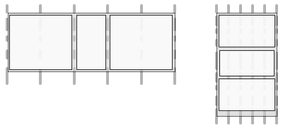

# Responsives Design für Web-Seiten{#responsive-design-for-web-pages}

>[!NOTE]
>
>Adobe empfiehlt die Verwendung des SPA-Editors für Projekte, für die ein Framework-basiertes Client-seitiges Rendering für einzelne Seiten erforderlich ist (z. B. _React_). [Weitere Informationen](/help/sites-developing/spa-overview.md)
>

>[!NOTE]
>
>Einige Beispiele beruhen auf dem Geometrixx-Beispielinhalt, der nicht mehr im Lieferumfang von AEM (Adobe Experience Manager) enthalten ist und durch We.Retail ersetzt wurde. Im Dokument [We.Retail-Referenzimplementierung](/help/sites-developing/we-retail.md#we-retail-geometrixx) finden Sie Informationen zum Herunterladen und Installieren von Geometrixx.

Gestalten Sie Ihre Seiten so, dass sie sich dem Client-Darstellungsfeld anpassen, auf dem sie angezeigt werden. Responsives Design ermöglicht die effektive Darstellung derselben Web-Seiten auf verschiedenen Geräten in beiden Ausrichtungen. Die folgende Abbildung zeigt einige Möglichkeiten, wie eine Seite auf Größenänderungen des Darstellungsfelds reagieren kann:

* Layout: Verwenden Sie einspaltige Layouts für kleinere Darstellungsfelder und mehrspaltige Layouts für größere Darstellungsfelder.
* Textgröße: Verwenden Sie in größeren Darstellungsfeldern eine größere Textgröße (wo passend, z. B. Überschriften).
* Inhalt: Schließen Sie bei der Anzeige auf kleineren Geräten nur die wichtigsten Inhalte ein.
* Navigation: Für den Zugriff auf andere Seiten werden gerätespezifische Tools bereitgestellt.
* Bilder: Stellen Sie anhand der Fenstergröße dem Client-Darstellungsfeld entsprechende Bilddarstellungen zur Verfügung.


Entwickeln Sie Adobe Experience Manager(AEM)-Anwendungen, die HTML5-Seiten generieren, welche sich an verschiedene Fenstergrößen und Ausrichtungen anpassen. Beispielsweise entsprechen die folgenden Breiten von Darstellungsfeldern verschiedenen Gerätetypen und -ausrichtungen.

* Maximale Breite von 480 Pixeln (Smartphone, Hochformat)
* Maximale Breite von 767 Pixeln (Smartphone, Querformat)
* Breite zwischen 768 Pixeln und 979 Pixeln (Tablet, Hochformat)
* Breite zwischen 980 Pixel und 1199 Pixel (Tablet, Querformat)
* Breite von 1200 Pixeln oder mehr (Desktop)

Weitere Informationen finden Sie unter den folgenden Themen zur Implementierung von responsivem Design:

* [Medienabfragen](/help/sites-developing/responsive.md#using-media-queries)
* [Fließende Raster](/help/sites-developing/responsive.md#developing-a-fluid-grid)
* [Adaptive Bilder](/help/sites-developing/responsive.md#using-adaptive-images)

Nutzen Sie beim Design den **[!UICONTROL Sidekick]**, um eine Vorschau Ihrer Seiten in verschiedenen Bildschirmgrößen anzuzeigen.

## Vor der Entwicklung {#before-you-develop}

Vor der Entwicklung einer AEM-Anwendung, die Ihre Web-Seiten unterstützt, sollten Sie einige Design-Entscheidungen treffen. Sie müssen beispielsweise über die folgenden Informationen verfügen:

* Auf welche Geräte der Entwicklungsprozess ausgerichtet ist.
* Die Größe der Zieldarstellungsfelder.
* Die Seiten-Layouts für die berücksichtigten Zieldarstellungsfelder.

### Programmstruktur {#application-structure}

Die typische AEM-Programmstruktur unterstützt alle Implementierungen responsiven Designs:

* Seitenkomponenten befinden sich unter /apps/*application_name*/components
* Vorlagen befinden sich unter /apps/*application_name*/templates
* Designs befinden sich unter /etc/designs

## Verwenden von Medienabfragen {#using-media-queries}

Medienabfragen ermöglichen die selektive Verwendung von CSS-Stilen für das Rendern von Seiten. AEM-Entwicklungs-Tools und -funktionen ermöglichen Ihnen die effektive und effiziente Implementierung von Medienabfragen in Programmen.

Die W3C-Gruppe stellt die [Medienabfragen](https://www.w3.org/TR/mediaqueries-3/)-Empfehlung zur Verfügung, die diese CSS3-Funktion und die Syntax beschreibt.

### Erstellen der CSS-Datei {#creating-the-css-file}

Definieren Sie in der CSS-Datei Medienabfragen anhand der Eigenschaften der Zielgeräte. Die folgende Implementierungsstrategie kann für die Verwaltung der Stile der verschiedenen Medienabfragen verwendet werden:

* Verwenden Sie einen Client-Bibliotheksordner, um das CSS zu definieren, das zusammengestellt wird, wenn die Seite gerendert wird.
* Definieren Sie die Medienabfragen und die zugehörigen Stile in separaten CSS-Dateien. Es ist nützlich, Dateinamen zu verwenden, die die Geräteeigenschaften der Medienabfrage darstellen.
* Definieren Sie Stile, die alle Geräte gemeinsam haben, in einer separaten CSS-Datei.
* Sortieren Sie in der Datei „css.txt“ des Client-Bibliotheksordners die Liste der CSS-Dateien so, wie es in der zusammengestellten CSS-Datei erforderlich ist.

Das `We.Retail`-Beispiel „Media“ verwendet diese Strategie zur Definition von Stilen beim Website-Design. Die von `We.Retail` verwendete CSS-Datei befindet sich unter `*/apps/weretail/clientlibs/clientlib-site/less/grid.less`.

In der folgenden Tabelle werden die Dateien im untergeordneten css-Ordner aufgeführt.

<table>
 <tbody>
  <tr>
   <th>Dateiname</th>
   <th>Beschreibung</th>
   <th>Medienabfrage</th>
  </tr>
  <tr>
   <td>style.css</td>
   <td>Allgemeine Stile.</td>
   <td>Nicht zutreffend</td>
  </tr>
  <tr>
   <td>bootstrap.css</td>
   <td>Allgemeine Stile, die vom Twitter-Bootstrap definiert werden.</td>
   <td>Nicht zutreffend</td>
  </tr>
  <tr>
   <td>responsive-1200px.css</td>
   <td>Stile für alle Medien, die mindestens 1200 Pixel breit sind.</td>
   <td><p>@media (min-width: 1200 px) {<br /> ...<br /> }</p> </td>
  </tr>
  <tr>
   <td>responsive-980px-1199px.css</td>
   <td>Stile für Medien, die zwischen 980 Pixel und 1199 Pixel breit sind.</td>
   <td><p>@media (min-width: 980 px) and (max-width: 1199 px) {<br /> ...<br /> }</p> </td>
  </tr>
  <tr>
   <td>responsive-768px-979px.css</td>
   <td>Stile für Medien, die zwischen 768 Pixel und 979 Pixel breit sind. </td>
   <td><p>@media (min-width: 768 px) and (max-width: 979 px) {<br /> ...<br /> }</p> </td>
  </tr>
  <tr>
   <td>responsive-767px-max.css</td>
   <td>Stile für alle Medien, die weniger als 768 Pixel breit sind.</td>
   <td><p>@media (max-width: 767 px) {<br /> ...<br /> }</p> </td>
  </tr>
  <tr>
   <td>responsive-480px.css</td>
   <td>Stile für alle Medien, die weniger als 481 Pixel breit sind.</td>
   <td>@media (max-width: 480 px) {<br /> ...<br /> }</td>
  </tr>
 </tbody>
</table>

Die Datei „css.txt“ im Ordner `/etc/designs/weretail/clientlibs` führt die CSS-Dateien auf, die der Client-Bibliotheksordner enthält. Die Reihenfolge der Dateien gibt die Priorität der Stile vor. Je kleiner das Gerät, desto spezifischer sind die Stile.

`#base=css`

```
style.css
 bootstrap.css
```

```
responsive-1200px.css
 responsive-980px-1199px.css
 responsive-768px-979px.css
 responsive-767px-max.css
 responsive-480px.css
```

**Tipp**: Anhand aussagekräftiger Namen können Sie die jeweilige Darstellungsfeldgröße leicht identifizieren.

### Verwenden von Medienabfragen bei AEM-Seiten {#using-media-queries-with-aem-pages}

Schließen Sie den Client-Bibliotheksordner in das JSP-Skript Ihrer Seitenkomponente ein. Dies hilft bei der Erstellung der CSS-Datei, die die Medienabfragen enthält und auf die Datei verweist.

```xml
<ui:includeClientLib categories="apps.weretail.all"/>
```

>[!NOTE]
>
>Der Client-Bibliotheksordner `apps.weretail.all` bettet die Bibliothek „clientlibs“ ein.

Das JSP-Skript generiert den folgenden HTML-Code, der auf die Stylesheets verweist:

```xml
<link rel="stylesheet" href="/etc/designs/weretail/clientlibs-all.css" type="text/css">
<link href="/etc/designs/weretail.css" rel="stylesheet" type="text/css">
```

## Anzeigen der Vorschau für bestimmte Geräte {#previewing-for-specific-devices}

Sie haben die Möglichkeit, eine Vorschau Ihrer Seiten in Darstellungsfeldern verschiedener Größen anzuzeigen, um das Verhalten Ihres responsiven Designs zu testen. Im **[!UICONTROL Vorschaumodus]** umfasst der **[!UICONTROL Sidekick]** zur Auswahl von Geräten ein Dropdown-Menü **[!UICONTROL Geräte]**. Wenn Sie ein Gerät auswählen, passt sich die Seite der jeweiligen Darstellungsfeldgröße an.


Zur Aktivierung der Gerätevorschau im **[!UICONTROL Sidekick]** müssen Sie die Seite und den Service **[!UICONTROL MobileEmulatorProvider]** konfigurieren. Eine andere Seitenkonfiguration kontrolliert die Liste von Geräten, die in der Liste **[!UICONTROL Geräte]** angezeigt wird.

### Hinzufügen der Liste „Geräte“ {#adding-the-devices-list}

Die Liste **[!UICONTROL Geräte]** wird im **[!UICONTROL Sidekick]** angezeigt, wenn Ihre Seite das JSP-Skript enthält, das die Liste **[!UICONTROL Geräte]** rendert. Fügen Sie das Skript `/libs/wcm/mobile/components/simulator/simulator.jsp` dem Abschnitt `head` Ihrer Seite hinzu, um im **[!UICONTROL Sidekick]** die Liste **[!UICONTROL Geräte]** hinzuzufügen.

Fügen Sie folgenden Code in das JSP-Skript ein, das den Abschnitt `head` definiert:

`<cq:include script="/libs/wcm/mobile/components/simulator/simulator.jsp"/>`

Öffnen Sie die Datei `/apps/weretail/components/page/head.jsp` in CRXDE Lite, um ein Beispiel zu sehen.

### Registrieren von Seitenkomponenten für die Simulation {#registering-page-components-for-simulation}

Registrieren Sie Ihre Seitenkomponenten beim Factory-Service „MobileEmulatorProvider“ und definieren Sie die Eigenschaft `mobile.resourceTypes`, um zur Unterstützung Ihrer Seiten den Gerätesimulator zu aktivieren.

In AEM können Sie die Konfigurationseinstellungen für solche Services auf unterschiedliche Weise vornehmen. Umfassende Informationen finden Sie unter [Konfigurieren von OSGi](/help/sites-deploying/configuring-osgi.md).

Erstellen Sie beispielsweise einen Knoten ` [sling:OsgiConfig](/help/sites-deploying/configuring-osgi.md#adding-a-new-configuration-to-the-repository)` in Ihrem Programm:

* Übergeordneter Ordner: `/apps/application_name/config`
* Name: `com.day.cq.wcm.mobile.core.impl.MobileEmulatorProvider-*alias*`

  Das Suffix - `*alias*` ist erforderlich, weil der Service „MobileEmulatorProvider“ ein Factory-Service ist. Verwenden Sie einen beliebigen eindeutigen Alias für diese Factory.

* jcr:primaryType: `sling:OsgiConfig`

Fügen Sie folgende Knoteneigenschaft hinzu:

* Name: `mobile.resourceTypes`
* Typ: `String[]`
* Wert: Die Pfade zu den Seitenkomponenten, die Ihre Web-Seiten rendern. Das Programm „geometrixx-media“ verwendet beispielsweise die folgenden Werte:

  ```
  geometrixx-media/components/page
   geometrixx-unlimited/components/pages/page
   geometrixx-unlimited/components/pages/coverpage
   geometrixx-unlimited/components/pages/issue
  ```

### Angeben der Gerätegruppen {#specifying-the-device-groups}

Zur Angabe der Gerätegruppen, die in der Liste „Geräte“ angezeigt werden, fügen Sie dem Knoten `cq:deviceGroups` der Stammseite Ihrer Website eine Eigenschaft `jcr:content` hinzu. Der Wert der Eigenschaft ist ein Array von Pfaden zu den Gerätegruppenknoten.

Gerätegruppenknoten befinden sich im Ordner `/etc/mobile/groups`.

Beispielsweise ist die Stammseite der Geometrixx Media-Website `/content/geometrixx-media`. Der Knoten `/content/geometrixx-media/jcr:content` umfasst die folgende Eigenschaft:

* Name: `cq:deviceGroups`
* Typ: `String[]`
* Wert: `/etc/mobile/groups/responsive`

Verwenden Sie die Konsole „Tools“, um [Gerätegruppen zu erstellen und zu bearbeiten](/help/sites-developing/groupfilters.md).

>[!NOTE]
>
>Für Gerätegruppen, die Sie für responsives Design verwenden, bearbeiten Sie die Gerätegruppe und wählen Sie auf der Registerkarte „Allgemein“ die Option „Emulator deaktivieren“ aus. Diese Option verhindert, dass das Emulator-Karussell angezeigt wird, was für responsives Design nicht relevant ist.
>

## Verwenden adaptiver Bilder {#using-adaptive-images}

Sie können Medienabfragen verwenden, um eine Bildressource auszuwählen, die auf der Seite angezeigt werden soll. Jede Ressource, die eine Medienabfrage verwendet, um ihre Verwendung an Bedingungen zu knüpfen, wird jedoch zum Client heruntergeladen. Die Medienabfrage bestimmt lediglich, ob die heruntergeladene Ressource angezeigt wird.

Bei großen Ressourcen wie Bildern stellt das Herunterladen aller Ressourcen keine effiziente Nutzung der Datenpipeline des Clients dar. Verwenden Sie JavaScript, um die Ressourcenanforderung zu initiieren, nachdem die Medienabfragen die Auswahl durchgeführt haben. Auf diese Weise können Sie Ressourcen selektiv herunterladen.

Die folgende Strategie lädt eine einzelne Ressource, die mithilfe von Medienabfragen ausgewählt wird:

1. Fügen Sie für jede Version der Ressource ein DIV-Element hinzu. Schließen Sie den URI der Ressource als Wert eines Attributwerts ein. Das Attribut wird vom Browser nicht als Ressource interpretiert.
1. Fügen Sie jedem DIV-Element eine Medienabfrage hinzu, die für die Ressource geeignet ist.
1. Wenn das Dokument geladen oder die Größe des Fensters geändert wird, testet JavaScript-Code die Medienabfrage jedes DIV-Elements.
1. Anhand der Abfrageergebnisse entscheiden Sie, welche Ressource eingeschlossen werden soll.
1. Fügen Sie ein HTML-Element in das DOM ein, das auf die Ressource verweist.

### Bewerten von Medienabfragen mithilfe von JavaScript {#evaluating-media-queries-using-javascript}

Implementierungen der von W3C definierten [MediaQueryList-Benutzeroberfläche](https://drafts.csswg.org/cssom-view/#the-mediaquerylist-interface) ermöglichen Ihnen die Bewertung von Medienabfragen mithilfe von JavaScript. Sie können Logik auf die Medienabfrageergebnisse anwenden und Skripte ausführen, die für das aktive Fenster bestimmt sind:

* Browser, die die MediaQueryList-Benutzeroberfläche implementieren, unterstützen die Funktion `window.matchMedia()`. Diese Funktion testet Medienabfragen anhand einer gegebenen Zeichenfolge. Die Funktion gibt ein `MediaQueryList`-Objekt zurück, das Zugriff auf die Abfrageergebnisse bietet.

* Für Browser, die die Benutzeroberfläche nicht implementieren, können Sie ein `matchMedia()`-Polyfill verwenden, z. B. [matchMedia.js](https://github.com/paulirish/matchMedia.js), eine frei verfügbare JavaScript-Bibliothek.

#### Auswählen von medienspezifischen Ressourcen {#selecting-media-specific-resources}

Das W3C-[Bildelement](https://html.spec.whatwg.org/multipage/embedded-content.html#the-picture-element) verwendet Medienabfragen, um die für Bildelemente zu verwendende Quelle zu ermitteln. Das Bildelement verwendet Elementattribute, um Medienabfragen mit Bildpfaden zu verknüpfen.

Die frei verfügbare Bibliothek [picturefill.js](https://github.com/scottjehl/picturefill) bietet ähnliche Funktionen wie das vorgeschlagene `picture`-Element und nutzt eine ähnliche Strategie. Die Bibliothek „picturefill.js“ ruft `window.matchMedia` auf, um die Medienabfragen zu prüfen, die für einen Satz von `div`-Elementen definiert ist. Alle `div`-Elemente geben auch eine Bildquelle an. Die Quelle wird verwendet, wenn die Medienabfrage des `div`-Elements `true` zurückgibt.

Die Bibliothek `picturefill.js` erfordert HTML-Code, der dem folgenden Beispiel ähnlich ist:

```xml
<div data-picture>
    <div data-src='path to default image'></div>
    <div data-src='path to small image'    data-media="(media query for phone)"></div>
    <div data-src='path to medium image'   data-media="(media query for tablet)"></div>
    <div data-src='path to large image'     data-media="(media query for monitor)"></div>
</div>
```

Wenn die Seite gerendert wird, fügt „picturefull.js“ ein `img`-Element als letztes untergeordnetes Element des Elements `<div data-picture>` ein:

```xml
<div data-picture>
    <div data-src='path to default image'></div>
    <div data-src='path to small image'    data-media="(media query for phone)"></div>
    <div data-src='path to medium image'   data-media="(media query for tablet)"></div>
    <div data-src='path to large image'     data-media="(media query for monitor)"></div>
    
</div>
```

Auf einer AEM-Seite ist der Wert des Attributs `data-src` der Pfad zu einer Ressource im Repository.

### Implementieren von adaptiven Bildern in AEM {#implementing-adaptive-images-in-aem}

Um adaptive Bilder in Ihre AEM-Anwendung zu implementieren, müssen Sie die erforderlichen JavaScript-Bibliotheken hinzufügen und das erforderliche HTML-Markup auf Ihren Seiten einfügen.

**Bibliotheken**

Rufen Sie die folgenden JavaScript-Bibliotheken ab und schließen Sie sie in einen Client-Bibliotheksordner ein:

* [matchMedia.js](https://github.com/paulirish/matchMedia.js) (für Browser, die die MediaQueryList-Benutzeroberfläche nicht implementieren)
* [picturefill.js](https://github.com/scottjehl/picturefill)
* jquery.js (verfügbar über den Client-Bibliotheksordner `/etc/clientlibs/granite/jquery` (Kategorie = jquery)
* [jquery.debouncedresize.js](https://github.com/louisremi/jquery-smartresize) (ein jquery-Ereignis, das auftritt, nachdem die Größe des Fensters verändert wurde)

**Tipp:** Durch [Einbettung](/help/sites-developing/clientlibs.md#embedding-code-from-other-libraries) können Sie automatisch mehrere Client-Bibliotheksordner zusammenfassen.

**HTML**

Erstellen Sie eine Komponente, die die erforderlichen div-Elemente generiert, die der picturefill.js-Code erwartet. Auf einer AEM-Seite ist der Wert des Attributs „data-src“ der Pfad zu einer Ressource im Repository. Beispielsweise kann eine Seitenkomponente die Medienabfragen und die zugeordneten Pfade für Bilddarstellungen in DAM fest programmieren. Alternativ können Sie eine benutzerdefinierte Bildkomponente erstellen, die es Autoren ermöglicht, Bilddarstellungen auszuwählen oder Laufzeit-Render-Optionen anzugeben.

Im folgenden HTML-Beispiel werden zwei DAM-Ausgabedarstellungen desselben Bildes ausgewählt.

```xml
<div data-picture>
    <div data-src='/content/dam/geometrixx-media/articles/meridien.png'></div>
    <div data-src='/content/dam/geometrixx-media/articles/meridien.png/jcr:content/renditions/cq5dam.thumbnail.319.319.png'    data-media="(min-width: 769px)"></div>
    <div data-src='/content/dam/geometrixx-media/articles/meridien.png/jcr:content/renditions/cq5dam.thumbnail.140.100.png'   data-media="(min-width: 481px)"></div>
</div>
```

>[!NOTE]
>
>Die Foundation-Komponente „Adaptive Image“ implementiert adaptive Bilder:
>
>* Client-Bibliotheksordner: `/libs/foundation/components/adaptiveimage/clientlibs`
>* Skript, das den HTML-Code generiert: `/libs/foundation/components/adaptiveimage/adaptiveimage.jsp`
>
>Der folgende Abschnitt enthält Details zu dieser Komponente.
>

### Grundlegendes zum Bild-Rendering in AEM {#understanding-image-rendering-in-aem}

Um das Bild-Rendering anzupassen, sollten Sie die standardmäßige AEM-Implementierung des statischen Bild-Renderings kennen. AEM stellt die Bildkomponente und ein Bild-Rendering-Servlet bereit, die zusammenarbeiten, um Bilder für Web-Seiten zu rendern. Die folgende Ereignissequenz tritt auf, wenn die Bildkomponente in das Absatzsystem der Seite eingefügt wird:

1. Bearbeitung: Autorinnen und Autoren bearbeiten die Bildkomponente, um die Bilddatei anzugeben, die in einer HTML-Seite enthalten sein soll. Der Dateipfad wird als Eigenschaftswert des Bildkomponentenknotens gespeichert.
1. Seitenanfrage: Die JSP der Seitenkomponente generiert den HTML-Code. Die JSP der Bildkomponente generiert ein img-Element und fügt es der Seite hinzu.
1. Bildanfrage: Der Webbrowser lädt die Seite und fordert das Bild gemäß dem src-Attribut des img-Elements an.
1. Bild-Rendering: Das Bild-Rendering-Servlet gibt das Bild an den Webbrowser zurück.


Beispielsweise erzeugt das JSP der Bildkomponente das folgende HTML-Element:

``

Wenn der Browser die Seite lädt, fordert er das Bild mit dem Wert des src-Attributs als URL an. Sling dekomprimiert die URL:

* Ressource: `/content/mywebsite/en/_jcr_content/par/image_0`
* Dateierweiterung: `.jpg`
* Selektor: `img`
* Suffix: `1358372073597.jpg`

Der Knoten `image_0` hat einen `jcr:resourceType`-Wert von `foundation/components/image`, der einen `sling:resourceSuperType`-Wert von `foundation/components/parbase` hat. Die Komponente „parbase“ enthält das Skript „img.GET.java“, das dem Selektor und der Dateinamenerweiterung der Anfrage-URL entspricht. CQ verwendet dieses Skript (Servlet) zum Rendern des Bildes.

Öffnen Sie mit CRXDE Lite die Datei `/libs/foundation/components/parbase/img.GET.java`, um den Quell-Code des Skripts zu anzuzeigen.

## Skalieren von Bildern für die aktuelle Darstellungsfeldgröße {#scaling-images-for-the-current-viewport-size}

Skalieren Sie Bilder zur Laufzeit entsprechend den Eigenschaften des Client-Darstellungsfelds, um Bilder bereitzustellen, die den Prinzipien des responsiven Designs entsprechen. Verwenden Sie dasselbe Design-Muster wie für das Rendering statischer Bilder, indem Sie ein Servlet und eine Authoring-Komponente verwenden.

Die Komponente muss die folgenden Aufgaben ausführen:

* Speichern des Pfads und der gewünschten Dimensionen der Bildressource als Eigenschaftswerte.
* Generieren von `div`-Elementen, die Medienselektoren und Service-Aufrufe für das Rendering des Bildes umfassen

>[!NOTE]
>
>Der Webclient verwendet die JavaScript-Bibliotheken „matchMedia“ und „Picturefill“ (oder ähnliche Bibliotheken), um Medienselektoren zu bewerten.
>

Das Servlet, das die Bildanforderung verarbeitet, muss die folgenden Aufgaben ausführen:

* Abrufen des Pfads und der Abmessungen des Bildes aus den Komponenteneigenschaften.
* Skalieren des Bilds entsprechend den Eigenschaften und Rückgabe des Bilds.

**Verfügbare Lösungen**

AEM installiert die folgenden Implementierungen, die Sie verwenden oder erweitern können.

* Die Komponente „Adaptive Image Foundation“, die Medienabfragen generiert, und HTTP-Anforderungen an das Servlet „Adaptive Image Component“, das die Bilder skaliert.
* Das Geometrixx Commons-Paket installiert die Beispiel-Servlets für das Image Reference Modification Servlet, die die Bildauflösung ändern.

### Grundlegendes zur Komponente für adaptive Bilder {#understanding-the-adaptive-image-component}

Die Komponente für adaptive Bilder generiert Aufrufe an „Adaptive Image Component Servlet“ zum Rendern eines Bildes, dessen Größe an den Gerätebildschirm angepasst ist. Die Komponente umfasst die folgenden Ressourcen:

* JSP: Fügt div-Elemente hinzu, die Medienabfragen mit Aufrufen an das Adaptive Image Component Servlet verknüpfen.
* Client-Bibliotheken: Der Ordner „clientlibs“ ist ein `cq:ClientLibraryFolder`, der die Polyfill-JavaScript-Bibliothek „matchMedia“ und eine angepasste JavaScript-Bibliothek „Picturefill“ zusammenfügt.
* Dialogfeld bearbeiten: Der Knoten `cq:editConfig` überschreibt die CQ-Foundation-Bildkomponente, damit das Drop-Ziel anstelle einer Foundation-Bildkomponente eine Komponente für adaptive Bilder erstellt.

#### Hinzufügen der DIV-Elemente {#adding-the-div-elements}

Das Skript „adaptive-image.jsp“ enthält den folgenden Code, der div-Elemente und Medienabfragen generiert:

```
<div data-picture data-alt='<%= alt %>'>
    <div data-src='<%= path + ".img.320.low." + extension + suffix %>'       data-media="(min-width: 1px)"></div>                                        <%-- Small mobile --%>
    <div data-src='<%= path + ".img.320.medium." + extension + suffix %>'    data-media="(min-width: 320px)"></div>  <%-- Portrait mobile --%>
    <div data-src='<%= path + ".img.480.medium." + extension + suffix %>'    data-media="(min-width: 321px)"></div>  <%-- Landscape mobile --%>
    <div data-src='<%= path + ".img.476.high." + extension + suffix %>'      data-media="(min-width: 481px)"></div>   <%-- Portrait iPad --%>
    <div data-src='<%= path + ".img.620.high." + extension + suffix %>'      data-media="(min-width: 769px)"></div>  <%-- Landscape iPad --%>
    <div data-src='<%= path + ".img.full.high." + extension + suffix %>'     data-media="(min-width: 1025px)"></div> <%-- Desktop --%>

    <%-- Fallback content for non-JS browsers. Same img src as the initial, unqualified source element. --%>
    <noscript>
        ' alt='<%= alt %>'>
    </noscript>
</div>
```

Die Variable `path` enthält den Pfad der aktuellen Ressource (der Komponentenknoten für adaptive Bilder). Der Code generiert eine Reihe von `div`-Elementen mit der folgenden Struktur:

`<div data-scr = "*path-to-parent-node*.adaptive-image.adapt.*width*.*quality*.jpg" data-media="*media query*"></div>`

Der Wert des Attributs `data-scr` ist eine URL, die Sling auflöst, um „Adaptive Image Component Servlet“ zu erhalten, das das Bild rendert. Das Datenmedienattribut umfasst die Medienabfrage, die anhand der Client-Eigenschaften geprüft wird.

Der folgende HTML-Code ist ein Beispiel für die `div`-Elemente, die das JSP generiert:

```xml
<div data-src='/content/geometrixx-media/en/events/the-lineup-you-ve-been-waiting-for/jcr:content/article-content-par/adaptive_image.adapt.320.low.jpg'></div>
    <div data-src='/content/geometrixx-media/en/events/the-lineup-you-ve-been-waiting-for/jcr:content/article-content-par/adaptive_image.adapt.320.medium.jpg'    data-media="(min-width: 320px)"></div>
    <div data-src='/content/geometrixx-media/en/events/the-lineup-you-ve-been-waiting-for/jcr:content/article-content-par/adaptive_image.adapt.480.medium.jpg'    data-media="(min-width: 321px)"></div>
    <div data-src='/content/geometrixx-media/en/events/the-lineup-you-ve-been-waiting-for/jcr:content/article-content-par/adaptive_image.adapt.476.high.jpg'     data-media="(min-width: 481px)"></div>
    <div data-src='/content/geometrixx-media/en/events/the-lineup-you-ve-been-waiting-for/jcr:content/article-content-par/adaptive_image.adapt.620.high.jpg'     data-media="(min-width: 769px)"></div>
    <div data-src='/content/geometrixx-media/en/events/the-lineup-you-ve-been-waiting-for/jcr:content/article-content-par/adaptive_image.adapt.full.high.jpg'     data-media="(min-width: 1025px)"></div>
```

#### Ändern der Bildgrößenselektoren {#changing-the-image-size-selectors}

Wenn Sie die adaptive Bildkomponente anpassen und die Breitenselektoren ändern, müssen Sie auch das Servlet „Adaptive Image Component“ konfigurieren, um die Breiten zu unterstützen.

### Grundlegendes zum Servlet „Adaptive Image Component“ {#understanding-the-adaptive-image-component-servlet}

„Adaptive Component Servlet“ ändert die Größe eines JPEG-Bilds in eine gegebene Breite und legt die JPEG-Qualität fest.

#### Die Benutzeroberfläche von „Adaptive Image Component Servlet“ {#the-interface-of-the-adaptive-image-component-servlet}

Das Servlet „Adaptive Image Component“ ist an das standardmäßige Sling-Servlet gebunden und unterstützt die Dateierweiterungen .jpg, .jpeg, .gif und .png. Der Servlet-Selektor ist „img“.

>[!CAUTION]
>
>Animierte GIF-Dateien werden in AEM für adaptive Ausgabedarstellungen nicht unterstützt.

Deshalb löst Sling HTTP-Anforderungs-URLs im folgenden Format in dieses Servlet auf:

`*path-to-node*.img.*extension*`

Beispielsweise leitet Sling HTTP-Anfragen mit der URL `http://localhost:4502/content/geometrixx/adaptiveImage.img.jpg` an „Adaptive Image Component Servlet“ weiter.

Zwei zusätzliche Selektoren geben die gewünschte Bildbreite und JPEG-Qualität an. Im folgenden Beispiel wird ein Bild mit einer Breite von 480 Pixeln und mittlerer Qualität angefordert:

`http://localhost:4502/content/geometrixx/adaptiveImage.adapt.480.MEDIUM.jpg`

**Unterstützte Bildeigenschaften**

Das Servlet akzeptiert eine begrenzte Anzahl von Bildbreiten und -qualitäten. Die folgenden Breiten werden standardmäßig unterstützt (in Pixeln):

* vollständig
* 320
* 480
* 476
* 620

Der vollständige Wert bedeutet, dass keine Skalierung vorgenommen wird.

Die folgenden Werte für die JPEG-Qualität werden unterstützt:

* NIEDRIG
* MITTEL
* HOCH

Die numerischen Werte sind 0,4, 0,82 bzw. 1,0.

**Ändern der standardmäßig unterstützten Breiten**

Verwenden Sie die Web-Konsole ([http://localhost:4502/system/console/configMgr](http://localhost:4502/system/console/configMgr)) oder einen sling:OsgiConfig-Knoten, um die unterstützten Breiten des Servlets „Adaptive Image Component“ von Adobe CQ zu konfigurieren.

Informationen zum Konfigurieren von AEM-Diensten finden Sie unter [Konfigurieren von OSGi](/help/sites-deploying/configuring-osgi.md).

<table>
 <tbody>
  <tr>
   <th> </th>
   <th>Web-Konsole</th>
   <th>sling:OsgiConfig</th>
  </tr>
  <tr>
   <th>Name des Service oder Knotens</th>
   <td>Der Service-Name auf der Registerkarte „Konfiguration“ lautet „Adobe CQ Adaptive Image Component Servlet“.</td>
   <td>com.day.cq.wcm.foundation.impl. AdaptiveImageComponentServlet</td>
  </tr>
  <tr>
   <th>Eigenschaft</th>
   <td><p>Unterstützte Breiten</p>
    <ul>
     <li>Um eine unterstützte Breite hinzuzufügen, klicken Sie auf die Schaltfläche „+“ und geben Sie eine positive ganze Zahl ein.</li>
     <li>Um eine unterstützte Breite zu entfernen, klicken Sie auf die zugehörige Schaltfläche „-“.</li>
     <li>Um eine unterstützte Breite zu ändern, bearbeiten Sie den Feldwert.</li>
    </ul> </td>
   <td><p>adapt.supported.widths</p>
    <ul>
     <li>Die Eigenschaft ist ein Zeichenfolgenwert mit mehreren Werten.</li>
    </ul> </td>
  </tr>
 </tbody>
</table>

#### Implementierungsdetails {#implementation-details}

Die Klasse `com.day.cq.wcm.foundation.impl.AdaptiveImageComponentServlet` erweitert die Klasse [AbstractImageServlet](https://developer.adobe.com/experience-manager/reference-materials/6-5/javadoc/com/day/cq/wcm/commons/AbstractImageServlet.html). Der Quell-Code von „AdaptiveImageComponentServlet“ befindet sich im Ordner `/libs/foundation/src/impl/src/com/day/cq/wcm/foundation/impl`.

Die Klasse verwendet Felix-SCR-Anmerkungen, um den Ressourcentyp und die Dateierweiterung zu konfigurieren, mit der das Servlet verknüpft ist, sowie den Namen des ersten Selektors.

```java
@Component(metatype = true, label = "Adobe CQ Adaptive Image Component Servlet",
        description = "Render adaptive images in a variety of qualities")
@Service
@Properties(value = {
    @Property(name = "sling.servlet.resourceTypes", value = "foundation/components/adaptiveimage", propertyPrivate = true),
    @Property(name = "sling.servlet.selectors", value = "img", propertyPrivate = true),
    @Property(name = "sling.servlet.extensions", value ={
            "jpg",
            "jpeg",
            "png",
            "gif"
    }, propertyPrivate = true)
})
```

Das Servlet verwendet die Eigenschaften-SCR-Anmerkung zum Festlegen der standardmäßig unterstützten Bildqualitäten und -abmessungen.

```java
@Property(value = {
            "320", // iPhone portrait
            "480", // iPhone landscape
            "476", // iPad portrait
            "620" // iPad landscape
    },
            label = "Supported Widths",
            description = "List of widths this component is permitted to generate.")
```

Die Klasse `AbstractImageServlet` stellt die Methode `doGet` zur Verfügung, die die HTTP-Anfrage verarbeitet. Diese Methode bestimmt die Ressource, die der Anfrage zugeordnet ist, ruft Ressourceneigenschaften aus dem Repository ab und gibt sie in einem [ImageContext](https://developer.adobe.com/experience-manager/reference-materials/6-5/javadoc/com/day/cq/wcm/commons/AbstractImageServlet.ImageContext.html)-Objekt zurück.

>[!NOTE]
>
>Die Klasse [com.day.cq.commons.DownloadResource](https://developer.adobe.com/experience-manager/reference-materials/6-5/javadoc/com/day/cq/commons/DownloadResource.html) stellt die `getFileReference method` zur Verfügung, die den Wert der Eigenschaft `fileReference` der Ressource abruft.

Die Klasse `AdaptiveImageComponentServlet` überschreibt die Methode `createLayer`. Die Methode ruft den Pfad der Bildressource und die angeforderte Bildbreite vom `ImageContext`-Objekt ab. Dann ruft sie die Methoden der Klasse `info.geometrixx.commons.impl.AdaptiveImageHelper` auf, die die tatsächliche Bildskalierung durchführen.

Die Klasse „AdaptiveImageComponentServlet“ überschreibt auch die Methode „writeLayer“. Diese Methode wendet die JPEG-Qualität auf das Bild an.

### Image Reference Modification Servlet (Geometrixx Common) {#image-reference-modification-servlet-geometrixx-common}

Das beispielhafte Reference Modification Servlet generiert Größenattribute für das img-Element, die ein Bild auf der Web-Seite zu skalieren.

#### Aufrufen des Servlets {#calling-the-servlet}

Das Servlet ist an `cq:page`-Ressourcen gebunden und unterstützt das Dateiformat JPG. Der Servlet-Selektor ist `image`. Deshalb löst Sling HTTP-Anforderungs-URLs im folgenden Format in dieses Servlet auf:

`path-to-page-node.image.jpg`

Beispielsweise leitet Sling HTTP-Anfragen mit der URL `http://localhost:4502/content/geometrixx/en.image.jpg` an „Image Reference Modification Servlet“ weiter.

Drei weitere Selektoren geben die gewünschte Breite, Höhe und (optional) Qualität des Bildes an. Im folgenden Beispiel wird ein Bild mit einer Breite von 770 Pixeln, einer Höhe von 360 Pixeln und von mittlerer Qualität angefordert.

`http://localhost:4502/content/geometrixx/en.image.770.360.MEDIUM.jpg`

**Unterstützte Bildeigenschaften**

Das Servlet akzeptiert eine begrenzte Anzahl von Bildabmessungen und Qualitätswerten.

Die folgenden Werte werden standardmäßig unterstützt (Breite x Höhe):

* 256 x 192
* 370 x 150
* 480 x 200
* 127 x 127
* 770 x 360
* 620 x 290
* 480 x 225
* 320 x 150
* 375 x 175
* 303 x 142
* 1170 x 400
* 940 x 340
* 770 x 300
* 480 x 190

Die folgenden Werte für die Bildqualität werden unterstützt:

* niedrig
* mittel
* hoch

In AEM können Sie die Konfigurationseinstellungen für solche Services auf unterschiedliche Weise vornehmen. Umfassende Informationen finden Sie unter [Konfigurieren von OSGi](/help/sites-deploying/configuring-osgi.md).

#### Festlegen der Bildressource {#specifying-the-image-resource}

Der Bildpfad, die Abmessungen und die Qualitätswerte müssen als Eigenschaften eines Knotens im Repository gespeichert werden:

* Der Knotenname ist `image`.
* Der übergeordnete Knoten ist der Knoten `jcr:content` einer Ressource `cq:page`.

* Der Bildpfad wird als Wert einer Eigenschaft mit der Bezeichnung `fileReference` gespeichert.

Verwenden Sie beim Bearbeiten einer Seite den **Sidekick** zum Angeben von Bildern und zum Hinzufügen des Knotens `image` zu den Seiteneigenschaften:

1. Klicken Sie im **Sidekick** auf die Registerkarte **Seite** und klicken Sie dann auf **Seiteneigenschaften**.
1. Klicken Sie auf die Registerkarte **Bild** und geben Sie das Bild an.
1. Klicken Sie auf **OK**.

#### Implementierungsdetails {#implementation-details-1}

Die Klasse „info.geometrixx.commons.impl.servlets.ImageReferenceModificationServlet“ erweitert die Klasse [AbstractImageServlet](https://developer.adobe.com/experience-manager/reference-materials/6-5/javadoc/com/day/cq/wcm/commons/AbstractImageServlet.html). Wenn Sie das Paket „cq-geometrixx-commons-pkg“ installiert haben, befindet sich der „ImageReferenceModificationServlet“-Quell-Code im Ordner `/apps/geometrixx-commons/src/core/src/main/java/info/geometrixx/commons/impl/servlets`.

Die Klasse verwendet Felix-SCR-Anmerkungen, um den Ressourcentyp und die Dateierweiterung zu konfigurieren, mit der das Servlet verknüpft ist, sowie den Namen des ersten Selektors.

```java
@Component(metatype = true, label = "Adobe CQ Image Reference Modification Servlet",
        description = "Render the image associated with a page in a variety of dimensions and qualities")
@Service
@Properties(value = {
    @Property(name = "sling.servlet.resourceTypes", value = NameConstants.NT_PAGE, propertyPrivate = true),
    @Property(name = "sling.servlet.selectors", value = "image", propertyPrivate = true),
    @Property(name = "sling.servlet.extensions", value = "jpg", propertyPrivate = true)
})
```

Das Servlet verwendet die Eigenschaften-SCR-Anmerkung zum Festlegen der standardmäßig unterstützten Bildqualitäten und -abmessungen.

```java
@Property(label = "Image Quality",
            description = "Quality must be a double between 0.0 and 1.0", value = "0.82")
@Property(value = {
                "256x192", // Category page article list images
                "370x150", // "Most popular" desktop & iPad & carousel min-width: 1px
                "480x200", // "Most popular" phone
                "127x127", // article summary phone square images
                "770x360", // article summary, desktop
                "620x290", // article summary, tablet
                "480x225", // article summary, phone (landscape)
                "320x150", // article summary, phone (portrait) and fallback
                "375x175", // 2-column article summary, desktop
                "303x142", // 2-column article summary, tablet
                "1170x400", // carousel, full
                "940x340",  // carousel min-width: 980px
                "770x300",  // carousel min-width: 768px
                "480x190"   // carousel min-width: 480px
            },
            label = "Supported Resolutions",
            description = "List of resolutions this component is permitted to generate.")
```

Die Klasse `AbstractImageServlet` stellt die Methode `doGet` zur Verfügung, die die HTTP-Anfrage verarbeitet. Diese Methode bestimmt die Ressource, die dem Aufruf zugeordnet ist, ruft Ressourceneigenschaften aus dem Repository ab und speichert sie in einem [ImageContext](https://developer.adobe.com/experience-manager/reference-materials/6-5/javadoc/com/day/cq/wcm/commons/AbstractImageServlet.ImageContext.html)-Objekt.

Die Klasse `ImageReferenceModificationServlet` überschreibt die Methode `createLayer` und implementiert die Logik, die die zu rendernde Bildressource festlegt. Die Methode ruft einen untergeordneten Knoten des Knotens `jcr:content` der Seite mit der Bezeichnung `image` ab. Aus diesem `image`-Knoten wird ein [Bildobjekt](https://developer.adobe.com/experience-manager/reference-materials/6-5/javadoc/com/day/cq/wcm/foundation/Image.html) erstellt und die Methode `getFileReference` gibt den Pfad zur Bilddatei aus der Eigenschaft `fileReference` des Bildknotens zurück.

>[!NOTE]
>Die Klasse [com.day.cq.commons.DownloadResource](https://developer.adobe.com/experience-manager/reference-materials/6-5/javadoc/com/day/cq/commons/DownloadResource.html) stellt die Methode „getFileReference“ zur Verfügung.
>

## Entwickeln eines fließenden Rasters {#developing-a-fluid-grid}

AEM ermöglicht Ihnen die effiziente und effektive Implementierung fließender Raster. Auf dieser Seite wird beschrieben, wie Sie fließende Raster oder eine vorhandene Rasterimplementierung (z. B. [Bootstrap](https://github.com/topics/twitter-bootstrap?l=css)) in Ihr AEM-Programm integrieren.

Wenn Sie nicht mit fließenden Rastern vertraut sind, lesen Sie den Abschnitt [Einführung in fließende Raster](/help/sites-developing/responsive.md#developing-a-fluid-grid) unten auf dieser Seite. Diese Einführung bietet einen Überblick über fließende Raster und Anleitungen für deren Entwurf.

### Definieren des Rasters mithilfe einer Seitenkomponente {#defining-the-grid-using-a-page-component}

Verwenden Sie Seitenkomponenten, um die HTML-Elemente zu generieren, die die Inhaltsblöcke der Seite definieren. Der „ClientLibraryFolder“, auf den die Seite verweist, stellt das CSS zur Verfügung, das das Layout der Inhaltsblöcke steuert:

* Seitenkomponente: Fügt div-Elemente hinzu, die Zeilen von Inhaltsblöcken darstellen. Die div-Elemente, die Inhaltsblöcke darstellen, enthalten eine parsys-Komponente, in der Autorinnen und Autoren Inhalte hinzufügen.
* Client-Bibliotheksordner: Stellt die CSS-Datei zur Verfügung, die die Medienabfragen und Stile für die div-Elemente enthält.

Beispielsweise enthält die Beispielanwendung „geometrixx-media“ die Komponente „media-home“. Diese Seitenkomponente fügt zwei Skripte hinzu, die zwei `div`-Elemente der Klasse `row-fluid` generieren:

* Die erste Zeile enthält ein `div`-Element der Klasse `span12` (der Inhalt umfasst 12 Spalten). Das `div`-Element enthält die parsys-Komponente.

* Die zweite Zeile enthält zwei `div`-Elemente, eines der Klasse `span8` und eines der Klasse `span4`. Jedes `div`-Element enthält die parsys-Komponente.

```xml
<div class="page-content">
    <div class="row-fluid">
        <div class="span12">
            <cq:include path="grid-12-par" resourceType="foundation/components/parsys" />
        </div>
    </div>
    <div class="row-fluid">
        <div class="span8">
            <cq:include path="grid-8-par" resourceType="foundation/components/parsys" />
        </div>
        <div class="span4">
            <cq:include path="grid-4-par" resourceType="foundation/components/parsys" />
        </div>
    </div>
</div>
```

>[!NOTE]
>
>Wenn eine Komponente verschiedene `cq:include`-Elemente umfasst, die auf die Parsys-Komponente verweisen, müssen alle `path`-Attribute unterschiedliche Werte aufweisen.
>

#### Skalieren des Seitenkomponentenrasters {#scaling-the-page-component-grid}

Das Design, das der Seitenkomponente „geometrixx-media“ (`/etc/designs/geometrixx-media`) zugeordnet ist, umfasst den ClientLibraryFolder `clientlibs`. Dieser ClientLibraryFolder definiert CSS-Stile für `row-fluid`-Klassen, `span*`-Klassen und `span*`-Klassen, die untergeordnete Elemente von `row-fluid`-Klassen sind. Medienabfragen ermöglichen die Neudefinition von Stilen für verschiedene Größen von Darstellungsfeldern.

Das folgende Beispiel-CSS ist eine Untergruppe dieser Stile. Diese Untergruppe konzentriert sich auf die Klassen `span12`, `span8` und `span4` sowie Medienabfragen für zwei Darstellungsfeldgrößen. Beachten Sie die folgenden Eigenschaften des CSS:

* Die `.span`-Stile definieren Elementbreiten anhand absoluter Zahlenwerte.
* Die `.row-fluid .span*`-Stile definieren Elementbreiten als Prozentsatz des übergeordneten Elements. Prozentsätze werden anhand der absoluten Breiten berechnet.
* Medienabfragen für größere Darstellungsfelder weisen größere absolute Breiten zu.

>[!NOTE]
>
>Das Geometrixx Media-Beispiel integriert das [Bootstrap](https://getbootstrap.com/2.0.2/)-JavaScript-Framework in seine Implementierung fließender Raster. Das Bootstrap-Framework stellt die Datei „bootstrap.css“ zur Verfügung.

```xml
/* default styles (no media queries) */
 .span12 { width: 940px }
 .span8 { width: 620px }
 .span4 { width: 300px }
 .row-fluid .span12 { width: 100% }
 .row-fluid .span8 { width: 65.95744680851064% }
 .row-fluid .span4 { width: 31.914893617021278% }

@media (min-width: 768px) and (max-width: 979px) {
 .span12 { width: 724px; }
 .span8 {     width: 476px; }
 .span4 {     width: 228px; }
 .row-fluid .span12 {     width: 100%;}
 .row-fluid .span8 {     width: 65.74585635359117%; }
 .row-fluid .span4 {     width: 31.491712707182323%; }
}

@media (min-width: 1200px) {
 .span12 { width: 1170px }
 .span8 { width: 770px }
 .span4 { width: 370px }
 .row-fluid .span12 { width: 100% }
 .row-fluid .span8 { width: 65.81196581196582% }
 .row-fluid .span4 { width: 31.623931623931625% }
}
```

#### Neupositionieren von Inhalten im Seitenkomponentenraster {#repositioning-content-in-the-page-component-grid}

Die Seiten der beispielhaften Geometrixx Media-Anwendung verteilen Zeilen von Inhaltsblöcken horizontal in breiten Darstellungsfeldern. In kleineren Darstellungsfeldern werden dieselben Blöcke vertikal verteilt. Das folgende Beispiel-CSS zeigt die Dateitypen, die dieses Verhalten für den HTML-Code implementieren, den die Seitenkomponente „media-home“ generiert:

* Das standardmäßige CSS für die Seite „media-welcome“ weist den `float:left`-Stil `span*`-Klassen zu, die in `row-fluid`-Klassen enthalten sind.

* Medienabfragen für kleinere Darstellungsfelder weisen denselben Klassen den `float:none`-Stil zu.

```xml
/* default styles (no media queries) */
    .row-fluid [class*="span"] {
        width: 100%;
        float: left;
}

@media (max-width: 767px) {
    [class*="span"], .row-fluid [class*="span"] {
        float: none;
        width: 100%;
    }
}
```

#### Modularisieren der Seitenkomponenten {#tip-modularize-your-page-components}

Modularisieren Sie Ihre Komponenten, damit Sie den Code effizienter nutzen können. Ihre Site verwendet wahrscheinlich mehrere verschiedene Seitentypen, z. B. eine Begrüßungsseite, eine Artikelseite oder eine Produktseite. Jeder Seitentyp enthält verschiedene Inhaltstypen und verwendet wahrscheinlich unterschiedliche Layouts. Wenn jedoch bestimmte Elemente eines Layouts auf mehreren Seiten verwendet werden, können Sie den Code wiederverwenden, der diesen Teil des Layouts implementiert.

**Verwenden von Seitenkomponentenüberlagerungen**

Erstellen Sie eine Hauptseitenkomponente, die Skripte für die Generierung der einzelnen Bestandteile einer Seite bietet (z. B. die Abschnitte `head` und `body` sowie die Abschnitte `header`, `content` und `footer` im Hauptteil).

Erstellen Sie andere Seitenkomponenten, die die Hauptseitenkomponente als `cq:resourceSuperType` verwenden. Diese Komponenten umfassen Skripte, die die Skripte der Hauptseite je nach Bedarf überschreiben.

Beispielsweise umfasst das Programm „geometrixx-media“ die Seitenkomponente (`sling:resourceSuperType` ist die Foundation-Seitenkomponente). Einige untergeordnete Komponenten (z. B. „article“, „category“ und „media-home“) verwenden diese Seitenkomponente als `sling:resourceSuperType`. Jede untergeordnete Komponente beinhaltet eine Datei „content.jsp“, die die content.jsp-Datei der Seitenkomponente überschreibt.

**Wiederverwenden von Skripten**

Erstellen Sie mehrere JSP-Skripte, die Zeilen- und Spaltenkombinationen generieren, die für mehrere Seitenkomponenten die gleichen sind. Beispielsweise verweisen sowohl das Skript `content.jsp` des Artikels als auch die media-home-Komponenten auf das Skript `8x4col.jsp`.

**Organisieren von CSS-Stilen nach Darstellungsfeldgrößen**

Platzieren Sie CSS-Stile und Medienabfragen für verschiedene Darstellungsfeldgrößen in verschiedenen Dateien. Verwenden Sie Client-Bibliotheksordner, um sie zu verketten.

### Einfügen von Komponenten in das Seitenraster {#inserting-components-into-the-page-grid}

Wenn Komponenten einen einzelnen Inhaltsblock generieren, steuert normalerweise das von der Seitenkomponente erstellte Raster die Platzierung des Inhalts.

Sie als Autorin oder Autor können den Inhaltsblock in verschiedenen Größen und relativen Positionen darstellen lassen. Der Inhaltstext sollte keine relativen Verweise auf andere Inhaltsblöcke enthalten.

Bei Bedarf muss die Komponente jegliche CSS- oder JavaScript-Bibliotheken zur Verfügung stellen, die für den von ihr generierten HTML-Code erforderlich sind. Verwenden Sie einen Client-Bibliotheksordner innerhalb der Komponente, damit die CSS- und JS-Dateien generiert werden. Zum Anzeigen der Dateien [erstellen Sie eine Abhängigkeit oder betten Sie die Bibliothek](/help/sites-developing/clientlibs.md#creating-client-library-folders) in einem anderen Client-Bibliotheksordner unterhalb des /etc-Ordners ein.

**Unterraster**

Falls die Komponente mehrere Inhaltsblöcke enthält, fügen Sie die Inhaltsblöcke innerhalb einer Zeile hinzu, um ein Unterraster auf der Seite zu erstellen:

* Verwenden Sie die gleichen Klassennamen wie die enthaltende Seitenkomponente, damit Sie div-Elemente als Zeilen und Inhaltsblöcke ausdrücken können.
* Zum Überschreiben des Verhaltens, das vom CSS des Seiten-Designs implementiert wird, verwenden Sie einen zweiten Klassennamen für das div-Element der Zeile und stellen Sie das zugehörige CSS in einem Client-Bibliotheksordner zur Verfügung.

Beispielsweise generiert die Komponente `/apps/geometrixx-media/components/2-col-article-summary` zwei Inhaltsspalten. Der HTML-Code, den sie generiert, weist die folgende Struktur auf:

```xml
<div class="row-fluid mutli-col-article-summary">
    <div class="span6">
        <article>
            <div class="article-summary-image">...</div>
            <div class="social-header">...</div>
            <div class="article-summary-description">...</div>
            <div class="social">...</div>
        </article>
    </div>
</div>
```

Die `.row-fluid .span6`-Selektoren des CSS der Seite gelten für die `div`-Elemente derselben Klasse und Struktur in diesem HTML-Code. Allerdings umfasst die Komponente auch den Client-Bibliotheksordner /apps/geometrixx-media/components/2-col-article-summary/clientlibs:

* Das CSS verwendet dieselben Medienabfragen wie die Seitenkomponente, um die Änderungen im Layout an denselben jeweiligen Seitenbreiten umzusetzen.
* Selektoren nutzen die Klasse `multi-col-article-summary` des `div`-Elements der Zeile, um das Verhalten der Klasse `row-fluid` der Seite zu überschreiben.

Beispielsweise sind in der Datei `/apps/geometrixx-media/components/2-col-article-summary/clientlibs/css/responsive-480px.css` die folgenden Stile enthalten:

```xml
@media (max-width: 480px) {
    .mutli-col-article-summary .article-summary-image {
        float: left;
        width: 127px;
    }
    .mutli-col-article-summary .article-summary-description {
        width: auto;
        margin-left: 127px;
    }
    .mutli-col-article-summary .article-summary-description h4 {
        padding-left: 10px;
    }
    .mutli-col-article-summary .article-summary-text {
        margin-left: 127px;
        min-height: 122px;
        top: 0;
    }
}
```

## Einführung zu fließenden Rastern {#introduction-to-fluid-grids}

Fließende Raster ermöglichen die Anpassung von Seiten-Layouts an die Dimensionen des Client-Darstellungsfelds. Raster bestehen aus logischen Spalten und Zeilen, die die Inhaltsblöcke auf der Seite positionieren.

* Spalten bestimmen die horizontalen Positionen und die Breiten von Inhaltsblöcken.
* Zeilen bestimmen die relativen vertikalen Positionen von Inhaltsblöcken.

Mithilfe der HTML5-Technologie können Sie das Raster implementieren und bearbeiten, um Seiten-Layouts an verschiedene Darstellungsfeldgrößen anzupassen:

* HTML-`div`-Elemente enthalten Inhaltsblöcke, die sich über mehrere Spalten erstrecken.
* Eine Zeile besteht aus einem oder mehreren dieser div-Elemente, wenn diese ein übergeordnetes div-Element gemeinsam haben.

### Verwenden separater Breiten {#using-discrete-widths}

Verwenden Sie für jeden Bereich von Darstellungsfeldbreiten eine statische Seitenbreite und Inhaltsblöcke mit einer konstanten Breite. Bei der manuellen Größenanpassung eines Browser-Fensters treten Änderungen an der Inhaltsgröße bei bestimmten Fensterbreiten (auch als Haltepunkte bezeichnet) auf. So werden Seiten-Designs besser eingehalten, wodurch das Anwendererlebnis verbessert wird.

#### Skalieren des Rasters {#scaling-the-grid}

Verwenden Sie Raster zum Skalieren von Inhaltsblöcken, um sie an verschiedene Darstellungsfeldgrößen anzupassen. Inhaltsblöcke erstrecken sich über eine bestimmte Anzahl von Spalten. Wenn Spalten breiter oder schmaler werden, um sich verschiedenen Darstellungsfeldgrößen anzupassen, werden Inhaltsblöcke ebenso entsprechend breiter oder schmaler. Skalierung kann sowohl große als auch mittelgroße Darstellungsfelder unterstützen, die breit genug sind, um Inhaltsblöcke nebeneinander zu platzieren.


#### Neupositionieren von Inhalten im Raster {#repositioning-content-in-the-grid}

Die Größe der Inhaltsblöcke kann durch eine Mindestbreite beschränkt werden, bei deren Überschreitung die Skalierung nicht mehr wirksam ist. Bei kleineren Darstellungsfeldern kann das Raster verwendet werden, um Inhaltsblöcke vertikal statt horizontal zu verteilen.


### Entwerfen des Rasters {#designing-the-grid}

Bestimmen Sie die Spalten und Zeilen, die Sie benötigen, um die Inhaltsblöcke auf Ihren Seiten zu positionieren. Ihre Seiten-Layouts bestimmen die Anzahl der Spalten und Zeilen, die sich über Ihr Raster erstrecken.

**Anzahl der Spalten**

Verwenden Sie ausreichend Spalten, um die Inhaltsblöcke für alle Darstellungsfeldgrößen in allen Layouts horizontal zu positionieren. Sie sollten zur Unterstützung zukünftiger Seiten-Designs mehr Spalten verwenden, als derzeit benötigt werden.

**Zeileninhalte**

Verwenden Sie Zeilen, um die vertikale Positionierung von Inhaltsblöcken zu steuern. Legen Sie die Inhaltsblöcke fest, die sich in derselben Zeile befinden:

* Inhaltsblöcke, die sich in einem der Layouts horizontal nebeneinander befinden, sind in derselben Zeile.
* Inhaltsblöcke, die sich in einem der Layouts horizontal (breitere Darstellungsfelder) und vertikal (kleinere Darstellungsfelder) nebeneinander befinden, sind in derselben Zeile.

### Rasterimplementierungen {#grid-implementations}

Erstellen Sie CSS-Klassen und -Stile, damit Sie das Layout der Inhaltsblöcke auf einer Seite steuern können. Seiten-Designs basieren häufig auf der relativen Größe und Position von Inhaltsblöcken im Darstellungsfeld. Das Darstellungsfeld bestimmt die tatsächliche Größe der Inhaltsblöcke. Ihr CSS muss die relativen und absoluten Größen berücksichtigen. Sie können ein fließendes Raster mit drei Arten von CSS-Klassen implementieren:

* Eine Klasse für ein `div`-Element, das ein Container für alle Zeilen ist. Diese Klasse legt die absolute Breite des Rasters fest.
* Eine Klasse für `div`-Elemente, die eine Zeile darstellen. Diese Klasse steuert die horizontale bzw. vertikale Positionierung der Inhaltsblöcke, die sie umfasst.
* Klassen für `div`-Elemente, die Inhaltsblöcke mit verschiedenen Breiten darstellen. Breiten werden als Prozentsatz des übergeordneten Elements (also der Zeile) ausgedrückt.

Zieldarstellungsfeldbreiten (und ihre zugehörigen Medienabfragen) grenzen bestimmte Breiten ein, die für ein Seiten-Layout verwendet werden.

#### Breiten von Inhaltsblöcken {#widths-of-content-blocks}

Im Allgemeinen basiert der `width`-Stil von Inhaltsblockklassen auf den folgenden Eigenschaften Ihrer Seite und Ihres Rasters:

* Die absolute Seitenbreite, die Sie für die Zieldarstellungsfeldgrößen verwenden. Bekannte Werte.
* Die absolute Breite der Rasterspalten für jede Seitenbreite. Diese Werte werden von Ihnen festgelegt.
* Die relative Breite jeder Spalte als Prozentsatz der gesamten Seitenbreite. Diese Werte werden von Ihnen berechnet.

Das CSS umfasst eine Reihe von Medienabfragen, die die folgende Struktur verwenden:

```xml
@media(query_for_targeted_viewport){

  .class_for_container{ width:absolute_page_width }
  .class_for_row { width:100%}

  /* several selectors for content blocks   */
  .class_for_content_block1 { width:absolute_block_width1 }
  .class_for_content_block2 { width:absolute_block_width2 }
  ...

  /* several selectors for content blocks inside rows */
  .class_for_row .class_for_content_block1 { width:relative_block_width1 }
  .class_for_row .class_for_content_block2 { width:relative_block_width2 }
  ...
}
```

Verwenden Sie den folgenden Algorithmus als Ausgangspunkt für die Entwicklung der Elementklassen und CSS-Stile für Ihre Seiten.

1. Definieren Sie einen Klassennamen für das div-Element, das alle Zeilen enthält, z. B. `content.`.
1. Definieren Sie eine CSS-Klasse für div-Elemente, die Zeilen darstellen, z. B. `row-fluid`.
1. Definieren Sie Klassennamen für Inhaltsblockelemente. Für alle möglichen Breiten ist eine Klasse erforderlich, und zwar in Form von Spaltenspannen. Verwenden Sie beispielsweise die Klasse `span3` für `div`-Elemente, die sich über drei Spalten erstrecken, und die Klasse `span4` für Elemente, die sich über vier Spalten erstrecken. Definieren Sie so viele Klassen, wie Spalten in Ihrem Raster vorhanden sind.

1. Fügen Sie der CSS-Datei für jede angestrebte Darstellungsfeldgröße die entsprechende Medienabfrage hinzu. Fügen Sie in jeder Medienabfrage die folgenden Elemente hinzu:

   * Einen Selektor für die Klasse `content`, z. B. `.content{}`.
   * Selektoren für die span-Klassen, z. B `.span3{ }`.
   * Einen Selektor für die Klasse `row-fluid`, z. B. `.row-fluid{ }`.
   * Selektoren für span-Klassen, die sich in row-fluid-Klassen befinden, z. B. `.row-fluid span3 { }`.

1. Fügen Sie jedem Selektor width-Stile hinzu:

   1. Legen Sie für die Breite von `content`-Selektoren die absolute Größe der Seite fest, z. B. `width:480px`.
   1. Legen Sie für die Breite aller row-fluid-Selektoren auf 100 % fest.
   1. Legen Sie für die Breite aller span-Selektoren die absolute Breite des Inhaltsblocks fest. Ein triviales Raster verwendet gleichmäßig verteilte Spalten mit der gleichen Breite: `(absolute width of page)/(number of columns)`.
   1. Legen Sie die Breite der `.row-fluid .span`-Selektoren als Prozentsatz der Gesamtbreite fest. Berechnen Sie diese Breite mithilfe der Formel `(absolute span width)/(absolute page width)*100`.

#### Positionieren von Inhaltsblöcken in Zeilen {#positioning-content-blocks-in-rows}

Verwenden Sie den float-Stil der `.row-fluid`-Klasse, um zu steuern, ob die Inhaltsblöcke in einer Zeile horizontal oder vertikal angeordnet werden.

* Die Stile `float:left` und `float:right` bedingen die horizontale Verteilung untergeordneter Elemente (Inhaltsblöcke).

* Der Stil `float:none` bedingt die vertikale Verteilung untergeordneter Elemente.

Fügen Sie den Stil dem `.row-fluid`-Selektor in den Medienabfragen hinzu. Legen Sie den Wert entsprechend dem Seiten-Layout fest, das Sie für die Medienabfrage verwenden. Beispielsweise zeigt das folgende Diagramm eine Zeile, die Inhalte für breite Darstellungsfelder horizontal und für schmale Darstellungsfelder vertikal verteilt.



Dieses Verhalten kann durch die folgende CSS-Anweisung implementiert werden:

```xml
@media (min-width: 768px) and (max-width: 979px) {
   .row-fluid {
       width:100%;
       float:left
   }
}

@media (max-width:480px){
    .row-fluid {
       width:100%;
       float:none
   }
}
```

#### Zuweisen von Klassen zu Inhaltsblöcken {#assigning-classes-to-content-blocks}

Legen Sie für das Seitenlayout der verschiedenen Darstellungsfeldgrößen die Anzahl der Spalten fest, über die sich die Inhaltsblöcke jeweils erstrecken. Bestimmen Sie dann, welche Klasse für die div-Elemente dieser Inhaltsblöcke verwendet werden soll.

Wenn Sie die div-Klassen eingerichtet haben, können Sie das Raster mithilfe Ihrer AEM-Anwendung implementieren.
