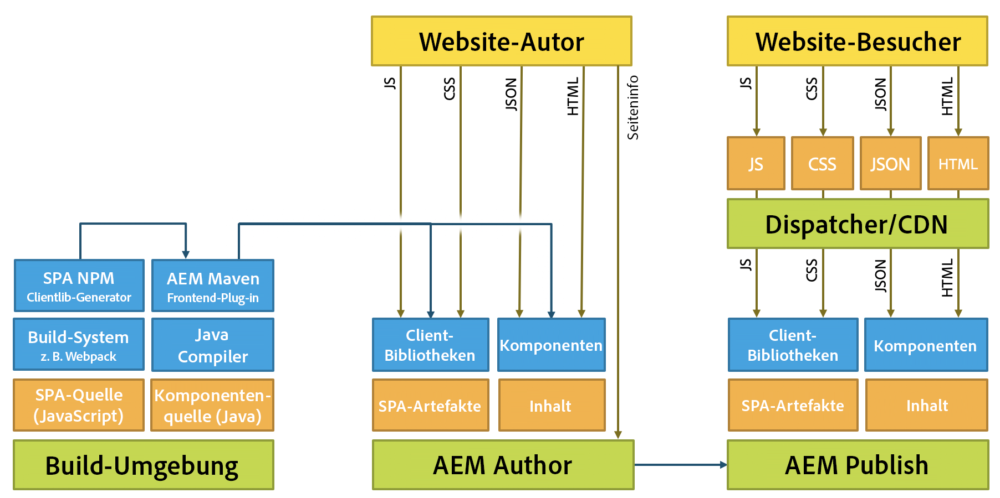

# Entwickeln von SPAs für AEM{#developing-spas-for-aem}

Single Page Applications (SPAs) können ansprechende Erlebnisse für Website-Benutzer bieten. Entwickler möchten Sites mit SPA Frameworks erstellen können und Autoren möchten Inhalte in Adobe Experience Manager (AEM) nahtlos für eine Site bearbeiten, die mit solchen Frameworks erstellt wurde.

Dieser Artikel enthält wichtige Fragen, die zu beachten sind, wenn ein Frontend-Entwickler damit beauftragt wird, eine SPA für AEM zu entwickeln, und gibt einen Überblick über die Architektur der AEM bei der Bereitstellung von SPA auf AEM.

>[!NOTE]
>
>Der SPA Editor ist die empfohlene Lösung für Projekte, die SPA Framework-basiertes Client-seitiges Rendering erfordern (z. B. React oder Angular).

## SPA-Entwicklungsgrundsätze für AEM {#spa-development-principles-for-aem}

Bei der Entwicklung von Single Page Applications in AEM wird davon ausgegangen, dass sich die Frontend-Entwicklungspersonen beim Erstellen einer SPA an die üblichen Best Practices halten. Wenn Sie als Frontend-Entwickler diese allgemeinen Best Practices und einige AEM-spezifische Prinzipien befolgen, wird Ihr SPA mit [AEM und die Inhaltsbearbeitungsfunktionen](/help/sites-developing/spa-walkthrough.md#content-editing-experience-with-spa).

* **[Portabilität](/help/sites-developing/spa-architecture.md#portability):** Wie alle anderen Komponenten auch sollten die Komponenten so portabel wie möglich gestaltet werden. Die SPA sollte aus portablen und wiederverwendbaren Komponenten bestehen.
* **[AEM verwaltet die Site-Struktur](/help/sites-developing/spa-architecture.md#aem-drives-site-structure)**: Die Frontend-Entwicklungsperson erstellt Komponenten und ist für deren interne Struktur verantwortlich, verlässt sich für die Definition der Inhaltsstruktur der Site jedoch auf AEM.
* **[Dynamisches Rendering](/help/sites-developing/spa-architecture.md#dynamic-rendering)**: Alle Rendering-Vorgänge sollten dynamisch sein.
* **[Dynamisches Routing](#dynamic-routing):** Die SPA ist für das Routing verantwortlich. AEM überwacht sie und ruft darauf basierend Inhalte ab. Jegliches Routing sollte ebenfalls dynamisch sein.

Wenn Sie sich bei der Entwicklung Ihrer SPA an diese Grundsätze halten, wird diese so flexibel und zukunftssicher wie möglich sein sowie die Nutzung aller unterstützten AEM Authoring-Funktionen ermöglichen.

Wenn Sie keine Unterstützung für AEM Authoring-Funktionen benötigen, sollten Sie möglicherweise ein anderes [SPA-Design-Modell](/help/sites-developing/spa-architecture.md#spa-design-models) in Betracht ziehen.

### Portabilität {#portability}

Wie bei der Entwicklung von Komponenten sollten Ihre Komponenten so gestaltet sein, dass sie maximale Portabilität aufweisen. Alle Muster, die der Portabilität oder Wiederverwendbarkeit der Komponenten zuwiderlaufen, sollten vermieden werden, um Kompatibilität, Flexibilität und Wartbarkeit in Zukunft zu garantieren.

Die resultierende SPA sollte mit hochgradig portablen und wiederverwendbaren Komponenten erstellt werden.

### AEM verwaltet die Site-Struktur {#aem-drives-site-structure}

Die Frontend-Entwicklungsperson muss sich als verantwortlich für die Einrichtung einer Bibliothek mit SPA-Komponenten betrachten, die zum Erstellen der App verwendet werden. Die Frontend-Entwicklungsperson hat die vollständige Kontrolle über die interne Struktur der Komponenten. [AEM besitzt jedoch jederzeit die Struktur der Site.](/help/sites-developing/spa-overview.md)

Das bedeutet, dass der Frontend-Entwickler Kundeninhalte vor oder nach dem Einstiegspunkt der Komponenten hinzufügen und innerhalb der Komponente auch Drittanbieter-Aufrufe durchführen kann. Der Frontend-Entwickler hat jedoch beispielsweise nicht die volle Kontrolle darüber, wie die Komponenten verschachtelt sind.

### Dynamisches Rendering {#dynamic-rendering}

Die SPA sollte sich nur auf dynamisches Rendering von Inhalten stützen. Dies ist die Standarderwartung, bei der AEM alle untergeordneten Elemente der Inhaltsstruktur abruft und rendert.

Jedes explizite Rendering, das auf bestimmte Inhalte verweist, gilt als statisches Rendering und wird zwar unterstützt, ist jedoch nicht mit den Inhaltserstellungsfunktionen von AEM kompatibel. Es widerspricht auch dem Grundsatz der [Portabilität](/help/sites-developing/spa-architecture.md#portability).

### Dynamisches Routing {#dynamic-routing}

Wie beim Rendering auch sollte das gesamte Routing dynamisch sein. In AEM sollte [die SPA stets für das Routing verantwortlich sein](/help/sites-developing/spa-routing.md); AEM lauscht darauf und ruft Inhalte auf dieser Basis ab.

Jedes statische Routing verstößt gegen den [Grundsatz der Portabilität](/help/sites-developing/spa-architecture.md#portability) und schränkt den Autor ein, da es nicht mit den Inhaltserstellungsfunktionen von AEM kompatibel ist. Bei statischem Routing müsste der Autor beispielsweise den Frontend-Entwickler bitten, dies zu tun, wenn der Inhaltsautor eine Route ändern oder eine Seite ändern möchte.

## AEM-Projektarchetyp {#aem-project-archetype}

Für jedes AEM-Projekt sollte der [AEM-Projektarchetyp](https://experienceleague.adobe.com/docs/experience-manager-core-components/using/developing/archetype/overview.html?lang=de) genutzt werden, der SPA-Projekte mithilfe von React oder Angular unterstützt und das SPA-SDK verwendet.

## SPA-Design-Modelle {#spa-design-models}

Wenn die [Prinzipien der Entwicklung von SPAs in AEM](/help/sites-developing/spa-architecture.md#spa-development-principles-for-aem) befolgt werden, wird Ihre SPA mit allen unterstützten Inhaltserstellungsfunktionen von AEM zusammenarbeiten.

Es kann jedoch Fälle geben, in denen dies nicht wirklich erforderlich ist. Die folgende Tabelle bietet einen Überblick über die verschiedenen Design-Modelle sowie ihre Vor- und Nachteile.

<table>
 <tbody>
  <tr>
   <th><strong>Design-Modell  </strong></th>
   <th><strong>Vorteile</strong></th>
   <th><strong>Nachteile</strong></th>
  </tr>
  <tr>
   <td>AEM wird als Headless-CMS ohne das <a href="/help/sites-developing/spa-reference-materials.md">SPA Editor SDK-Framework</a> verwendet.</td>
   <td>Die Frontend-Entwicklungsperson hat die vollständige Kontrolle über die App.</td>
   <td>
Inhaltsautorinnen bzw. -autoren können das Inhaltserstellungserlebnis von AEM nicht nutzen.
 
Der Code ist weder portabel noch wiederverwendbar, wenn er statische Referenzen oder Routing enthält.
 
Eine Verwendung des Vorlageneditors ist nicht zulässig. Daher muss die Frontend-Entwicklungsperson bearbeitbare Vorlagen über das JCR verwalten.
 </td>
  </tr>
  <tr>
   <td>Die Frontend-Entwicklungsperson verwendet das SPA-Editor-SDK-Framework, gibt jedoch für die Inhaltsautorinnen und -autoren nur ausgewählte Bereiche frei.</td>
   <td>Der Entwickler behält die Kontrolle über die App, indem er Authoring nur in eingeschränkten Bereichen der App aktiviert.</td>
   <td>
Autoren von Inhalten sind auf eine begrenzte Anzahl von AEM-Inhaltserstellungsfunktionen beschränkt.
 
Der Code ist möglicherweise weder portabel noch wiederverwendbar, wenn er statische Referenzen oder statisches Routing enthält.
 
Die Verwendung des Vorlageneditors ist nicht zulässig, daher muss der Frontend-Entwickler bearbeitbare Vorlagen über das JCR verwalten.
 </td>
  </tr>
  <tr>
   <td>Das Projekt nutzt komplett das SPA-Editor-SDK, die Frontend-Komponenten werden als Bibliothek entwickelt und die Verwaltung der Inhaltsstruktur der App wird an AEM übertragen.</td>
   <td>
Die App ist wiederverwendbar und portabel.
 
Der Inhaltsautor kann die App mit den Inhaltserstellungsfunktionen von AEM bearbeiten.  
 
Die SPA ist mit dem Vorlageneditor kompatibel.
 </td>
   <td>
Der Entwickler hat keine Kontrolle über die Struktur der App und den Teil des Inhalts, der an AEM delegiert wurde.
 
Der Entwickler kann aber Bereiche der App für Inhalte reservieren, die nicht mit AEM erstellt werden sollen.
 </td>
  </tr>
 </tbody>
</table>

>[!NOTE]
>
>Obwohl alle Modelle in AEM unterstützt werden, erfolgt dies nur durch Implementierung des dritten Modells (und folgt daher der empfohlenen [SPA Entwicklungsgrundsätze in AEM](/help/sites-developing/spa-architecture.md#spa-development-principles-for-aem)) können Inhaltsautoren mit dem Inhalt der SPA in AEM interagieren und ihn bearbeiten, wie sie es gewohnt sind.

## Migrieren vorhandener SPAs zu AEM {#migrating-existing-spas-to-aem}

Wenn Ihre SPA die [SPA-Entwicklungsprinzipien für AEM](/help/sites-developing/spa-architecture.md#spa-development-principles-for-aem) einhält, funktioniert Ihre SPA in AEM und ist mit dem AEM-SPA-Editor bearbeitbar.

Führen Sie die folgenden Schritte aus, um Ihre bestehende SPA für die Zusammenarbeit mit AEM bereit zu machen.

1. **Gestalten Sie Ihre JS-Komponenten modular.**

   Gestalten Sie sie so, dass sie in beliebiger Reihenfolge, Position und Größe gerendert werden können.
1. **Verwenden Sie die vom Adobe SDK bereitgestellten Container, um Ihre Komponenten auf dem Bildschirm zu platzieren.**

   AEM bietet eine Seiten- und Absatzsystemkomponente, die Sie verwenden können.
1. **Erstellen Sie für jede JS-Komponente eine AEM-Komponente.**

   Die AEM-Komponenten definieren den Dialog und die JSON-Ausgabe.

## Anweisungen für Frontend-Entwickler {#instructions-for-front-end-developers}

Wenn eine Frontend-Entwicklungsperson damit beauftragt wird, eine SPA für AEM zu erstellen, besteht die wichtigste Aufgabe darin, sich mit ihr auf die Komponenten und ihre JSON-Modelle zu einigen.

Im Folgenden werden die Schritte beschrieben, die ein Frontend-Entwickler bei der Entwicklung eines SPA für AEM durchführen muss.

1. **Einigen Sie sich hinsichtlich der Komponenten und ihrer JSON-Modelle**

   Frontend-Entwickler und Back-End-AEM-Entwickler müssen sich darauf einigen, welche Komponenten erforderlich sind, und ein Modell erstellen, damit eine Eins-zu-Eins-Übereinstimmung zwischen SPA Komponenten und den Backend-Komponenten besteht.

   AEM-Komponenten sind weiterhin erforderlich, insbesondere um Bearbeitungsdialogfelder bereitzustellen und das Komponentenmodell zu exportieren.

1. **In React-Komponenten greifen Sie auf das Modell zu über`this.props.cqModel`**

   Sobald Komponenten vereinbart sind und das JSON-Modell vorhanden ist, kann der Frontend-Entwickler die SPA entwickeln und über `this.props.cqModel` bequem auf das JSON-Modell zugreifen.

1. **Implementieren der `render()`-Methode der Komponente**

   Der Frontend-Entwickler implementiert die `render()`-Methode nach Belieben und kann die Felder der `cqModel`-Eigenschaft verwenden. Dadurch werden das DOM und die HTML-Fragmente ausgegeben, die in die Seite eingefügt werden. Dabei handelt es sich um die Standardmethode zur Erstellung einer App in React.

1. **Ordnen Sie die Komponente dem AEM-Ressourcentyp zu via`MapTo()`**

   Die Zuordnung speichert Komponentenklassen und wird von der bereitgestellten `Container`-Komponente intern zum Abrufen und dynamischen Instanziieren von Komponenten basierend auf dem angegebenen Ressourcentyp genutzt.

   Sie dient als „Kleber“ zwischen Front- und Backend, sodass der Editor weiß, welchen Komponenten die React-Komponenten entsprechen.

   `Page` und `ResponsiveGrid` sind gute Beispiele für Klassen, die den grundlegenden `Container` erweitern.

1. **Definieren Sie `EditConfig` der Komponente als Parameter für`MapTo()`**

   Dieser Parameter teilt dem Editor mit, wie die Komponente benannt werden soll, solange sie noch nicht gerendert ist oder über keinen zu rendernden Inhalt verfügt.

1. **Erweitern Sie die bereitgestellte `Container`-Klasse für Seiten und Container**

   Seiten und Absatzsysteme sollten diese Klasse erweitern, damit die Übertragung an innere Komponenten erwartungsgemäß funktioniert.

1. **Implementieren Sie eine Routing-Lösung, die die HTML5-`History`-API verwendet.**

   Wenn `ModelRouter` aktiviert ist, löst der Aufruf der Funktionen `pushState` und `replaceState` eine Anfrage an `PageModelManager` aus, um ein fehlendes Fragment des Modells abzurufen.

   Die aktuelle Version der `ModelRouter` unterstützt nur die Verwendung von URLs, die auf den tatsächlichen Ressourcenpfad der Einstiegspunkte des Sling-Modells verweisen. Der Einsatz von Vanity-URLs oder -Aliassen wird nicht unterstützt.

   Der `ModelRouter` kann deaktiviert oder so konfiguriert werden, dass eine Liste von regulären Ausdrücken ignoriert wird.

## AEM-Agnostik {#aem-agnostic}

Diese Code-Blöcke veranschaulichen, dass Ihre React- und Angular-Komponenten nichts Spezifisches für Adobe oder AEM benötigen.

* Alles, was sich in der JavaScript-Komponente befindet, ist AEM-agnostisch.
* Was jedoch AEM ist, ist, dass die JS-Komponente mit dem MapTo-Helfer einer AEM Komponente zugeordnet werden muss.

Das `MapTo`-Hilfsprogramm ist die Verbindung, die eine Abstimmung zwischen Backend- und Frontend-Komponenten ermöglicht:

* Es teilt dem JS-Container (oder dem JS-Absatzsystem) mit, welche JS-Komponente für das Rendern der einzelnen Komponenten, die in der JSON vorhanden sind, verantwortlich ist.
* Es wird ein HTML-Datenattribut zum HTML-Code hinzugefügt, das die JS-Komponente rendert, damit der SPA-Editor weiß, welches Dialogfeld dem Autor beim Bearbeiten der Komponente angezeigt werden soll.

Weitere Informationen zum Verwenden von `MapTo` und Erstellen von SPAs für AEM im Allgemeinen finden Sie im Handbuch „Erste Schritte“ für Ihr ausgewähltes Framework.

* [Erste Schritte mit SPAs in AEM – React](/help/sites-developing/spa-getting-started-react.md)
* [Erste Schritte mit SPAs in AEM – Angular](/help/sites-developing/spa-getting-started-angular.md)

## AEM-Architektur und SPAs {#aem-architecture-and-spas}

Die allgemeine Architektur von AEM einschließlich Umgebungen für Entwicklung, Authoring und Veröffentlichung ändert sich bei Verwendung von SPAs nicht. Es ist jedoch hilfreich zu verstehen, wie die SPA-Entwicklung mit dieser Architektur verbunden ist.

* **Build-Umgebung**

  Hier wird die Quelle für die SPA Anwendungsquelle und die Komponentenquelle ausgecheckt.

   * Der NPM-clientlib-Generator erstellt aus dem SPA-Projekt eine Client-Bibliothek.
   * Diese Bibliothek wird von Maven verwendet und vom Maven Build-Plugin zusammen mit der Komponente für AEM Author bereitgestellt.

* **AEM Author**

  Inhalte werden im AEM Author erstellt, einschließlich der Authoring-SPAs.

  Wenn eine SPA in der Authoring-Umgebung mit dem SPA-Editor bearbeitet wird:

   1. Die SPA fordert den äußeren HTML-Code an.
   1. Das CSS wird geladen.
   1. Das JavaScript der SPA-Anwendung wird geladen.
   1. Sobald die SPA-Anwendung ausgeführt wird, wird die JSON angefordert, damit die App das DOM der Seite einschließlich der `cq-data`-Attribute erstellen kann.
   1. Diese `cq-data`-Attribute ermöglichen es dem Editor, zusätzliche Seiteninformationen zu laden, sodass er weiß, welche Bearbeitungskonfigurationen für die Komponenten verfügbar sind.

* **AEM Publish**

  Hier werden die erstellten Inhalte und kompilierten Bibliotheken einschließlich SPA-Anwendungsartefakten, clientlibs und Komponenten für den öffentlichen Gebrauch veröffentlicht.

* **Dispatcher/CDN**

  Der Dispatcher dient für Besucherinnen und Besucher der Site als Zwischenspeicherebene von AEM.

   * Anfragen werden ähnlich wie im AEM-Autor verarbeitet. Es gibt jedoch keine Anforderung für die Seiteninformationen, da dies nur vom Editor benötigt wird.
   * JavaScript, CSS, JSON und HTML werden zwischengespeichert, wodurch die Seite für eine schnelle Bereitstellung optimiert wird.

>[!NOTE]
>
>In AEM gibt es keine Notwendigkeit, JavaScript-Build-Mechanismen oder das JavaScript selbst auszuführen. AEM hostet lediglich die kompilierten Artefakte aus der SPA-Anwendung.

## Nächste Schritte {#next-steps}

Einen Überblick darüber, wie eine einfache SPA in AEM strukturiert ist und wie sie funktioniert, finden Sie im Erste-Schritte-Handbuch für [React](/help/sites-developing/spa-getting-started-react.md) und [Angular](/help/sites-developing/spa-getting-started-angular.md).

Eine schrittweise Anleitung zum Erstellen einer eigenen SPA finden Sie unter [Erste Schritte mit dem AEM-SPA-Editor – WKND-Events-Tutorial](https://experienceleague.adobe.com/docs/experience-manager-learn/sites/spa-editor/spa-editor-framework-feature-video-use.html?lang=de).

Weitere Informationen zum dynamischen Modell für die Komponentenzuordnung und dazu, wie es mit SPAs in AEM funktioniert, finden Sie im Artikel [Dynamisches Modell für die Komponentenzuordnung bei SPAs](/help/sites-developing/spa-dynamic-model-to-component-mapping.md).

Wenn Sie SPA in AEM für ein anderes Framework als React oder Angular implementieren möchten oder einfach einen tiefen Einblick in die Funktionsweise des SPA SDK für AEM erhalten möchten, lesen Sie den Abschnitt [SPA Blueprint](/help/sites-developing/spa-blueprint.md) Artikel.
