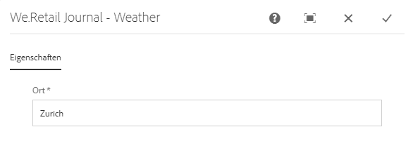
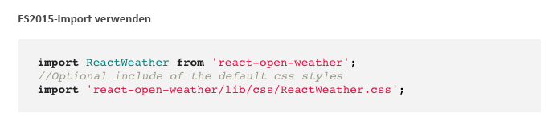
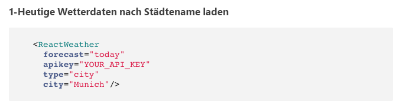

# Implementieren einer Reaktionskomponente für SPA{#implementing-a-react-component-for-spa}

Single Page Applications (SPAs) können ansprechende Erlebnisse für Website-Benutzer bieten. Entwickler möchten in der Lage sein, Websites mithilfe von SPA-Frameworks zu erstellen, und Autoren möchten Inhalte innerhalb von AEM für eine Website, die mit SPA-Frameworks erstellt wurde, nahtlos bearbeiten.

Die SPA-Erstellungsfunktion bietet eine umfassende Lösung zur Unterstützung von SPAs in AEM. In diesem Artikel wird ein Beispiel dafür vorgestellt, wie eine einfache, vorhandene React-Komponente an den AEM SPA-Editor angepasst werden kann.

>[!NOTE]
>
>Der SPA Editor ist die empfohlene Lösung für Projekte, bei denen SPA Framework-basiertes clientseitiges Rendering (z.B. React oder Angular) erforderlich ist.

## Einführung {#introduction}

Dank des einfachen und leichten Vertrags, der für AEM erforderlich ist und zwischen dem SPA und dem SPA Editor eingerichtet wurde, ist es einfach, eine vorhandene JavaScript-Anwendung zu benutzen und sie an eine SPA in AEM anzupassen.

In diesem Artikel wird das Beispiel der Wetterkomponente im Beispiel-SPA &quot;We.Retail&quot;des Protokolls veranschaulicht.

Bevor Sie diesen Artikel lesen, sollten Sie mit der [Struktur einer SPA Anwendung für AEM](/help/sites-developing/spa-getting-started-react.md) vertraut sein.

>[!CAUTION]
>Dieses Dokument verwendet die [We.Retail-Protokoll-App](https://github.com/Adobe-Marketing-Cloud/aem-sample-we-retail-journal) nur zu Demonstrationszwecken. Sie sollte nicht für Projektaufgaben verwendet werden.
>
>Für jedes AEM-Projekt sollte der [AEM-Projektarchetyp](https://docs.adobe.com/content/help/de-DE/experience-manager-core-components/using/developing/archetype/overview.html) genutzt werden, der SPA-Projekte mithilfe von React oder Angular unterstützt und das SPA SDK verwendet.

## Die Wetterkomponente {#the-weather-component}

Die Wetterkomponente befindet sich oben links in der Web.Retail-Protokoll-App. Es zeigt das aktuelle Wetter einer bestimmten Position an, wobei Wetterdaten dynamisch abgerufen werden.

### Verwenden des Wetter-Widgets {#using-the-weather-widget}


Beim Authoring von Inhalten der SPA im SPA Editor wird die Wetterkomponente als jede andere AEM mit einer Symbolleiste angezeigt und kann bearbeitet werden.


Die Stadt kann wie jede andere AEM in einem Dialog aktualisiert werden.



Die Änderung wird beibehalten und die Komponente wird automatisch mit neuen Wetterdaten aktualisiert.


### Wetterkomponentenimplementierung {#weather-component-implementation}

Die Wetterkomponente basiert tatsächlich auf einer öffentlich zugänglichen React-Komponente namens [React Open Weather](https://www.npmjs.com/package/react-open-weather), die für die Verwendung als Komponente in der Musteranwendung We.Retail-Protokoll SPA wurde.

Im Folgenden finden Sie Ausschnitte aus der NPM-Dokumentation zur Verwendung der Komponente &quot;React Open Weather&quot;.

 

Überprüfen des Codes der angepassten Wetterkomponente ( `Weather.js`) im Protokoll We.Retail:

* **Linie 16**: Das Widget &quot;Offenes Wetter react&quot;wird nach Bedarf geladen.
* **Linie 46**: Die  `MapTo` Funktion bezieht diese React-Komponente mit einer entsprechenden AEM-Komponente zusammen, damit sie im SPA Editor bearbeitet werden kann.

* **Zeilen 22-29**: Der Wert  `EditConfig` wird definiert, wobei geprüft wird, ob der Ort gefüllt wurde, und der Wert definiert wird, wenn er leer ist.

* **Zeilen 31-44**: Die Komponente &quot;Wetter&quot;erweitert die  `Component` Klasse und stellt die erforderlichen Daten bereit, wie in der NPM-Nutzungsdokumentation für die Komponente &quot;React Open Weather&quot;definiert, und rendert die Komponente.

```javascript
/*~~~~~~~~~~~~~~~~~~~~~~~~~~~~~~~~~~~~~~~~~~~~~~~~~~~~~~~~~~~~~~~~~~~~~~~~~~~~~~
 ~ Copyright 2018 Adobe Systems Incorporated
 ~
 ~ Licensed under the Apache License, Version 2.0 (the "License");
 ~ you may not use this file except in compliance with the License.
 ~ You may obtain a copy of the License at
 ~
 ~     https://www.apache.org/licenses/LICENSE-2.0
 ~
 ~ Unless required by applicable law or agreed to in writing, software
 ~ distributed under the License is distributed on an "AS IS" BASIS,
 ~ WITHOUT WARRANTIES OR CONDITIONS OF ANY KIND, either express or implied.
 ~ See the License for the specific language governing permissions and
 ~ limitations under the License.
 ~~~~~~~~~~~~~~~~~~~~~~~~~~~~~~~~~~~~~~~~~~~~~~~~~~~~~~~~~~~~~~~~~~~~~~~~~~~~~*/
import React, {Component} from 'react';
import ReactWeather from 'react-open-weather';
import {MapTo} from '@adobe/aem-react-editable-components';

require('./Weather.css');

const WeatherEditConfig = {

    emptyLabel: 'Weather',

    isEmpty: function() {
        return !this.props || !this.props.cq_model || !this.props.cq_model.city || this.props.cq_model.city.trim().length < 1;
    }
};

class Weather extends Component {

    render() {
        let apiKey = "12345678901234567890";
        let city;

        if (this.props.cq_model) {
            city = this.props.cq_model.city;
            return <ReactWeather key={'react-weather' + Date.now()} forecast="today" apikey={apiKey} type="city" city={city} />
        }

        return null;
    }
}

MapTo('we-retail-journal/global/components/weather')(Weather, WeatherEditConfig);
```

Obwohl bereits eine Back-End-Komponente vorhanden sein muss, kann der Front-End-Entwickler die React Open Weather-Komponente im Web.Retail-Protokoll SPA mit sehr wenig Kodierung nutzen.

## Nächster Schritt {#next-step}

Weitere Informationen zum Entwickeln von SPA für AEM finden Sie im Artikel [SPA für AEM](/help/sites-developing/spa-architecture.md).
