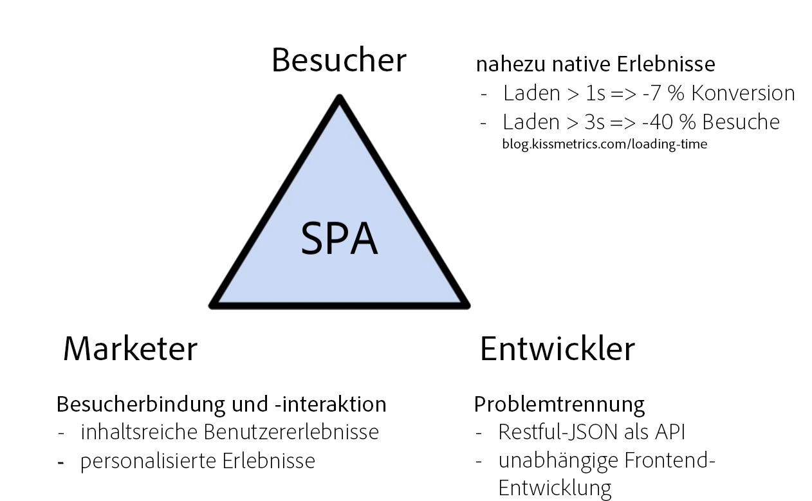
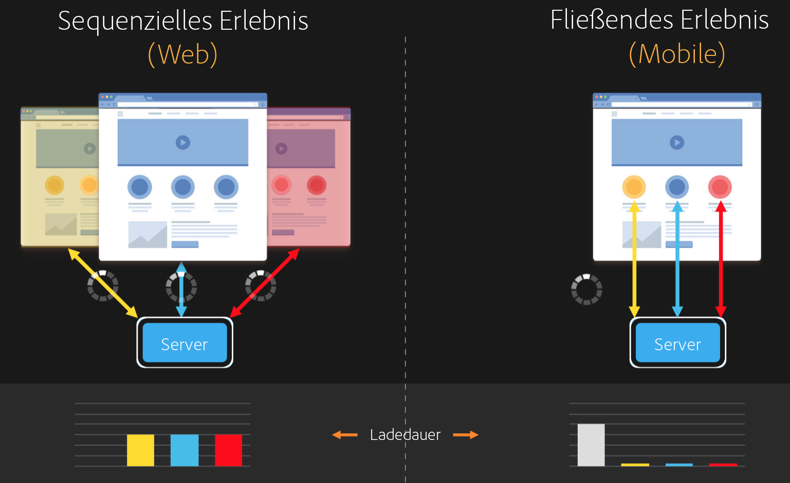
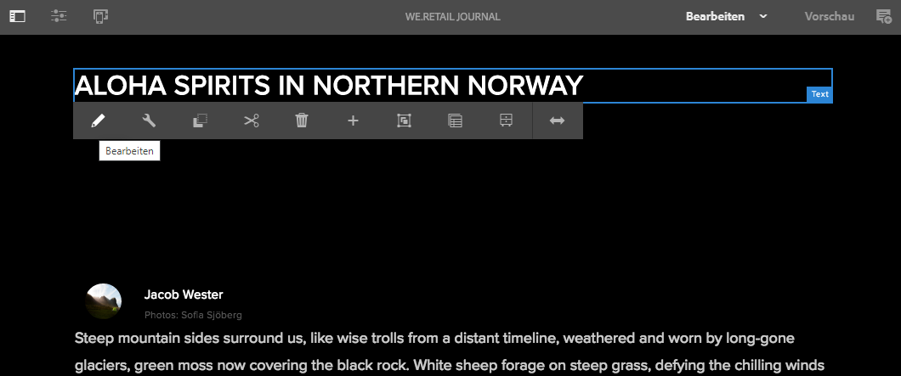
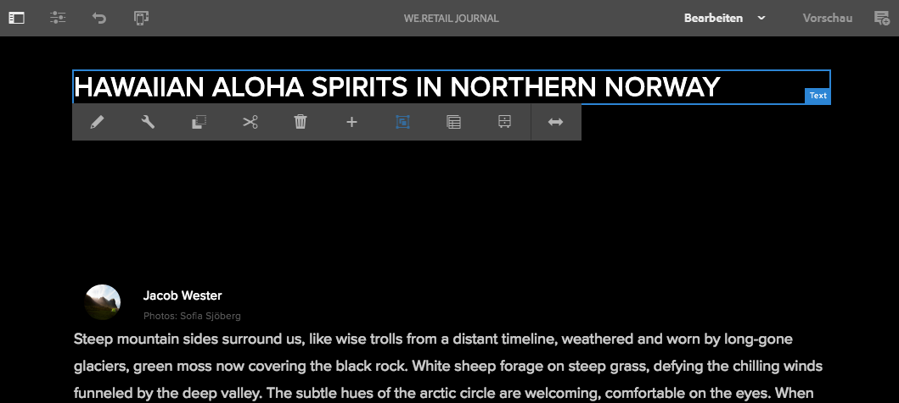
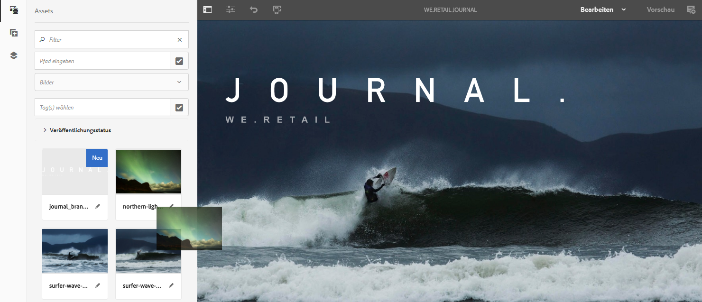
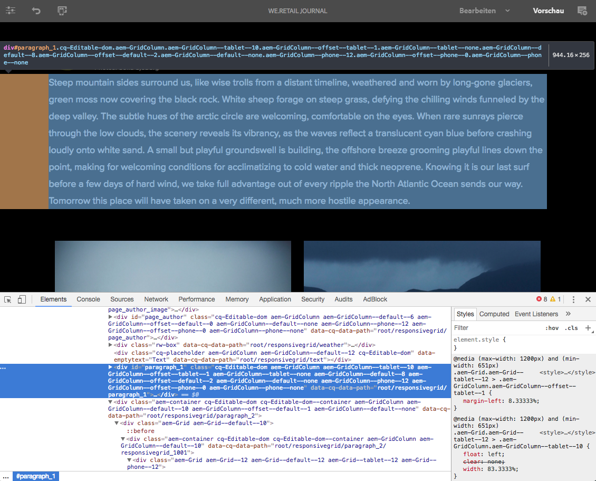

# Einführung in SPAs und exemplarische Anleitung{#spa-introduction-and-walkthrough}

Single Page Applications (SPAs) können ansprechende Erlebnisse für Website-Benutzer bieten. Entwickler möchten Sites mit SPA-Frameworks erstellen und Autoren möchten Inhalte in AEM nahtlos für eine Site bearbeiten, die mit diesen Frameworks erstellt wurde.

Der SPA-Editor bietet eine umfassende Lösung zur Unterstützung von SPAs in AEM. In diesem Artikel wird die Verwendung einer einfachen SPA zur Inhaltserstellung erläutert und gezeigt, wie sie mit dem zugrunde liegenden AEM-SPA-Editor in Beziehung steht.

>[!NOTE]
>
>Der SPA Editor ist die empfohlene Lösung für Projekte, bei denen SPA Framework-basiertes clientseitiges Rendering (z.B. React oder Angular) erforderlich ist.

## Einführung {#introduction}

### Ziel des Artikels {#article-objective}

In diesem Artikel werden die grundlegenden Konzepte von SPAs vorgestellt, bevor der Leser eine exemplarische Anleitung zum SPA-Editor erhält, indem eine einfache SPA-Anwendung zum Demonstrieren der grundlegenden Inhaltsbearbeitung verwendet wird. Dann folgen Details zum Aufbau der Seite und zu der Frage, wie die SPA mit dem AEM-SPA-Editor in Beziehung steht und interagiert.

Ziel der vorliegenden Einführung und exemplarischen Anleitung ist es, einem AEM-Entwickler zu demonstrieren, warum SPAs relevant sind, wie sie grundsätzlich funktionieren, wie SPAs vom AEM-SPA-Editor gehandhabt werden und wie sie sich von einer standardmäßigen AEM-Anwendung unterscheiden.

Die exemplarische Vorgehensweise basiert auf AEM Standardfunktionalität und der Beispielanwendung &quot;We.Retail&quot;-Protokoll. Folgende Anforderungen müssen erfüllt sein:

* [AEM Version 6.4 mit Service Pack 2 oder neuer](/help/release-notes/sp-release-notes.md)
* [Installieren Sie hier die Beispielanwendung &quot;We.Retail&quot;, die auf GitHub verfügbar ist.](https://github.com/Adobe-Marketing-Cloud/aem-sample-we-retail-journal)

>[!CAUTION]
>
>Dieses Dokument verwendet die [We.Retail-Protokoll-App](https://github.com/Adobe-Marketing-Cloud/aem-sample-we-retail-journal) nur zu Demonstrationszwecken. Sie sollte nicht für Projektaufgaben verwendet werden.
>
>Für jedes AEM-Projekt sollte der [AEM-Projektarchetyp](https://docs.adobe.com/content/help/de-DE/experience-manager-core-components/using/developing/archetype/overview.html) genutzt werden, der SPA-Projekte mithilfe von React oder Angular unterstützt und das SPA SDK verwendet.

### Was ist eine SPA? {#what-is-a-spa}

Eine Single Page Application (SPA) unterscheidet sich von einer herkömmlichen Seite insofern, als sie Client-seitig gerendert wird und primär JavaScript-gesteuert ist. Dabei wird auf Ajax-Aufrufe zurückgegriffen, um Daten zu laden und die Seite dynamisch zu aktualisieren. Der Großteil der Inhalte oder alle Inhalte werden einmal in einem einzelnen Seiten-Load abgerufen, wobei je nach Benutzerinteraktion mit der Seite asynchron zusätzliche Ressourcen geladen werden.

So wird der Bedarf nach Seitenaktualisierungen reduziert und dem Benutzer ein Erlebnis präsentiert, das nahtlos und schnell ist und eher wie eine native App funktioniert.

Der AEM-SPA-Editor ermöglicht es Frontend-Entwicklern, SPAs zu erstellen, die sich in eine AEM-Site integrieren lassen, damit Inhaltsautoren SPA-Inhalte so einfach bearbeiten können wie andere AEM-Inhalte.

### Warum eine SPA? {#why-a-spa}

Da SPAs schneller, nahtloser und eher wie eine native Anwendung sind, sind sie nicht nur für Besucher der Web-Seite, sondern auch für Marketing-Experten und Entwickler attraktiv. Das hängt mit der Art und Weise zusammen, wie SPAs funktionieren.



**Besucher**

* Besucher bevorzugen native Erlebnisse, wenn sie mit Inhalten interagieren.
* Es gibt Daten, die klar zeigen, dass eine Konversion umso wahrscheinlicher ist, je schneller eine Seite ist.

**Marketing-Experten**

* Marketing-Experten wollen umfangreiche, quasi native Erlebnisse bieten, um Besucher dazu zu bringen, sich voll und ganz auf Inhalte einzulassen.
* Durch Personalisierung können diese Erlebnisse noch ansprechender gestaltet werden.

**Entwickler**

* Entwickler wünschen sich eine saubere Trennung zwischen Inhalten und Präsentation.
* Eine saubere Trennung macht das System leichter erweiterbar und erlaubt eine unabhängige Frontend-Entwicklung.

### Wie funktioniert eine SPA? {#how-does-a-spa-work}

Die Grundidee hinter einem SPA besteht darin, dass Aufrufe und Abhängigkeiten von einem Server verringert werden, um Verzögerungen zu minimieren, die durch Serveraufrufe verursacht werden, sodass die SPA der Reaktionsgeschwindigkeit einer nativen Anwendung nahekommt.

Bei einer herkömmlichen, sequenziellen Web-Seite werden nur die für die aktuelle Seite benötigten Daten geladen. Das bedeutet, dass beim Wechseln des Besuchers zu einer anderen Seite der Server für die zusätzlichen Ressourcen aufgerufen werden muss. Es können zusätzliche Aufrufe erforderlich sein, da der Besucher mit Elementen auf der Seite interagiert. Diese Mehrfachaufrufe können zu einer Wahrnehmung von Verzögerungen führen, da die Seite die Anfragen des Besuchers erfüllen muss.



Für eine reibungslosere Benutzererfahrung, die dem entspricht, was ein Besucher von mobilen, nativen Apps erwartet, lädt eine SPA alle erforderlichen Daten für den Besucher beim ersten Laden. Dies mag zunächst ein wenig länger dauern, erfordert dann jedoch keine weiteren Server-Aufrufe mehr.

Durch die clientseitige Wiedergabe reagieren Seitenelemente schneller, und die Interaktionen mit der Seite durch den Besucher werden sofort ausgeführt. Alle weiteren erforderlichen Daten werden asynchron aufgerufen, um die Seitengeschwindigkeit zu maximieren.

>[!NOTE]
>
>Technische Details zur Funktionsweise SPA in AEM finden Sie im Artikel [Erste Schritte mit SPA in AEM](/help/sites-developing/spa-getting-started-react.md).
>
>Einen genaueren Überblick über Design, Architektur und technischen Arbeitsablauf des SPA-Editors finden Sie im Artikel [SPA Editor Overview](/help/sites-developing/spa-overview.md).

## Inhaltsbearbeitungserlebnis mit SPA {#content-editing-experience-with-spa}

Wenn ein SPA erstellt wurde, um den AEM SPA Editor zu nutzen, merkt der Inhaltsautor keinen Unterschied beim Bearbeiten und Erstellen von Inhalten. Es stehen gängige AEM-Funktionen zur Verfügung; am Workflow des Autors keine Änderungen erforderlich sind.

>[!NOTE]
>
>Die exemplarische Vorgehensweise basiert auf AEM Standardfunktionalität und der Beispielanwendung &quot;We.Retail&quot;-Protokoll. Folgende Anforderungen müssen erfüllt sein:
>
>* [AEM Version 6.4 mit Service Pack 2](/help/release-notes/sp-release-notes.md)
>* [Installieren Sie hier die Beispielanwendung &quot;We.Retail&quot;, die auf GitHub verfügbar ist.](https://github.com/Adobe-Marketing-Cloud/aem-sample-we-retail-journal)

>


1. Bearbeiten Sie die Web.Retail-Protokoll-App in AEM.

   `https://localhost:4502/editor.html/content/we-retail-journal/react.html`

   

1. Wählen Sie eine Überschriftenkomponente aus und beachten Sie, dass eine Symbolleiste wie bei jeder anderen Komponente angezeigt wird. Wählen Sie **Bearbeiten** aus.

   

1. Bearbeiten Sie den Inhalt in AEM wie gewohnt und beachten Sie, dass die Änderungen persistiert werden.

   

   >[!NOTE]
   >Weitere Informationen zum Texteditor und zur SPA finden Sie unter [SPA Editor Overview](spa-overview.md#requirements-limitations).

1. Verwenden Sie den Assets-Browser, um per Drag-and-Drop ein neues Bild in eine Bildkomponente zu ziehen.

   

1. Die Änderung wird persistiert.

   

Weitere Authoring-Werkzeuge wie das Ziehen und Ablegen zusätzlicher Komponenten auf der Seite, das Neuanordnen von Komponenten und das Ändern des Layouts werden wie in jeder anderen Nicht-SPA-Anwendung unterstützt.

>[!NOTE]
>
>Der SPA-Editor ändert das DOM der Anwendung nicht. Die SPA selbst ist für das DOM verantwortlich.
>
>Um zu erfahren, wie das funktioniert, fahren Sie mit dem nächsten Abschnitt des Artikels [SPAs und der AEM-SPA-Editor](/help/sites-developing/spa-walkthrough.md#spa-apps-and-the-aem-spa-editor) fort.

## SPAs und der AEM-SPA-Editor {#spa-apps-and-the-aem-spa-editor}

Wenn Sie erfahren, wie sich ein SPA für den Endbenutzer verhält und dann die SPA überprüfen, können Sie besser verstehen, wie eine SAP-App mit dem SPA Editor in AEM funktioniert.

### Verwenden einer SPA-Anwendung {#using-an-spa-application}

1. Laden Sie die Web.Retail-Protokoll-Anwendung entweder auf dem Veröffentlichungsserver oder verwenden Sie die Option **Ansicht als Veröffentlicht** aus dem Menü **Seiteninformationen** im Seiteneditor.

   `/content/we-retail-journal/react.html`

   

   Beachten Sie die Seitenstruktur, einschließlich Navigation zu untergeordneten Seiten, Wetter-Widget und Artikeln.

1. Navigieren Sie mithilfe des Menüs zu einer untergeordneten Seite und beachten Sie, dass die Seite sofort geladen wird, ohne dass eine Aktualisierung erforderlich ist.

   

1. Öffnen Sie die integrierten Entwickler-Tools Ihres Browsers und überwachen Sie beim Navigieren durch die untergeordneten Seiten die Netzwerkaktivität.

   

   Wenn Sie in der App von Seite zu Seite wechseln, ist der Traffic sehr gering. Die Seite wird nicht neu geladen; lediglich die neuen Bilder werden angefordert.

   Die SPA verwaltet Inhalt und Routing komplett auf der Client-Seite.

Wenn die Seite beim Navigieren durch die untergeordneten Seiten nicht neu geladen wird: Wie wird sie dann geladen?

Im nächsten Abschnitt [Laden einer SPA-Anwendung](/help/sites-developing/spa-walkthrough.md#loading-an-spa-application) werden die Mechanismen zum Laden der SPA und zum synchronen und asynchronen Laden von Inhalten genauer beschrieben.

### Laden einer SPA-Anwendung {#loading-an-spa-application}

1. Laden Sie, falls noch nicht geschehen, die Anwendung „We.Retail Journal“ entweder auf den Veröffentlichungs-Server oder unter Verwendung der Option **Als veröffentlicht anzeigen** im Menü **Seiteninformationen** des Seiteneditors.

   `/content/we-retail-journal/react.html`

   

1. Verwenden Sie das integrierte Tool Ihres Browsers, um die Quelle der Seiten anzuzeigen.
1. Beachten Sie, dass der Inhalt der Quelle extrem begrenzt ist.

   ```
   <!DOCTYPE HTML>
   <html lang="en-CH">
       <head>
       <meta charset="UTF-8">
       <title>We.Retail Journal</title>
   
       <meta name="template" content="we-retail-react-template"/>
   
   <link rel="stylesheet" href="/etc.clientlibs/we-retail-journal/react/clientlibs/we-retail-journal-react.css" type="text/css">
   
   <link rel="stylesheet" href="/libs/wcm/foundation/components/page/responsive.css" type="text/css">
   
   </head>
       <body class="page basicpage">
   
   <div id="page"></div>
   
   <script type="text/javascript" src="/etc.clientlibs/we-retail-journal/react/clientlibs/we-retail-journal-react.js"></script>
   
       </body>
   </html>
   ```

   Die Seite enthält im Hauptteil keine Inhalte. Es besteht hauptsächlich aus Stylesheets und einem Aufruf eines React-Skripts, `we-retail-journal-react.js`.

   Dieses React-Skript ist der primäre Treiber dieser Anwendung und ist für die Wiedergabe des gesamten Inhalts verantwortlich.

1. Nutzen Sie die integrierten Tools Ihres Browsers, um die Seite zu überprüfen. Sehen Sie sich den Inhalt des vollständig geladenen DOM an.

   

1. Wechseln Sie im Inspektor zur Registerkarte „Netzwerk“ und laden Sie die Seite neu.

   Beachten Sie, dass wenn Bildanfragen ignoriert werden, die primären Ressourcen, die für die Seite geladen werden, die Seite selbst, CSS, das React-JavaScript, seine Abhängigkeiten sowie JSON-Daten für die Seite sind.

   

1. Laden Sie die `react.model.json` in einer neuen Registerkarte.

   `/content/we-retail-journal/react.model.json`

   

   Der AEM-SPA-Editor nutzt [AEM Content Services](/help/assets/content-fragments/content-fragments.md), um den gesamten Inhalt der Seite als JSON-Modell bereitzustellen.

   Durch Implementierung spezifischer Schnittstellen stellen Sling-Modelle die für die SPA notwendigen Daten bereit. Die Bereitstellung der JSON-Daten wird nach unten an die jeweilige Komponente delegiert (von Seite zu Absatz zu Komponente usw.).

   Jede Komponente wählt aus, was sie anzeigt und wie sie dargestellt wird (serverseitig mit HTML oder clientseitig mit React). Natürlich konzentriert sich dieser Artikel auf die clientseitige Wiedergabe mit React.

1. Das Modell kann Seiten auch zusammen gruppieren, damit sie synchron geladen werden. Dadurch verringert sich die Zahl der erforderlichen Seitenneuladungen.

   Im Protokoll We.Retail werden die Seiten `home`, `blog` und `aboutus` synchron geladen, da Besucher normalerweise alle diese Seiten besuchen. Die Seite `weather` wird jedoch asynchron geladen, da Besucher sie mit geringerer Wahrscheinlichkeit besuchen.

   Dieses Verhalten ist nicht obligatorisch und kann umfassend definiert werden.

   

1. Um diesen Unterschied im Verhalten zu sehen, laden Sie die -Seite neu und löschen Sie die Netzwerkaktivität des Inspektors. Navigieren Sie zum Blog und zu unseren Seiten im Seitenmenü und sehen Sie, dass keine Netzwerk-Aktivität gemeldet wird.

   Navigieren Sie zur Wetterseite und sehen Sie, dass `weather.model.json` asynchron aufgerufen wird.

   

### Interaktion mit dem SPA-Editor {#interaction-with-the-spa-editor}

Mithilfe der Beispielanwendung &quot;We.Retail Protokoll&quot;ist klar, wie sich die App beim Veröffentlichen verhält und geladen wird, wobei Inhaltsdienste für JSON Content Versand sowie das asynchrone Laden von Ressourcen genutzt werden.

Darüber hinaus ist die Inhaltserstellung mit einem SPA-Editor für den Inhaltsautor in AEM nahtlos.

Im folgenden Abschnitt werden wir uns den Vertrag ansehen, der es dem SPA-Editor erlaubt, Komponenten innerhalb der SPA mit AEM-Komponenten zu verbinden und so für ein nahtloses Bearbeitungserlebnis zu sorgen.

1. Laden Sie die Web.Retail-Protokoll-Anwendung im Editor und wechseln Sie zum **Vorschau**-Modus.

   `https://localhost:4502/editor.html/content/we-retail-journal/react.html`

1. Überprüfen Sie mithilfe der integrierten Entwickler-Tools Ihres Browsers den Inhalt der Seite. Wählen Sie mit dem Auswahl-Tool eine bearbeitbare Komponente auf der Seite aus und zeigen Sie die Elementdetails an.

   Beachten Sie, dass die Komponente über ein neues Datenattribut verfügt (`data-cq-data-path`).

   

   Beispiel

   `data-cq-data-path="root/responsivegrid/paragraph_1`

   Diese Pfade ermöglichen das Abrufen und Verknüpfen des Konfigurationsobjekts des Bearbeitungskontexts jeder Komponente.

   Dies ist das einzige Markup-Attribut, das erforderlich ist, damit der Editor das Element als bearbeitbare Komponente innerhalb der SPA erkennen kann. Auf Grundlage dieses Attributs bestimmt der SPA-Editor, welche bearbeitbare Konfiguration mit der Komponente verknüpft ist, sodass der richtige Rahmen, die richtige Symbolleiste usw. geladen werden.

   Einige spezifische Klassennamen werden auch für die Kennzeichnung von Platzhaltern und für die Drag-and-Drop-Funktion von Assets hinzugefügt.

   >[!NOTE]
   >
   >Hierbei handelt es sich um eine Verhaltensänderung von serverseitig gerenderten Seiten in AEM, wobei für jede bearbeitbare Komponente ein `cq`-Element eingefügt wird.
   >
   >
   >Durch diesen Ansatz in SPA entfällt die Notwendigkeit, benutzerdefinierte Elemente zu injizieren. Dabei wird nur ein zusätzliches Datenattribut verwendet, wodurch das Markup für den Frontend-Entwickler einfacher wird.

## Nächste Schritte {#next-steps}

Da Sie nun das SPA-Bearbeitungserlebnis in AEM kennen und die Beziehung einer SPA zum SPA-Editor verstehen, können Sie sich genauere Einblicke in die Erstellung einer SPA verschaffen.

* [Erste Schritte mit SPA in ](/help/sites-developing/spa-getting-started-react.md) AEM zeigt, wie ein grundlegendes SPA für die Arbeit mit dem SPA Editor in AEM
* [SPA-Editor – Überblick](/help/sites-developing/spa-overview.md) liefert genauere Informationen zum Kommunikationsmodell zwischen AEM und der SPA.
* [Entwicklung von SPAs für AEM](/help/sites-developing/spa-architecture.md) beschreibt, wie Frontend-Entwickler damit beauftragt werden können, eine SPA für AEM zu entwickeln, und wie SPAs mit der Architektur von AEM interagieren.
