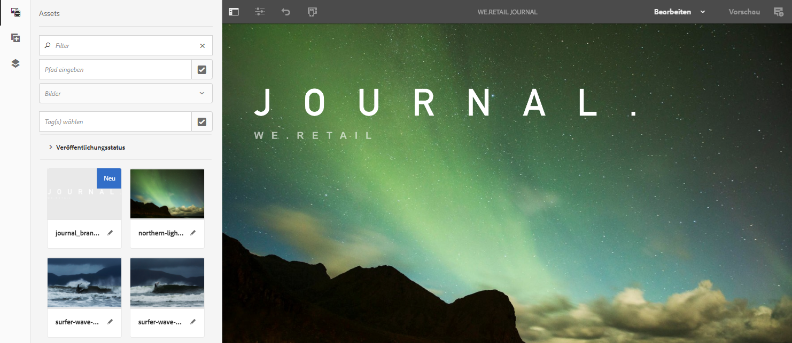

# Einführung und exemplarische Vorgehensweisen zu SPA{#spa-introduction-and-walkthrough}

Single Page Applications (SPAs) können ansprechende Erlebnisse für Website-Benutzer bieten. Entwickler möchten Sites mit SPA-Frameworks erstellen und Autoren möchten Inhalte in AEM nahtlos für eine Site bearbeiten, die mit diesen Frameworks erstellt wurde.

Der SPA-Editor bietet eine umfassende Lösung zur Unterstützung von SPAs in AEM. Dieser Artikel erläutert die Verwendung einer einfachen SPA-Anwendung zum Authoring und zeigt, wie sie mit dem zugrunde liegenden AEM SPA-Editor in Beziehung steht.

>[!NOTE]
>
>Der SPA-Editor ist die empfohlene Lösung für Projekte, bei denen clientseitiges Rendering (z.B. React oder Angular) durch das SPA-Framework erforderlich ist.

## Einführung {#introduction}

### Artikel Ziel {#article-objective}

In diesem Artikel werden die grundlegenden Konzepte von SPAs vorgestellt, bevor der Leser durch eine exemplarische Anleitung des SPA-Editors geführt wird, indem eine einfache SPA-Anwendung verwendet wird, um die grundlegende Bearbeitung von Inhalten zu demonstrieren. Anschließend taucht er in die Konstruktion der Seite ein und zeigt, wie die SPA-Anwendung mit dem AEM SPA Editor in Beziehung steht und mit ihm interagiert.

Ziel dieser Einführung und exemplarischen Vorgehensweise ist es, einem AEM-Entwickler zu zeigen, warum SPAs relevant sind, wie sie im Allgemeinen funktionieren, wie eine SPA vom AEM SPA Editor verarbeitet wird und wie sie sich von einer Standard-AEM-Anwendung unterscheiden.

Die exemplarische Vorgehensweise basiert auf der standardmäßigen AEM-Funktionalität und der Web.Retail-Protokoll-App. Folgende Anforderungen müssen erfüllt sein:

* [AEM Version 6.4 mit Service Pack 2 oder neuer
   ](/help/release-notes/sp-release-notes.md)
* [Installieren Sie hier die Beispielanwendung &quot;We.Retail&quot;, die auf GitHub verfügbar ist.](https://github.com/Adobe-Marketing-Cloud/aem-sample-we-retail-journal)

>[!CAUTION]
>
>Dieses Dokument verwendet die [We.Retail-Protokoll-App](https://github.com/Adobe-Marketing-Cloud/aem-sample-we-retail-journal) nur zu Demonstrationszwecken. Es sollte nicht für Projektarbeiten verwendet werden.
>
>Jedes AEM-Projekt sollte den [AEM-Projektarchiv](https://docs.adobe.com/content/help/en/experience-manager-core-components/using/developing/archetype/overview.html)nutzen, der SPA-Projekte mit React oder Angular unterstützt und das SPA-SDK nutzt.

### Was ist ein BSG? {#what-is-a-spa}

Eine einseitige Anwendung (SPA) unterscheidet sich von einer herkömmlichen Seite insofern, als sie clientseitig wiedergegeben wird und primär Javascript-gesteuert ist. Dabei wird auf Ajax-Aufrufen zurückgegriffen, um Daten zu laden und die Seite dynamisch zu aktualisieren. Die meisten oder alle Inhalte werden einmal in einer einzelnen Seite geladen, wobei je nach Benutzerinteraktion mit der Seite zusätzliche Ressourcen asynchron geladen werden.

Auf diese Weise wird die Seitenaktualisierung reduziert und dem Benutzer ein Erlebnis präsentiert, das nahtlos, schnell und mehr wie eine native App funktioniert.

Der AEM SPA Editor ermöglicht es Frontend-Entwicklern, SPAs zu erstellen, die in eine AEM-Site integriert werden können. Dadurch können Autoren den SPA-Inhalt genauso einfach bearbeiten wie andere AEM-Inhalte.

### Warum ein BSG? {#why-a-spa}

Durch die Beschleunigung, Verkapselung und mehr wie eine native Anwendung wird eine SPA nicht nur für den Besucher der Webseite, sondern auch für Marketingfachleute und Entwickler aufgrund der Art und Weise, wie SPAs funktionieren, zu einem sehr attraktiven Erlebnis.


**Besucher**

* Besucher möchten native Erlebnisse, wenn sie mit Inhalten interagieren.
* Es gibt klare Daten, dass eine Konversion umso wahrscheinlicher ist, je schneller eine Seite ist.

**Marketingexperten**

* Marketingexperten möchten umfangreiche, native Erlebnisse zum Angebot bringen, um Besucher dazu anzuregen, sich voll mit Inhalten zu beschäftigen.
* Durch die Personalisierung werden diese Erlebnisse noch ansprechender.

**Entwickler**

* Entwickler wollen eine saubere Trennung zwischen Inhalt und Präsentation.
* Eine saubere Trennung macht das System erweiterbarer und ermöglicht eine unabhängige Front-End-Entwicklung.

### Wie wirkt ein BSG? {#how-does-a-spa-work}

Die Grundidee hinter einer SPA ist, dass Aufrufe und Abhängigkeiten von einem Server verringert werden, um Verzögerungen zu minimieren, die durch Serveraufrufe verursacht werden, sodass die SPA die Reaktionsgeschwindigkeit einer nativen Anwendung angeht.

Auf einer herkömmlichen, sequenziellen Webseite werden nur die für die sofortige Seite benötigten Daten geladen. Das bedeutet, dass beim Wechsel des Besuchers zu einer anderen Seite der Server für die zusätzlichen Ressourcen aufgerufen wird. Es können zusätzliche Aufrufe erforderlich sein, da der Besucher mit Elementen auf der Seite interagiert. Diese Mehrfachaufrufe können zu Verzögerungen oder Verzögerungen führen, da die Seite die Anforderungen des Besuchers einhalten muss.


Für eine reibungslosere Benutzererfahrung, die dem entspricht, was ein Besucher von mobilen, nativen Apps erwartet, lädt eine SPA beim ersten Laden alle erforderlichen Daten für den Besucher. Dies kann zunächst etwas länger dauern, erfordert dann jedoch keine zusätzlichen Server-Aufrufe mehr.

Durch die clientseitige Wiedergabe reagieren Seitenelemente schneller, und die Interaktionen mit der Seite durch den Besucher werden sofort ausgeführt. Alle weiteren erforderlichen Daten werden asynchron aufgerufen, um die Seitengeschwindigkeit zu maximieren.

>[!NOTE]
>
>Technische Informationen zur Funktionsweise von SPAs in AEM finden Sie im Artikel [Erste Schritte mit SPAs in AEM](/help/sites-developing/spa-getting-started-react.md).
>
>Weitere Informationen zu Design, Architektur und technischem Arbeitsablauf des SPA-Editors finden Sie im Artikel [SPA Editor-Übersicht](/help/sites-developing/spa-overview.md).

## Content Editing Experience with SPA {#content-editing-experience-with-spa}

Wenn eine SPA erstellt wurde, um den AEM SPA Editor zu nutzen, merkt der Inhaltsersteller keinen Unterschied beim Bearbeiten und Erstellen von Inhalten. Es sind gängige AEM-Funktionen verfügbar und es sind keine Änderungen am Arbeitsablauf des Autors erforderlich.

>[!NOTE]
>
>Die exemplarische Vorgehensweise basiert auf der standardmäßigen AEM-Funktionalität und der Web.Retail-Protokoll-App. Folgende Anforderungen müssen erfüllt sein:
>
>* [AEM Version 6.4 mit Service Pack 2](/help/release-notes/sp-release-notes.md)
>* [Installieren Sie hier die Beispielanwendung &quot;We.Retail&quot;, die auf GitHub verfügbar ist.](https://github.com/Adobe-Marketing-Cloud/aem-sample-we-retail-journal)
>


1. Bearbeiten Sie die Web.Retail-Protokoll-App in AEM.

   `https://localhost:4502/editor.html/content/we-retail-journal/react.html`

   

1. Wählen Sie eine Überschriftenkomponente aus und beachten Sie, dass eine Symbolleiste wie bei jeder anderen Komponente angezeigt wird. Wählen Sie **Bearbeiten** aus.

   

1. Bearbeiten Sie den Inhalt innerhalb von AEM normal und beachten Sie, dass die Änderungen beibehalten werden.

   

   >[!NOTE]
   >Weitere Informationen zum Texteditor und den [SPAs finden Sie unter Übersicht über](spa-overview.md#requirements-limitations) den SPA-Editor.

1. Verwenden Sie den Assets-Browser, um ein neues Bild per Drag &amp; Drop in eine Bildkomponente zu ziehen.

   

1. Die Änderung wird beibehalten.

   

Weitere Authoring-Werkzeuge wie das Ziehen und Ablegen zusätzlicher Komponenten auf der Seite, das Neuanordnen von Komponenten und das Ändern des Layouts werden wie in jeder anderen Nicht-SPA-Anwendung unterstützt.

>[!NOTE]
>
>Der SPA-Editor ändert das DOM der Anwendung nicht. Die SPA selbst ist für das DOM verantwortlich.
>
>Um zu sehen, wie dies funktioniert, fahren Sie mit dem nächsten Abschnitt dieses Artikels [SPA-Apps und AEM SPA-Editor](/help/sites-developing/spa-walkthrough.md#spa-apps-and-the-aem-spa-editor)fort.

## SPA-Apps und AEM SPA-Editor {#spa-apps-and-the-aem-spa-editor}

Die Erfahrung, wie sich eine SPA für den Endbenutzer verhält und anschließend die SPA-Seite überprüft, hilft, besser zu verstehen, wie eine SAP-App mit dem SPA Editor in AEM funktioniert.

### Verwenden einer SPA-Anwendung {#using-an-spa-application}

1. Laden Sie die Web.Retail-Protokoll-Anwendung entweder auf dem Veröffentlichungsserver oder unter Verwendung der Option **Ansicht wie veröffentlicht** im Menü &quot; **Seiteninformationen** &quot;des Seiteneditors.

   `/content/we-retail-journal/react.html`

   

   Beachten Sie die Seitenstruktur, einschließlich Navigation zu untergeordneten Seiten, Wetter-Widget und Artikeln.

1. Navigieren Sie mithilfe des Menüs zu einer untergeordneten Seite und sehen Sie, dass die Seite sofort geladen wird, ohne dass eine Aktualisierung erforderlich ist.

   

1. Öffnen Sie die integrierten Entwicklerwerkzeuge Ihres Browsers und überwachen Sie die Aktivität des Netzwerks, während Sie durch die untergeordneten Seiten navigieren.

   

   Während Sie von Seite zu Seite in der App wechseln, ist der Traffic sehr gering. Die Seite wird nicht neu geladen und nur die neuen Bilder werden angefordert.

   Die SPA verwaltet den Inhalt und das Routing vollständig clientseitig.

Wenn die Seite beim Navigieren durch die untergeordneten Seiten nicht neu geladen wird, wie wird sie dann geladen?

Der nächste Abschnitt, [Laden einer SPA-Anwendung](/help/sites-developing/spa-walkthrough.md#loading-an-spa-application), geht näher auf die Mechanismen des Ladens der SPA ein und beschreibt, wie Inhalte synchron und asynchron geladen werden können.

### Laden einer SPA-Anwendung {#loading-an-spa-application}

1. Laden Sie, falls noch nicht geladen, die Anwendung &quot;We.Retail Protokoll&quot;entweder auf dem Veröffentlichungsserver oder unter Verwendung der Option &quot; **Ansicht wie veröffentlicht** &quot;im Menü &quot; **Seiteninformationen** &quot;des Seiteneditors.

   `/content/we-retail-journal/react.html`

   

1. Verwenden Sie das integrierte Tool Ihres Browsers, um die Seitenquelle Ansicht.
1. Beachten Sie, dass der Inhalt der Quelle extrem begrenzt ist.

   ```
   <!DOCTYPE HTML>
   <html lang="en-CH">
       <head>
       <meta charset="UTF-8">
       <title>We.Retail Journal</title>
   
       <meta name="template" content="we-retail-react-template"/>
   
   <link rel="stylesheet" href="/etc.clientlibs/we-retail-journal/react/clientlibs/we-retail-journal-react.css" type="text/css">
   
   <link rel="stylesheet" href="/libs/wcm/foundation/components/page/responsive.css" type="text/css">
   
   </head>
       <body class="page basicpage">
   
   <div id="page"></div>
   
   <script type="text/javascript" src="/etc.clientlibs/we-retail-journal/react/clientlibs/we-retail-journal-react.js"></script>
   
       </body>
   </html>
   ```

   Die Seite enthält keinen Inhalt im Hauptteil. Es besteht hauptsächlich aus Stylesheets und einem Aufruf eines React-Skripts, `we-retail-journal-react.js`.

   Dieses React-Skript ist der primäre Treiber dieser Anwendung und ist für die Wiedergabe des gesamten Inhalts verantwortlich.

1. Verwenden Sie die integrierten Tools Ihres Browsers, um die Seite zu überprüfen. Sehen Sie sich den Inhalt des DOM vollständig geladen an.

   

1. Wechseln Sie im Inspektor zur Registerkarte &quot;Netzwerk&quot;und laden Sie die Seite erneut.

   Beachten Sie, dass Bildanforderungen ignoriert werden, dass die primären Ressourcen, die für die Seite geladen werden, die Seite selbst, CSS, das JavaScript &quot;React&quot;, seine Abhängigkeiten sowie JSON-Daten für die Seite sind.

   

1. Laden Sie die Datei `react.model.json` in eine neue Registerkarte.

   `/content/we-retail-journal/react.model.json`

   

   Der AEM SPA Editor nutzt [AEM Content Services](/help/assets/content-fragments.md) , um den gesamten Inhalt der Seite als JSON-Modell bereitzustellen.

   Durch die Implementierung spezifischer Schnittstellen stellen Sling-Modelle die für die SPA erforderlichen Informationen bereit. Der Versand der JSON-Daten wird nach unten auf jede Komponente (von Seite zu Absatz, zu Komponente usw.) übertragen.

   Jede Komponente wählt aus, was sie anzeigt und wie sie dargestellt wird (serverseitig mit HTML oder clientseitig mit React). Natürlich konzentriert sich dieser Artikel auf die clientseitige Wiedergabe mit React.

1. Das Modell kann auch Seiten gruppieren, sodass sie synchron geladen werden, wodurch sich die Anzahl der erforderlichen Seitenneuladungen verringert.

   Im Beispiel des We.Retail-Protokolls werden die `home`-, `blog`- und `aboutus` -Seiten synchron geladen, da Besucher in der Regel alle diese Seiten besuchen. Die `weather` Seite wird jedoch asynchron geladen, da es für Besucher weniger wahrscheinlich ist, sie zu besuchen.

   Dieses Verhalten ist nicht obligatorisch und kann vollständig definiert werden.

   

1. Um diesen Verhaltensunterschied Ansicht, laden Sie die Seite neu und löschen Sie die Netzwerk-Aktivität des Inspektors. Navigieren Sie zum Blog und zu unseren Seiten im Seitenmenü und sehen Sie, dass keine Netzwerk-Aktivität gemeldet wird.

   Navigieren Sie zur Wetterseite und sehen Sie, dass die Seite asynchron aufgerufen `weather.model.json` wird.

   

### Interaktion mit dem SPA-Editor {#interaction-with-the-spa-editor}

Mithilfe der Beispielanwendung &quot;We.Retail Protokoll&quot;ist klar, wie sich die App beim Veröffentlichen verhält und geladen wird, wobei Inhaltsdienste für JSON Content Versand sowie das asynchrone Laden von Ressourcen genutzt werden.

Darüber hinaus ist die Inhaltserstellung mit einem SPA-Editor für den Inhaltsautor in AEM nahtlos.

Im folgenden Abschnitt wird der Vertrag erläutert, der es dem SPA-Editor ermöglicht, Komponenten innerhalb der SPA mit AEM-Komponenten zu verknüpfen und diese nahtlose Bearbeitung zu erzielen.

1. Laden Sie die Web.Retail-Protokoll-Anwendung im Editor und wechseln Sie in den **Vorschau** -Modus.

   `https://localhost:4502/editor.html/content/we-retail-journal/react.html`

1. Überprüfen Sie mithilfe der integrierten Entwicklerwerkzeuge Ihres Browsers den Inhalt der Seite. Wählen Sie mit dem Auswahlwerkzeug eine bearbeitbare Komponente auf der Seite aus und Ansicht der Elementdetails.

   Beachten Sie, dass die Komponente über ein neues Datenattribut verfügt `data-cq-data-path`.

   

   Beispiel

   `data-cq-data-path="root/responsivegrid/paragraph_1`

   Diese Pfade ermöglichen das Abrufen und Verknüpfen des Konfigurationsobjekts des Bearbeitungskontexts jeder Komponente.

   Dies ist das einzige Markup-Attribut, das erforderlich ist, damit der Editor dies als bearbeitbare Komponente innerhalb der SPA erkennt. Auf der Grundlage dieses Attributs bestimmt der SPA-Editor, welche editierbare Konfiguration mit der Komponente verknüpft ist, sodass der richtige Rahmen, die richtige Symbolleiste usw. geladen wurde.

   Einige spezifische Klassennamen werden auch für die Kennzeichnung von Platzhaltern und für die Drag &amp; Drop-Funktion von Assets hinzugefügt.

   >[!NOTE]
   >
   >Hierbei handelt es sich um eine Verhaltensänderung von serverseitig gerenderten Seiten in AEM, wobei für jede bearbeitbare Komponente ein `cq` Element eingefügt wird.
   >
   >
   >Durch diesen Ansatz in SPA entfällt die Notwendigkeit, benutzerdefinierte Elemente zu injizieren. Dabei wird nur ein zusätzliches Datenattribut verwendet, wodurch das Markup für den Frontend-Entwickler einfacher wird.

## Nächste Schritte {#next-steps}

Jetzt, da Sie die SPA-Bearbeitungserfahrung in AEM und die Beziehung eines SPA zum SPA-Editor kennen, sollten Sie sich einen tieferen Eindruck davon machen, wie ein SPA aufgebaut ist.

* [Erste Schritte mit SPAs in AEM](/help/sites-developing/spa-getting-started-react.md) zeigen, wie eine grundlegende SPA für die Verwendung mit dem SPA-Editor in AEM erstellt wurde
* [Der SPA Editor-Überblick](/help/sites-developing/spa-overview.md) geht näher auf das Kommunikationsmodell zwischen AEM und SPA ein.
* [In der Entwicklung von SPAs für AEM](/help/sites-developing/spa-architecture.md) wird beschrieben, wie Frontend-Entwickler dazu bewegt werden, eine SPA für AEM zu entwickeln, und wie SPAs mit der AEM-Architektur interagieren.
