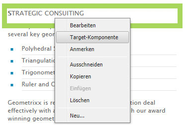
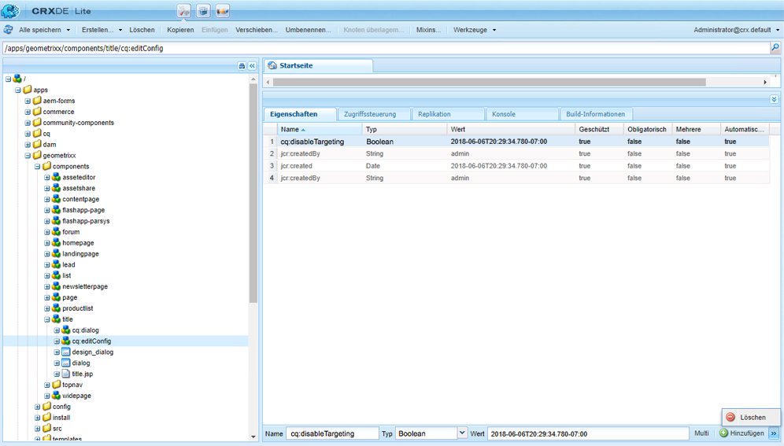
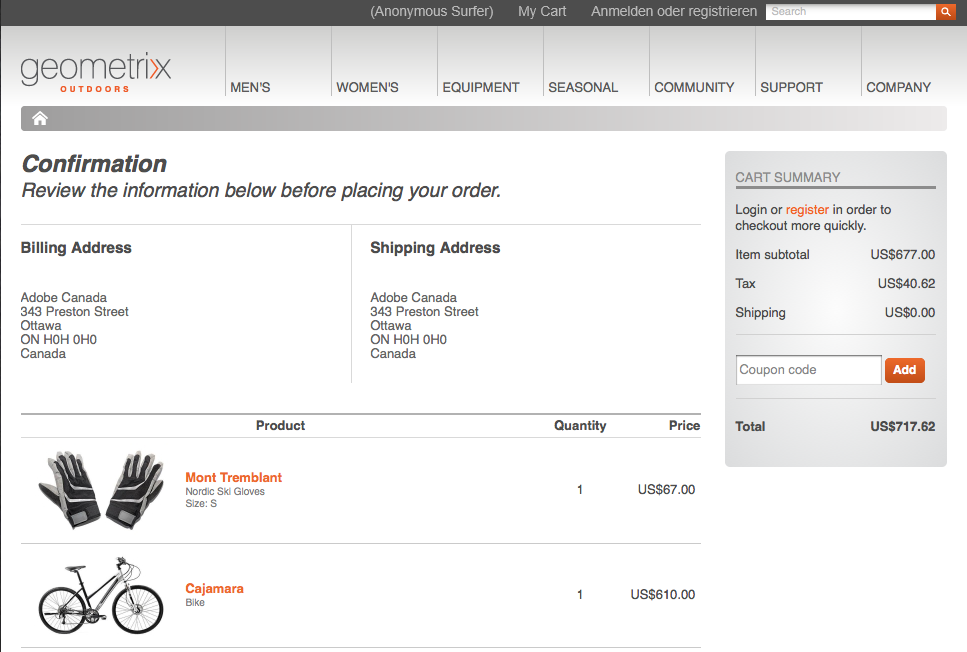

# Entwicklung für zielgerichtete Inhalte{#developing-for-targeted-content}

In diesem Abschnitt werden Themen zur Entwicklung von Komponenten zur Verwendung mit Content-Targeting behandelt.

* Weitere Informationen zur Verbindung mit Adobe Target finden Sie unter [Integration mit Adobe Target](/help/sites-administering/target.md).
* Informationen zum Verfassen von zielgerichtetem Inhalt finden Sie unter [Verfassen von zielgerichtetem Inhalt mit dem Targeting-Modus](/help/sites-authoring/content-targeting-touch.md).

>[!NOTE]
>
>Wenn Sie eine Komponente in AEM Author anvisieren, führt die Komponente eine Reihe von serverseitigen Aufrufen an Adobe Target durch, um die Kampagne zu registrieren, Angebote einzurichten und Adobe Target-Segmente abzurufen (falls konfiguriert). Es werden keine serverseitigen Aufrufe von AEM Publish an Adobe Target vorgenommen.

## Aktivieren von Targeting mit Adobe Target auf Ihren Seiten  {#enabling-targeting-with-adobe-target-on-your-pages}

Um zielgerichtete Komponenten auf Ihren Seiten zu verwenden, die mit Adobe Target interagieren, fügen Sie bestimmten clientseitigen Code in das Element &lt;head> ein.

### Der head-Bereich {#the-head-section}

Fügen Sie die folgenden Codeblöcke in den &lt;head>-Bereich Ihrer Seite ein:

```xml
<!--/* Include Context Hub */-->
<sly data-sly-resource="${'contexthub' @ resourceType='granite/contexthub/components/contexthub'}"/>
```

```xml
<cq:include script="/libs/cq/cloudserviceconfigs/components/servicelibs/servicelibs.jsp"/>
```

Dieser Code fügt die erforderlichen JavaScript-Analyseobjekte hinzu und lädt die Cloud-Service-Bibliotheken, die mit der Website verbunden sind. Für den Target-Dienst werden die Bibliotheken über `/libs/cq/analytics/components/testandtarget/headlibs.jsp` geladen

Die geladenen Bibliotheken hängen von der Art der Ziel-Client-Bibliothek (mbox.js oder at.js) ab, die in der Target-Konfiguration verwendet wird:

**Für Standard-mbox.js**

```
<script type="text/javascript" src="/libs/cq/foundation/testandtarget/parameters.js"></script>
 <script type="text/javascript" src="/libs/cq/foundation/testandtarget/mbox.js"></script>
 <script type="text/javascript" src="/libs/cq/foundation/personalization/integrations/commons.js"></script>
 <script type="text/javascript" src="/libs/cq/foundation/testandtarget/util.js"></script>
 <script type="text/javascript" src="/libs/cq/foundation/testandtarget/init.js"></script>
```

**Für benutzerdefinierte mbox.js**

```
<script type="text/javascript" src="/etc/cloudservices/testandtarget/<CLIENT-CODE>/_jcr_content/public/mbox.js"></script>
        <script type="text/javascript" src="/libs/cq/foundation/testandtarget/parameters.js"></script>
 <script type="text/javascript" src="/libs/cq/foundation/personalization/integrations/commons.js"></script>
 <script type="text/javascript" src="/libs/cq/foundation/testandtarget/util.js"></script>
 <script type="text/javascript" src="/libs/cq/foundation/testandtarget/init.js"></script>
```

**Für at.js**

```
<script type="text/javascript" src="/libs/cq/foundation/testandtarget/parameters.js"></script>
 <script type="text/javascript" src="/libs/cq/foundation/testandtarget/atjs-integration.js"></script>
 <script type="text/javascript" src="/libs/cq/foundation/testandtarget/atjs.js"></script>
```

>[!NOTE]
>
>Es wird nur die mit dem Produkt gelieferte Version von `at.js` unterstützt. Die mit dem Produkt gelieferte `at.js`-Version kann abgerufen werden, indem Sie die `at.js`-Datei am folgenden Speicherort anzeigen:
>
>**/libs/cq/testandtarget/clientlibs/testandtarget/atjs/source/at.js**.

**Für benutzerdefinierte at.js**

```
<script type="text/javascript" src="/etc/cloudservices/testandtarget/<CLIENT-CODE>/_jcr_content/public/at.js"></script>
    <script type="text/javascript" src="/libs/cq/foundation/testandtarget/parameters.js"></script>
 <script type="text/javascript" src="/libs/cq/foundation/testandtarget/atjs-integration.js"></script>
```

Die Target-Funktionalität auf Client-Seite wird vom `CQ_Analytics.TestTarget`-Objekt verwaltet. Daher enthält die Seite Initialisierungscode wie im folgenden Beispiel:

```
<script type="text/javascript">
            if ( !window.CQ_Analytics ) {
                window.CQ_Analytics = {};
            }
            if ( !CQ_Analytics.TestTarget ) {
                CQ_Analytics.TestTarget = {};
            }
            CQ_Analytics.TestTarget.clientCode = 'my_client_code';
        </script>
      ...

    <div class="cloudservice testandtarget">
  <script type="text/javascript">
  CQ_Analytics.TestTarget.maxProfileParams = 11;

  if (CQ_Analytics.CCM) {
   if (CQ_Analytics.CCM.areStoresInitialized) {
    CQ_Analytics.TestTarget.registerMboxUpdateCalls();
   } else {
    CQ_Analytics.CCM.addListener("storesinitialize", function (e) {
     CQ_Analytics.TestTarget.registerMboxUpdateCalls();
    });
   }
  } else {
   // client context not there, still register calls
   CQ_Analytics.TestTarget.registerMboxUpdateCalls();
  }
  </script>
 </div>
```

Die JSP fügt die erforderlichen Analytics-JavaScript-Objekte und Verweise auf clientseitige JavaScript-Bibliotheken hinzu. Die Datei testandtarget.js enthält die Funktionen mbox.js . Der HTML-Code, den das Skript generiert, ähnelt dem folgenden Beispiel:

```xml
<script type="text/javascript">
        if ( !window.CQ_Analytics ) {
            window.CQ_Analytics = {};
        }
        if ( !CQ_Analytics.TestTarget ) {
            CQ_Analytics.TestTarget = {};
        }
        CQ_Analytics.TestTarget.clientCode = 'MyClientCode';
</script>
<link rel="stylesheet" href="/etc/clientlibs/foundation/testandtarget/testandtarget.css" type="text/css">
<script type="text/javascript" src="/etc/clientlibs/foundation/testandtarget/testandtarget.js"></script>
<script type="text/javascript" src="/etc/clientlibs/foundation/testandtarget/init.js"></script>
```

#### Der Hauptteil (Start) {#the-body-section-start}

Fügen Sie den folgenden Code unmittelbar nach dem &lt;body> -Tag hinzu, um die Client-Kontextfunktionen zur Seite hinzuzufügen:

```xml
<cq:include path="clientcontext" resourceType="cq/personalization/components/clientcontext"/>
```

#### Der Hauptteil (Ende) {#the-body-section-end}

Fügen Sie den folgenden Code unmittelbar vor dem Ende-Tag &lt;/body> hinzu:

```xml
<cq:include path="cloudservices" resourceType="cq/cloudserviceconfigs/components/servicecomponents"/>
```

Das JSP-Skript dieser Komponente generiert Aufrufe an die Target-JavaScript-API und implementiert andere erforderliche Konfigurationen. Der HTML-Code, den das Skript generiert, ähnelt dem folgenden Beispiel:

```xml
<div class="servicecomponents cloudservices">
  <div class="cloudservice testandtarget">
    <script type="text/javascript">
      CQ_Analytics.TestTarget.maxProfileParams = 11;
      CQ_Analytics.CCM.addListener("storesinitialize", function(e) {
        CQ_Analytics.TestTarget.registerMboxUpdateCalls();
      });
    </script>
    <div id="cq-analytics-texthint" style="background:white; padding:0 10px; display:none;">
      <h3 class="cq-texthint-placeholder">Component clientcontext is missing or misplaced.</h3>
    </div>
    <script type="text/javascript">
      $CQ(function(){
      if( CQ_Analytics &&
          CQ_Analytics.ClientContextMgr &&
          !CQ_Analytics.ClientContextMgr.isConfigLoaded )
        {
          $CQ("#cq-analytics-texthint").show();
        }
      });
    </script>
  </div>
</div>
```

### Verwendung einer benutzerdefinierten Ziel-Bibliotheksdatei {#using-a-custom-target-library-file}

>[!NOTE]
>
>Wenn Sie weder DTM noch ein anderes Marketingsystem mit Targeting verwenden, können Sie individuelle Ziel-Bibliotheksdateien verwenden.

>[!NOTE]
>
>Standardmäßig werden Mboxes ausgeblendet. Die mboxDefault-Klasse bestimmt dieses Verhalten. Durch das Ausblenden von Mboxes wird sichergestellt, dass Besucher den Standardinhalt nicht sehen, bevor er ausgetauscht wird. Das Ausblenden von Mboxes wirkt sich jedoch auf die wahrgenommene Leistung aus.

Die standardmäßige mbox.js -Datei, die zum Erstellen von Mboxes verwendet wird, befindet sich unter /etc/clientlibs/foundation/testandtarget/mbox/source/mbox.js. Um eine individuelle mbox.js-Datei zu verwenden, fügen Sie sie zur Target-Cloud-Konfiguration hinzu. Um die Datei hinzuzufügen, muss die mbox.js-Datei im Dateisystem verfügbar sein.

Wenn Sie beispielsweise den [Marketing Cloud-ID-Dienst](https://docs.adobe.com/content/help/en/id-service/using/home.html) verwenden möchten, müssen Sie mbox.js herunterladen, damit er den richtigen Wert für die Variable `imsOrgID` enthält, die auf Ihrem Mandanten basiert. Diese Variable ist für die Integration mit den Marketing Cloud-ID-Service erforderlich. Weitere Informationen finden Sie unter [Adobe Analytics als Berichtsquelle für Adobe Target](https://docs.adobe.com/content/help/en/target/using/integrate/a4t/a4t.html) und [Vor der Implementierung von](https://docs.adobe.com/content/help/en/target/using/integrate/a4t/before-implement.html).

>[!NOTE]
>
>Wenn eine benutzerdefinierte Mbox in einer Target-Konfiguration definiert ist, müssen alle Benutzer auf Veröffentlichungsservern Lesezugriff auf **/etc/cloudservices** haben. Ohne diesen Zugriff führt das Laden von mbox.js-Dateien auf der Veröffentlichungs-Website zu einem 404-Fehler.

1. Gehen Sie zur Seite CQ **Tools** und wählen Sie **Cloud Services** aus. ([https://localhost:4502/libs/cq/core/content/tools/cloudservices.html](https://localhost:4502/libs/cq/core/content/tools/cloudservices.html))
1. Wählen Sie in der Baumstruktur „Adobe Target“ aus und doppelklicken Sie in der Liste der Konfigurationen auf Ihre Target-Konfiguration.
1. Klicken Sie auf der Seite „Konfiguration“ auf „Bearbeiten“.
1. Klicken Sie für die benutzerdefinierte mbox.js-Eigenschaft auf „Durchsuchen“ und wählen Sie die Datei aus.
1. Um die Änderungen zu übernehmen, geben Sie das Kennwort für Ihr Adobe Target-Konto ein, klicken Sie auf „Erneut mit Target verbinden“ und klicken Sie auf „OK“, wenn die Verbindung erfolgreich hergestellt wurde. Klicken Sie anschließend im Dialogfeld „Komponente bearbeiten“ auf „OK“.

Ihre Target-Konfiguration umfasst eine benutzerdefinierte mbox.js-Datei. [Der erforderliche Code im head-Abschnitt](/help/sites-developing/target.md#p-the-head-section-p) Ihrer Seite fügt die Datei anstatt einer Referenz zur testandtarget.js-Bibliothek zum Client-Bibliotheks-Framework hinzu.

## Deaktivieren des Ziel-Befehls für Komponenten  {#disabling-the-target-command-for-components}

Die meisten Komponenten können mit dem Target-Befehl im Kontextmenü in zielgerichtete Komponenten umgewandelt werden.



Um den Target-Befehl aus dem Kontextmenü zu entfernen, fügen Sie die folgende Eigenschaft aus dem cq:editConfig-Knoten der Komponente hinzu:

* Name: cq:disableTargeting
* Typ: Boolesch
* Wert: True

Um beispielsweise das Targeting für die Titelkomponenten der Geometrixx Demo Site-Seiten zu deaktivieren, fügen Sie die Eigenschaft zum Knoten /apps/geometrixx/components/title/cq:editConfig hinzu.



## Senden von Auftragsbestätigungsinformationen an Adobe Target {#sending-order-confirmation-information-to-adobe-target}

>[!NOTE]
>
>Wenn Sie DTM nicht verwenden, senden Sie Auftragsbestätigungen an Adobe Target.

Um die Leistung Ihrer Website zu verfolgen, senden Sie Kaufinformationen von Ihrer Bestellbestätigungsseite an Adobe Target. (Siehe [Erstellen einer orderConfirmPage-Mbox](https://docs.adobe.com/content/help/en/dtm/implementing/target/configure-target/mboxes/order-confirmation-mbox.html) in der Adobe Target-Dokumentation.) Adobe Target erkennt Mbox-Daten als Auftragsbestätigungsdaten, wenn Ihr MBox-Name `orderConfirmPage` lautet, und verwendet die folgenden spezifischen Parameternamen:

* productPurchasedId: Eine Liste der IDs, die die gekauften Produkte identifizieren.
* orderId: Die ID der Bestellung.
* orderTotal: Der gesamte Kaufpreis.

Der Code der gerenderten HTML-Seite, die die Mbox erstellt, ähnelt dem folgenden Beispiel:

```xml
<script type="text/javascript">
     mboxCreate('orderConfirmPage',
     'productPurchasedId=product1 product2 product3',
     'orderId=order1234',
     'orderTotal=24.54');
</script>
```

Die Werte der einzelnen Parameter sind für jede Bestellung unterschiedlich. Daher benötigen Sie eine Komponente, die den Code basierend auf den Eigenschaften des Kaufs generiert. Das [eCommerce-Integrations-Framework](/help/commerce/cif-classic/administering/ecommerce.md) von CQ ermöglicht Ihnen die Integration mit Ihrem Produktkatalog und die Implementierung eines Warenkorbs und einer Kaufbestätigungsseite.

Das Geometrixx Outdoors-Beispiel zeigt die folgende Bestätigungsseite an, wenn ein Besucher Produkte kauft:



Der folgende Code für das JSP-Skript einer Komponente greift auf die Eigenschaften des Warenkorbs zu und gibt anschließend den Code für das Erstellen der Mbox aus.

```java
<%--

  confirmationmbox component.

--%><%
%><%@include file="/libs/foundation/global.jsp"%><%
%><%@page session="false"
          import="com.adobe.cq.commerce.api.CommerceService,
                  com.adobe.cq.commerce.api.CommerceSession,
                  com.adobe.cq.commerce.common.PriceFilter,
                  com.adobe.cq.commerce.api.Product,
                  java.util.List, java.util.Iterator"%><%

/* obtain the CommerceSession object */
CommerceService commerceservice = resource.adaptTo(CommerceService.class);
CommerceSession session = commerceservice.login(slingRequest, slingResponse);

/* obtain the cart items */
List<CommerceSession.CartEntry> entries = session.getCartEntries();
Iterator<CommerceSession.CartEntry> cartiterator = entries.iterator();

/* iterate the items and get the product IDs */
String productIDs = new String();
while(cartiterator.hasNext()){
 CommerceSession.CartEntry entry = cartiterator.next();
 productIDs = productIDs + entry.getProduct().getSKU();
    if (cartiterator.hasNext()) productIDs = productIDs + ", ";
}

/* get the cart price and orderID */
String total = session.getCartPrice(new PriceFilter("CART", "PRE_TAX"));
String orderID = session.getOrderId();

%><div class="mboxDefault"></div>
<script type="text/javascript">
     mboxCreate('orderConfirmPage',
     'productPurchasedId=<%= productIDs %>',
     'orderId=<%= orderID %>',
     'orderTotal=<%= total %>');
</script>
```

Wenn die Komponente in der Kaufbestätigungsseite im vorherigen Beispiel enthalten ist, enthält der Seitenquellcode das folgende Skript, das die Mbox erstellt:

```
<div class="mboxDefault"></div>
<script type="text/javascript">

     mboxCreate('orderConfirmPage',
     'productPurchasedId=47638-S, 46587',
     'orderId=d03cb015-c30f-4bae-ab12-1d62b4d105ca',
     'orderTotal=US$677.00');

</script>
```

## Grundlagen der Target-Komponente  {#understanding-the-target-component}

Die Target-Komponente ermöglicht es Autoren, dynamische Mboxes aus CQ-Inhaltskomponenten zu erstellen. (Siehe [Content-Targeting](/help/sites-authoring/content-targeting-touch.md).) Die Target-Komponente befindet sich unter /libs/cq/personalization/components/target.

Das target.jsp-Skript greift auf die Seiteneigenschaften zu, um die Targeting-Engine zu bestimmen, die für die Komponente verwendet werden soll, und führt dann das entsprechende Skript aus:

* Adobe Target: /libs/cq/personalization/components/target/engine_tnt.jsp
* [Adobe Target mit AT.JS](/help/sites-administering/target.md): /libs/cq/personalization/components/target/engine_atjs.jsp
* [Adobe Campaign](/help/sites-authoring/target-adobe-campaign.md): /libs/cq/personalization/components/target/engine_cq_campaign.jsp
* Clientseitige Regeln/ContextHub: /libs/cq/personalization/components/target/engine_cq.jsp

### Erstellung von Mboxes {#the-creation-of-mboxes}

>[!NOTE]
>
>Standardmäßig werden Mboxes ausgeblendet. Die mboxDefault-Klasse bestimmt dieses Verhalten. Durch das Ausblenden von Mboxes wird sichergestellt, dass Besucher den Standardinhalt nicht sehen, bevor er ausgetauscht wird. Das Ausblenden von Mboxes wirkt sich jedoch auf die wahrgenommene Leistung aus.

Wenn Adobe Target das Content-Targeting ausführt, erstellt das engine_tnt.jsp-Skript Mboxes, die den Inhalt des zielgerichteten Erlebnisses enthalten:

* Fügt ein `div` -Element mit der Klasse `mboxDefault` hinzu, wie von der Adobe Target-API benötigt.

* Fügt den Mbox-Inhalt (den Inhalt des zielgerichteten Erlebnisses) im `div`-Element hinzu.

Nach dem `mboxDefault`-div-Element wird der JavaScript-Code eingefügt, der die Mbox erstellt:

* Der Name, die ID und der Ort der Mbox basieren auf dem Repository-Pfad der Komponente.
* Das Skript ruft Client-Kontextparameternamen und -werte ab.
* Aufrufe werden an die Funktionen durchgeführt, die mbox.js und andere Client-Bibliotheken definieren, um die Mboxes zu erstellen.

#### Client-Bibliotheken für Content-Targeting {#client-libraries-for-content-targeting}

Folgende clientlib-Kategorien sind verfügbar:

* testandtarget.mbox
* testandtarget.init
* testandtarget.util
* testandtarget.atjs
* testandtarget.atjs-integration
