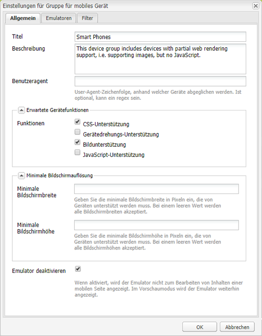
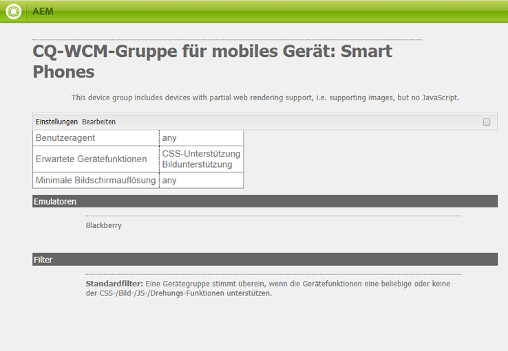
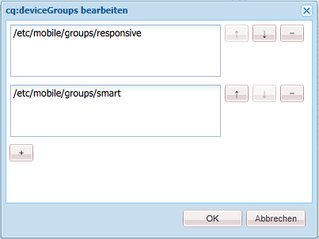
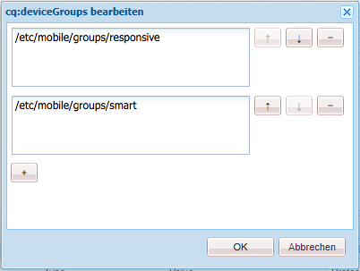
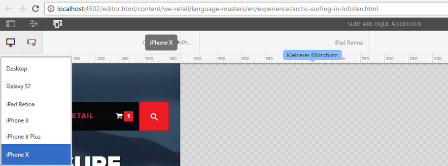

# Rendering von adaptiven Vorlagen{#adaptive-template-rendering}

Das Rendering von adaptiven Vorlagen bietet eine Möglichkeit, eine Seite mit Variationen zu verwalten. Ursprünglich sollte diese Funktion verschiedene HTML-Ausgaben für mobile Geräte bereitstellen (z. B. für Feature- und für Smartphones). Sie ist auch dann nützlich, wenn Erlebnisse für verschiedene Geräte bereitgestellt werden sollen, die unterschiedliche Markup- oder HTML-Ausgaben erfordern.

## Überblick {#overview}

Vorlagen werden im Allgemeinen auf einem responsiven Raster aufgebaut. Seiten, die basierend auf diesen Vorlagen erstellt wurden, sind vollständig responsiv und passen sich automatisch an das Ansichtsfenster des Client-Geräts an. Über die Emulator-Symbolleiste im Seiten-Editor können Autoren Layouts für bestimmte Geräte festlegen.

Sie können auch Vorlagen einrichten, um das adaptive Rendering zu unterstützen. Wenn Gerätegruppen korrekt konfiguriert sind, wird die Seite mit einem anderen Selektor in der URL gerendert, wenn ein Gerät im Emulatormodus ausgewählt wird. Mit einem Selektor lässt sich ein bestimmtes Seiten-Rendering direkt über die URL aufrufen.

Beachten Sie beim Einrichten der Gerätegruppen Folgendes:

* Jedes Gerät muss zu mindestens einer Gerätegruppe gehören.
* Ein Gerät kann zu mehreren Gerätegruppen gehören.
* Da Geräte zu mehreren Gerätegruppen gehören können, können Selektoren auch kombiniert werden.
* Die Kombination von Selektoren wird von oben nach unten bewertet, da sie im Repository gespeichert werden.

>[!NOTE]
>
>Die Gerätegruppe **Responsive Geräte** weist nie einen Selektor auf, da davon ausgegangen wird, dass Geräte, die responsive Designs unterstützen, kein adaptives Layout benötigen.

## Konfiguration {#configuration}

Selektoren für das adaptive Rendering können Sie für vorhandene Gerätegruppen oder für [selbst erstellte Gruppen konfigurieren.](/help/sites-developing/mobile.md#device-groups)

Bei diesem Beispiel konfigurieren wir die vorhandene Gerätegruppe **Smartphones** so, dass sie einen Selektor für das adaptive Rendering als Teil der Vorlage **Erlebnisseite** in We.Retail aufweisen.

1. Bearbeiten Sie die Gerätegruppe, die einen adaptiven Selektor in `http://localhost:4502/miscadmin#/etc/mobile/groups` erfordert.

   Aktivieren Sie die Option **Emulator deaktivieren** und speichern Sie diese Einstellung.

   

1. Der Selektor steht für **Blackberry** und **iPhone 4** zur Verfügung, vorausgesetzt, die Gerätegruppe **Smartphones** wird, wie in den folgenden Schritten erläutert, zur Vorlage und zu den Seitenstrukturen hinzugefügt.

   

1. Lassen Sie über CRXDE Lite zu, dass die Gerätegruppe bei der Vorlage genutzt wird. Fügen Sie dazu diese Gruppe zu der String-Eigenschaft mit mehreren Werten `cq:deviceGroups` in der Struktur der Vorlage hinzu.

   `/conf/<your-site>/settings/wcm/templates/<your-template>/structure/jcr:content`

   Beispiel: Die Smartphones-Gerätegruppe soll hinzugefügt werden:

   `/conf/we-retail/settings/wcm/templates/experience-page/structure/jcr:content`

   

1. Lassen Sie mithilfe von CRX DE Lite zu, dass die Gerätegruppe auf Ihrer Site verwendet wird, indem Sie sie zur String-Eigenschaft mit mehreren Werten `cq:deviceGroups` in der Struktur Ihrer Site hinzufügen.

   `/content/<your-site>/jcr:content`

   Beispiel: Die Gerätegruppe **Smartphones** soll zugelassen werden:

   `/content/we-retail/jcr:content`

   

Wenn Sie nun den [Emulator](/help/sites-authoring/responsive-layout.md#layout-definitions-device-emulation-and-breakpoints) im Seiten-Editor verwenden (z. B. beim [Bearbeiten des Layouts](/help/sites-authoring/responsive-layout.md)) und ein Gerät der konfigurierten Gerätegruppe auswählen, wird die Seite mit einem Selektor als Teil der URL gerendert.

In unserem Beispiel wird beim Bearbeiten einer Seite basierend auf der Vorlage **Erlebnisseite** und Auswählen von iPhone 4 im Emulator die Seite gerendert, wobei der Selektor als `arctic-surfing-in-lofoten.smart.html` anstelle von `arctic-surfing-in-lofoten.html` angegeben wird.

Die Seite lässt sich auch direkt über diesen Selektor auswählen.

