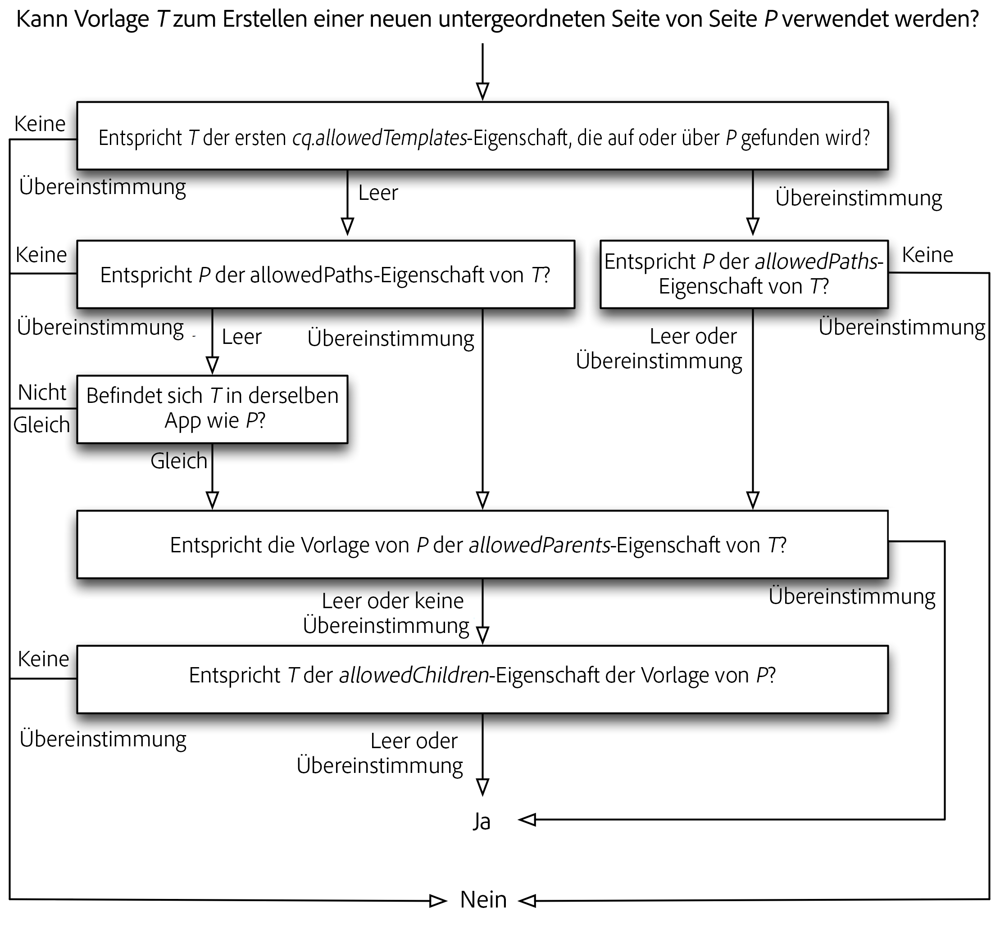

# Vorlagen{#templates}

Vorlagen werden an verschiedenen Stellen in AEM verwendet:

* [Wenn Sie eine Seite erstellen, wählen Sie eine Vorlage aus](#templates-pages). Diese Vorlage wird als Basis für die neue Seite verwendet. Die Vorlage definiert die Struktur der Seite, jeden anfänglichen Inhalt und die [Komponenten](/help/sites-authoring/default-components.md), die verwendet werden können (Design-Eigenschaften).

* [Beim Erstellen eines Inhaltsfragments wählen Sie auch eine Vorlage aus](#templates-content-fragments). Diese Vorlage definiert die Struktur, die Anfangselemente und die Variationen.

Die folgenden Vorlagen werden im Detail beschrieben:

* [Bearbeitbare Seitenvorlagen](/help/sites-developing/page-templates-editable.md)
* [Seitenvorlagen – statisch](/help/sites-developing/page-templates-static.md)
* [Inhaltsfragmentvorlagen](/help/sites-developing/content-fragment-templates.md)
* [Rendering von adaptiven Vorlagen](/help/sites-developing/templates-adaptive-rendering.md)

## Vorlagen – Seiten {#templates-pages}

AEM bietet jetzt zwei grundlegende Arten von Vorlagen zum Erstellen von Seiten:

>[!NOTE]
>
>Wenn Sie eine Vorlage zum [Erstellen einer neuen Seite](/help/sites-authoring/managing-pages.md#creating-a-new-page) verwenden, gibt es keinen sichtbaren Unterschied (zum Autor oder zur Autorin der Seite) und keine Angabe zum Typ der verwendeten Vorlage.

### Bearbeitbare Vorlagen {#editable-templates}

Bearbeitbare Vorlagen gelten nun als Best Practices für die Entwicklung mit AEM.

Die Vorteile bearbeitbarer Vorlagen:

* Können von den Autoren oder Autorinnen [erstellt](/help/sites-authoring/templates.md#creating-a-new-template-template-author) und [bearbeitet](/help/sites-authoring/templates.md#editing-a-template-structure-template-author) werden.

* wurden eingeführt, damit Sie Folgendes für alle Seiten definieren können, die mit der Vorlage erstellt wurden:

   * Die Struktur
   * Den anfänglichen Inhalt
   * Inhaltsrichtlinien

* Nachdem die neue Seite erstellt wurde, wird eine dynamische Verbindung zwischen der Seite und der Vorlage aufrechterhalten. Diese Verbindung bedeutet, dass Änderungen an der Vorlagenstruktur auf allen Seiten widergespiegelt werden, die mit dieser Vorlage erstellt werden. Änderungen am anfänglichen Inhalt werden nicht übernommen.
* Verwendet Inhaltsrichtlinien (die im Vorlageneditor bearbeitet wurden), um die Designeigenschaften beizubehalten (verwendet den Designmodus im Seiteneditor nicht).
* Werden gespeichert unter `/conf`
* Siehe [Bearbeitbare Vorlagen](/help/sites-developing/page-templates-editable.md) für weitere Informationen.

>[!NOTE]
>
>Siehe [Verwenden bearbeitbarer Seitenvorlagen zum Entwickeln einer Experience Manager-Site](https://experienceleague.adobe.com/docs/experience-manager-learn/sites/page-authoring/template-editor-feature-video-use.html?lang=de).

### Statische Vorlagen {#static-templates}

Statische Vorlagen:

* Muss von Ihren Entwickelnden definiert und konfiguriert werden.
* Das ursprüngliche Vorlagensystem von AEM, das seit vielen Versionen verfügbar ist.
* Eine statische Vorlage ist eine Hierarchie von Knoten mit derselben Struktur wie die zu erstellende Seite, jedoch ohne tatsächlichen Inhalt.
* Werden kopiert, um die Seite zu erstellen. Danach existiert keine dynamische Verbindung.
* Verwendet [Design-Modus](/help/sites-authoring/default-components-designmode.md), um Design-Eigenschaften zu persistieren.
* Werden gespeichert unter `/apps`
* Siehe [Statische Vorlagen](/help/sites-developing/page-templates-static.md) für weitere Informationen.

>[!NOTE]
>
>Ab AEM 6.5 gilt die Verwendung statischer Vorlagen nicht mehr als Best Practice. Verwenden Sie stattdessen bearbeitbare Vorlagen.
>
>[AEM-Modernisierung](modernization-tools.md)-Tools können Ihnen bei der Migration von statischen zu bearbeitbaren Vorlagen helfen.

### Verfügbarkeit von Vorlagen {#template-availability}

>[!CAUTION]
>
>AEM bietet verschiedene Eigenschaften zur Steuerung der unter **Sites** zulässigen Vorlagen. Ihre Kombination kann jedoch zu komplexen Regeln führen, die schwer zu verfolgen und zu verwalten sind.
>
>Daher empfiehlt Adobe, einfach anzufangen, indem Sie Folgendes definieren:
>
>* nur die `cq:allowedTemplates`-Eigenschaft
>
>* nur im Site-Stamm
>
>Ein Beispiel finden Sie unter „We.Retail“: `/content/we-retail/jcr:content`
>
>Außerdem können die Eigenschaften `allowedPaths`, `allowedParents` und `allowedChildren` in den Vorlagen platziert werden, um komplexere Regeln zu definieren. Wenn möglich, ist es jedoch *viel* einfacher, weitere `cq:allowedTemplates`-Eigenschaften auf Unterabschnitten der Site zu definieren, wenn es notwendig ist, die erlaubten Vorlagen weiter einzuschränken.
>
>Ein zusätzlicher Vorteil ist, dass die `cq:allowedTemplates`-Eigenschaften von einem Autor oder einer Autorin auf der Registerkarte **Erweitert** der **Seiteneigenschaften** aktualisiert werden können. Die anderen Vorlageneigenschaften können nicht über die (standardmäßige) Benutzeroberfläche aktualisiert werden. Dafür wird ein Entwickler bzw. eine Entwicklerin benötigt, der bzw. die die Regeln und Code-Implementierung für jede Änderung pflegt.

Beim Erstellen einer neuen Seite in der Site-Admin-Oberfläche hängt die Liste der verfügbaren Vorlagen vom Speicherort der neuen Seite und den in den einzelnen Vorlagen angegebenen Platzierungsbeschränkungen ab.

Die folgenden Eigenschaften bestimmen, ob eine `T`-Vorlage für eine neue Seite verwendet wird, die als untergeordnetes Element der Seite `P` platziert werden soll. Jede dieser Eigenschaften ist eine mehrwertige Zeichenfolge, welche null oder mehrere reguläre Ausdrücke enthält, die für die Übereinstimmung mit Pfaden verwendet werden:

* Die Eigenschaft `cq:allowedTemplates` des Unterknotens `jcr:content` von `P` oder ein Vorgänger von `P`.

* Die `allowedPaths`-Eigenschaft von `T`.

* Die `allowedParents`-Eigenschaft von `T`.

* Die `allowedChildren`-Eigenschaft der Vorlage von `P`.

Die Bewertung funktioniert wie folgt:

* Die erste nicht leere Eigenschaft `cq:allowedTemplates`, die beim Aufrufen der mit `P` beginnenden Seitenhierarchie gefunden wird, wird mit dem Pfad von `T` abgeglichen. Wenn keiner der Werte übereinstimmt, wird `T` abgelehnt.

* Wenn `T` eine nicht leere `allowedPaths`-Eigenschaft hat, aber keiner der Werte mit dem Pfad von `P` übereinstimmt, wird `T` zurückgewiesen.

* Wenn beide oben genannten Eigenschaften entweder leer oder nicht vorhanden sind, wird `T` abgelehnt, es sei denn, es gehört zum selben Programm wie `P`. `T` gehört genau dann zum selben Programm wie `P`, wenn der Name der zweiten Ebene des Pfades von `T` mit dem Namen der zweiten Ebene des Pfades von `P` übereinstimmt. Zum Beispiel gehört die Vorlage `/apps/geometrixx/templates/foo` zum selben Programm wie die Seite `/content/geometrixx`.

* Wenn `T` eine nicht leere `allowedParents`-Eigenschaft hat, aber keiner der Werte mit dem Pfad von `P` übereinstimmt, wird `T` zurückgewiesen.

* Wenn die Vorlage von `P` eine nicht leere `allowedChildren`-Eigenschaft hat, aber keiner der Werte mit dem Pfad von `T` übereinstimmt, wird `T` zurückgewiesen.

* In allen anderen Fällen ist `T` zulässig.

Das folgende Diagramm zeigt den Vorlagenauswertungsprozess:

#### Einschränkende Vorlagen in untergeordneten Seiten {#limiting-templates-used-in-child-pages}

Um zu begrenzen, welche Vorlagen zum Erstellen von untergeordneten Seiten unter einer bestimmten Seite verwendet werden können, verwenden Sie die Eigenschaft `cq:allowedTemplates` des Knotens `jcr:content` auf der Seite. Damit lässt sich die Liste der Vorlagen angeben, die als untergeordnete Seiten zulässig sein sollen. Jeder Wert in der Liste muss ein absoluter Pfad zu einer Vorlage für eine zulässige untergeordnete Seite sein, zum Beispiel, `/apps/geometrixx/templates/contentpage`.

Sie können die Eigenschaft `cq:allowedTemplates` im Knoten `jcr:content` der Vorlage verwenden, damit diese Konfiguration auf alle neu erstellten Seiten angewendet wird, die diese Vorlage nutzen.

Wenn Sie mehrere Einschränkungen hinzufügen möchten, z. B. bezüglich der Vorlagenhierarchie, können Sie die Eigenschaften `allowedParents/allowedChildren` der Vorlage verwenden. Sie können dann explizit angeben, dass Seiten, die aus einer Vorlage T erstellt wurden, übergeordnet/untergeordnet von Seiten sein müssen, die aus einer Vorlage T erstellt wurden.

## Vorlagen – Inhaltsfragmente {#templates-content-fragments}

Siehe [Inhaltsfragmentvorlagen](/help/sites-developing/content-fragment-templates.md).
