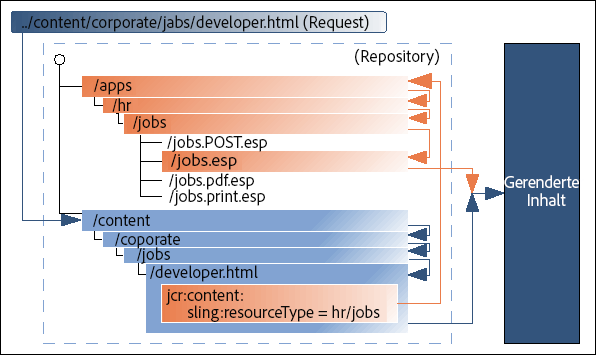

# Grundlegende AEM-Konzepte {#aem-core-concepts}

>[!NOTE]
>
>Bevor Sie sich mit den grundlegenden Konzepten von AEM befassen, empfiehlt Adobe, dass Sie das WKND-Lernprogramm im Dokument [Erste Schritte bei der Entwicklung von AEM Sites](/help/sites-developing/getting-started.md) absolvieren, um einen Überblick über den AEM-Entwicklungsprozess und eine Einführung in die grundlegende Konzepte zu erhalten.

## Voraussetzungen für die Entwicklung auf AEM {#prerequisites-for-developing-on-aem}

Sie benötigen die folgenden Fähigkeiten zur Entwicklung auf AEM:

* Ein Grundverständnis von Web-Anwendungstechniken, einschließlich:

   * dem request-response-Zyklus (XMLHttpRequest/XMLHttpResponse)
   * HTML
   * CSS
   * JavaScript

* Kenntnisse über den Experience Server (CRX) einschließlich des Content Explorers
* Für die Entwicklung in der klassischen Benutzeroberfläche sind grundlegende Kenntnisse von JSP (JavaServer Pages) einschließlich der Fähigkeit, einfache JSP-Beispiele zu verstehen und zu modifizieren, erforderlich.

Es wird außerdem empfohlen, dass Sie die [Richtlinien und Best Practices](/help/sites-developing/dev-guidelines-bestpractices.md) lesen und befolgen.

## Java Content Repository {#java-content-repository}

Der Java Content Repository-Standard [JSR 283](https://www.adobe.io/experience-manager/reference-materials/spec/jcr/2.0/index.html) legt eine hersteller- und implementierungsunabhängige Methode für den bidirektionalen Zugriff auf Inhalte auf einer granularen Ebene in einem Content-Repository fest.

Maßgeblich für Spezifikationen ist Adobe Research (Switzerland) AG gehalten.

Das [JCR API 2.0](https://docs.adobe.com/docs/en/spec/javax.jcr/javadocs/jcr-2.0/index.html)-Paket, javax.jcr.&amp;ast; wird für den direkten Zugriff und die Bearbeitung von Repository-Inhalten verwendet.

## Experience Server (CRX) und Jackrabbit {#experience-server-crx-and-jackrabbit}

Der Experience Server stellt die Experience Services bereit, auf denen AEM basiert und die zum Erstellen benutzerdefinierter Anwendungen verwendet werden können. Außerdem wird das Inhalts-Repository auf Basis von Jackrabbit eingebettet.

[Apache Jackrabbit](https://jackrabbit.apache.org/) ist eine vollständig konforme Open-Source-Implementierung der JCR-API 2.0.

## Sling-Anfrageverarbeitung {#sling-request-processing}

### Einführung in Sling {#introduction-to-sling}

AEM basiert auf [Sling](https://sling.apache.org/site/index.html), einem auf REST-Prinzipien basierenden Web-Anwendungs-Framework, das eine einfache Entwicklung von inhaltsorientierten Programmen ermöglicht. Sling verwendet ein JCR-Repository wie Apache Jackrabbit oder im Falle von AEM das CRX Content Repository als eigenen Datenspeicher. Sling ist Teil der Apache Software Foundation – weitere Informationen finden Sie bei Apache.

Bei Verwendung von Sling ist der Typ des zu rendernden Inhalts nicht die erste Verarbeitungsüberlegung. Stattdessen ist die Hauptüberlegung, ob die URL zu einem Inhaltsobjekt aufgelöst wird, für das dann ein Skript gefunden werden kann, um das Rendering durchzuführen. Dies bietet Autoren von Web-Inhalten eine hervorragende Unterstützung beim Erstellen von Seiten, die leicht an ihre Anforderungen angepasst werden können.

Die Vorteile dieser Flexibilität zeigen sich in Programmen mit einer großen Auswahl verschiedener Inhaltselemente oder wenn Sie Seiten benötigen, die einfach angepasst werden können. Insbesondere bei der Implementierung eines Web-Content-Management-Systems wie dem WCM in der AEM-Lösung.

Siehe [Entdecken Sie Sling in 15 Minuten](https://sling.apache.org/documentation/getting-started/discover-sling-in-15-minutes.html) für die ersten Schritte zur Entwicklung mit Sling.

Das folgende Diagramm erläutert die Sling-Skriptauflösung: Es wird gezeigt, wie Sie von der HTTP-Anfrage zum Inhaltsknoten, vom Inhaltsknoten zum Ressourcentyp, vom Ressourcentyp zum Skript gelangen und welche Skriptvariablen verfügbar sind.


Das folgende Diagramm erläutert alle ausgeblendeten, aber leistungsfähigen Anforderungsparameter, die Sie beim Umgang mit dem SlingPostServlet verwenden können, dem Standardhandler für alle POST-Anforderungen, der Ihnen endlose Optionen zum Erstellen, Ändern, Löschen, Kopieren und Verschieben von Knoten im Repository bietet.


### Sling ist inhaltszentriert {#sling-is-content-centric}

Sling ist *inhaltszentriert*. Dies bedeutet, dass sich die Verarbeitung auf den Inhalt konzentriert, da jede (HTTP-)Anfrage auf den Inhalt in Form einer JCR-Ressource (eines Repository-Knotens) abgebildet wird:

* das erste Ziel ist die Ressource (JCR-Knoten), die den Inhalt enthält
* zweitens, die Repräsentation oder das Skript werden aus den Ressourceneigenschaften in Kombination mit bestimmten Teilen der Anfrage (z. B. Selektoren und/oder der Erweiterung) angeordnet.

### RESTful Sling {#restful-sling}

Aufgrund der inhaltsorientierten Philosophie implementiert Sling einen REST-orientierten Server und bietet damit ein neues Konzept für Webanwendungs-Frameworks. Die Vorteile:

* sehr RESTful, nicht nur an der Oberfläche; Ressourcen und Repräsentationen werden korrekt innerhalb des Servers modelliert
* entfernt ein oder mehrere Datenmodelle

   * bisher wurde Folgendes benötigt: URL-Struktur, Geschäftsobjekte, DB-Schema;
   * Dies wird jetzt reduziert auf: URL = Ressource = JCR-Struktur

### URL-Zerlegung {#url-decomposition}

In Sling wird die Verarbeitung durch die URL der Benutzeranfrage gesteuert. Dies definiert den Inhalt, der von den entsprechenden Skripten angezeigt werden soll. Um dies zu erreichen, werden die Informationen aus der URL extrahiert.

Wenn wir die folgende URL analysieren:

```xml
https://myhost/tools/spy.printable.a4.html/a/b?x=12
```

können wir sie in ihre zusammengesetzten Teile zerlegen:

| protocol | host | content path | selector(s) | extension |  | suffix |  | param(s) |
|---|---|---|---|---|---|---|---|---|
| https:// | myhost | tools/spy | .printable.a4. | html | / | a/b | ? | x=12 |

**** protocolHTTP

**** hostName der Website.

**content** pathPath, der den zu rendernden Inhalt angibt. Wird in Kombination mit der Erweiterung verwendet. In diesem Beispiel werden sie in tools/spy.html übersetzt.

**Auswahl(en)** , die für alternative Methoden zum Rendern des Inhalts verwendet werden; in diesem Beispiel eine druckerfreundliche Version im A4-Format.

**** extensionContent-Format; gibt auch das Skript an, das für die Wiedergabe verwendet werden soll.

**** suffixKann verwendet werden, um zusätzliche Informationen anzugeben.

**param(s)** Alle für dynamischen Inhalt erforderlichen Parameter.

#### Von URL zu Inhalt und Skripten {#from-url-to-content-and-scripts}

Mit diesen Prinzipien gilt:

* Das Mapping verwendet den aus der Anfrage extrahierten Inhaltspfad, um die Ressource zu lokalisieren
* Wenn die entsprechende Ressource gefunden wurde, wird der Sling-Ressourcentyp extrahiert und zum Suchen des Skripts verwendet, das zum Rendern des Inhalts verwendet werden soll

Die folgende Abbildung zeigt den verwendeten Mechanismus, auf den in den folgenden Abschnitten näher eingegangen wird.



Mit Sling geben Sie an, welches Skript eine bestimmte Entität rendert (indem Sie die Eigenschaft `sling:resourceType` im JCR-Knoten festlegen). Dieser Mechanismus bietet mehr Freiheit als einer, in dem das Skript auf die Datenentitäten zugreift (wie es eine SQL-Anweisung in einem PHP-Skript tun würde), da eine Ressource mehrere Ausgabedarstellungen haben kann.

#### Anforderungen an Ressourcen zuordnen {#mapping-requests-to-resources}

Die Anfrage wird zerlegt und die notwendigen Informationen werden extrahiert. Das Repository wird nach der angeforderten Ressource (Inhaltsknoten) durchsucht:

* Das erste Sling überprüft, ob ein Knoten an dem in der Anfrage angegebenen Speicherort vorhanden ist. z. B. `../content/corporate/jobs/developer.html`
* Wenn kein Knoten gefunden wird, wird die Erweiterung verworfen und die Suche wiederholt. z. B. `../content/corporate/jobs/developer`
* Wenn kein Knoten gefunden wird, gibt Sling den HTTP-Code 404 (Nicht gefunden) zurück.

Sling erlaubt auch anderen Elementen als JCR-Knoten, als Ressourcen zu fungieren, dies ist jedoch eine erweiterte Funktion.

### Auffinden des Skripts {#locating-the-script}

Wenn die entsprechende Ressource (Inhaltsknoten) gefunden wird, wird der **Sling-Ressourcentyp** extrahiert. Dies ist ein Pfad, der das Skript findet, das zum Rendern des Inhalts verwendet wird.

Der vom `sling:resourceType` angegebene Pfad kann wie folgt sein:

* absolut oder
* relativ zu einem Konfigurationsparameter

   Relative Pfade werden von der Adobe empfohlen, da sie die Portabilität erhöhen.

Alle Sling-Skripte werden in Unterordnern von `/apps` oder `/libs` gespeichert, die in dieser Reihenfolge durchsucht werden (siehe [Anpassen von Komponenten und anderen Elementen](/help/sites-developing/dev-guidelines-bestpractices.md#customizing-components-and-other-elements)).

Einige andere zu beachtende Punkte sind:

* wenn die Methode (GET, POST) benötigt wird, wird sie gemäß der HTTP-Spezifikation, z. B. jobs.POST.esp (siehe unten) in Großbuchstaben angegeben
* verschiedene Skript-Engines werden unterstützt:

   * HTL (HTML-Vorlagensprache - das bevorzugte und empfohlene serverseitige Vorlagensystem von Adobe Experience Manager für das HTML): `.html`
   * ECMAScript (JavaScript)-Seiten (serverseitige Ausführung): `.esp, .ecma`
   * Java Server Pages (serverseitige Ausführung): `.jsp`
   * Java Servlet Compiler (serverseitige Ausführung): `.java`
   * JavaScript-Templates (clientseitige Ausführung): `.jst`

Die Liste der von der angegebenen Instanz von AEM unterstützten Skript-Engines wird in der Felix Management Console aufgeführt (`http://<host>:<port>/system/console/slingscripting`).

Darüber hinaus unterstützt Apache Sling die Integration mit anderen gängigen Skript-Engines (z. B. Groovy, JRuby, Freemarker) und bietet eine Möglichkeit zur Integration neuer Skript-Engines.

Wenn das `sling:resourceType` `hr/jobs` im obigen Beispiel  ist, dann für:

* GET/HEAD-Anfragen und URLs, die auf .html enden (Standardanfragetypen, Standardformat)

   Das Skript lautet /apps/hr/jobs/jobs.esp. Der letzte Abschnitt von sling:resourceType bildet den Dateinamen.

* POST-Anfragen (alle Anforderungstypen außer GET/HEAD, der Methodenname muss in Großbuchstaben angegeben werden)

   POST wird im Skriptnamen verwendet.

   Das Skript lautet `/apps/hr/jobs/jobs.POST.esp`.

* URLs in anderen Formaten, die nicht mit .html enden

   Beispiel `../content/corporate/jobs/developer.pdf`

   Das Skript wäre `/apps/hr/jobs/jobs.pdf.esp`. Das Suffix wird zum Skriptnamen hinzugefügt.

* URLs mit Selektoren

   Selektoren können verwendet werden, um denselben Inhalt in einem alternativen Format anzuzeigen. Zum Beispiel eine druckerfreundliche Version, einen RSS-Feed oder eine Zusammenfassung.

   Wenn wir uns eine druckerfreundliche Version ansehen, in der der Selektor *print* sein könnte; wie in `../content/corporate/jobs/developer.print.html`

   Das Skript wäre `/apps/hr/jobs/jobs.print.esp`. Der Selektor wird zum Skriptnamen hinzugefügt.

* Wenn kein sling:resourceType definiert wurde, dann:

   * wird der Inhaltspfad für die Suche nach einem geeigneten Skript verwendet (wenn der pfadbasierte ResourceTypeProvider aktiv ist).

      Zum Beispiel würde das Skript für `../content/corporate/jobs/developer.html` eine Suche in `/apps/content/corporate/jobs/` erzeugen.

   * wird der primäre Knotentyp verwendet.

* Wenn kein Skript gefunden wird, wird das Standard-Skript verwendet.

   Die Standardversion wird derzeit als Klartext (.txt), HTML (.html) und JSON (.json) unterstützt, welche alle die Eigenschaften des Knotens auflisten (passend formatiert). Die Standardversion für die Erweiterung .res oder für Anforderungen ohne Anforderungserweiterung besteht darin, die Ressource (sofern möglich) zu spoolen.
* Für die HTTP-Fehlerbehandlung (Codes 403 oder 404) sucht Sling nach einem Skript, entweder:

   * am Speicherort /apps/sling/servlet/errorhandler für [angepasste Skripte](/help/sites-developing/customizing-errorhandler-pages.md)
   * oder am Speicherort der Standardskripte /libs/sling/servlet/errorhandler/403.esp bzw. 404.esp.

Wenn mehrere Skripte für eine bestimmte Anfrage gelten, wird das Skript mit der besten Übereinstimmung ausgewählt. Je genauer eine Übereinstimmung ist, desto besser ist sie; Mit anderen Worten: je mehr Selektorübereinstimmungen, desto besser, unabhängig von einer Anfrageerweiterung oder einer Übereinstimmung des Methodennamens.

Beispiel: Eine Anfrage zum Zugriff auf die Ressource
`/content/corporate/jobs/developer.print.a4.html`
vom Typ
`sling:resourceType="hr/jobs"`

Angenommen, wir haben die folgende Liste von Skripten am richtigen Speicherort:

1. `GET.esp`
1. `jobs.esp`
1. `html.esp`
1. `print.esp`
1. `print.html.esp`
1. `print/a4.esp`
1. `print/a4/html.esp`
1. `print/a4.html.esp`

Dann wäre die Reihenfolge der Bevorzugung (8) - (7) - (6) - (5) - (4) - (3) - (2) - (1).

Zusätzlich zu den Ressourcentypen (primär definiert durch die Eigenschaft `sling:resourceType`) gibt es auch den Supertyp der Ressource. Dieser wird normalerweise durch die Eigenschaft `sling:resourceSuperType` angezeigt. Diese Supertypen werden ebenfalls berücksichtigt, wenn Sie versuchen, ein Skript zu finden. Der Vorteil von Ressourcensupertypen besteht darin, dass sie eine Hierarchie von Ressourcen bilden können, wobei der Standard-Ressourcentyp `sling/servlet/default` (von den Standard-Servlets verwendet) effektiv der Stamm ist.

Der Ressourcensupertyp einer Ressource kann auf zwei Arten definiert werden:

* durch die Eigenschaft `sling:resourceSuperType` der Ressource.
* durch die Eigenschaft `sling:resourceSuperType` des Knotens, auf den der `sling:resourceType` zeigt.

Beispiel:

* /

   * a
   * b

      * sling:resourceSuperType = a
   * c

      * sling:resourceSuperType = b
   * x

      * sling:resourceType = c
   * y

      * sling:resourceType = c
      * sling:resourceSuperType = a


Die Typhierarchie von:

* `/x`
   * das `[ c, b, a, <default>]`
* while für `/y`
   * die Hierarchie ist `[ c, a, <default>]`

Grund hierfür ist, dass `/y` die Eigenschaft `sling:resourceSuperType` aufweist, während `/x` sie nicht aufweist und daher der Obertyp vom Ressourcentyp übernommen wird.

#### Sling-Skripte können nicht direkt aufgerufen werden {#sling-scripts-cannot-be-called-directly}

In Sling können Skripte nicht direkt aufgerufen werden, da dies das strenge Konzept eines REST-Servers sprengen würde. Sie würden Ressourcen und Repräsentationen mischen.

Wenn Sie die Repräsentation (das Skript) direkt aufrufen, blenden Sie die Ressource in Ihrem Skript aus, sodass das Framework (Sling) nicht mehr davon weiß. Somit verlieren Sie bestimmte Eigenschaften:

* automatische Handhabung von HTTP-Methoden außer GET, einschließlich:

   * POST, PUT, DELETE, die mit einer Sling-Standardimplementierung behandelt werden
   * das Skript `POST.jsp` in Ihrem sling:resourceType-Speicherort

* Ihre Code-Architektur ist nicht mehr so sauber oder so klar strukturiert wie sie es sein sollte; von größter Bedeutung für die großmaßstäbliche Entwicklung

### Sling-API {#sling-api}

Diese verwendet das Sling-API-Paket org.apache.sling.&amp;ast; und Tag-Bibliotheken.

### Referenzieren von vorhandenen Elementen mithilfe von sling:include {#referencing-existing-elements-using-sling-include}

Eine letzte Überlegung ist die Notwendigkeit, auf vorhandene Elemente innerhalb der Skripte zu verweisen.

Komplexere Skripte (aggregierende Skripte) müssen möglicherweise auf mehrere Ressourcen zugreifen (z. B. Navigation, Seitenleiste, Fußzeile, Elemente einer Liste) und tun dies durch Einbeziehen der *Ressource*.

Dazu können Sie den Befehl sling:include(&quot;/&lt;path>/&lt;resource>&quot;) verwenden. Dies umfasst effektiv die Definition der referenzierten Ressource, wie in der folgenden Anweisung, die auf eine vorhandene Definition für das Rendern von Bildern verweist:

```xml
%><sling:include resourceType="geometrixx/components/image/img"/><%
```

## OSGI {#osgi}

OSGi definiert eine Architektur für die Entwicklung und Bereitstellung modularer Anwendungen und Bibliotheken (es wird auch als Dynamic Module System für Java bezeichnet). OSGi-Container erlauben es Ihnen, Ihr Programm in einzelne Module aufzuteilen (JAR-Dateien mit zusätzlichen Metainformationen und sogenannten Bundles in OSGi-Terminologie) und die Querabhängigkeiten zwischen ihnen zu verwalten mit:

* Diensten, die innerhalb des Containers implementiert sind
* einem Vertrag zwischen dem Container und Ihrer Anwendung

Diese Services und Verträge bieten eine Architektur, die es einzelnen Elementen ermöglicht, sich dynamisch für die Zusammenarbeit zu entdecken.

Ein OSGi-Framework bietet Ihnen dann dynamisches Laden/Entladen, Konfiguration und Kontrolle dieser Bundles - ohne dass ein Neustart erforderlich ist.

>[!NOTE]
>
>Ausführliche Informationen zur OSGi-Technologie finden Sie auf der [OSGi-Website](https://www.osgi.org).
>
>Speziell die Seite mit grundlegenden Informationen beinhaltet eine Sammlung von Präsentationen und Tutorials.

Diese Architektur ermöglicht es Ihnen, Sling um programmspezifische Module zu erweitern. Sling, und daher CQ5, verwendet die [Apache Felix](https://felix.apache.org/)-Implementierung von OSGI (Open Services Gateway Initiative) und basiert auf der OSGi Service Platform Release 4 Version 4.2. Beides sind Sammlungen von OSGi-Bundles, die in einem OSGi-Framework ausgeführt werden.

Dies ermöglicht es Ihnen, die folgenden Handlungen innerhalb Ihrer Installation für ein beliebiges Paket durchzuführen:

* install
* Starten
* Anhalten
* Aktualisieren
* uninstall
* Aktuellen Status anzeigen
* Greifen Sie auf detailliertere Informationen (z. B. symbolischer Name, Version, Ort, usw.) über die spezifischen Bundles zu

Weitere Informationen finden Sie unter [Web-Konsole](/help/sites-deploying/web-console.md), [OSGI-Konfiguration](/help/sites-deploying/configuring-osgi.md) und [OSGi-Konfigurationseinstellungen](/help/sites-deploying/osgi-configuration-settings.md).

## Entwicklungsobjekte in der AEM-Umgebung {#development-objects-in-the-aem-environment}

Folgendes ist für die Entwicklung von Interesse:

**** ItemEin Element ist entweder ein Knoten oder eine Eigenschaft.

Ausführliche Informationen zum Bearbeiten von Item-Objekten finden Sie in den [Javadocs](https://docs.adobe.com/docs/en/spec/javax.jcr/javadocs/jcr-2.0/javax/jcr/Item.html) der Schnittstelle javax.jcr.Item

**Knoten (und ihre Eigenschaften)** Knoten und ihre Eigenschaften sind in der JCR API 2.0-Spezifikation (JSR 283) definiert. Sie speichern Inhalte, Objektdefinitionen, Rendering-Skripte und andere Daten.

Knoten definieren die Inhaltsstruktur und ihre Eigenschaften speichern den tatsächlichen Inhalt und die Metadaten.

Inhaltsknoten steuern das Rendering. Sling ruft den Inhaltsknoten von der eingehenden Anfrage ab. Die Eigenschaft „sling:resourceType“ dieses Knotens verweist auf die zu verwendende Sling-Rendering-Komponente.

Ein Knoten, bei dem es sich um einen JCR-Namen handelt, wird in der Sling-Umgebung auch als Ressource bezeichnet.

Um beispielsweise die Eigenschaften des aktuellen Knotens abzurufen, können Sie folgenden Code in Ihrem Skript verwenden:

`PropertyIterator properties = currentNode.getProperties();`

wobei currentNode das aktuelle Knotenobjekt ist.

Weitere Informationen zum Bearbeiten von Knotenobjekten finden Sie in den [Javadocs](https://docs.adobe.com/docs/en/spec/javax.jcr/javadocs/jcr-2.0/javax/jcr/Node.html).

**** WidgetAEM alle Benutzereingaben werden von Widgets verwaltet. Diese werden oft verwendet, um die Bearbeitung eines Inhalts zu steuern.

Dialogfelder werden durch die Kombination von Widgets erstellt.

AEM wurde mit der Widgets-Bibliothek ExtJS entwickelt.

**** DialogEin Dialogfeld ist ein spezieller Typ von Widget.

Um Inhalte zu bearbeiten, verwendet AEM Dialogfelder, die vom Anwendungsentwickler definiert wurden. Diese kombinieren eine Reihe von Widgets, um dem Benutzer alle Felder und Aktionen zu präsentieren, die zum Bearbeiten des zugehörigen Inhalts erforderlich sind.

Dialogfelder werden auch zum Bearbeiten von Metadaten und von verschiedenen Verwaltungstools verwendet.

**** ComponentEine Softwarekomponente ist ein Systemelement, das einen vordefinierten Dienst oder ein vordefiniertes Ereignis anbietet und mit anderen Komponenten kommunizieren kann.

Innerhalb von AEM wird häufig eine Komponente zum Rendern des Inhalts einer Ressource verwendet. Wenn es sich bei der Ressource um eine Seite handelt, wird die Komponente, die sie rendert, als Top-Level-Komponente oder als Seitenkomponente bezeichnet. Allerdings muss eine Komponente weder Inhalte darstellen noch mit einer bestimmten Ressource verknüpft sein. Zum Beispiel zeigt eine Navigationskomponente Informationen über mehrere Ressourcen an.

Die Definition einer Komponente umfasst:

* den Code, der zum Rendern des Inhalts verwendet wird
* ein Dialogfeld für die Benutzereingabe und die Konfiguration des resultierenden Inhalts.

**** TemplateEine Vorlage ist die Basis für einen bestimmten Seitentyp. Beim Erstellen einer Seite auf der Registerkarte „Websites“ muss der Benutzer eine Vorlage auswählen. Die neue Seite wird dann durch Kopieren dieser Vorlage erstellt.

Eine Vorlage ist eine Hierarchie von Knoten, die dieselbe Struktur aufweist wie die zu erstellende Seite, aber keine Inhalte.

Sie definiert die Seitenkomponente, die zum Rendern der Seite verwendet wird, und den Standardinhalt (primären Top-Level-Inhalt). Der Inhalt definiert die Art des Renderns, da AEM inhaltsorientiert ist.

**Seitenkomponente (Komponente der obersten Ebene)** Die Komponente, die zum Rendern der Seite verwendet werden soll.

**** Seite: Eine Seite ist eine &quot;Instanz&quot;einer Vorlage.

Eine Seite hat einen Hierarchieknoten vom Typ cq:Page und einen Inhaltsknoten vom Typ cq:PageContent. Die Eigenschaft „sling:resourceType“ des Inhaltsknotens verweist auf die Seitenkomponente, die zum Rendern der Seite verwendet wird.

Um beispielsweise den Namen der aktuellen Seite zu erhalten, können Sie folgenden Code in Ihrem Skript verwenden:

S`tring pageName = currentPage.getName();`

wobei currentPage das aktuelle Seitenobjekt ist. Weitere Informationen zum Bearbeiten von Seitenobjekten finden Sie in den [Javadocs](https://helpx.adobe.com/experience-manager/6-5/sites/developing/using/reference-materials/javadoc/com/day/cq/wcm/api/Page.html).

**Seiten-** Manager Der Seiten-Manager ist eine Schnittstelle, die Methoden für Vorgänge auf Seitenebene bereitstellt.

Um beispielsweise die übergeordnete Seite einer Ressource zu erhalten, können Sie folgenden Code in Ihrem Skript verwenden:

Page myPage = pageManager.getContainingPage(myResource);

pageManager ist das Seitenmanagerobjekt und myResource ein Ressourcenobjekt. Weitere Informationen zu den vom Seitenmanager bereitgestellten Methoden finden Sie in den [Javadocs](https://helpx.adobe.com/de/experience-manager/6-5/sites/developing/using/reference-materials/javadoc/com/day/cq/wcm/api/PageManager.html).

## Struktur innerhalb des Repositorys {#structure-within-the-repository}

Die folgende Liste gibt einen Überblick über die Struktur, die Sie im Repository sehen.

>[!CAUTION]
>
>Änderungen an dieser Struktur oder an den darin enthaltenen Dateien sollten sorgfältig vorgenommen werden.
>
>Änderungen sind bei der Entwicklung erforderlich, aber Sie sollten darauf achten, dass Sie die Auswirkungen der von Ihnen vorgenommenen Änderungen vollständig verstehen.

>[!CAUTION]
>
>Sie dürfen keinerlei Änderungen im Pfad `/libs` vornehmen. Für die Konfiguration und andere Änderungen kopieren Sie das Objekt von `/libs` nach `/apps` und nehmen Sie Änderungen innerhalb von `/apps` vor.

* `/apps`

    Anwendungsbezogen; enthält für Ihre Website spezifische Komponentendefinitionen. Die von Ihnen entwickelten Komponenten können auf den Standardkomponenten basieren, die unter `/libs/foundation/components` verfügbar sind.

* `/content`

   Inhalte, die für Ihre Website erstellt wurden.

* `/etc`

* `/home`

   Benutzer- und Gruppeninformationen.

* `/libs`

    Bibliotheken und Definitionen, die zum Kern von AEM gehören. Die Unterordner in `/libs` stellen die vordefinierten AEM Funktionen dar, wie z. B. Suche oder Replikation. Der Inhalt in `/libs` sollte nicht geändert werden, da er die Funktionsweise AEM beeinflusst. Website-spezifische Funktionen sollten unter `/apps` entwickelt werden (siehe [Anpassen von Komponenten und anderen Elementen](/help/sites-developing/dev-guidelines-bestpractices.md#customizing-components-and-other-elements)).

* `/tmp`

   Temporärer Arbeitsbereich.

* `/var`

    Dateien, die sich ändern und vom System aktualisiert werden; wie Audit-Logs, Statistiken, Event-Handling.

## Umgebungen {#environments}

Bei AEM besteht eine Produktionsumgebung häufig aus zwei verschiedenen Arten von Instanzen: einer [Autoren- und einer Veröffentlichungsinstanz](/help/sites-deploying/deploy.md#author-and-publish-installs).

## Der Dispatcher {#the-dispatcher}

Der Dispatcher ist das Tool von Adobe für Caching und/oder Lastenausgleich. Weitere Informationen finden Sie unter [Dispatcher](https://helpx.adobe.com/experience-manager/dispatcher/user-guide.html).

## FileVault (Quellversionssystem) {#filevault-source-revision-system}

FileVault stellt Ihrem JCR-Repository Dateisystemzuordnung und Versionskontrolle zur Verfügung. Es kann verwendet werden, um AEM-Entwicklungsprojekte mit voller Unterstützung für das Speichern und Versionieren von Projektcode, Inhalten, Konfigurationen usw. in Standardversionskontrollsystemen (z. B. Subversion) zu verwalten.

Detaillierte Informationen finden Sie in der [FileVault-Tool](/help/sites-developing/ht-vlttool.md)-Dokumentation.

## Workflows {#workflows}

Ihre Inhalte unterliegen oft organisatorischen Prozessen, einschließlich Schritten wie Genehmigung und Freigabe durch verschiedene Teilnehmer. Diese Prozesse können als Workflows dargestellt, innerhalb von [AEM definiert und entwickelt](/help/sites-developing/workflows-models.md) und dann bei Bedarf auf die [entsprechenden Inhaltsseiten](/help/sites-administering/workflows.md) oder [digitalen Assets](/help/assets/assets-workflow.md) angewendet werden.

Die Workflow-Engine wird verwendet, um die Implementierung Ihrer Workflows und deren anschließende Anwendung auf Ihre Inhalte zu verwalten.

## Multi-Site-Management {#multi-site-management}

Multi-Site-Manager (MSM) ermöglicht es Ihnen, mehrere Websites mit gemeinsamen Inhalten problemlos zu verwalten. Mit MSM können Sie Beziehungen zwischen den Websites definieren, sodass Inhaltsänderungen an einer Websites automatisch in anderen Websites repliziert werden.

Zum Beispiel werden Websites oft in mehreren Sprachen für internationale Zielgruppen bereitgestellt. Wenn die Anzahl der Websites in derselben Sprache niedrig ist (drei bis fünf), ist ein manueller Prozess für die Synchronisierung von Inhalten über Seiten hinweg möglich. Sobald jedoch die Anzahl der Websites wächst oder wenn mehrere Sprachen beteiligt sind, wird es effizienter, den Prozess zu automatisieren.

* Verwalten Sie effizient verschiedene Sprachversionen einer Website.
* Aktualisieren Sie automatisch eine oder mehrere Websites, die auf einer Quell-Website basieren:

   * Erzwingen Sie eine gemeinsame Basisstruktur und verwenden Sie gemeinsamen Inhalt über mehrere Websites hinweg.
   * Maximieren Sie die Verwendung von verfügbaren Ressourcen.
   * Pflegen Sie ein gemeinsames Look-and-Feel.
   * Konzentrieren Sie sich auf die Verwaltung der Inhalte, die sich auf den Websites unterscheiden.

Weitere Informationen finden Sie unter [Multi-Site-Manager](/help/sites-administering/msm.md).
