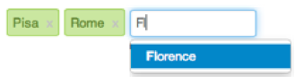

# Konzepte der Touch-optimierten Benutzeroberfläche von AEM{#concepts-of-the-aem-touch-enabled-ui}

AEM verfügt über eine Touch-fähige Benutzeroberfläche mit [Responsive Design](/help/sites-authoring/responsive-layout.md) für die Authoring-Umgebung, die sowohl auf Touch- als auch auf Desktop-Geräten ausgeführt werden kann.

>[!NOTE]
>
>Die touchfähige Benutzeroberfläche ist die Standard-Benutzeroberfläche für AEM. Die klassische Benutzeroberfläche wurde mit AEM 6.4 veraltet.

Die Touch-optimierte Benutzeroberfläche umfasst Folgendes:

* Suite-Kopfzeile:
   * Zeigt das Logo an.
   * Enthält einen Link zu „Globale Navigation“.
   * Enthält einen Link zu anderen generischen Aktionen, z. B. „Suchen“, „Hilfe“, „Marketing Cloud-Lösungen“, „Benachrichtigungen“ und „Benutzereinstellungen“.
* Leiste auf der linken Seite (Anzeige bei Bedarf, kann ausgeblendet werden):
   * Zeitleiste
   * Verweise
   * Filter
* Kontextabhängige Navigationskopfzeile:
   * Anzeige, welche Konsole Sie derzeit verwenden bzw. Ihrer Position in der Konsole
   * Auswahl für Leiste auf der linken Seite
   * Breadcrumb
   * Zugriff auf geeignete Aktionen vom Typ **Erstellen**
   * Anzeige der Auswahl
* Inhaltsbereich:
   * Auflistung der Inhaltselemente (Seiten, Assets, Forenposts usw.)
   * Formatierung nach Wunsch, z. B. Spalte, Karte oder Liste
   * Nutzung eines responsiven Designs (Größe der Anzeige wird je nach Gerät bzw. Fenstergröße automatisch angepasst)
   * Unendliches Scrollen (keine Seiten mehr, alle Elemente in einem Fenster)


>[!NOTE]
>
>Nahezu für die gesamte AEM-Funktionalität wurde eine Portierung zur Touch-optimierten Benutzeroberfläche durchgeführt. In einigen wenigen Fällen wird aber die Funktionalität der klassischen Benutzeroberfläche genutzt. Weitere Informationen erhalten Sie unter [Status der Funktionen der Touch-optimierten Benutzeroberfläche](/help/release-notes/touch-ui-features-status.md).

Die Touch-optimierte Benutzeroberfläche wurde von Adobe entworfen, um produktübergreifend die Einheitlichkeit des Anwendererlebnisses sicherzustellen. Sie basiert auf den folgenden Komponenten:

* **Coral-Benutzeroberfläche** (CUI), eine Implementierung des visuellen Stils von Adobe für die Touch-optimierte Benutzeroberfläche. Mit der Coral-Benutzeroberfläche verfügen Sie über alle Elemente, die Sie benötigen, um den visuellen Benutzeroberflächenstil für Ihr Produkt, Ihr Projekt oder Ihre Web-Anwendung einzuführen.
* Komponenten der **Granite-Benutzeroberfläche** werden mithilfe der Coral-Benutzeroberfläche erstellt.

Die Grundprinzipien der Touch-optimierten Benutzeroberfläche lauten:

* Mobile Nutzung an erster Stelle („Mobile first“), ohne den Desktop zu vergessen
* Responsives Design
* Anzeige je nach Kontext
* Wiederverwendbarkeit
* Einbettung von Referenzdokumentation
* Einbettung von Tests
* Bottom-Up-Design zur Sicherstellung, dass diese Prinzipien auf alle Elemente und Komponenten angewendet werden

Eine weitere Übersicht über die touchfähige UI-Struktur finden Sie im Artikel [Struktur der AEM Touch-Enabled-UI](/help/sites-developing/touch-ui-structure.md).

## AEM-Technologiestapel {#aem-technology-stack}

Für AEM wird die Granite-Plattform als Basis genutzt. Sie enthält unter anderem das Java-Content-Repository.


## Granite {#granite}

Granite ist der Open-Web-Stapel von Adobe mit verschiedenen Komponenten, z. B.:

* Anwendungsstarter
* OSGi-Framework zur Aufnahme aller Bereitstellungen
* Verschiedene OSGi-Kompendiumdienste als Hilfe bei der Anwendungserstellung
* Umfassendes Framework für die Protokollierung mit verschiedenen Protokollierungs-APIs
* CRX-Repository-Implementierung der JCR-API-Spezifikation
* Apache Sling-Web-Framework
* Zusätzliche Teile des aktuellen CRX-Produkts

>[!NOTE]
>
>Granite wird als offenes Entwicklungsprojekt in Adobe ausgeführt: Beiträge zum Code, zu Diskussionen und zu Problemen kommen aus dem gesamten Unternehmen.
>
>Granite ist aber **kein** Open-Source-Projekt. Es basiert in hohem Maße auf mehreren Open-Source-Projekten (vor allem Apache Sling, Felix, Jackrabbit und Lucene), aber Adobe achtet genau darauf, was öffentlich und was intern ist.

## Granite-Benutzeroberfläche {#granite-ui}

Mit der Granite-Engineering-Plattform wird auch ein UI-Framework als Grundlage bereitgestellt. Hiermit soll vor allem Folgendes erreicht werden:

* Bereitstellung von UI-Widgets mit hoher Granularität
* Implementierung der UI-Konzepte und Darstellung der besten Vorgehensweisen (Rendering langer Listen, Filterung von Listen, CRUD für Objekte, CUD-Assistenten usw.)
* Bereitstellung einer erweiterbaren und Plug-in-basierten Benutzeroberfläche für die Verwaltung

Hierfür werden die folgenden Anforderungen erfüllt:

* Respektierung des Ansatzes „Mobile first“
* Erweiterbarkeit
* Einfache Außerkraftsetzung


GraniteUI.pdf

[Datei ](assets/graniteui.pdf)
abrufenGranite-Benutzeroberfläche:

* Nutzung der RESTful-Architektur von Sling
* Implementierung von Komponentenbibliotheken, die für die Erstellung von inhaltszentrierten Web-Anwendungen bestimmt sind
* Bereitstellung von UI-Widgets mit hoher Granularität
* Bereitstellung einer einheitlichen Standardbenutzeroberfläche
* Erweiterbarkeit
* Gleichzeitige Auslegung auf mobile Geräte und Desktopgeräte (Respektierung von „Mobile first“)
* Nutzung für alle Granite-basierten Plattformen/Produkte/Projekte, z. B. AEM


* [Granite-Benutzeroberfläche – Foundation-Komponenten](#granite-ui-foundation-components) Diese Bibliothek mit Grundlagenkomponenten kann von anderen Bibliotheken verwendet oder erweitert werden.
* [Granite-Benutzeroberfläche – Verwaltungskomponenten](#granite-ui-administration-components)

### Clientseite und Serverseite {#client-side-vs-server-side}

Die Client/Server-Kommunikation der Granite-Benutzeroberfläche besteht aus Hypertext und nicht aus Objekten. Es ist also nicht erforderlich, dass der Client die Geschäftslogik versteht.

* Der Server erweitert den HTML-Code um semantische Daten.
* Der Client erweitert den Hypertext um „Hypermedia“ (Interaktion).


#### Clientseite {#client-side}

Hierfür wird eine Erweiterung des HTML-Vokabulars verwendet, die bereitgestellt wird, damit der Autor seine Absicht zur Erstellung einer interaktiven Web-App erklären kann. Dies ist ein ähnlicher Ansatz wie [WAI-ARIA](https://www.w3.org/TR/wai-aria/) und [Microformats](https://microformats.org/).

Er umfasst hauptsächlich eine Sammlung mit Interaktionsmustern (z. B. asynchrone Übermittlung eines Formulars), die anhand von JS- und CSS-Code implementiert und auf Clientseite ausgeführt werden. Die Rolle der Clientseite besteht darin, das Markup zu erweitern (als Hypermedia-Affordanz des Servers bereitgestellt), um Interaktivität zu erzielen.

Die Clientseite ist unabhängig von der Servertechnologie. Solange der Server das entsprechende Markup bereitstellt, kann die Clientseite ihre Rolle erfüllen.

Derzeit wird der JS- und CSS-Code als Granite-[clientlibs](/help/sites-developing/clientlibs.md)-Element unter der folgenden Kategorie bereitgestellt:

`granite.ui.foundation and granite.ui.foundation.admin`

Die Bereitstellung erfolgt im Rahmen des Inhaltspakets:

`granite.ui.content`

#### Serverseite {#server-side}

Besteht aus einer Sammlung von Sling-Komponenten, die dem Autor das schnelle *Verfassen* einer Web-App ermöglichen. Der Entwickler entwickelt Komponenten und der Autor stellt die Komponenten zu einer Web-App zusammen. Die Rolle der Serverseite besteht darin, die Hypermedia-Affordanz (Markup) für den Client bereitzustellen.

Derzeit befinden sich die Komponenten im Granite-Repository unter:

`/libs/granite/ui/components/foundation`

Dies wird als Teil des Inhaltspakets bereitgestellt:

`granite.ui.content`

### Unterschiede zur klassischen Benutzeroberfläche {#differences-with-the-classic-ui}

Die Unterschiede zwischen der Granite-Benutzeroberfläche und ExtJS (für die klassische Benutzeroberfläche verwendet) sind ebenfalls interessant:

<table>
 <tbody>
  <tr>
   <td><strong>ExtJS</strong></td>
   <td><strong>Granite-Benutzeroberfläche</strong></td>
  </tr>
  <tr>
   <td>Remote-Prozeduraufruf<br /> </td>
   <td>Staatliche Übergänge</td>
  </tr>
  <tr>
   <td>Datenübertragungsobjekte</td>
   <td>Hypermedia</td>
  </tr>
  <tr>
   <td>Client kennt Serverinternals</td>
   <td>Kunde kennt keine Internale</td>
  </tr>
  <tr>
   <td>"FAT-Client"</td>
   <td>"Thin client"</td>
  </tr>
  <tr>
   <td>Spezialisierte Client-Bibliotheken</td>
   <td>Universelle Clientbibliotheken</td>
  </tr>
 </tbody>
</table>

### Granite-Benutzeroberflächen-Foundation-Komponenten {#granite-ui-foundation-components}

Mit den [Granite-Benutzeroberflächen-Foundation-Komponenten](https://helpx.adobe.com/de/experience-manager/6-5/sites/developing/using/reference-materials/granite-ui/api/jcr_root/libs/granite/ui/index.html) werden die grundlegenden Bausteine bereitgestellt, die für die Erstellung einer Benutzeroberfläche benötigt werden. Dies sind beispielsweise:

* Schaltfläche
* Hyperlink
* Benutzer-Avatar

Sie finden die Foundation-Komponenten unter:

`/libs/granite/ui/components/foundation`

Diese Bibliothek enthält eine Granite-Benutzeroberflächen-Komponente für jedes Coral-Element. Eine Komponente ist inhaltsorientiert und die zugehörige Konfiguration befindet sich im Repository. Dies ermöglicht die Erstellung einer Granite-Benutzeroberflächen-Anwendung, ohne dass manuell HTML-Markup geschrieben werden muss.

Zweck:

* Komponentenmodell für HTML-Elemente
* Komposition der Komponenten
* Automatisches Testen von Einheiten und Funktionalität

Implementierung:

* Komposition und Konfiguration auf Repository-Basis
* Nutzung von Testeinrichtungen der Granite-Plattform
* JSP-Vorlagen

Diese Bibliothek mit Foundation-Komponenten kann von anderen Bibliotheken verwendet oder erweitert werden.

### ExtJS und zugehörige Granite-Benutzeroberflächen-Komponenten {#extjs-and-corresponding-granite-ui-components}

Die folgende Liste enthält eine nützliche Übersicht über ExtJS-xtype- und -Knotentypen mit den entsprechenden Granite-Benutzeroberflächen-Ressourcentypen für die Aktualisierung von ExtJS-Code zur Verwendung der Granite-Benutzeroberfläche.

| **ExtJS xtype** | **Granite-UI-Ressourcentyp** |
|---|---|
| `button` | `granite/ui/components/foundation/form/button` |
| `checkbox` | `granite/ui/components/foundation/form/checkbox` |
| `componentstyles` | `cq/gui/components/authoring/dialog/componentstyles` |
| `cqinclude` | `granite/ui/components/foundation/include` |
| `datetime` | `granite/ui/components/foundation/form/datepicker` |
| `dialogfieldset` | `granite/ui/components/foundation/form/fieldset` |
| `hidden` | `granite/ui/components/foundation/form/hidden` |
| `html5smartfile, html5smartimage` | `granite/ui/components/foundation/form/fileupload` |
| `multifield` | `granite/ui/components/foundation/form/multifield` |
| `numberfield` | `granite/ui/components/foundation/form/numberfield` |
| `pathfield, paragraphreference` | `granite/ui/components/foundation/form/pathbrowser` |
| `selection` | `granite/ui/components/foundation/form/select` |
| `sizefield` | `cq/gui/components/authoring/dialog/sizefield` |
| `tags` | `granite/ui/components/foundation/form/autocomplete``cq/gui/components/common/datasources/tags` |
| `textarea` | `granite/ui/components/foundation/form/textarea` |
| `textfield` | `granite/ui/components/foundation/form/textfield` |

| **Knotentyp** | **Granite-UI-Ressourcentyp** |
|---|---|
| `cq:WidgetCollection` | `granite/ui/components/foundation/container` |
| `cq:TabPanel` | `granite/ui/components/foundation/container``granite/ui/components/foundation/layouts/tabs` |
| `cq:panel` | `granite/ui/components/foundation/container` |

### Granite-Benutzeroberfläche – Verwaltungskomponenten {#granite-ui-administration-components}

Die [Verwaltungskomponenten der Granite-Benutzeroberfläche](https://helpx.adobe.com/experience-manager/6-5/sites/developing/using/reference-materials/granite-ui/api/jcr_root/libs/granite/ui/index.html) stellen die Foundation-Komponenten für die Bereitstellung von generischen Bausteinen dar, die von allen Verwaltungsanwendungen implementiert werden können. Dies sind beispielsweise:

* Globale Navigationsleiste
* Leiste (Skelett)
* Suchbereich

Zweck:

* Einheitliches Erscheinungsbild für Verwaltungsanwendungen
* RAD für Verwaltungsanwendungen

Implementierung:

* Vordefinierte Komponenten, die die Foundation-Komponenten verwenden
* Anpassung von Komponenten

## Coral-Benutzeroberfläche  {#coral-ui}

CoralUI.pdf

[Get ](assets/coralui.pdf)
FileCoral UI (CUI) ist eine Implementierung des visuellen Stils der Adobe für die touchfähige Benutzeroberfläche, die für Konsistenz in der Benutzererfahrung über mehrere Produkte hinweg ausgelegt ist. Mit der Coral-Benutzeroberfläche werden alle Elemente bereitgestellt, die Sie zur Übernahme des visuellen Stils der Autorenumgebung benötigen.

>[!CAUTION]
>
>Die Coral-Benutzeroberfläche ist eine Benutzeroberflächenbibliothek, die für AEM-Kunden erhältlich ist, um Anwendungen und Web-Oberflächen innerhalb der Lizenzgrenzen des Produkts zu erstellen.
>
>Die Nutzung der Coral-Benutzeroberfläche ist nur unter folgenden Bedingungen bzw. für folgende Zwecke zulässig:
>
>
>* Bei Lieferung im Paket mit AEM
>* Zur Verwendung beim Erweitern der vorhandenen Benutzeroberfläche der Autorenumgebung
>* Begleitmaterial, Anzeigen und Präsentationen von Adobe
>* Benutzeroberfläche von Anwendungen unter der Marke Adobe (Schriftart darf nicht frei für andere Zwecke verfügbar sein)
>* Geringe Anpassungen

>
>
Die Nutzung der Coral-Benutzeroberfläche sollte in folgenden Fällen vermieden werden:
>
>* Dokumente und andere Elemente, die sich nicht auf Adobe beziehen
>* Umgebungen für die Inhaltserstellung (in denen die Ausgangselemente von Dritten generiert werden)
>* Anwendungen/Komponenten/Webseiten, die nicht eindeutig mit Adobe verknüpft sind

>


Die Coral-Benutzeroberfläche ist eine Sammlung von Bausteinen für die Entwicklung von Web-Anwendungen.


Sie ist vollständig modular konzipiert und jedes Modul stellt basierend auf seiner primäre Rolle eine eigene Ebene dar. Die Ebenen sind so konzipiert, dass sie sich gegenseitig unterstützen, aber sie können bei Bedarf auch unabhängig voneinander verwendet werden. Dies ermöglicht es, das Coral-Anwendererlebnis in allen HTML-fähigen Umgebungen zu implementieren.

Für die Coral-Benutzeroberfläche muss kein bestimmtes Entwicklungsmodell bzw. keine bestimmte Plattform verwendet werden. Hauptziel von Coral ist es, einheitlichen und sauberen HTML5-Markup-Code bereitzustellen, und zwar unabhängig von der eigentlichen Methode, die zum Ausgeben des Markup-Codes verwendet wird. Er kann für client- oder serverseitiges Rendering, Vorlagen, JSP, PHP oder auch Adobe Flash-RIA-Anwendungen verwendet werden, um nur einige zu nennen.

### HTML-Elemente – Markup-Ebene  {#html-elements-the-markup-layer}

Über die HTML-Elemente wird ein einheitliches Erscheinungsbild für alle Basiselemente der Benutzeroberfläche (z. B. Navigationsleiste, Schaltfläche, Menü, Leiste usw.) erzielt.

Auf der einfachsten Ebene ist ein HTML-Element ein HTML-Tag mit einem dedizierten Klassennamen. Komplexere Elemente können aus mehreren Tags zusammengestellt werden, die ineinander geschachtelt sind (auf spezifische Weise).

Das CSS wird verwendet, um das eigentliche Erscheinungsbild bereitzustellen. Um eine einfache Anpassung des Erscheinungsbilds (z. B. für Branding-Fälle) zu ermöglichen, werden die Formatierungswerte als Variablen deklariert, die zur Laufzeit vom [LESS](https://lesscss.org/)-Prozessor vorab verarbeitet werden.

Zweck:

* Bereitstellung von Basiselementen der Benutzeroberfläche mit einheitlichem Erscheinungsbild
* Bereitstellung des standardmäßigen Rastersystems

Implementierung:

* HTML-Tags mit von [Bootstrap](https://twitter.github.com/bootstrap/) inspirierten Formatierungen
* Definition von Klassen in LESS-Dateien
* Definition von Symbolen als Schriftart-Sprites

Beispiel für verwendeten Markup-Code:

```xml
<button class="btn btn-large btn-primary" type="button">Large button</button>
<button class="btn btn-large" type="button">Large button</button>
```

Darstellung:


Das Erscheinungsbild wird in LESS definiert und es besteht eine Bindung an ein Element nach dem dedizierten Klassennamen (der folgende Auszug wurde gekürzt):

```xml
.btn {
    font-size: @baseFontSize;
    line-height: @baseLineHeight;
    .buttonBackground(@btnBackground,
                                @btnBackgroundHighlight,
                                @grayDark, 0 1px 1px rgba(255,255,255,.75));
```

Die tatsächlichen Werte werden in einer LESS-Variablendatei definiert (der folgende Auszug wurde gekürzt):

```xml
@btnBackgroundHighlight: darken(@white, 10%);
@btnPrimaryBackgroundHighlight: spin(@btnPrimaryBackground, 20%);
@baseFontSize: 17px;
@baseFontFamily: @sansFontFamily;
```

### Element-Plug-ins {#element-plugins}

Viele der HTML-Elemente müssen ein bestimmtes dynamisches Verhalten aufweisen, z. B. das Öffnen und Schließen von Popup-Menüs. Dies ist die Rolle der Element-Plug-ins, mit denen diese Aufgaben erreicht werden, indem das DOM per JavaScript geändert wird.

Für ein Plug-in gilt einer der folgenden Fälle:

* Es ist für ein spezifisches DOM-Element ausgelegt. Beispiel: Ein Dialogfeld-Plugin erwartet, `DIV class=dialog` zu finden
* Es ist generischer Art. Über einen Layout-Manager wird beispielsweise das Layout für eine Liste mit `DIV`- oder `LI`-Elementen bereitgestellt.

Das Plug-in-Verhalten kann auf folgende Arten mit Parametern angepasst werden:

* Übergeben der Parameter per JavaScript-Aufruf
* Verwenden dedizierter `data-*`-Attribute, die mit dem HTML-Markup verknüpft sind

Entwickler können für jedes Plug-in den besten Ansatz wählen, aber die Faustregel lautet:

* `data-*` Attribute für Optionen im Zusammenhang mit dem HTML-Layout. Beispielsweise zum Angeben der Anzahl von Spalten.
* API-Optionen/-Klassen für Funktionalität in Verbindung mit Daten. Beispiel: Erstellung der Liste mit den anzuzeigenden Elementen.

Dasselbe Konzept wird auch verwendet, um die Formularvalidierung zu implementieren. Für ein Element, das überprüft werden soll, müssen Sie das erforderliche Eingabefeld als benutzerdefiniertes `data-*`-Attribut angeben. Dieses Attribut wird dann als Option für ein Validierungs-Plug-in verwendet.

>[!NOTE]
>
>Die HTML5-native Formularvalidierung sollte nach Möglichkeit immer verwendet und erweitert werden.

Zweck:

* Bereitstellen von dynamischem Verhalten für HTML-Elemente
* Bereitstellen von benutzerdefinierten Layouts, die per reinem CSS nicht erreichbar sind
* Durchführen einer Formularvalidierung
* Durchführen der erweiterten DOM-Bearbeitung

Implementierung:

* jQuery-Plug-in, an ein spezifisches DOM-Element (auch mehrere) gebunden
* Verwenden von Attributen `data-*` zum Anpassen des Verhaltens

Ein Auszug aus Markup-Beispielcode (beachten Sie die als data-*-Attribute angegebenen Optionen):

```xml
<ul data-column-width="220" data-layout="card" class="cards">
  <li class="item">
    <div class="thumbnail">
      
      <div class="caption">
        <h4>Toolbar</h4>
          <p><small>toolbar</small><br></p>
      </div>
    </div>
  </li>
  <li class="item">
    <div class="thumbnail">
      
      <div class="caption">
        <h4>Toolbar</h4>
        <p><small>toolbar</small><br></p>
      </div>
    </div>
  </li>
```

Aufruf des jQuery-Plug-ins:

```
$(‘.cards’).cardlayout ();
```

Anzeige als:


Mit dem `cardLayout`-Plug-in wird das Layout für die eingebundenen `UL`-Elemente basierend auf der entsprechenden Höhe erstellt und außerdem wird die Breite des übergeordneten Elements berücksichtigt.

### Widgets für HTML-Elemente {#html-elements-widgets}

In einem Widget werden ein oder mehrere grundlegende Elemente mit einem JavaScript-Plug-in kombiniert, um UI-Elemente auf höherer Ebene zu erhalten. Hiermit können ein komplexeres Verhalten und außerdem ein komplexeres Erscheinungsbild als mit einem einzelnen Element implementiert werden. Gute Beispiele hierfür sind die Tag-Auswahl oder Leisten-Widgets.

Ein Widget kann benutzerdefinierte Ereignisse sowohl auslösen als auch darauf lauschen, um eine Kooperation mit anderen Widgets der Seite zu ermöglichen. Bei einigen Widgets handelt es sich eigentlich um native jQuery-Widgets, für die die Coral-HTML-Elemente verwendet werden.

Zweck:

* Implementieren von UI-Elementen der höheren Ebene für komplexeres Verhalten
* Auslösen und Verarbeiten von Ereignissen

Implementierung:

* jQuery-Plug-in und HTML-Markup
* Nutzung von Vorlagen auf Client-/Serverseite

Beispiel-Markup:

```
<input type="text" name="tags" placeholder="Tags" class="tagManager"/>
```

Aufruf des jQuery-Plug-ins (mit Optionen):

```
$(".tagManager").tagsManager({
        prefilled: ["Pisa", "Rome"] })
```

Das Plug-in gibt HTML-Markup aus (hierfür werden grundlegende Elemente verwendet, die ggf. intern andere Plug-ins nutzen):

```
<span>Pisa</code>
<a title="Removing tag" tagidtoremove="0"
   id="myRemover_0" class="myTagRemover" href="#">x</a></code>

<span id="myTag_1" class="myTag"><span>Rome</code>
<a title="Removing tag" tagidtoremove="1"
   id="myRemover_1" class="myTagRemover" href="#">x</a></code>

<input type="text" data-original-title="" class="input-medium tagManager"
       placeholder="Tags" name="tags" data-provide="typeahead" data-items="6"
       autocomplete="off">
```

Anzeige als:



### Dienstprogrammbibliothek {#utility-library}

Diese Bibliothek ist eine Sammlung mit JavaScript-Hilfs-Plug-ins bzw. -Funktionen, für die Folgendes gilt:

* UI-unabhängig
* Trotzdem wichtig für die Erstellung von Web-Anwendungen mit vollem Funktionsumfang

Hierzu gehören auch die XSS-Verarbeitung und der „Event Bus“.

Die HTML-Element-Plug-ins und -Widgets können zwar auf Funktionalität basieren, die über die Dienstprogrammbibliothek bereitgestellt wird, aber die Dienstprogrammbibliothek kann keine feste Abhängigkeit von den Elementen oder Widgets selbst aufweisen.

Zweck:

* Bereitstellung von allgemeiner Funktionalität
* Event Bus-Implementierung
* Clientseitige Vorlagen
* XSS

Implementierung:

* jQuery-Plug-ins oder AMD-konforme JavaScript-Module
