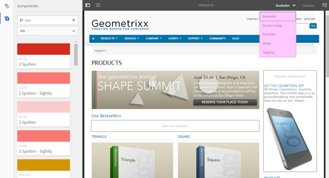

# Struktur der Touch-optimierten Benutzeroberfläche von Adobe Experience Manager{#structure-of-the-aem-touch-enabled-ui}

Die Touch-optimierte Adobe Experience Manager-Benutzeroberfläche (AEM) basiert auf mehreren Prinzipien und besteht aus mehreren Schlüsselelementen:

## Konsolen {#consoles}

### Grundlegendes Layout und Größenanpassung {#basic-layout-and-resizing}

Die Benutzeroberfläche ist für Mobilgeräte sowie Desktop-Computer geeignet. Adobe hat sich dagegen entschieden, zwei verschiedene Layouts zu entwickeln, und verwendet stattdessen ein Layout, das mit allen Bildschirmen und Geräten kompatibel ist.

Alle Module verwenden dasselbe Basis-Layout. In AEM sieht es wie folgt aus:

Das Layout ermöglicht eine schnelle und einfache Bedienung und passt sich an die Größe des verwendeten Bildschirms oder Fensters an.

Wenn beispielsweise die Auflösung unter 1.024 px liegt (z. B. bei einem Mobilgerät), wird die Anzeige entsprechend angepasst:

### Kopfzeilenleiste {#header-bar}

Die Kopfzeilenleiste zeigt globale Elemente, z. B.:

* das Logo und das spezifische Produkt/die spezifische Lösung, das/die Sie derzeit verwenden; AEM bildet dies auch einen Link zur globalen Navigation
* Suchen
* Symbol für den Zugriff auf die Hilferessourcen
* Symbol für Zugriff auf andere Lösungen
* Anzeige (und Zugriff) aller Warnungen oder Posteingangselemente, die auf Sie warten
* Benutzersymbol mit einem Link zum Profil-Management

### Symbolleiste {#toolbar}

Die Symbolleiste zeigt abhängig vom Kontext Tools an, die die Ansicht oder Elemente der Seite steuern. Die Symbolleiste ist produktspezifisch, die Elemente weisen jedoch einige Gemeinsamkeiten auf.

Sie zeigt stets die aktuell möglichen Aktionen an:

Abhängig von der Auswahl einer Ressource:

### Linke Leiste {#left-rail}

Die linke Leiste kann nach Bedarf geöffnet oder ausgeblendet werden. Sie zeigt Folgendes an:

* **Zeitleiste**
* **Verweise**
* **Filter**

Der Standardwert ist **Nur Inhalt** (Leiste ausgeblendet).

## Bearbeiten von Seiten {#page-authoring}

Beim Erstellen von Seiten sind die strukturellen Bereiche wie folgt.

### Inhalts-Frame {#content-frame}

Der Seiteninhalt wird im Inhalts-Frame gerendert. Der Inhalts-Frame ist unabhängig vom Editor, um sicherzustellen, dass keine Konflikte aufgrund von CSS oder JavaScript auftreten.

Der Inhalts-Frame wird im rechten Bereich des Fensters unter der Symbolleiste angezeigt.

### Editor-Frame {#editor-frame}

Der Editor-Frame erkennt die Bearbeitungsfunktionen.

Der Editor-Frame ist ein Container (abstrakt) für alle *Seitenbearbeitungselemente*. Er wird über dem Inhalts-Frame angezeigt und enthält:

* die obere Symbolleiste
* Seitenbereich
* alle Überlagerungen
* alle anderen Seitenbearbeitungselemente; z. B. die Komponenten-Symbolleiste

### Seitenbereich {#side-panel}

Diese enthält zwei Standardregisterkarten, auf denen Sie Assets und Komponenten auswählen können. Sie können von hier auf die Seite gezogen und dort abgelegt werden.

Der Seitenbereich ist standardmäßig ausgeblendet. Wenn diese Option ausgewählt ist, wird sie entweder auf der linken Seite angezeigt oder über das gesamte Fenster eingeblendet (wenn die Fenstergröße unter einer Breite von 1024 Pixel liegt). z. B. auf einem Mobilgerät).

### Seitenbereich – Assets {#side-panel-assets}

Auf der Registerkarte Assets können Sie aus dem Asset-Bereich auswählen. Sie können auch nach einem bestimmten Begriff filtern oder eine Gruppe auswählen.

### Seitenbereich – Asset-Gruppen {#side-panel-asset-groups}

Auf der Registerkarte &quot;Asset&quot;gibt es eine Dropdown-Liste, mit der Sie die spezifischen Asset-Gruppen auswählen können.

### Seitenbereich – Komponenten {#side-panel-components}

Auf der Registerkarte Komponenten können Sie aus dem Komponentenbereich auswählen. Sie können auch nach einem bestimmten Begriff filtern oder eine Gruppe auswählen.

### Überlagerungen {#overlays}

Diese überlagern den Inhalts-Frame und werden von der [Ebenen](#layer) um die Mechanismen zu realisieren, wie Sie (transparent) mit den Komponenten und deren Inhalt interagieren können.

Die Überlagerungen befinden sich im Editor-Frame (neben allen anderen Seitenbearbeitungselementen); sie überlagern jedoch die entsprechenden Elemente im Inhalts-Frame.

### Ebene {#layer}

Eine Ebene ist eine unabhängige Funktionsgruppe, die Sie aktivieren können, um Folgendes auszuführen:

* eine andere Ansicht der Seite aufrufen
* ermöglichen die Bearbeitung und/oder Interaktion mit einer Seite

Anders als spezifische Aktionen zu einzelnen Komponenten bieten die Ebenen komplexe Funktionen für die gesamte Seite.

AEM enthält mehrere bereits für die Seitenbearbeitung implementierte Ebenen. , z. B. Bearbeiten, Vorschau, Anmerkungen.

>[!NOTE]
>
>Ebenen sind ein leistungsstarkes Konzept, das die Ansicht des Benutzers und die Interaktion mit dem Seiteninhalt beeinflusst. Wenn Sie eigene Ebenen entwickeln, müssen Sie sicherstellen, dass die Ebene beim Verlassen bereinigt wird.

### Ebenenschalter {#layer-switcher}

Mit dem Ebenenschalter können Sie die Ebene auswählen, die Sie verwenden möchten. Wenn er geschlossen ist, zeigt er die aktuell verwendete Ebene an.

Der Ebenenschalter ist als Dropdown-Liste in der Symbolleiste verfügbar (oben im Fenster im Editor-Frame).

### Komponentensymbolleiste {#component-toolbar}

Jede Instanz einer Komponente zeigt ihre Symbolleiste an, wenn darauf geklickt wird (entweder einmal oder mit einem langsamen Doppelklick). Die Symbolleiste enthält die spezifischen Aktionen (z. B. Kopieren, Einfügen, Öffnen-Editor), die für die Komponenteninstanz (bearbeitbar) auf der Seite verfügbar sind.

Je nach verfügbarem Platz werden die Komponenten-Symbolleisten in der oberen oder unteren rechten Ecke der entsprechenden Komponente platziert.

## Weiterführende Informationen {#further-information}

Weitere Informationen zu den Konzepten der Touch-optimierten Benutzeroberfläche finden Sie unter [Konzepte der AEM Touch-optimierten Benutzeroberfläche](/help/sites-developing/touch-ui-concepts.md).

Weitere technische Informationen finden Sie unter [JS-Dokumentationssatz](https://helpx.adobe.com/de/experience-manager/6-5/sites/developing/using/reference-materials/jsdoc/ui-touch/editor-core/index.html) für den Touch-optimierten Seiteneditor.
