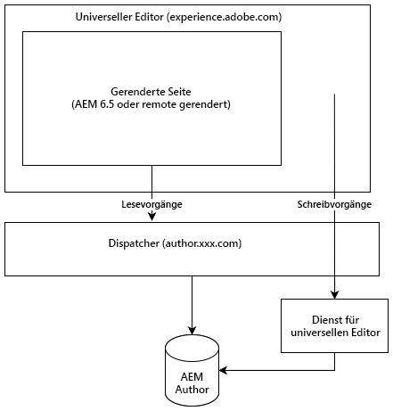

# Der universelle Editor {#universal-editor}

Erfahren Sie mehr über die Flexibilität des universellen Editors und wie er Ihre Headless-Erlebnisse mit AEM 6.5 unterstützen kann.

## Überblick {#overview}

Der universelle Editor ist ein vielseitiger visueller Editor, der Teil von Adobe Experience Manager Sites ist. Damit können Autorinnen und Autoren jedes Headless-Erlebnisses in WYSIWYG (What you see is what you get) bearbeiten.

* Autorinnen und Autoren profitieren von der Flexibilität des universellen Editors, da er dieselbe konsistente visuelle Bearbeitung für alle Formen von AEM-Headless-Inhalten unterstützt.
* Entwickler profitieren von der Vielseitigkeit des universellen Editors, da er auch die echte Entkopplung der Implementierung unterstützt. Es ermöglicht Entwicklern die Verwendung praktisch jedes Frameworks oder jeder Architektur ihrer Wahl, ohne dass SDK- oder Technologiebeschränkungen auferlegt werden.

Weitere Informationen finden Sie in der Dokumentation zu [AEM as a Cloud Service ](https://experienceleague.adobe.com/de/docs/experience-manager-cloud-service/content/implementing/developing/universal-editor/introduction) universellen Editor.

## Architektur {#architecture}

Der universelle Editor ist ein Service, der mit AEM zusammenarbeitet, um Inhalte „headless“ zu erstellen.

* Der universelle Editor befindet sich unter `https://experience.adobe.com/#/aem/editor/canvas` und kann Seiten bearbeiten, die von AEM 6.5 gerendert werden.
* Die AEM-Seite wird vom universellen Editor über den Dispatcher aus der AEM-Autoreninstanz gelesen.
* Der universelle Editor-Dienst, der auf demselben Host wie Dispatcher ausgeführt wird, schreibt Änderungen zurück in die AEM-Autoreninstanz.



## Einrichtung {#setup}

Um den universellen Editor zu testen, müssen Sie:

1. [Aktualisieren und konfigurieren Sie Ihre AEM-Autoreninstanz.](#update-configure-aem)
1. [Richten Sie einen lokalen universellen Editor-Dienst ein.](#set-up-ue)
1. [Passen Sie Ihren Dispatcher an, um den universellen Editor-Dienst zuzulassen.](#update-dispatcher)

Nachdem Sie die Einrichtung abgeschlossen haben, können Sie [Ihre Anwendungen instrumentieren, um den universellen Editor zu verwenden.](#instrumentation)

### AEM aktualisieren {#update-aem}

Service Pack 21 oder 22 und ein Feature Pack für AEM sind erforderlich, um den universellen Editor mit AEM 6.5 verwenden zu können.

#### Anwenden des neuesten Service Packs {#latest}

Stellen Sie sicher, dass Sie mindestens Service Pack 21 oder 22 für AEM 6.5 ausführen. Sie können das neueste Service Pack von „Software [&quot; herunterladen](https://experienceleague.adobe.com/docs/experience-cloud/software-distribution/home.html?lang=de)

#### Installieren des Feature Packs für den universellen Editor {#feature-pack}

Installieren Sie **Universal Editor Feature Pack für AEM 6.5** [verfügbar unter Software Distribution.](https://experience.adobe.com/#/downloads/content/software-distribution/en/aem.html?package=/content/software-distribution/en/details.html/content/dam/aem/public/cq-6.5.21-universal-editor-1.0.0.zip)

Wenn Sie Service Pack 23 oder höher bereits ausführen, ist das Feature Pack nicht erforderlich.

### Konfigurieren von Services {#configure-services}

Das Feature Pack installiert eine Reihe neuer Pakete, für die eine zusätzliche Konfiguration erforderlich ist.

#### Legen Sie das SameSite-Attribut für das `login-token`-Cookie fest. {#samesite-attribute}

1. Öffnen Sie den Configuration Manager. 
   * `http://<host>:<port>/system/console/configMgr`
1. Suchen Sie **Adobe Granite Token Authentication Handler** in der Liste und klicken Sie auf **Konfigurationswerte ändern**.
1. Ändern Sie im Dialogfeld den Wert **SameSite-Attribut für das Anmelde-Token** (`token.samesite.cookie.attr`) auf `Partitioned`.
1. Klicken Sie auf **Speichern**.

#### Entfernen Sie die Option „X-Frame“ für `SAMEORIGIN`. {#sameorigin}

1. Öffnen Sie den Configuration Manager. 
   * `http://<host>:<port>/system/console/configMgr`
1. Suchen Sie **Apache Sling Main Servlet** in der Liste und klicken Sie auf **Konfigurationswerte bearbeiten**.
1. Löschen Sie den `X-Frame-Options=SAMEORIGIN` aus dem Attribut **Zusätzliche Antwortkopfzeilen** (`sling.additional.response.headers`), falls vorhanden.
1. Klicken Sie auf **Speichern**.

#### Konfigurieren Sie den Adobe Granite Query Parameter Authentication Handler. {#query-parameter}

1. Öffnen Sie den Configuration Manager. 
   * `http://<host>:<port>/system/console/configMgr`
1. Suchen Sie **Adobe Granite Query Parameter Authentication Handler** in der Liste und klicken Sie auf **Konfigurationswerte bearbeiten**.
1. Fügen Sie im Feld **Pfad** (`path`) `/` hinzu, um zu aktivieren.
   * Ein leerer Wert deaktiviert den Authentifizierungs-Handler.
1. Klicken Sie auf **Speichern**.

#### Legen Sie fest, für welche Inhaltspfade oder `sling:resourceTypes` der universelle Editor geöffnet werden soll. {#paths}

1. Öffnen Sie den Configuration Manager. 
   * `http://<host>:<port>/system/console/configMgr`
1. Suchen Sie **Universal Editor URL Service** in der Liste und klicken Sie auf **Konfigurationswerte bearbeiten**.
1. Legen Sie fest, für welche Inhaltspfade oder `sling:resourceTypes` der universelle Editor geöffnet werden soll.
   * Geben Sie im Feld **Öffnen der universellen Editor-Zuordnung** die Pfade an, für die der universelle Editor geöffnet wird.
   * Geben Sie im Feld **sling:resourceTypes, das vom universellen Editor geöffnet werden soll** eine Liste der Ressourcen an, die direkt vom universellen Editor geöffnet werden.
1. Klicken Sie auf **Speichern**.

AEM öffnet den universellen Editor für Seiten, die auf dieser Konfiguration basieren.

1. AEM prüft die Zuordnungen unter `Universal Editor Opening Mapping`. Wenn sich der Inhalt unter einem der dort definierten Pfade befindet, wird der universelle Editor dafür geöffnet.
1. Bei Inhalten, die nicht unter in `Universal Editor Opening Mapping` definierten Pfaden enthalten sind, prüft AEM, ob die `resourceType` des Inhalts mit den in **sling:resourceTypes, die vom universellen Editor geöffnet werden sollen, definierten** übereinstimmt, und wenn der Inhalt mit einem dieser Typen übereinstimmt, wird der universelle Editor für ihn bei `${author}${path}.html` geöffnet.
1. Andernfalls öffnet AEM den Seiteneditor.

Die folgenden Variablen stehen zur Definition Ihrer Zuordnungen unter `Universal Editor Opening Mapping` zur Verfügung.

* `path`: Inhaltspfad der zu öffnenden Ressource
* `localhost`: Externalizer-Eintrag für `localhost` ohne Schema, z. B. `localhost:4502`
* `author`: Externalizer-Eintrag für Autor ohne Schema, z. B. `localhost:4502`
* `publish`: Externalizer-Eintrag für Veröffentlichung ohne Schema, z. B. `localhost:4503`
* `preview`: Externalizer-Eintrag für Vorschau ohne Schema, z. B. `localhost:4504`
* `env`: `prod`, `stage`, `dev` basierend auf den definierten Sling-Ausführungsmodi
* `token`: Abfrage-Token für die `QueryTokenAuthenticationHandler` erforderlich

Beispielzuordnungen:

* Öffnen Sie alle Seiten unter `/content/foo` in der AEM-Autoreninstanz:
   * `/content/foo:${author}${path}.html?login-token=${token}`
   * Dies führt zu `https://localhost:4502/content/foo/x.html?login-token=<token>`
* Öffnen Sie alle Seiten unter `/content/bar` auf einem Remote-NextJS-Server und geben Sie alle Variablen als Informationen an.
   * `/content/bar:nextjs.server${path}?env=${env}&author=https://${author}&publish=https://${publish}&login-token=${token}`
   * Dies führt zu `https://nextjs.server/content/bar/x?env=prod&author=https://localhost:4502&publish=https://localhost:4503&login-token=<token>`

### Einrichten des universellen Editor-Dienstes {#set-up-ue}

Wenn die AEM aktualisiert und konfiguriert wurde, können Sie einen lokalen universellen Editor-Dienst für Ihre eigene lokale Entwicklung und Tests einrichten.

1. Installieren Sie Node.js Version >=20.
1. Laden Sie den neuesten universellen Editor-Service von [Software Distribution](https://experienceleague.adobe.com/de/docs/experience-cloud/software-distribution/home) herunter und entpacken Sie ihn.
1. Konfigurieren des universellen Editor-Dienstes über Umgebungsvariablen oder `.env` Datei.
   * [Weitere Informationen finden Sie in der Dokumentation zum universellen Editor von AEM as a Cloud Service.](https://experienceleague.adobe.com/en/docs/experience-manager-cloud-service/content/implementing/developing/universal-editor/local-dev#setting-up-service)
   * Beachten Sie, dass Sie möglicherweise die Option `UES_MAPPING` verwenden müssen, wenn eine interne IP-Umschreibung erforderlich ist.
1. Führen Sie `universal-editor-service.cjs` aus.

### Aktualisieren der Dispatcher {#update-dispatcher}

Wenn AEM konfiguriert ist und ein lokaler universeller Editor-Dienst ausgeführt wird, müssen Sie einen Reverse-Proxy für den neuen Dienst ([ Dispatcher) zulassen](https://experienceleague.adobe.com/de/docs/experience-manager-dispatcher/using/dispatcher)

1. Passen Sie die vhost-Datei der Autoreninstanz an, um einen Reverse-Proxy einzuschließen.

   ```html
   <IfModule mod_proxy.c>
    ProxyPass "/universal-editor" "http://localhost:8080"
    ProxyPassReverse "/universal-editor" "http://localhost:8080"
   </IfModule>
   ```

   >[!NOTE]
   >
   >8080 ist der Standard-Port. Wenn Sie dies mit dem `UES_PORT` Parameter in [Ihrer `.env`-Datei](https://experienceleague.adobe.com/en/docs/experience-manager-cloud-service/content/implementing/developing/universal-editor/local-dev#setting-up-service) geändert haben, müssen Sie den Port-Wert hier entsprechend anpassen.

1. Starten Sie Apache neu.

## Instrumentieren der App {#instrumentation}

Wenn die AEM aktualisiert wurde und ein lokaler universeller Editor-Dienst ausgeführt wird, können Sie mit der Bearbeitung von Headless-Inhalten mit dem universellen Editor beginnen.

Ihre App muss jedoch so instrumentiert sein, dass sie den universellen Editor nutzen kann. Dazu gehören Meta-Tags, die den Editor anweisen, wie und wo der Inhalt beibehalten werden soll. Weitere Informationen zu dieser Instrumentierung finden Sie unter [Dokumentation zum universellen Editor für AEM as a Cloud Service.](https://experienceleague.adobe.com/en/docs/experience-manager-cloud-service/content/implementing/developing/universal-editor/getting-started#instrument-page)

Beachten Sie, dass bei Verwendung der Dokumentation für den universellen Editor mit AEM as a Cloud Service die folgenden Änderungen mit AEM 6.5 gelten.

* Das Protokoll im Meta-Tag muss `aem65` statt `aem` sein.

  ```html
  <meta name="urn:adobe:aue:system:aemconnection" content={`aem65:${getAuthorHost()}`}/>
  ```

* Der Service-Endpunkt des universellen Editors muss über ein Meta-Tag angekündigt werden.

  ```html
  <meta name="urn:adobe:aue:config:service" content={`${getAuthorHost()}/universal-editor`}/>
  ```

* Im `plugins` Abschnitt der Komponentendefinition müssen `aem65` anstelle von `aem` verwendet werden.

>[!TIP]
>
>Eine ausführliche Anleitung für Entwicklerinnen und Entwickler, die mit dem universellen Editor beginnen, finden Sie im Dokument [Übersicht über den universellen Editor für AEM-](https://experienceleague.adobe.com/en/docs/experience-manager-cloud-service/content/implementing/developing/universal-editor/developer-overview)) in der AEM as a Cloud Service-Dokumentation, wobei Sie die erforderlichen Änderungen für die AEM 6.5-Unterstützung, die in diesem Abschnitt erwähnt werden, im Auge behalten.

## Unterschiede zwischen AEM 6.5 und AEM as a Cloud Service {#differences}

Der universelle Editor in AEM 6.5 funktioniert im Großen und Ganzen genauso wie in AEM as a Cloud Service, einschließlich der Benutzeroberfläche und eines Großteils des Setups. Es gibt jedoch Unterschiede, die zu beachten sind.

* Der universelle Editor in 6.5 unterstützt nur den Headless-Anwendungsfall.
* Das Setup des universellen Editors variiert geringfügig bei 6.5 ([wie ](#setup) aktuellen Dokument beschrieben).
* Der universelle Editor in 6.5 verwendet eine andere Asset-Auswahl und eine andere Inhaltsfragmentauswahl als AEM as a Cloud Service.
