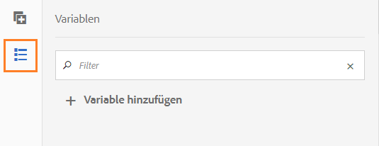
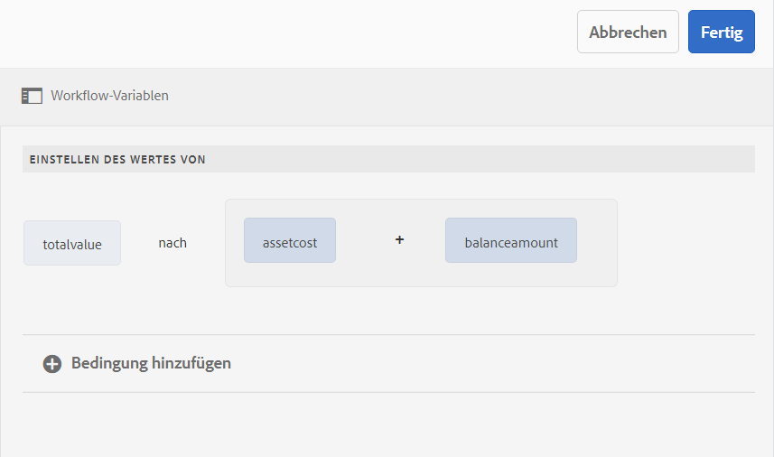
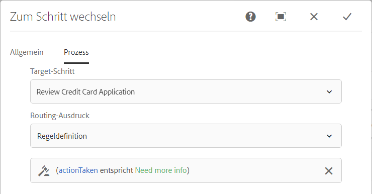

# Variablen in AEM Workflows{#variables-in-aem-workflows}

Eine Variable in einem Workflow-Modell ist eine Methode, einen Wert basierend auf seinem Datentyp zu speichern. Anschließend können Sie den Namen der Variablen in einem beliebigen Workflow-Schritt verwenden, um den in der Variablen gespeicherten Wert abzurufen. Sie können auch Variablennamen verwenden, um Ausdrücke für Routing-Entscheidungen zu definieren.

In AEM Workflow-Modellen haben Sie folgende Möglichkeiten:

* [Erstellen Sie eine ](/help/sites-developing/using-variables-in-aem-workflows.md#create-a-variable) Variable eines Datentyps basierend auf dem Informationstyp, den Sie darin speichern möchten.
* [Legen Sie mit dem Workflow-Schritt Variable festlegen einen Wert für die ](/help/sites-developing/using-variables-in-aem-workflows.md#set-a-variable) Variable fest.
* [Verwenden Sie die ](/help/sites-developing/using-variables-in-aem-workflows.md#use-a-variable) Variablen ODER Aufspaltung und AEM Workflow-Schritte , um einen Ausdruck für Routing-Entscheidungen zu definieren. Sie können auch Variablen in allen AEM Forms-Workflow-Schritten verwenden.

Das folgende Video zeigt, wie Sie Variablen in AEM Workflow-Modellen erstellen, festlegen und verwenden können:

>[!VIDEO](https://helpx.adobe.com/content/dam/help/en/experience-manager/6-5/forms/using/usevariables_example.mp4)

Variablen sind eine Erweiterung der [MetaDataMap](https://helpx.adobe.com/experience-manager/6-5/sites/developing/using/reference-materials/javadoc/com/adobe/granite/workflow/metadata/MetaDataMap.html)-Schnittstelle. Sie können [MetaDataMap](https://helpx.adobe.com/experience-manager/6-5/sites/developing/using/reference-materials/javadoc/com/adobe/granite/workflow/metadata/MetaDataMap.html) in ECMAScript verwenden, um auf mithilfe von Variablen gespeicherte Metadaten zuzugreifen.

## Variable {#create-a-variable} erstellen

Sie erstellen Variablen mithilfe des Bereichs Variablen , der im Sidekick des Workflow-Modells verfügbar ist. AEM Workflow-Variablen unterstützen die folgenden Datentypen:

* **Primitive-Datentypen**: Long, Double, Boolean, Date und String
* **Komplexe Datentypen**:  [](https://docs.oracle.com/javase/8/docs/api/org/w3c/dom/Document.html) XMLund  [JSON](https://static.javadoc.io/com.google.code.gson/gson/2.3/com/google/gson/JsonObject.html)

>[!NOTE]
>
>Workflows unterstützen nur das ISO8601-Format für Datumsvariablen.

Weitere komplexe Datentypen, die in AEM Forms-Workflows verfügbar sind, finden Sie unter [Variablen in AEM Forms-Workflows](/help/forms/using/variable-in-aem-workflows.md).  Verwenden Sie den Datentyp ArrayList , um Variablensammlungen zu erstellen. Sie können eine ArrayList-Variable für alle primitiven und komplexen Datentypen erstellen. Erstellen Sie beispielsweise eine ArrayList-Variable und wählen Sie String als Untertyp aus, um mehrere Zeichenfolgenwerte mit der -Variablen zu speichern.

Führen Sie die folgenden Schritte aus, um eine Variable zu erstellen:

1. Navigieren Sie in einer AEM-Instanz zu Tools > Workflow > Modelle .
1. Tippen Sie auf **[!UICONTROL Erstellen]** und geben Sie den Titel und einen optionalen Namen für das Workflow-Modell an. Wählen Sie das Modell aus und tippen Sie auf **[!UICONTROL Bearbeiten]**.
1. Tippen Sie auf das Variablensymbol im Sidekick des Workflow-Modells und tippen Sie auf **[!UICONTROL Variable hinzufügen]**.

   

1. Geben Sie im Dialogfeld Variable hinzufügen den Namen an und wählen Sie den Typ der Variablen aus.
1. Wählen Sie den Datentyp aus der Dropdown-Liste **[!UICONTROL Typ]** aus und geben Sie die folgenden Werte an:

   * Primitive-Datentyp - Geben Sie einen optionalen Standardwert für die Variable an.
   * JSON oder XML - Geben Sie einen optionalen JSON- oder XML-Schemapfad an. Das System validiert den Schemapfad beim Zuordnen und Speichern der in diesem Schema verfügbaren Eigenschaften zu einer anderen Variablen.
   * Formulardatenmodell - Geben Sie einen Formulardatenmodellpfad an.
   * ArrayList - Geben Sie einen Untertyp für die Sammlung an.

1. Geben Sie eine optionale Beschreibung für die Variable an und tippen Sie auf , um die Änderungen zu speichern. Die Variable wird in der Liste angezeigt, die im linken Bereich verfügbar ist.

Berücksichtigen Sie beim Erstellen von Variablen die folgenden Vorgehensweisen:

* Erstellen Sie so viele Variablen, wie ein Workflow erfordert. Um jedoch Datenbankressourcen zu schonen, sollten Sie die Anzahl der Variablen auf das erforderliche Minimum beschränken und Variablen nach Möglichkeit wiederverwenden.
* Bei Variablen wird zwischen Groß- und Kleinbuchstaben unterschieden. Stellen Sie sicher, dass Sie Variablen in Ihrem Workflow auf die gleiche Groß-/Kleinschreibung verweisen.
* Vermeiden Sie die Verwendung von Sonderzeichen im Namen einer Variablen

## Variable {#set-a-variable} festlegen

Mit dem Schritt Variable festlegen können Sie den Wert einer Variablen festlegen und die Reihenfolge definieren, in der die Werte festgelegt werden. Die -Variable wird in der Reihenfolge festgelegt, in der die Variablenzuordnungen im Schritt der festgelegten Variablen aufgelistet werden.

Änderungen an Variablenwerten betreffen nur die Instanz des Prozesses, in der die Änderung erfolgt. Wenn beispielsweise ein Workflow initiiert wird und sich die Variablendaten ändern, wirken sich die Änderungen nur auf diese Instanz des Workflows aus. Die Änderungen wirken sich nicht auf andere Instanzen des Workflows aus, die zuvor initiiert wurden oder später initiiert werden.

Je nach Datentyp der Variablen können Sie die folgenden Optionen verwenden, um den Wert einer Variablen festzulegen:

* **Literal:** Verwenden Sie die Option, wenn Sie den genauen, zu spezifizierenden Wert kennen.
* **Ausdruck:** Verwenden Sie die Option, wenn der zu verwendende Wert auf der Grundlage eines Ausdrucks berechnet wird. Der Ausdruck wird im bereitgestellten Ausdruckseditor erstellt.
* **JSON Dot Notation:** Verwenden Sie die Option, um einen Wert aus einer JSON- oder FDM-Variablen abzurufen.
* **XPATH:** Verwenden Sie die Option, um einen Wert aus einer XML-Typvariablen abzurufen.
* **Relativ zur Payload:** Verwenden Sie die Option, wenn der in einer Variablen zu speichernde Wert in einem Pfad relativ zur Payload verfügbar ist.
* **Absoluter Pfad:** Verwenden Sie die Option, wenn der in einer Variablen zu speichernde Wert in einem absoluten Pfad verfügbar ist.

Sie können auch bestimmte Elemente einer JSON- oder XML-Variablen mithilfe der JSON-DOT-Notation oder XPATH-Notation aktualisieren.

### Zuordnung zwischen Variablen {#add-mapping-between-variables} hinzufügen

Führen Sie die folgenden Schritte aus, um die Zuordnung zwischen Variablen hinzuzufügen:

1. Tippen Sie auf der Seite &quot;Workflow-Bearbeitung&quot;auf das Symbol Schritte , das im Sidekick des Workflow-Modells verfügbar ist.
1. Ziehen Sie den Schritt **Variable** festlegen in den Workflow-Editor, tippen Sie auf den Schritt und wählen Sie  (Konfigurieren).
1. Wählen Sie im Dialogfeld &quot;Variable festlegen&quot;**[!UICONTROL Mapping]** > **[!UICONTROL Mapping]** hinzufügen.
1. Wählen Sie im Abschnitt **Map Variable** die Variable aus, in der Daten gespeichert werden sollen, wählen Sie den Zuordnungsmodus aus und geben Sie einen Wert an, der in der Variablen gespeichert werden soll. Die Zuordnungsmodi variieren je nach Variablentyp.
1. Ordnen Sie weitere Variablen zu, um einen aussagekräftigen Ausdruck zu erhalten. Tippen Sie auf , um die Änderungen zu speichern.

### Beispiel 1: Abfrage einer XML-Variablen zum Festlegen eines Werts für eine Zeichenfolgenvariable {#example-query-an-xml-variable-to-set-value-for-a-string-variable}

Wählen Sie eine Variable des XML-Typs aus, um eine XML-Datei zu speichern. Abfragen Sie die XML-Variable, um den Wert für eine Zeichenfolgenvariable für die Eigenschaft festzulegen, die in der XML-Datei verfügbar ist. Verwenden Sie **Geben Sie XPATH für das Feld &quot;XML variable**&quot;an, um die Eigenschaft zu definieren, die in der string -Variablen gespeichert werden soll.

Wählen Sie in diesem Beispiel eine XML-Variable **formdata** aus, um die Datei **cc-app.xml** zu speichern. Abfragen Sie die Variable **formdata** , um den Wert für die String-Variable **emailaddress** festzulegen und den Wert für die Eigenschaft **emailAddress** zu speichern, die in der Datei **cc-app.xml** verfügbar ist.

>[!VIDEO](https://helpx.adobe.com/content/dam/help/en/experience-manager/6-5/forms/using/set_variable_example1.mp4 "Wert einer Variablen festlegen")

### Beispiel 2: Verwenden Sie einen Ausdruck, um Werte basierend auf anderen Variablen zu speichern. {#example2}

Verwenden Sie einen Ausdruck, um die Summe der Variablen zu berechnen und das Ergebnis in einer Variablen zu speichern.

Verwenden Sie in diesem Beispiel den Ausdruckseditor, um einen Ausdruck zu definieren, um die Summe der Variablen **assetscost** und **balanceAmount** zu berechnen und das Ergebnis in der Variablen **totalValue** zu speichern.

>[!VIDEO](https://helpx.adobe.com/content/dam/help/en/experience-manager/6-5/forms/using/variables_expression.mp4)

## Ausdruckseditor {#use-expression-editor} verwenden

Sie können auch Ausdrücke verwenden, um den Wert einer Variablen zur Laufzeit zu berechnen. Variablen bieten einen Ausdruckseditor zum Definieren von Ausdrücken.

Verwenden Sie den Ausdruckseditor, um:

* Legen Sie den Wert von Variablen mithilfe anderer Workflow-Variablen, -Zahlen oder mathematischer Ausdrücke fest.
* Verwenden von Workflow-Variablen, Zeichenfolge, Zahl oder einem Ausdruck in einem mathematischen Ausdruck
* Fügen Sie Bedingungen hinzu, um Werte von Variablen festzulegen.
* Fügen Sie Operatoren zwischen Bedingungen hinzu.



Sie basiert auf dem Regeleditor für adaptive Formulare mit folgenden Änderungen. Regeleditor in Variablen:

* Unterstützt keine Funktionen.
* Stellt keine Benutzeroberfläche zum Anzeigen der Regelzusammenfassung bereit
* verfügt nicht über einen Code-Editor.
* Das Aktivieren und Deaktivieren des Werts eines Objekts wird nicht unterstützt.
* Das Festlegen der Eigenschaft eines Objekts wird nicht unterstützt.
* Der Aufruf eines Webdienstes wird nicht unterstützt.

Weitere Informationen finden Sie unter [Regeleditor für adaptive Formulare](/help/forms/using/rule-editor.md).

## Variable {#use-a-variable} verwenden

Sie können Variablen verwenden, um Eingaben und Ausgaben abzurufen oder das Ergebnis eines Schritts zu speichern. Der Workflow-Editor bietet zwei Arten von Workflow-Schritten:

* Workflow-Schritte mit Unterstützung für Variablen
* Workflow-Schritte ohne Unterstützung für Variablen

### Workflow-Schritte mit Unterstützung für Variablen {#workflow-steps-with-support-for-variables}

Der Schritt Gehe zu oder Aufspaltung und alle AEM Forms-Workflow-Schritte unterstützen Variablen.

#### ODER-Aufspaltungsschritt {#or-split-step}

Die ODER-Teilung erstellt eine Verzweigung im Workflow, nach nur einer der beiden Zweige aktiv bleibt. Mit diesem Schritt können Sie bedingte Prozesspfade in einem Workflow einrichten. Sie fügen jeder Verzweigung nach Bedarf Workflow-Schritte hinzu.

Sie können Routing-Ausdrücke für eine Verzweigung mithilfe einer Regeldefinition, eines ECMA-Skripts oder eines externen Skripts definieren.

Sie können Variablen verwenden, um den Routing-Ausdruck mithilfe des Ausdruckseditors zu definieren. Weitere Informationen zur Verwendung von Routing-Ausdrücken für den Schritt ODER-Teilung finden Sie unter [ODER-Teilung-Schritt](/help/sites-developing/workflows-step-ref.md#or-split).

Verwenden Sie in diesem Beispiel vor dem Definieren des Routing-Ausdrucks [Beispiel 2](/help/sites-developing/using-variables-in-aem-workflows.md#example2), um den Wert für die Variable **totalvalue** festzulegen. Verzweigung 1 ist aktiv, wenn der Wert der Variable **totalvalue** größer als 50000 ist. Auf ähnliche Weise können Sie eine Regel definieren, um Verzweigung 2 aktiv zu machen, wenn der Wert der Variablen **totalvalue** kleiner als 50000 ist.

>[!VIDEO](https://helpx.adobe.com/content/dam/help/en/experience-manager/6-5/forms/using/variables_orsplit_example.mp4)

Wählen Sie auf ähnliche Weise einen externen Skriptpfad aus oder geben Sie das ECMA-Skript für Routing-Ausdrücke an, um die aktive Verzweigung auszuwerten. Tippen Sie auf **[!UICONTROL Verzweigung umbenennen]** , um einen alternativen Namen für die Verzweigung anzugeben.

Weitere Beispiele finden Sie unter [Erstellen eines Workflow-Modells](/help/forms/using/aem-forms-workflow.md#create-a-workflow-model).

#### Gehe zu Schritt {#go-to-step}

**Zum Schritt wechseln** ermöglicht es Ihnen, den nächsten auszuführenden Schritt im Workflow-Modell abhängig vom Ergebnis eines Routing-Ausdrucks anzugeben.

Ähnlich wie beim Schritt &quot;ODER-Teilung&quot;können Sie Routing-Ausdrücke für &quot;Zu Schritt&quot;mithilfe einer Regeldefinition, eines ECMA-Skripts oder eines externen Skripts definieren.

Sie können Variablen verwenden, um den Routing-Ausdruck mithilfe des Ausdruckseditors zu definieren. Weitere Informationen zur Verwendung von Routing-Ausdrücken für den Schritt &quot;Gehe zu&quot;finden Sie unter [Gehe zu Schritt](/help/sites-developing/workflows-step-ref.md#goto-step).



In diesem Beispiel gibt der Schritt Gehe zu den Vorgang die Kreditkartenanwendung überprüfen als nächsten Schritt an, wenn der Wert für die Variable **action** **Mehr Info** erforderlich ist.

Weitere Beispiele zur Verwendung der Regeldefinition im Schritt Gehe zu finden finden Sie unter [Simulieren einer For-Schleife](/help/sites-developing/workflows-step-ref.md#simulateforloop).

#### Forms-Workflow-orientierte Workflow-Schritte {#forms-workflow-centric-workflow-steps}

Alle AEM Forms-Workflow-Schritte unterstützen Variablen. Weitere Informationen finden Sie unter [Forms-zentrierter Workflow unter OSGi](/help/forms/using/aem-forms-workflow-step-reference.md).

### Workflow-Schritte ohne Unterstützung für Variablen {#workflow-steps-without-support-for-variables}

Sie können die Schnittstelle [MetaDataMap](https://helpx.adobe.com/experience-manager/6-5/sites/developing/using/reference-materials/javadoc/com/adobe/granite/workflow/metadata/MetaDataMap.html) verwenden, um auf Variablen in Workflow-Schritten zuzugreifen, die keine Variablen unterstützen.

#### Variablenwert {#retrieve-the-variable-value} abrufen

Verwenden Sie die folgenden APIs im ECMA-Skript, um Werte für vorhandene Variablen basierend auf dem Datentyp abzurufen:

| Variablendatentyp | API |
|---|---|
| Primitive (Long, Double, Boolean, Date und String) | workItem.getWorkflowData().getMetaDataMap().get(variableName, type) |
| XML | Packages.org.w3c.dom.Document xmlObject = workItem.getWorkflowData().getMetaDataMap().get(variableName, Packages.org.w3c.dom.Document.class); |
| JSON | Packages.com.google.gson.JsonObject jsonObject = workItem.getWorkflowData().getMetaDataMap().get(variableName, Packages.com.google.gson.JsonObject.class); |

Informationen zu APIs für zusätzliche komplexe Variablendaten, die in AEM Forms-Workflows verfügbar sind, finden Sie unter [Variablen in AEM Forms-Workflows](/help/forms/using/variable-in-aem-workflows.md).

**Beispiel**

Rufen Sie den Wert des Datentyps string mithilfe der folgenden API ab:

```
workItem.getWorkflowData().getMetaDataMap().get(accname, Packages.java.lang.String)
```

#### Variablenwert {#update-the-variable-value} aktualisieren

Verwenden Sie die folgende API im ECMA-Skript, um den Wert einer Variablen zu aktualisieren:

```
workItem.getWorkflowData().getMetaDataMap().put(variableName, value)
```

**Beispiel**

```
workItem.getWorkflowData().getMetaDataMap().put(salary, 50000)
```

aktualisiert den Wert für die Variable **gehalt** auf 50000.

### Variablen zum Aufrufen von Workflows festlegen {#apiinvokeworkflow}

Sie können eine API verwenden, um Variablen festzulegen und an Workflow-Instanzen aufzurufen.

[workflowSession.](https://helpx.adobe.com/experience-manager/6-5/sites/developing/using/reference-materials/javadoc/com/adobe/granite/workflow/WorkflowSession.html#startWorkflow-com.adobe.granite.workflow.model.WorkflowModel-com.adobe.granite.workflow.exec.WorkflowData-java.util.Map-) startWorkflow verwendet model, wfData und metaData als Argumente. Verwenden Sie MetaDataMap , um einen Wert für die Variable festzulegen.

In dieser API wird die Variable **variableName** mithilfe von metaData.put(variableName, value) auf **value** gesetzt.

```java
import com.adobe.granite.workflow.model.WorkflowModel;
import com.adobe.granite.workflow.metadata.MetaDataMap;
import com.adobe.aemfd.docmanager.Document;

/*Assume that you already have a workflowSession and modelId along with the payloadType and payload*/
WorkflowData wfData = workflowSession.newWorkflowData(payloadType, payload);
MetaDataMap metaData = wfData.getMetaDataMap();
metaData.put(variableName, value); //Create a variable "variableName" in your workflow model
WorkflowModel model = workflowSession.getModel(modelId);
workflowSession.startWorkflow(model, wfData, metaData);
```

## Variable bearbeiten {#edit-a-variable}

1. Tippen Sie auf der Seite &quot;Workflow bearbeiten&quot;auf das Symbol Variablen , das im Sidekick des Workflow-Modells verfügbar ist. Im Abschnitt Variablen im linken Bereich werden alle vorhandenen Variablen angezeigt.
1. Tippen Sie auf das Symbol  (Bearbeiten) neben dem Variablennamen, den Sie bearbeiten möchten.
1. Bearbeiten Sie die Variableninformationen und tippen Sie auf , um die Änderungen zu speichern. Sie können die Felder **[!UICONTROL Name]** und **[!UICONTROL Typ]** für eine Variable nicht bearbeiten.

## Variable {#delete-a-variable} löschen

Entfernen Sie vor dem Löschen der Variablen alle Verweise der Variablen aus dem Workflow. Stellen Sie sicher, dass die Variable im Workflow nicht verwendet wird.

Führen Sie die folgenden Schritte aus, um eine Variable zu löschen:

1. Tippen Sie auf der Seite &quot;Workflow bearbeiten&quot;auf das Symbol Variablen , das im Sidekick des Workflow-Modells verfügbar ist. Im Abschnitt Variablen im linken Bereich werden alle vorhandenen Variablen angezeigt.
1. Tippen Sie auf das Symbol Löschen neben dem Variablennamen, den Sie löschen möchten.
1. Tippen Sie auf , um die Variable zu bestätigen und zu löschen.
