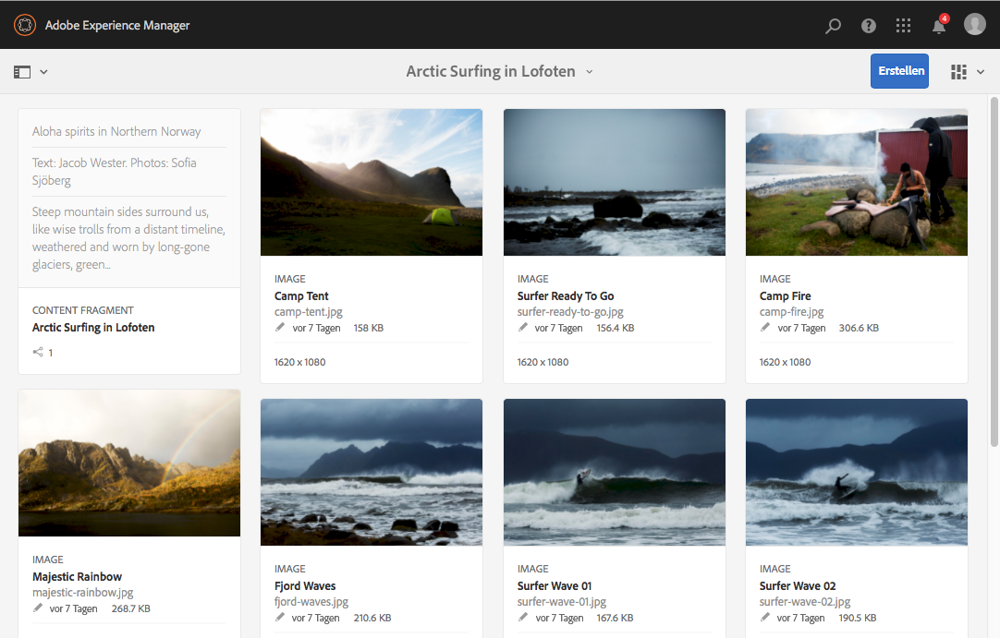
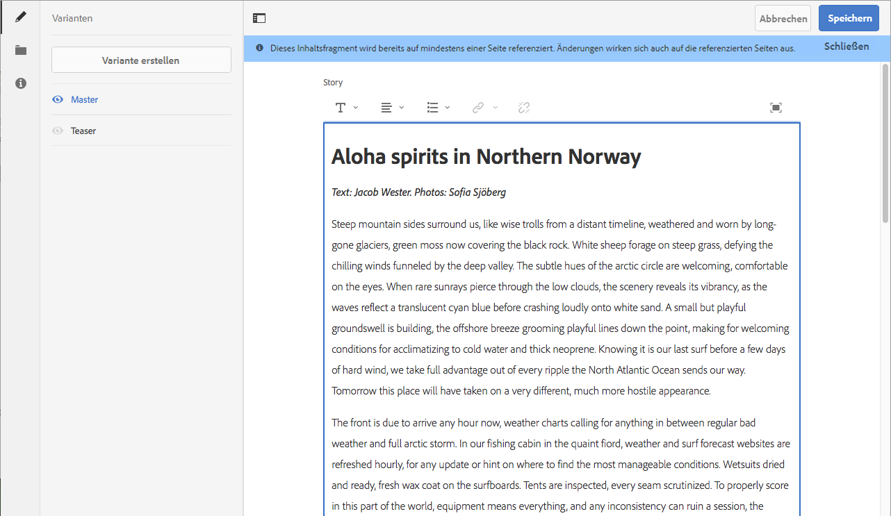
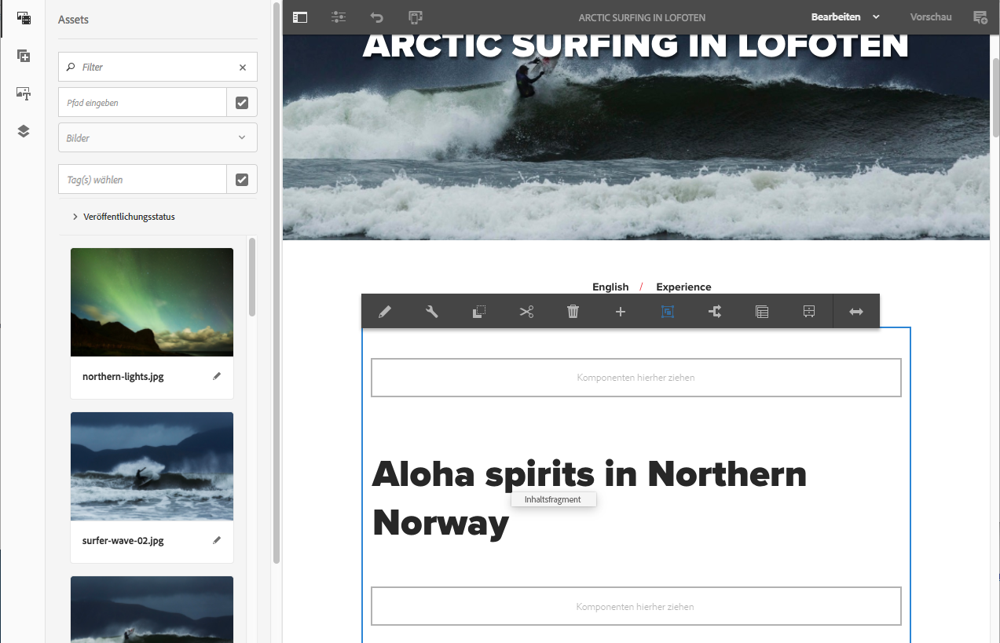

# Testen von Inhaltsfragmenten in We.Retail{#trying-out-content-fragments-in-we-retail}

Inhaltsfragmente ermöglichen es Ihnen, kanalneutrale Inhalte zusammen mit (möglicherweise kanalspezifischen) Varianten zu erstellen. **We.Retail** (in einer vorkonfigurierten Instanz von Adobe Experience Manager) stellt das Fragment **Surfen in der Arktis auf den Lofoten** als einfaches Beispiel bereit. Dies zeigt Folgendes:

* Inhaltsfragmente für Adobe Experience Manager (AEM) werden [als seitenunabhängige Assets erstellt und verwaltet](/help/assets/content-fragments/content-fragments.md). Sie ermöglichen Ihnen das Erstellen kanalneutraler Inhalte zusammen mit (möglicherweise kanalspezifischen) Variationen.

   * Siehe [Suche nach Inhaltsfragment-Assets in We.Retail](#where-to-find-content-fragments-in-we-retail).

* Sie können [diese Fragmente und ihre Varianten bei der Erstellung Ihrer Inhaltsseiten](/help/sites-authoring/content-fragments.md) verwenden.

   * Siehe [Verwendung von Inhaltsfragmenten in We.Retail](#where-content-fragments-are-used-in-we-retail).

Die vollständige Dokumentation zum Erstellen, Verwalten, Nutzen und Entwickeln von Inhaltsfragmenten:

* Siehe [Weitere Informationen](#further-information).

>[!NOTE]
>
>**Inhaltsfragmente** und **[Experience Fragments](/help/sites-authoring/experience-fragments.md)** sind unterschiedliche Funktionen in AEM:
>
>* **Inhaltsfragmente** sind redaktionelle Inhalte, in erster Linie Text und zugehörige Bilder. Sie sind reine Inhalte ohne Design und Layout.
>* **Experience Fragments** sind vollständig gestaltete Inhalte und stellen Teile von Web-Seiten dar.
>
>Experience Fragments können Inhalte in Form von Inhaltsfragmenten enthalten, aber nicht umgekehrt.

## Suche nach Inhaltsfragment-Assets in We.Retail {#where-to-find-content-fragments-in-we-retail}

Es gibt mehrere Beispielinhaltsfragmente in We.Retail. Navigieren Sie zu **Assets** > **Dateien** > **We.Retail** > **Deutsch** > **Erlebnisse**.

Diese enthalten **Surfen in der Arktis auf den Lofoten**, ein Fragment mit den zugehörigen visuellen Assets:

* Navigieren Sie über **Assets**, **Dateien**, **We.Retail**, **English**, **Experiences**, **Arctic Surfing in Lofoten**:

   * [http://localhost:4502/assets.html/content/dam/we-retail/en/experiences/arctic-surfing-in-lofoten](http://localhost:4502/assets.html/content/dam/we-retail/en/experiences/arctic-surfing-in-lofoten ) 

Sie können das Fragment **Surfen in der Arktis auf den Lofoten** auswählen und bearbeiten:

* [http://localhost:4502/editor.html/content/dam/we-retail/en/experiences/arctic-surfing-in-lofoten/arctic-surfing-in-lofoten](http://localhost:4502/editor.html/content/dam/we-retail/en/experiences/arctic-surfing-in-lofoten/arctic-surfing-in-lofoten)

Hier können Sie Ihr Fragment mithilfe der Registerkarten (linkes Bedienfeld) [bearbeiten und verwalten](/help/assets/content-fragments/content-fragments.md):

<!--  ASSET does not exist-->

* **[Variationen](/help/assets/content-fragments/content-fragments-variations.md)** einschließlich [Markdown](/help/assets/content-fragments/content-fragments-markdown.md)
* **[Zugehörige Inhalte](/help/assets/content-fragments/content-fragments-assoc-content.md)**
* **[Metadaten](/help/assets/content-fragments/content-fragments-metadata.md)**

## Verwendung von Inhaltsfragmenten in We.Retail {#where-content-fragments-are-used-in-we-retail}

Um die [Seitenerstellung mit einem Inhaltsfragment](/help/sites-authoring/content-fragments.md) zu illustrieren, werden mehrere Beispielseiten bereitgestellt, z. B.:

* [http://localhost:4502/sites.html/content/we-retail/language-masters/en/experience](http://localhost:4502/sites.html/content/we-retail/language-masters/en/experience)

Beispiel: Auf das Inhaltsfragment **Surfen in der Arktis auf den Lofoten** wird auf der Sites-Seite verwiesen:

* Navigieren Sie zu **Sites** > **We.Retail** > **Sprach-Master** > **Deutsch** > **Erlebnisse**. Öffnen Sie dann **Surfen in der Arktis auf den Lofoten** zur Bearbeitung:

   * [http://localhost:4502/editor.html/content/we-retail/language-masters/en/experience/arctic-surfing-in-lofoten.html](http://localhost:4502/editor.html/content/we-retail/language-masters/en/experience/arctic-surfing-in-lofoten.html)

## Weiterführende Informationen {#further-information}

Weitere Informationen finden Sie unter:

* [Arbeiten mit Inhaltsfragmenten](/help/assets/content-fragments/content-fragments.md)

   * Hier erfahren Sie, wie Sie Ihre Inhaltsfragment-Assets erstellen, bearbeiten und verwalten.

* [Seitenbearbeitung mit Inhaltsfragmenten](/help/sites-authoring/content-fragments.md)

   * Verwenden Sie Ihr Inhaltsfragment beim Erstellen einer Seite.

* [Entwickeln von AEM-Komponenten für Inhaltsfragmente](/help/sites-developing/components-content-fragments.md)

   * Ein Überblick über die Komponenten für Inhaltsfragmente.

* [Entwickeln und Erweitern von Inhaltsfragmenten](/help/sites-developing/customizing-content-fragments.md)

   * Informationen, mit deren Hilfe Sie Inhaltsfragmente entwickeln und erweitern können.
