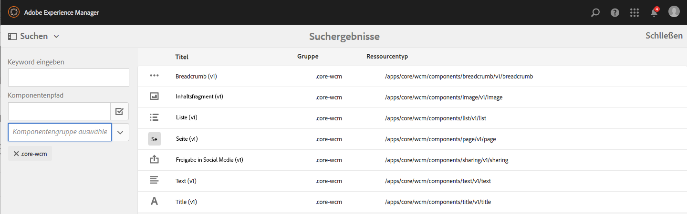
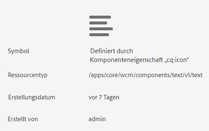
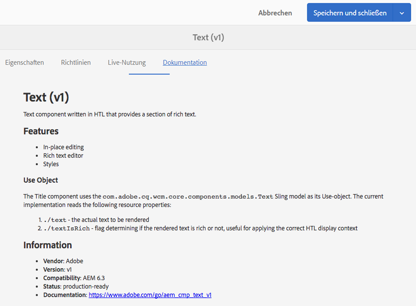
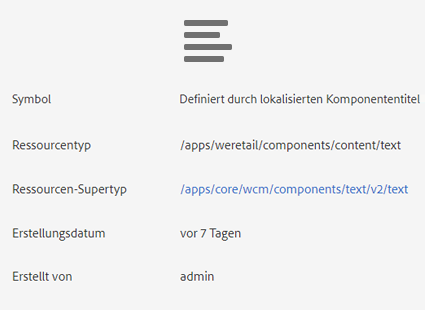
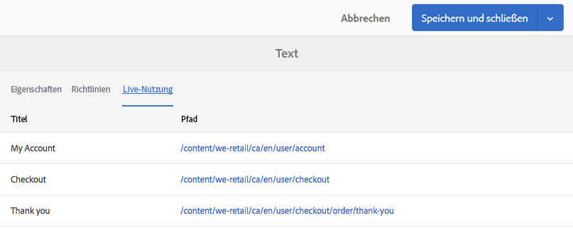
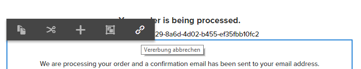
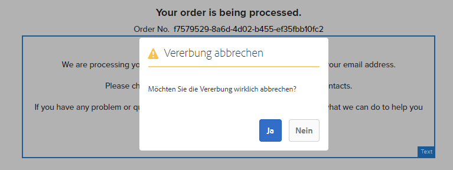
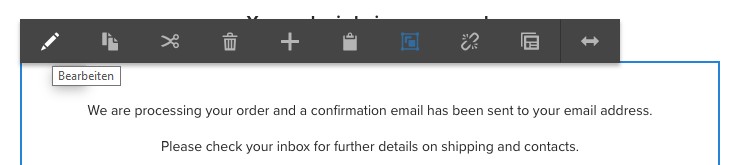
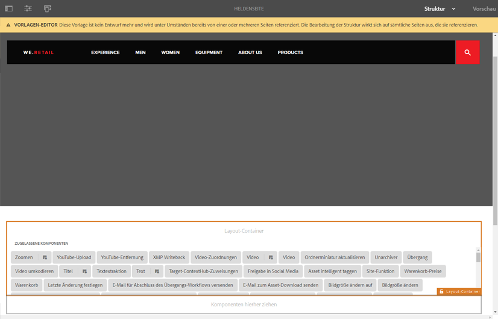
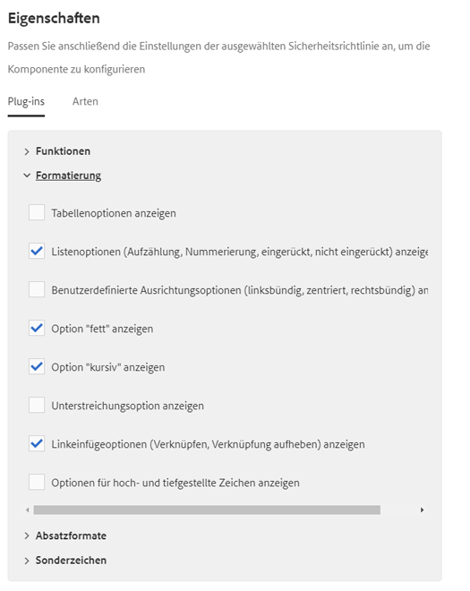

# Testen von Kernkomponenten in We.Retail{#trying-out-core-components-in-we-retail}

Die Kernkomponenten sind moderne, flexible Komponenten, die sich problemlos erweitern und in Ihre Projekte integrieren lassen. Sie basieren auf mehreren wichtigen Designprinzipien wie HTL, unmittelbarer Nutzbarkeit, Konfigurierbarkeit, Versionierung und Erweiterbarkeit. We.Retail baut auf Kernkomponenten auf.

## Testen {#trying-it-out}

1. Starten Sie AEM mit den We.Retail-Beispielinhalten und öffnen Sie die [Komponentenkonsole](/help/sites-authoring/default-components-console.md).

   **Globale Navigation > Tools > Komponenten**

1. Wenn Sie die Leiste in der Komponentenkonsole öffnen, können Sie nach einer bestimmten Komponentengruppe filtern. Die Kernkomponenten befinden sich an den folgenden Stellen:

   * `.core-wcm`: Die Standardkernkomponenten
   * `.core-wcm-form`: Die Kernkomponenten für die Formularübermittlung

   Choose `.core-wcm`.

   

1. Beachten Sie, dass alle Kernkomponenten mit **v1** benannt sind, was bedeutet, dass dies die erste Version dieser Kernkomponente ist. Künftig werden regelmäßig Versionen veröffentlicht, die mit AEM kompatibel sind und ein einfaches Upgrade ermöglichen, sodass Sie die neuesten Funktionen nutzen können.
1. Klicken Sie auf **Text (v1)**.

   Beachten Sie, dass der **Ressourcentyp** der Komponente `/apps/core/wcm/components/text/v1/text` ist. Kernkomponenten befinden sich unter `/apps/core/wcm/components` und sind pro Komponente versioniert.

   

1. Klicken Sie auf die Registerkarte **Dokumentation**, um die Entwicklerdokumentation für die Komponente anzuzeigen.

   

1. Wechseln Sie zur Komponentenkonsole zurück. Filtern Sie nach der Gruppe **We.Retail** und wählen Sie die **Textkomponente** aus.
1. Beachten Sie, dass der **Ressourcentyp** auf eine Komponente verweist, wie unter `/apps/weretail` erwartet, aber der **Resource Super Type** auf die Core-Komponente `/apps/core/wcm/components/text/v1/text` verweist.

   

1. Klicken Sie auf die Registerkarte **Live Usage**, um zu sehen, auf welchen Seiten diese Komponente derzeit verwendet wird. Klicken Sie auf die erste **Dankeseite**, um die Seite zu bearbeiten.

   

1. Wählen Sie auf der Dankeseite die Textkomponente aus und klicken Sie im Bearbeitungsmenü der Komponente auf das Symbol zum Aufheben der Vererbung.

   [We.Retail weist eine globalisierte Site-Struktur auf](/help/sites-developing/we-retail-globalized-site-structure.md), in der Inhalte von Sprach-Mastern per Push ](/help/sites-administering/msm.md)durch einen Mechanismus, der als Vererbung bezeichnet wird, an Live Copies übertragen werden[. Aus diesem Grund muss die Vererbung abgebrochen werden, damit Benutzer den Text manuell bearbeiten können.

   

1. Bestätigen Sie den Abbruch, indem Sie auf **Ja** klicken.

   

1. Wenn die Vererbung abgebrochen ist und Sie die Textkomponenten auswählen, stehen Ihnen viele weitere Optionen zur Verfügung. Klicken Sie auf** Bearbeiten**.

   

1. Sie können nun sehen, welche Bearbeitungsmöglichkeiten für die Textkomponente zur Verfügung stehen.

   

1. Wählen Sie aus dem Menü **Seiteninformationen** die Option **Vorlage bearbeiten** aus.
1. Klicken Sie im Vorlagen-Editor der Seite auf das Richtlinien-Symbol **** der Textkomponente im **Layout-Container** der Seite.

   

1. Die Kernkomponenten ermöglichen es Vorlagenautoren zu konfigurieren, welche Eigenschaften für Seitenautoren zur Verfügung stehen. Dazu zählen Funktionen wie zulässige Einfügequellen, Formatierungsoptionen und verfügbare Absatzformate.

   Derartige Designdialogfelder sind für viele Kernkomponenten verfügbar und sind eng mit dem Vorlagen-Editor verzahnt. Sobald diese aktiviert sind, stehen sie den Autoren über die Komponenten-Editoren zur Verfügung.

   

## Weiterführende Informationen {#further-information}

Weitere Informationen zu den Kernkomponenten finden Sie im Dokument [Kernkomponenten](https://docs.adobe.com/content/help/de-DE/experience-manager-core-components/using/introduction.html) für Autoren. Dies enthält einen Überblick über die Kernkomponenten. Im Dokument [Entwickeln von Kernkomponenten](https://helpx.adobe.com/experience-manager/core-components/using/developing.html) für Entwickler finden Sie einen technischen Überblick.

Sie können sich darüber hinaus eingehender mit [bearbeitbaren Vorlagen](/help/sites-developing/we-retail-editable-templates.md) befassen. Ausführliche Informationen zu bearbeitbaren Vorlagen finden Sie im Authoring-Dokument [Erstellen von Seitenvorlagen](/help/sites-authoring/templates.md) oder auf der Developer Dokument-Seite [Templates - Editable](/help/sites-developing/page-templates-editable.md).
