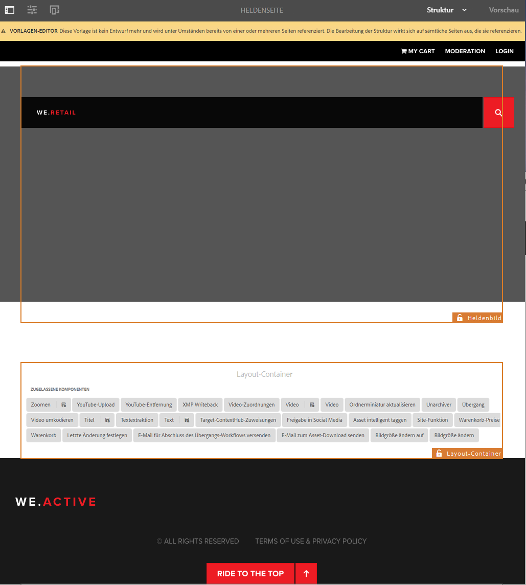
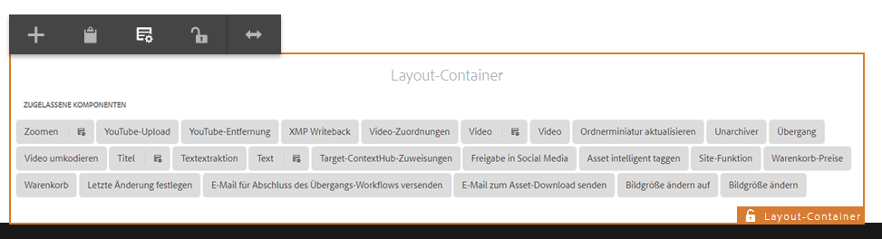
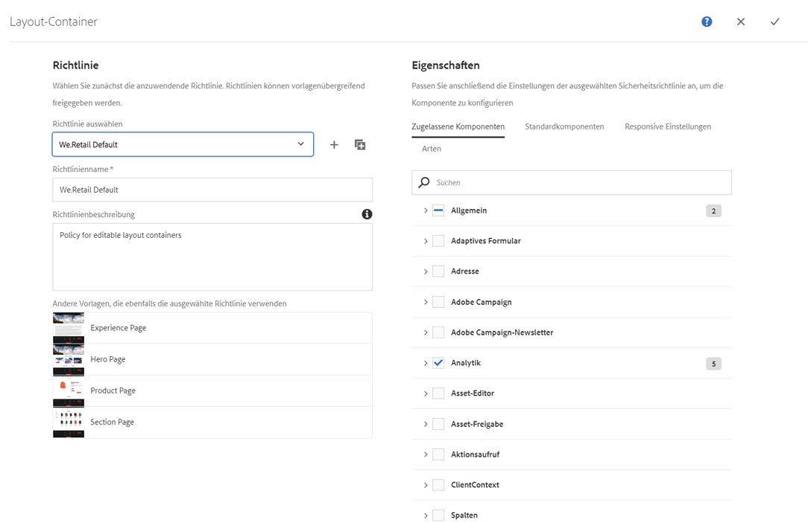
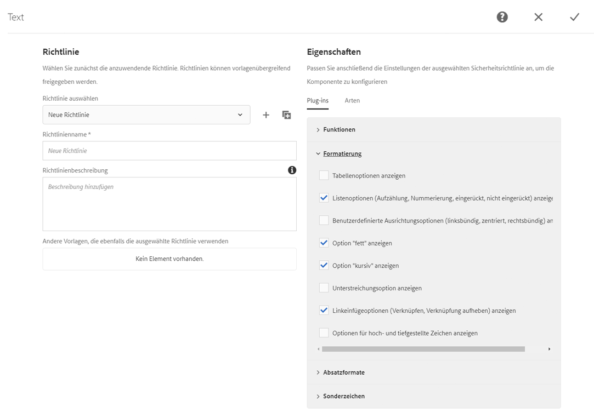

# Testen bearbeitbarer Vorlagen in We.Retail{#trying-out-editable-templates-in-we-retail}

Mit den bearbeitbaren Vorlagen ist das Erstellen und Verwalten von Vorlagen nicht mehr nur eine Aufgabe für Entwickler. Ein erfahrener Benutzer, ein so genannter Vorlagenautor, kann nun Vorlagen erstellen. Entwickler müssen weiterhin die Umgebung einrichten, Clientbibliotheken erstellen und die zu verwendenden Komponenten erstellen. Sobald diese Grundlagen vorhanden sind, hat der Vorlagenautor jedoch die Flexibilität, Vorlagen ohne Entwicklungsprojekt zu erstellen und zu konfigurieren.

Alle Seiten in We.Retail basieren auf bearbeitbaren Vorlagen, sodass Nicht-Entwickler die Vorlagen anpassen und anpassen können.

## Testen {#trying-it-out}

1. Bearbeiten Sie die Seite &quot;Ausrüstung&quot;der Sprach-Master-Verzweigung.

   http://localhost:4502/editor.html/content/we-retail/language-masters/en/equipment.html

1. Beachten Sie, dass die Modusauswahl keinen Designmodus mehr bietet. Alle Seiten für We.Retail basieren auf bearbeitbaren Vorlagen. Um das Design bearbeitbarer Vorlagen zu ändern, müssen sie im Vorlageneditor bearbeitet werden.
1. Wählen Sie aus dem Menü **Seiteninformationen** die Option **Vorlage bearbeiten** aus.
1. Sie bearbeiten jetzt die Vorlage Hero Page .

   Im Strukturmodus der Seite können Sie die Struktur der Vorlage ändern. Dazu gehören beispielsweise die Komponenten, die im Layout-Container zulässig sind.

   

1. Konfigurieren Sie die Richtlinien für den Layout-Container, um zu definieren, welche Komponenten im Container zulässig sind.

   Richtlinien entsprechen Designkonfigurationen.

   

1. Im Dialogfeld &quot;Design&quot;des Layout-Containers können Sie

   * Wählen Sie eine vorhandene Richtlinie aus oder erstellen Sie eine neue Richtlinie für den Container
   * Auswählen, welche Komponenten im Container zulässig sind
   * Definieren Sie die Standardkomponenten, die platziert werden sollen, wenn ein Asset in den Container gezogen wird

   

1. Im Vorlageneditor können Sie die Richtlinie der Textkomponente im Layout-Container bearbeiten.

   Damit können Sie:

   * Wählen Sie eine vorhandene Richtlinie aus oder erstellen Sie eine neue Richtlinie für den Container
   * Definieren Sie die Funktionen, die dem Seitenautor bei Verwendung dieser Komponente zur Verfügung stehen, z. B.

      * Zulässige Einfügequellen
      * Formatierungsoptionen
      * Zulässige Absatzstile
      * Zulässige Sonderzeichen

   Viele Komponenten, die auf den Kernkomponenten basieren, ermöglichen die Konfiguration von Optionen auf Komponentenebene über die bearbeitbaren Vorlagen, sodass Entwickler keine Anpassungen mehr vornehmen müssen.

   

1. Im Vorlageneditor können Sie mit der Modusauswahl zu **Anfänglicher Inhalt** -Modus, um festzulegen, welcher Inhalt auf der Seite erforderlich ist.

   **Layout** -Modus verwendet werden, da er sich auf einer normalen Seite befindet, um das Layout für die Vorlage zu definieren.

## Weitere Informationen {#more-information}

Umfassende technische Informationen zu bearbeitbaren Vorlagen finden Sie im Dokument [Erstellen von Seitenvorlagen](/help/sites-authoring/templates.md) für Autoren oder im Dokument [Bearbeitbare Seitenvorlagen](/help/sites-developing/page-templates-editable.md) für Entwickler.

Sie können sich darüber hinaus eingehender mit [Kernkomponenten](/help/sites-developing/we-retail-core-components.md) befassen. Im Dokument [Kernkomponenten](https://experienceleague.adobe.com/docs/experience-manager-core-components/using/introduction.html?lang=de) für Autoren finden Sie einen Überblick über die Kernkomponenten. Im Dokument [Dokumentation zur Entwicklung der Kernkomponenten](https://helpx.adobe.com/de/experience-manager/core-components/using/developing.html) für Entwickler finden Sie einen technischen Überblick.
