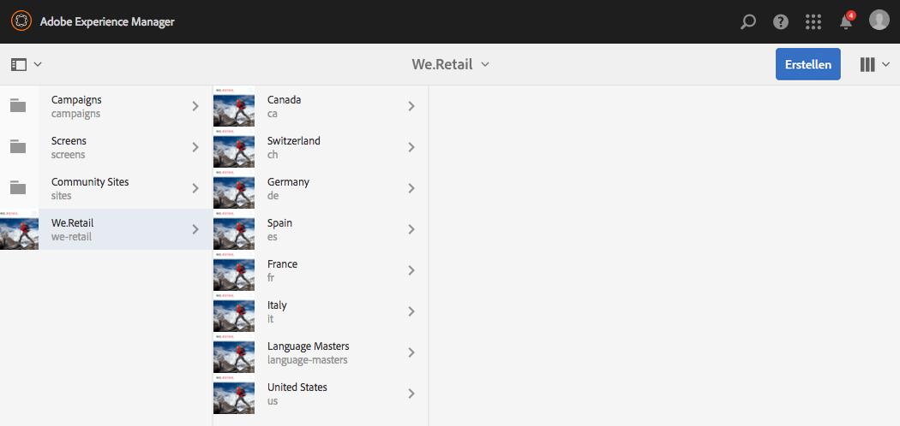
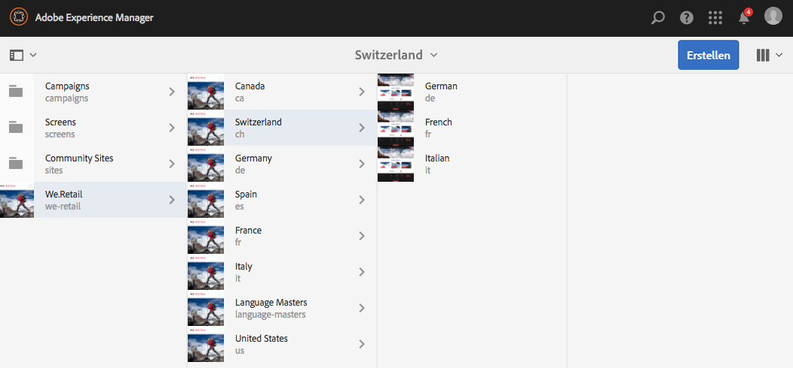
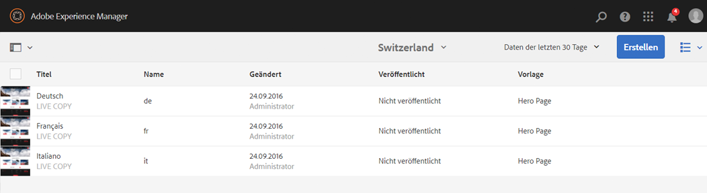
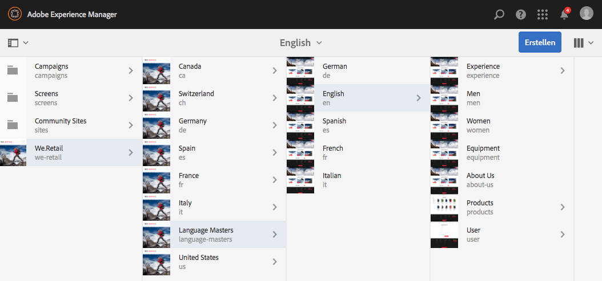
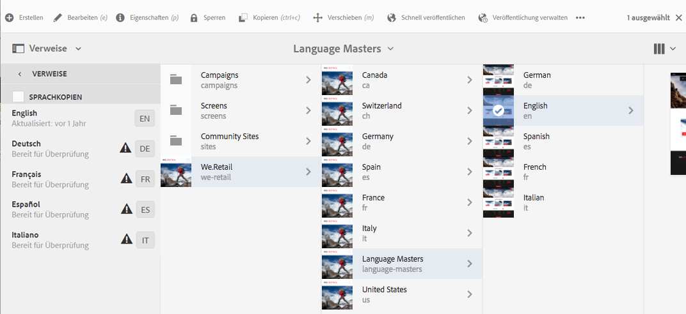
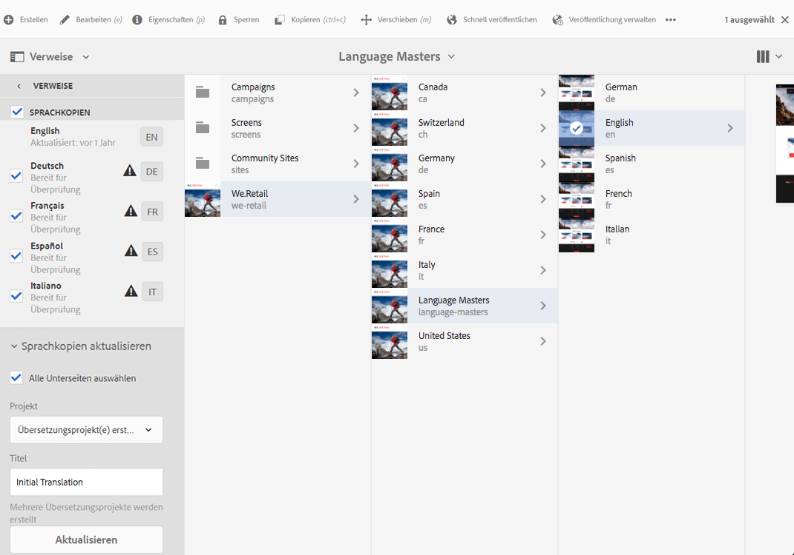
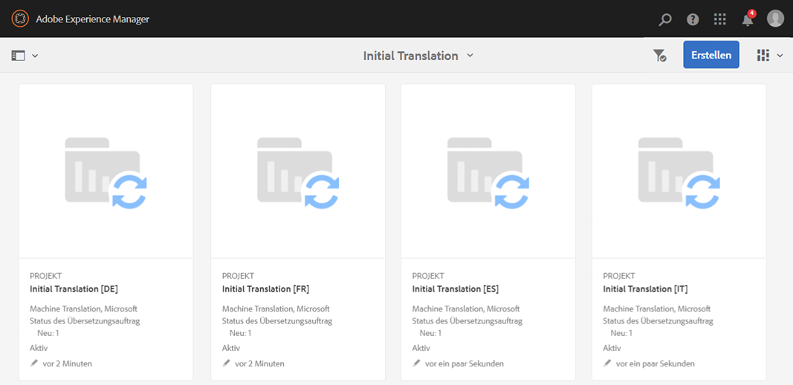
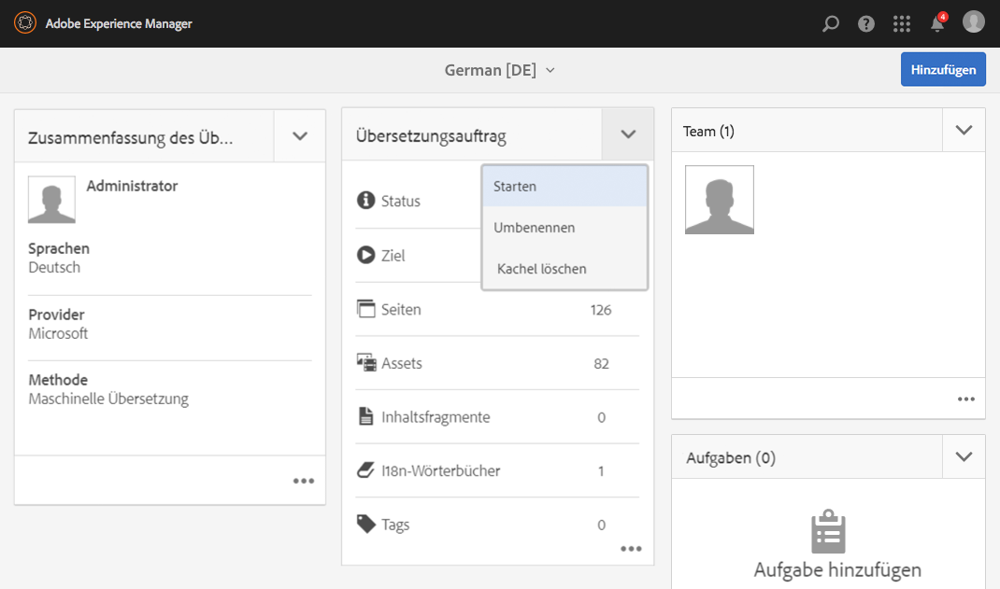
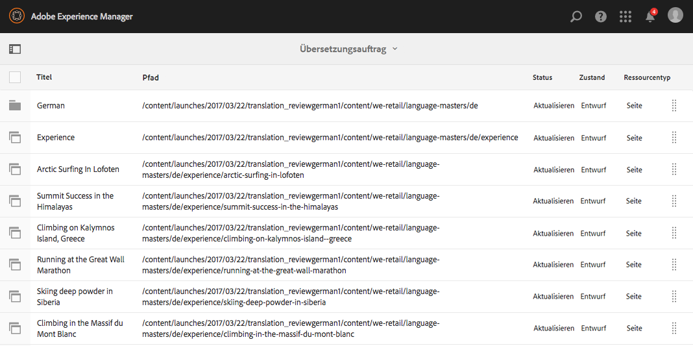
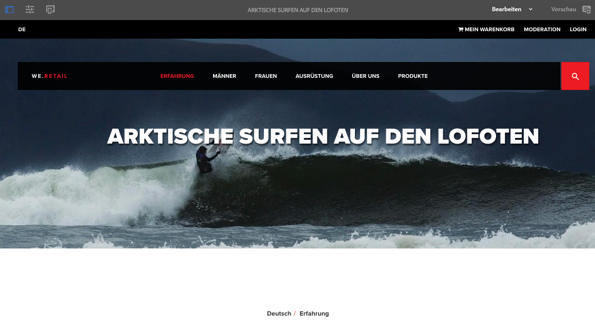

# Testen der globalisierten Site-Struktur von We.Retail{#trying-out-the-globalized-site-structure-in-we-retail}

We.Retail verfügt über eine globalisierte Site-Struktur, die Sprach-Master aufweist, die live in länderspezifische Websites kopiert werden können. Alles ist standardmäßig eingerichtet, sodass Sie mit dieser Struktur und den integrierten Übersetzungsfunktionen experimentieren können.

## Testen {#trying-it-out}

1. Öffnen Sie die Sites-Konsole unter **Globale Navigation > Sites**.
1. Wechseln Sie zur Spaltenansicht (falls diese nicht bereits aktiviert ist) und wählen Sie „We.Retail“ aus. Beachten Sie die Beispiellandstruktur mit der Schweiz, den Vereinigten Staaten, Frankreich usw., neben den Sprachführern.

   

1. Wählen Sie die Schweiz aus und zeigen Sie die Sprachstämme für die Sprachen des Landes an. Beachten Sie, dass unterhalb dieser Stämme keine Inhalte vorhanden sind.

   

1. Wechseln Sie in die Listenansicht, um zu sehen, dass es sich bei den Sprachkopien für die Länder um Live Copies handelt.

   

1. Kehren Sie zur Spaltenansicht zurück und klicken Sie auf den Sprach-Master, um die Sprach-Master-Stämme mit Inhalten anzuzeigen. Beachten Sie, dass nur Englisch über Inhalte verfügt.

   We.Retail verfügt nicht von vornherein über übersetzte Inhalte, aber die Struktur und die Konfiguration sind vorhanden, damit Sie die Übersetzungsdienste demonstrieren können.

   

1. Lassen Sie den englischen Sprach-Master ausgewählt, öffnen Sie die Leiste **Verweise** in der Sites-Konsole und wählen Sie **Sprachkopien** aus.

   

1. Aktivieren Sie das Kontrollkästchen neben der Bezeichnung **Sprachkopien**, um alle Sprachkopien auszuwählen. Wählen Sie auf der Leiste im Abschnitt **Sprachkopien aktualisieren** die Option **Neues Übersetzungsprojekt erstellen** aus. Geben Sie einen Namen für das Projekt ein und klicken Sie auf **Aktualisieren**.

   

1. Für jede Sprachübersetzung wird ein Projekt erstellt. Zeigen Sie sie unter **Navigation > Projekte** an.

   

1. Klicken Sie auf „Deutsch“, um die Details des Übersetzungsprojekts anzuzeigen. Beachten Sie, dass der Status **Entwurf** lautet. Klicken Sie neben der Überschrift **Übersetzungsauftrag** auf den Pfeil nach unten und wählen Sie **Starten** aus, um die Übersetzung mit dem Übersetzungsdienst von Microsoft zu beginnen.

   

1. Das Übersetzungsprojekt beginnt. Klicken Sie unten auf der Karte mit der Bezeichnung (Übersetzungsauftrag) auf das Auslassungszeichen, um die Details anzuzeigen. Seiten mit dem Status **Bereit für Überprüfung** wurden bereits vom Übersetzungsdienst übersetzt.

   

1. Wählen Sie in der Liste eine der Seiten und dann in der Symbolleiste die Option **Vorschau in Sites** aus, um die übersetzte Seite im Seiteneditor zu öffnen.

   

>[!NOTE]
>
>Dieses Verfahren hat die Integration mit der maschinellen Übersetzung von Microsoft demonstriert. Anhand des [AEM-Übersetzungsintegrations-Frameworks](/help/sites-administering/translation.md) können Sie Integrationen mit zahlreichen Standardübersetzungsdiensten vornehmen, um die Übersetzung von AEM zu organisieren.

## Weiterführende Informationen {#further-information}

Weitere Informationen finden Sie im Authoring-Dokument [Übersetzung von Inhalten für mehrsprachige Sites](/help/sites-administering/translation.md).
