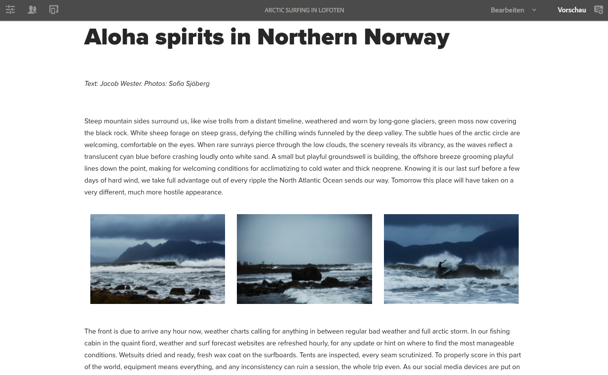
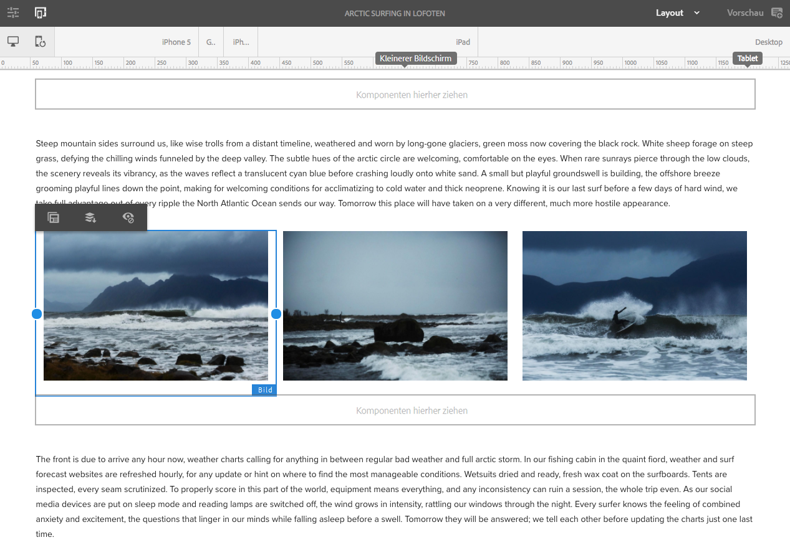
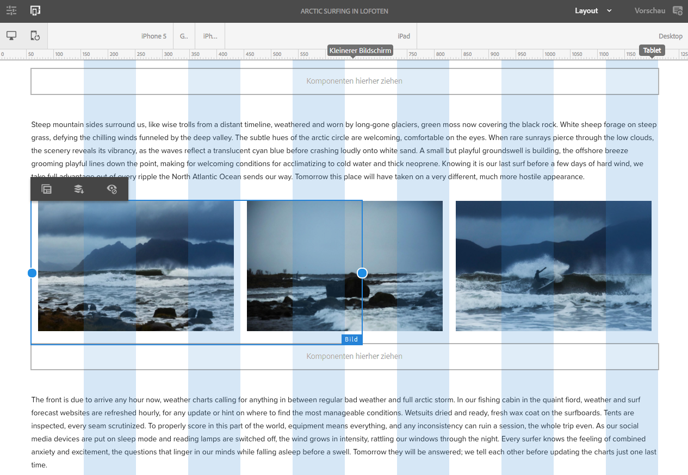

# Ausprobieren von responsivem Layout in We.Retail{#trying-out-responsive-layout-in-we-retail}

Alle Web.Retail-Seiten verwenden die Komponente Layout Container, um reaktionsfähiges Design zu implementieren. Der Layout-Container bietet ein Absatzsystem, mit dem Sie Komponenten in einem responsiven Raster positionieren können. Dieses Raster kann das Layout abhängig von der Größe des Geräts/Fensters und des Formats neu anordnen. Die Komponente wird zusammen mit dem Modus **Layout** im Seiteneditor verwendet, mit dem Sie Ihr reaktionsfähiges Layout je nach Gerät erstellen und bearbeiten können.

## Testen {#trying-it-out}

1. Bearbeiten Sie die Seite „Arctic Surfing“ im Abschnitt „Erlebnisse“ des Sprachmaster-Zweigs.

   http://localhost:4502/editor.html/content/we-retail/language-masters/en/experience/arctic-surfing-in-lofoten.html

1. Wechseln Sie zu **Vorschau**, um die Seite so anzuzeigen, wie sie für einen Besucher der Website gerendert würde. Führen Sie einen Bildlauf nach unten zum Inhalt des Artikels *Aloha-Spirituosen in Nordnorwegen*.

   

1. Ändern Sie die Größe des Browserfensters und sehen Sie zu, wie sich das Layout dynamisch an die Größenanpassung anpasst.

   

1. Wechseln Sie in den Layout-Modus. Die Emulator-Symbolleiste wird automatisch angezeigt, sodass Sie Ihr Layout für das Zielgerät planen können.

   Wenn Sie eine Komponente auswählen, werden im Bearbeitungsmenü neben den Größenänderungsgriffen für die Komponente Optionen zum Ein- und Ausblenden angezeigt.

   

1. Durch Greifen und Ziehen des Größenänderungsgriffs der Komponente wird automatisch das Layout-Raster angezeigt, um Sie bei der Größenänderung zu unterstützen.

   

## Weiterführende Informationen {#further-information}

Weitere Informationen finden Sie im Authoring-Dokument [Responsive Layout](/help/sites-authoring/responsive-layout.md) oder im Administrator-Dokument [Konfigurieren des Layout-Containers und des Layoutmodus](/help/sites-administering/configuring-responsive-layout.md).
