# Verwenden und Erweitern von Widgets (klassische Benutzeroberfläche){#using-and-extending-widgets-classic-ui}

>[!NOTE]
>
>Auf dieser Seite wird die Verwendung von Widgets innerhalb der klassischen Benutzeroberfläche beschrieben, die in AEM 6.4 nicht mehr unterstützt wird.
>
>Adobe empfiehlt, die moderne [Touch-optimierte Benutzeroberfläche](/help/sites-developing/touch-ui-concepts.md) zu verwenden, die auf [Coral-Benutzeroberfläche](/help/sites-developing/touch-ui-concepts.md#coral-ui) und [Granite-Benutzeroberfläche](/help/sites-developing/touch-ui-concepts.md#granite-ui-foundation-components) basiert.

Die webbasierte Oberfläche von Adobe Experience Manager nutzt AJAX und andere moderne Browsertechnologien, um WYSIWYG-Bearbeitung und -Formatierung von Inhalten durch Autoren direkt auf der Webseite zu ermöglichen.

Adobe Experience Manager (AEM) verwendet die [ExtJS](https://www.sencha.com/)-Widgetbibliothek, die die besonders ausgereiften Benutzeroberflächenelemente bereitstellt, die in allen wichtigen Browsern funktionieren und die Erstellung von Benutzeroberflächen in Desktopqualität ermöglichen.

Diese Widgets sind in AEM enthalten und können nicht nur von AEM, sondern auch von jeder mit AEM erstellten Website verwendet werden.

Eine vollständige Übersicht aller verfügbaren Widgets in AEM finden Sie in der [Widget-API-Dokumentation](https://helpx.adobe.com/de/experience-manager/6-5/sites/developing/using/reference-materials/widgets-api/index.html) oder der [Liste der bestehenden X-Typen](/help/sites-developing/xtypes.md). Darüber hinaus zeigen zahlreiche Beispiele auf der Website von [Sencha](https://www.sencha.com/products/extjs/examples/), dem Eigentümer des Frameworks, wie das ExtJS-Framework zu verwenden ist.

Auf dieser Seite erhalten Sie einige Einblicke in die Verwendung und Erweiterung von Widgets. Zuerst wird beschrieben, wie [clientseitiger Code in eine Seite eingefügt wird](#including-the-client-sided-code-in-a-page). Dann werden einige Beispielkomponenten beschrieben, die erstellt wurden, um einige grundlegende Anwendungs- und Erweiterungsfälle zu illustrieren. Diese Komponenten stehen als das Paket **Using ExtJS Widgets** auf **Package Share** zur Verfügung.

Das Paket enthält Beispiele für:

* [Grundlegende Dialogfelder](#basic-dialogs), die mit vordefinierten Widgets erstellt wurden.
* [Dynamische Dialogfelder](#dynamic-dialogs), die mit vordefinierten Widgets und benutzerdefinierter JavaScript-Logik konfiguriert wurden.
* Dialogfelder, die auf [benutzerdefinierten Widgets](#custom-widgets) basieren.
* Ein [Baumstrukturbedienfeld](#tree-overview), das eine JCR-Baumstruktur unterhalb eines bestimmten Pfades anzeigt.
* Ein [Rasterbedienfeld](#grid-overview), das Daten im Tabellenformat anzeigt.

>[!NOTE]
>
>Die klassische Benutzeroberfläche von Adobe Experience Manager baut auf [ExtJS 3.4.0](https://extjs.cachefly.net/ext-3.4.0/docs/) auf.

## Einbauen von clientseitigem Code in eine Seite {#including-the-client-sided-code-in-a-page}

Client-seitiger JavaScript- und Stylesheet-Code sollte in einer Client-Bibliothek platziert werden.

Erstellen Sie eine Client-Bibliothek wie folgt:

1. Erstellen Sie einen Knoten unter `/apps/<project>` mit den folgenden Eigenschaften:

   * name=&quot;clientlib&quot;
   * jcr:mixinTypes=&quot;[mix:lockable]&quot;
   * jcr:primaryType=&quot;cq:ClientLibraryFolder&quot;
   * sling:resourceType=&quot;widgets/clientlib&quot;
   * categories=&quot;[&lt;category-name>]&quot;
   * dependencies=&quot;[cq.widgets]&quot;

   `Note: <category-name> is the name of the custom library (e.g. "cq.extjstraining") and is used to include the library on the page.`

1. Erstellen Sie unter `clientlib` die Ordner `css` und `js` (nt:folder).

1. Erstellen Sie unter `clientlib` die Dateien `css.txt` und `js.txt` (nt:files). Diese TXT-Dateien listen die Dateien auf, die in der Bibliothek enthalten sind.

1. Bearbeiten Sie `js.txt`: Sie muss mit &quot;`#base=js`&quot;beginnen, gefolgt von der Liste der Dateien, die vom CQ-Client-Bibliotheksdienst aggregiert werden, z. B.:

   ```
   #base=js
    components.js
    exercises.js
    CustomWidget.js
    CustomBrowseField.js
    InsertTextPlugin.js
   ```

1. Bearbeiten Sie `css.txt`: Sie muss mit &quot;`#base=css`&quot;beginnen, gefolgt von der Liste der Dateien, die vom CQ-Client-Bibliotheksdienst aggregiert werden, z. B.:

   ```
   #base=css
    components.css
   ```

1. Platzieren Sie die JavaScript-Dateien, die der Bibliothek angehören, unterhalb des Ordners `js`.

1. Platzieren Sie unter dem Ordner `css` die `.css`-Dateien und die Ressourcen, die von den CSS-Dateien verwendet werden (z. B. `my_icon.png`).

>[!NOTE]
>
>Die oben beschriebene Verarbeitung von Stylesheets ist optional.

Fügen Sie die Client-Bibliothek wie folgt in die Seitenkomponenten-JSP ein:

* um sowohl JavaScript-Code als auch Stylesheets einzuschließen:
   `<ui:includeClientLib categories="<category-name1>, <category-name2>, ..."/>`
wohin gehört 
`<category-nameX>` ist der Name der clientseitigen Bibliothek.

* nur JavaScript-Code einschließen:
   `<ui:includeClientLib js="<category-name>"/>`

Weitere Informationen finden Sie in der Beschreibung des Tags [&lt;ui:includeClientLib>](/help/sites-developing/taglib.md#lt-ui-includeclientlib).

In manchen Fällen darf eine Client-Bibliothek nur im Autorenmodus verfügbar sein und muss im Veröffentlichungsmodus ausgeschlossen werden. Dies erreichen Sie wie folgt:

```xml
    if (WCMMode.fromRequest(request) != WCMMode.DISABLED) {
        %><ui:includeClientLib categories="cq.collab.blog"/><%
    }
```

### Erste Schritte mit den Beispielen  {#getting-started-with-the-samples}

Um den Tutorials auf dieser Seite zu folgen, installieren Sie das Paket **Using ExtJS Widgets** in einer lokalen AEM-Instanz und erstellen Sie eine Beispielseite, auf der die Komponenten enthalten sein werden. Gehen Sie dazu wie folgt vor:

1. Laden Sie in Ihrer AEM-Instanz das Paket **Using ExtJS Widgets (v01)** von Package Share herunter und installieren Sie das Paket. Es wird das Projekt `extjstraining` unter `/apps` im Repository erstellt.
1. Schließen Sie die Client-Bibliothek, die die Skripte (js) und das Stylesheet (css) enthält, in das Head-Tag der Geometrixx-Seiten-JSP ein, da Sie die Beispielkomponenten auf einer neuen Seite der Verzweigung **Geometrixx** einfügen werden:
Öffnen Sie in **CRXDE Lite** die Datei `/apps/geometrixx/components/page/headlibs.jsp` und fügen Sie die Kategorie `cq.extjstraining` wie folgt zum vorhandenen Tag `<ui:includeClientLib>` hinzu:
   `%><ui:includeClientLib categories="apps.geometrixx-main, cq.extjstraining"/><%`
1. Erstellen Sie eine neue Seite in der Verzweigung **Geometrixx** unter `/content/geometrixx/en/products` und rufen Sie sie **Verwenden von ExtJS Widgets** auf.
1. Wechseln Sie in den Designmodus und fügen Sie alle Komponenten der Gruppe **Using ExtJS Widgets** dem Design von Geometrixx hinzu.
1. Gehen Sie im Bearbeitungsmodus zurück: Die Komponenten der Gruppe **Using ExtJS Widgets** sind im Sidekick verfügbar.

>[!NOTE]
>
>Die Beispiele auf dieser Seite basieren auf dem Geometrixx-Beispielinhalt, der nicht mehr im Lieferumfang von AEM enthalten ist, da er durch We.Retail ersetzt wurde. Informationen zum Herunterladen und Installieren von Geometrixx finden Sie im Dokument [We.Retail Reference Implementation](/help/sites-developing/we-retail.md#we-retail-geometrixx) .

### Grundlegende Dialogfelder {#basic-dialogs}

Dialogfelder werden in der Regel verwendet, um Inhalte zu bearbeiten, aber auch nur zum Anzeigen von Informationen. Eine einfache Möglichkeit zum Anzeigen eines vollständigen Dialogfelds besteht darin, auf seine Darstellung im JSON-Format zuzugreifen. Verweisen Sie dazu Ihren Browser auf:

`https://localhost:4502/<path-to-dialog>.-1.json`

Die erste Komponente der Gruppe **Using ExtJS Widgets** im Sidekick wird mit **1. Dialog Basics** bezeichnet und umfasst vier grundlegende Dialogfelder, die mit standardmäßigen Widgets und ohne modifizierte JavaScript-Logik erstellt wurden. Die Dialogfelder werden unter `/apps/extjstraining/components/dialogbasics` gespeichert. Die grundlegenden Dialogfelder sind:

* das Dialogfeld „“ (Knoten `full`full): Es zeigt ein Fenster mit drei Registerkarten mit jeweils zwei Textfeldern an.
* das Dialogfeld „Single Panel“ (Knoten `singlepanel`): Es zeigt ein Fenster mit einer Registerkarte mit zwei Textfeldern an.
* das Dialogfeld „Multi Panel“ (Knoten `multipanel`): Es zeigt dasselbe an wie das Dialogfeld „Full“, ist aber anders aufgebaut.
* das Dialogfeld „“ (Knoten `design`design): Es zeigt ein Fenster mit zwei Registerkarten an. Die erste Registerkarte weist ein Textfeld auf, ein Dropdown-Menü und einen ausblendbaren Textbereich. Die zweite Registerkarte verfügt über einen Feldsatz mit vier Textfeldern und einen ausblendbaren Feldsatz mit zwei Textfeldern.

Fügen Sie die Komponente **1. Dialog Basics** der Beispielseite hinzu:

1. Fügen Sie die Komponente **1. Dialog Basics** zur Beispielseite aus der Registerkarte **Using ExtJS Widgets** im Tab **Sidekick** hinzu.
1. Die Komponente zeigt einen Titel, etwas Text und einen Link **EIGENSCHAFTEN**: Klicken Sie auf den Link, um die Eigenschaften des im Repository gespeicherten Absatzes anzuzeigen. Klicken Sie erneut auf den Link, um die Eigenschaften zu verbergen.

Die Komponente wird wie im Folgenden dargestellt:


#### Beispiel 1: Dialogfeld „Full“{#example-full-dialog}

Das Dialogfeld **Full** zeigt ein Fenster mit drei Registerkarten mit jeweils zwei Textfeldern. Es ist das Standarddialogfeld der Komponente **Dialog Basics**. Die Eigenschaften sind:

* Wird durch einen Knoten definiert: node type = `cq:Dialog`, xtype = ` [dialog](/help/sites-developing/xtypes.md#dialog)`.
* Zeigt drei Registerkarten an (Knotentyp = `cq:Panel`).
* Jede Registerkarte verfügt über zwei Textfelder (node type = `cq:Widget`, xtype = ` [textfield](/help/sites-developing/xtypes.md#textfield)`).
* Wird durch den Knoten definiert:
   `/apps/extjstraining/components/dialogbasics/full`
* Wird im JSON-Format gerendert, indem Folgendes angefordert wird:
   `https://localhost:4502/apps/extjstraining/components/dialogbasics/full.-1.json`

Das Dialogfeld wird wie im Folgenden dargestellt:


#### Beispiel 2: Dialogfeld „Single Panel“{#example-single-panel-dialog}

Das Dialogfeld **Single Panel** zeigt ein Fenster mit einer Registerkarte und zwei Textfeldern an. Die Eigenschaften sind:

* Zeigt eine Registerkarte an (node type = `cq:Dialog`, xtype = ` [panel](/help/sites-developing/xtypes.md#panel)`)
* Die Registerkarte verfügt über zwei Textfelder (node type = `cq:Widget`, xtype = ` [textfield](/help/sites-developing/xtypes.md#textfield)`).
* Wird durch den Knoten definiert:
   `/apps/extjstraining/components/dialogbasics/singlepanel`
* Wird im JSON-Format gerendert, indem Folgendes angefordert wird:
   `https://localhost:4502/apps/extjstraining/components/dialogbasics/singlepanel.-1.json`
* Ein Vorteil gegenüber dem Dialogfeld **Full** besteht darin, dass weniger Konfiguration erforderlich ist.
* Empfohlene Verwendung: für einfache Dialogfelder, die Informationen anzeigen oder nur wenige Felder aufweisen.

So verwenden Sie das Dialogfeld „Single Panel“:

1. Ersetzen Sie das Dialogfeld der Komponente **Dialog Basics** durch das Dialogfeld **Single Panel**:
   1. Löschen Sie in **CRXDE Lite** den Knoten: `/apps/extjstraining/components/dialogbasics/dialog`
   1. Klicken Sie auf **Alle speichern**, um die Änderungen zu speichern.
   1. Kopieren Sie den Knoten: `/apps/extjstraining/components/dialogbasics/singlepanel`
   1. Fügen Sie den kopierten Knoten unter ein: `/apps/extjstraining/components/dialogbasics`
   1. Wählen Sie den Knoten aus: `/apps/extjstraining/components/dialogbasics/Copy of singlepanel`und benennen Sie sie `dialog` um.
1. Bearbeiten Sie die Komponente: Das Dialogfeld wird wie im Folgenden dargestellt:

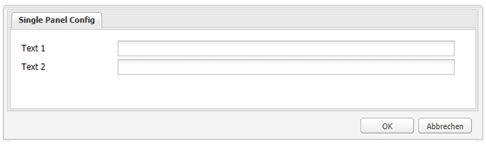

#### Beispiel 3: Dialogfeld „Multi Panel“{#example-multi-panel-dialog}

Das Dialogfeld **Multi Panel** zeigt dasselbe wie das Dialogfeld **Full**, ist aber anders aufgebaut. Die Eigenschaften sind:

* Wird durch einen Knoten definiert (node type = `cq:Dialog`, xtype = ` [tabpanel](/help/sites-developing/xtypes.md#tabpanel)`).
* Zeigt drei Registerkarten an (Knotentyp = `cq:Panel`).
* Jede Registerkarte verfügt über zwei Textfelder (node type = `cq:Widget`, xtype = ` [textfield](/help/sites-developing/xtypes.md#textfield)`).
* Wird durch den Knoten definiert:
   `/apps/extjstraining/components/dialogbasics/multipanel`
* Wird im JSON-Format gerendert, indem Folgendes angefordert wird:
   `https://localhost:4502/apps/extjstraining/components/dialogbasics/multipanel.-1.json`
* Ein Vorteil gegenüber dem Dialogfeld **Full** besteht in der vereinfachten Struktur.
* Empfohlene Verwendung: für Dialogfelder mit mehreren Registerkarten.

So verwenden Sie das Dialogfeld &quot;Multi Panel&quot;:

1. Ersetzen Sie das Dialogfeld der Komponente **Dialog Basics** durch das Dialogfeld **Multi Panel** :
Führen Sie die für [Beispiel 2 beschriebenen Schritte aus: Dialogfeld für einzelne Bereiche](#example-single-panel-dialog)
1. Bearbeiten Sie die Komponente: Das Dialogfeld wird wie im Folgenden dargestellt:

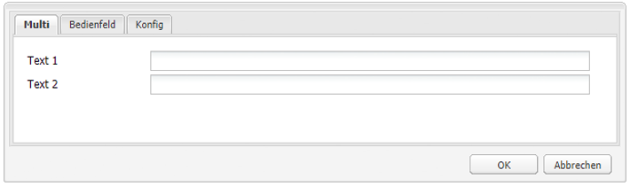

#### Beispiel 4: Dialogfeld „Rich“{#example-rich-dialog}

Das Dialogfeld **Rich** zeigt ein Fenster mit zwei Registerkarten an. Die erste Registerkarte weist ein Textfeld auf, ein Dropdown-Menü und einen ausblendbaren Textbereich. Die zweite Registerkarte verfügt über einen Feldsatz mit vier Textfeldern und einen ausblendbaren Feldsatz mit zwei Textfeldern. Die Eigenschaften sind:

* Wird durch einen Knoten definiert (node type = `cq:Dialog`, xtype = ` [dialog](/help/sites-developing/xtypes.md#dialog)`).
* Zeigt zwei Registerkarten an (Knotentyp = `cq:Panel`).
* Die erste Registerkarte verfügt über ein Widget ` [dialogfieldset](/help/sites-developing/xtypes.md#dialogfieldset)` mit einem Widget ` [textfield](/help/sites-developing/xtypes.md#textfield)` und einem Widget ` [selection](/help/sites-developing/xtypes.md#selection)` mit 3 Optionen und ein ausblendbares Widget ` [dialogfieldset](/help/sites-developing/xtypes.md#dialogfieldset)` mit dem Widget ` [textarea](/help/sites-developing/xtypes.md#textarea)`.
* Die zweite Registerkarte verfügt über ein ` [dialogfieldset](/help/sites-developing/xtypes.md#dialogfieldset)` Widget mit 4 ` [textfield](/help/sites-developing/xtypes.md#textfield)` Widgets und ein ausblendbares `dialogfieldset` Widget mit 2 ` [textfield](/help/sites-developing/xtypes.md#textfield)`.
* Wird durch den Knoten definiert:
   `/apps/extjstraining/components/dialogbasics/rich`
* Wird im JSON-Format gerendert, indem Folgendes angefordert wird:
   `https://localhost:4502/apps/extjstraining/components/dialogbasics/rich.-1.json`

So verwenden Sie das Dialogfeld **Rich**:

1. Ersetzen Sie das Dialogfeld der Komponente **Dialog Basics** durch das Dialogfeld **Rich** :
Führen Sie die für [Beispiel 2 beschriebenen Schritte aus: Dialogfeld für einzelne Bereiche](#example-single-panel-dialog)
1. Bearbeiten Sie die Komponente: Das Dialogfeld wird wie im Folgenden dargestellt:

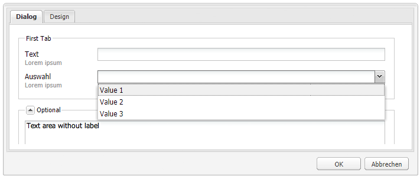 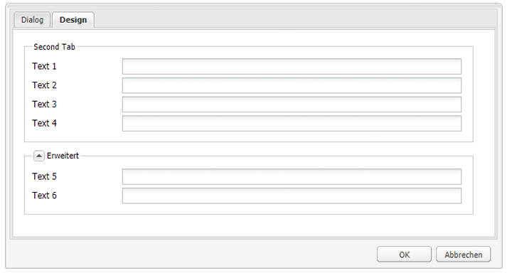

### Dynamische Dialogfelder {#dynamic-dialogs}

Die zweite Komponente der Gruppe **Using ExtJS Widgets** im Sidekick heißt **2. Dynamic Dialogs** und umfasst drei dynamische Dialogfelder, die mit standardmäßigen Widgets und **modifizierter JavaScript-Logik** erstellt wurden. Die Dialogfelder werden unter `/apps/extjstraining/components/dynamicdialogs` gespeichert. Die dynamischen Dialogfelder sind:

* das Dialogfeld „Switch Tabs“ (Knoten `switchtabs`): Es zeigt ein Fenster mit zwei Registerkarten. Die erste Registerkarte weist eine Navigationsauswahl mit drei Optionen auf: Wenn eine Option ausgewählt ist, wird eine Registerkarte zu der Option angezeigt. Die zweite Registerkarte weist zwei Textfelder auf.
* das Dialogfeld „“ (Knoten `arbitrary`arbitrary): Es zeigt ein Fenster mit einer Registerkarte an. Die Registerkarte verfügt über ein Feld, in das Sie Assets ziehen oder hochladen können, und ein Feld, das Informationen über die Seite, die es umfasst, und das Asset (falls auf eines verwiesen wird) anzeigt.
* das Dialogfeld Felder ein/aus ( Knoten `togglefield` ): Es wird ein Fenster mit einer Registerkarte angezeigt. Die Registerkarte verfügt über ein Kontrollkästchen: Ist es aktiviert, wird ein Feldsatz mit zwei Textfeldern angezeigt.

So fügen Sie die Komponente **2. Dynamische Dialogfelder** auf der Beispielseite ein:

1. Fügen Sie die Komponente **2. Dynamische Dialogfelder** zur Beispielseite aus der Registerkarte **Verwenden von ExtJS Widgets** im Tab **Sidekick** hinzu.
1. Die Komponente zeigt einen Titel, etwas Text und einen Link **EIGENSCHAFTEN**: Klicken Sie, um die Eigenschaften des im Repository gespeicherten Absatzes anzuzeigen. Klicken Sie erneut, um die Eigenschaften zu verbergen.

Die Komponente wird wie im Folgenden dargestellt:


#### Beispiel 1: Dialogfeld „Switch Tabs“{#example-switch-tabs-dialog}

Das Dialogfeld **Switch Tabs** zeigt ein Fenster mit zwei Registerkarten an. Die erste Registerkarte weist eine Navigationsauswahl mit drei Optionen auf: Wenn eine Option ausgewählt ist, wird eine Registerkarte zu der Option angezeigt. Die zweite Registerkarte weist zwei Textfelder auf.

Die wichtigsten Eigenschaften sind:

* Wird durch einen Knoten definiert (node type = `cq:Dialog`, xtype = ` [dialog](/help/sites-developing/xtypes.md#dialog)`).
* Zeigt zwei Registerkarten (node type = `cq:Panel`): eine Auswahlregisterkarte und eine zweite Registerkarte, die von der Auswahl auf der ersten Registerkarte abhängt (drei Optionen).
* Hat 3 optionale Registerkarten (node type = `cq:Panel`), jede hat 2 Textfelder (node type = `cq:Widget`, xtype = ` [textfield](/help/sites-developing/xtypes.md#textfield)`). Es wird jeweils nur eine optionale Registerkarte angezeigt.
* Wird definiert durch den Knoten `switchtabs` unter:
   `/apps/extjstraining/components/dynamicdialogs/switchtabs`
* Wird im JSON-Format gerendert, indem Folgendes angefordert wird:
   `https://localhost:4502/apps/extjstraining/components/dynamicdialogs/switchtabs.-1.json`

Die Logik wird wie folgt durch Ereignis-Listener und JavaScript-Code implementiert:

* Der Dialogfeldknoten hat einen &quot; `beforeshow`&quot;-Listener, der alle optionalen Registerkarten ausblendet, bevor das Dialogfeld angezeigt wird:
   `beforeshow="function(dialog){Ejst.x2.manageTabs(dialog.items.get(0));}"`

   `dialog.items.get(0)` Ruft die Registerkarte ab, die das Auswahlfeld und die 3 optionalen Bedienfelder enthält.
* Das `Ejst.x2`-Objekt wird in der `exercises.js`-Datei definiert unter:
   `/apps/extjstraining/clientlib/js/exercises.js`
* In der `Ejst.x2.manageTabs()`-Methode sind alle optionalen Registerkarten ausgeblendet, da der Wert von `index` -1 ist (i wechselt von 1 zu 3).
* Die Auswahlregisterkarte verfügt über zwei Listener: eines, das die ausgewählte Registerkarte anzeigt, wenn das Dialogfeld geladen wird (&quot; `loadcontent`&quot;-Ereignis), und eines, das die ausgewählte Registerkarte anzeigt, wenn die Auswahl geändert wird (&quot; `selectionchanged`&quot;-Ereignis):
   `loadcontent="function(field,rec,path){Ejst.x2.showTab(field);}"`

   `selectionchanged="function(field,value){Ejst.x2.showTab(field);}"`
* In der `Ejst.x2.showTab()`-Methode:
   `field.findParentByType('tabpanel')` Ruft das Registerkartenbedienfeld ab, das alle Registerkarten enthält (  `field` repräsentiert das Auswahl-Widget)
   `field.getValue()` Ruft den Wert der Auswahl ab, z. B.: tab2
   `Ejst.x2.manageTabs()` zeigt die ausgewählte Registerkarte an.
* Jede optionale Registerkarte verfügt über einen Listener, der die Registerkarte beim Ereignis &quot;`render`&quot;ausblendet:
   `render="function(tab){Ejst.x2.hideTab(tab);}"`
* In der `Ejst.x2.hideTab()`-Methode:
   ist `tabPanel` das Registerkartenbedienfeld, das alle Registerkarten enthält.
   ist `index` der Index der optionalen Registerkarte.
   `tabPanel.hideTabStripItem(index)` blendet die Registerkarte aus

Dies wird wie folgt angezeigt:

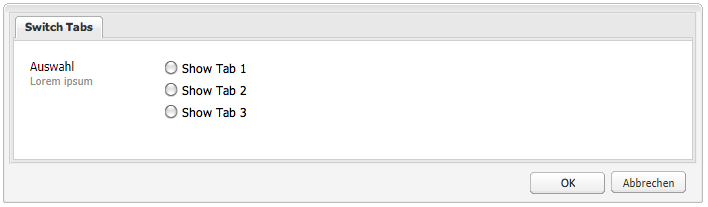

#### Beispiel 2: Dialogfeld „Arbitrary“{#example-arbitrary-dialog}

Sehr oft zeigt ein Dialogfeld Inhalte aus der zugrunde liegenden Komponente an. Das hier beschriebene Dialogfeld **Arbitrary** zeigt Inhalte aus einer anderen Komponente an.

Das Dialogfeld **Arbitrary** zeigt ein Fenster mit einer Registerkarte an. Die Registerkarte verfügt über zwei Felder: eines, in das Sie Assets ziehen oder hochladen können, und eines, das Informationen über die Seite, die es umfasst, und das Asset (falls auf eines verwiesen wird) anzeigt.

Die wichtigsten Eigenschaften sind:

* Wird durch einen Knoten definiert (node type = `cq:Dialog`, xtype = ` [dialog](/help/sites-developing/xtypes.md#dialog)`).
* Zeigt 1 tabpanel-Widget (node type = `cq:Widget`, xtype = ` [tabpanel](/help/sites-developing/xtypes.md#tabpanel)`) mit 1 Bereich (node type = `cq:Panel`) an
* Das Bedienfeld hat ein smartfile-Widget (node type = `cq:Widget`, xtype = ` [smartfile](/help/sites-developing/xtypes.md#smartfile)`) und ein ownerdraw-Widget (node type = `cq:Widget`, xtype = ` [ownerdraw](/help/sites-developing/xtypes.md#ownerdraw)`).
* Wird definiert durch den Knoten `arbitrary` unter:
   `/apps/extjstraining/components/dynamicdialogs/arbitrary`
* Wird im JSON-Format gerendert, indem Folgendes angefordert wird:
   `https://localhost:4502/apps/extjstraining/components/dynamicdialogs/arbitrary.-1.json`

Die Logik wird wie folgt durch Ereignis-Listener und JavaScript-Code implementiert:

* Das ownerdraw-Widget verfügt über einen &quot; `loadcontent`&quot;-Listener, der Informationen über die Seite anzeigt, die die Komponente enthält, und das Asset, auf das das smartfile-Widget beim Laden des Inhalts verweist:
   `loadcontent="function(field,rec,path){Ejst.x2.showInfo(field,rec,path);}"`

   `field` wird mit dem ownerdraw-Objekt festgelegt
   `path` wird mit dem Inhalts-Pfad der Komponente festgelegt (z. B.: /content/geometrixx/de/products/triangle/ui-tutorial/jcr:content/par/dynamicdialogs)
* Das `Ejst.x2`-Objekt wird in der `exercises.js`-Datei definiert unter:
   `/apps/extjstraining/clientlib/js/exercises.js`
* In der `Ejst.x2.showInfo()`-Methode:
   ist `pagePath` der Pfad der Seite, die die Komponente enthält.
   stellt `pageInfo` die Seiteneigenschaften im JSON-Format dar.
   ist `reference` der Pfad des referenzierten Assets.
   stellt `metadata` die Metadaten des Assets im JSON-Format dar.
   `ownerdraw.getEl().update(html);` zeigt den erstellten HTML-Code im Dialogfeld an

So verwenden Sie das Dialogfeld **Arbitrary**:

1. Ersetzen Sie das Dialogfeld der Komponente **Dynamisches Dialogfeld** durch das Dialogfeld **Arbitrary** :
Führen Sie die für [Beispiel 2 beschriebenen Schritte aus: Dialogfeld für einzelne Bereiche](#example-single-panel-dialog)
1. Bearbeiten Sie die Komponente: Das Dialogfeld wird wie im Folgenden dargestellt:

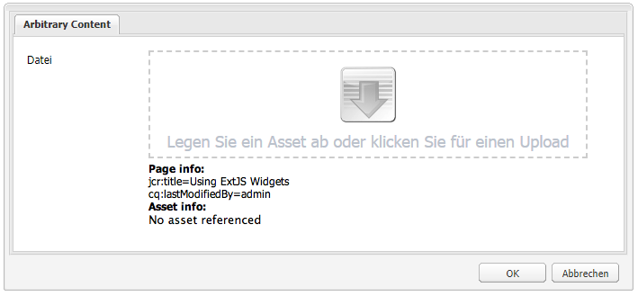

#### Beispiel 3: Dialogfeld „Toggle Fields“{#example-toggle-fields-dialog}

Das Dialogfeld **Toggle Fields** zeigt ein Fenster mit einer Registerkarte an. Die Registerkarte verfügt über ein Kontrollkästchen: Ist es aktiviert, wird ein Feldsatz mit zwei Textfeldern angezeigt.

Die wichtigsten Eigenschaften sind:

* Wird durch einen Knoten definiert (node type = `cq:Dialog`, xtype = ` [dialog](/help/sites-developing/xtypes.md#dialog)`).
* Zeigt 1 tabpanel-Widget (node type = `cq:Widget`, xtype = ` [tabpanel](/help/sites-developing/xtypes.md#textpanel)`) mit 1 Bereich (node type = `cq:Panel`) an.
* Das Bedienfeld verfügt über ein selection-/checkbox-Widget (node type = `cq:Widget`, xtype = ` [selection](/help/sites-developing/xtypes.md#selection)`, type = ` [checkbox](/help/sites-developing/xtypes.md#checkbox)`) und ein ausblendbares dialogfieldset-Widget (node type = `cq:Widget`, xtype = ` [dialogfieldset](/help/sites-developing/xtypes.md#dialogfieldset)`), das standardmäßig ausgeblendet ist, mit 2 textfield-Widgets (node type = `cq:Widget`, xtype = ` [textfield](/help/sites-developing/xtypes.md#textfield)`).
* Wird definiert durch den Knoten `togglefields` unter:
   `/apps/extjstraining/components/dynamicdialogs/togglefields`
* Wird im JSON-Format gerendert, indem Folgendes angefordert wird:
   `https://localhost:4502/apps/extjstraining/components/dynamicdialogs/togglefields.-1.json`

Die Logik wird wie folgt durch Ereignis-Listener und JavaScript-Code implementiert:

* Die Auswahlregisterkarte verfügt über zwei Listener: eines, das das dialogfieldset anzeigt, wenn der Inhalt geladen wird (&quot; `loadcontent`&quot;-Ereignis), und eines, das das dialogfieldset anzeigt, wenn die Auswahl geändert wird (&quot; `selectionchanged`&quot;-Ereignis):
   `loadcontent="function(field,rec,path){Ejst.x2.toggleFieldSet(field);}"`

   `selectionchanged="function(field,value){Ejst.x2.toggleFieldSet(field);}"`
* Das `Ejst.x2`-Objekt wird in der `exercises.js`-Datei definiert unter:
   `/apps/extjstraining/clientlib/js/exercises.js`
* In der `Ejst.x2.toggleFieldSet()`-Methode:
   `box` ist das Auswahlobjekt
   ist `panel` das Bedienfeld, das das selection- und das dialogfieldset-Widget enthält.
   `fieldSet` ist das dialogfieldset -Objekt
   `show` ist der Wert der Auswahl (true oder false) basierend auf &#39;  `show`&#39;, dass das dialogfieldset angezeigt wird oder nicht.

So verwenden Sie das Dialogfeld **Umschalten zwischen Feldern**:

1. Ersetzen Sie das Dialogfeld der Komponente **Dynamisches Dialogfeld** durch das Dialogfeld **Felder ein/aus**:
Führen Sie die für [Beispiel 2 beschriebenen Schritte aus: Dialogfeld für einzelne Bereiche](#example-single-panel-dialog)
1. Bearbeiten Sie die Komponente: Das Dialogfeld wird wie im Folgenden dargestellt:

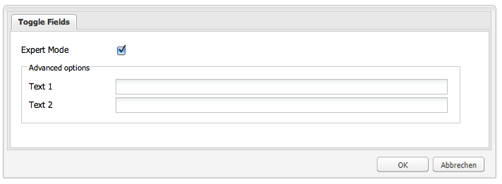

### Benutzerdefinierte Widgets {#custom-widgets}

Die direkt einsatzbereiten und im Lieferumfang von AEM enthaltenen Widgets sollten die meisten Anwendungsfälle abdecken. Manchmal kann es jedoch erforderlich sein, ein benutzerdefiniertes Widget zu erstellen, um eine projektspezifische Anforderung abzudecken. Benutzerdefinierte Widgets werden erstellt, indem vorhandene erweitert werden. Das Paket **Using ExtJS Widgets** enthält drei Dialogfelder, die drei verschiedene benutzerdefinierte Widgets verwenden, um die ersten Schritte mit der Anpassung zu vereinfachen:

* Das Dialogfeld „Multi Field“ (Knoten `multifield`) zeigt ein Fenster mit einer Registerkarte. Die Registerkarte verfügt über ein benutzerdefiniertes multifield-Widget mit zwei Feldern: Ein Dropdown-Menü mit zwei Optionen und ein Textfeld. Da es auf dem im Lieferumfang enthaltenen `multifield`-Widget (mit nur einem Textfeld) basiert, verfügt es über alle Funktionen des `multifield`-Widgets.
* Das Dialogfeld „Tree Browse“ (`treebrowse`-Knoten) zeigt ein Fenster mit einer Registerkarte, die ein Pfadbrowser-Widget enthält: Wenn Sie auf den Pfeil klicken, wird ein Fenster geöffnet, in dem Sie eine Hierarchie durchsuchen und ein Element auswählen können. Der Pfad des Elements wird dann dem Pfadfeld hinzugefügt und wird beibehalten, wenn das Dialogfeld geschlossen wird.
* Ein Dialogfeld, das auf dem Rich-Text-Editor-Plug-in basiert (Knoten `rteplugin`) und dem Rich-Text-Editor eine benutzerdefinierte Schaltfläche hinzufügt, mit der benutzerdefinierter Text in den Haupttext eingefügt werden kann. Es besteht aus einem `richtext`-Widget (RTE) und einer benutzerdefinierten Funktion, die durch den RTE-Plug-in-Mechanismus hinzugefügt wird.

Die benutzerdefinierten Widgets und das Plug-in sind in der Komponente **3. Custom Widgets** des Pakets **Using ExtJS Widgets** enthalten. Fügen Sie diese Komponente wie folgt der Beispielseite hinzu:

1. Fügen Sie die Komponente **3. Custom Widgets** auf der Beispielseite von der Registerkarte **Using ExtJS Widgets** im Tab **Sidekick** hinzu.
1. Die Komponente zeigt einen Titel, etwas Text und, wenn Sie auf den Link **EIGENSCHAFTEN** klicken, die Eigenschaften des im Repository gespeicherten Absatzes an. Durch erneutes Klicken werden die Eigenschaften verborgen.
Die Komponente wird wie im Folgenden dargestellt:

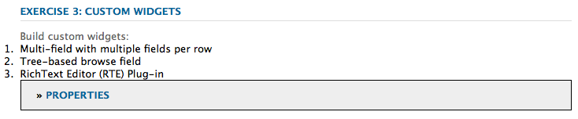

#### Beispiel 1: Custom Multifield-Widget {#example-custom-multifield-widget}

Das auf dem **Custom Multifield**-Widget basierende Dialogfeld zeigt ein Fenster mit einer Registerkarte an. Die Registerkarte verfügt über ein benutzerdefiniertes multifield-Widget mit zwei Feldern (im Gegensatz zur Standardversion mit einem Feld): Ein Dropdown-Menü mit zwei Optionen und ein Textfeld.

Das auf dem **Custom Multifield**-Widget basierende Dialogfeld:

* Wird durch einen Knoten definiert (node type = `cq:Dialog`, xtype = ` [dialog](/help/sites-developing/xtypes.md#dialog)`).
* Zeigt ein tabpanel-Widget (node type = `cq:Widget`, xtype = ` [tabpanel](/help/sites-developing/xtypes.md#tabpanel)`) an, das ein Bedienfeld enthält (node type = `cq:Widget`, xtype = ` [panel](/help/sites-developing/xtypes.md#panel)`).
* Das Bedienfeld hat ein Widget `multifield` (Knotentyp = `cq:Widget`, xtype = ` [multifield](/help/sites-developing/xtypes.md#multifield)`).
* Das Widget `multifield` verfügt über eine fieldconfig (node type = `nt:unstructured`, xtype = `ejstcustom`, optionsProvider = `Ejst.x3.provideOptions`), die auf dem benutzerdefinierten xtype &#39; `ejstcustom`&#39; basiert:
   * &#39; `fieldconfig`&#39; ist eine Konfigurationsoption des ` [CQ.form.MultiField](https://helpx.adobe.com/experience-manager/6-5/sites/developing/using/reference-materials/widgets-api/index.html?class=CQ.form.MultiField)` -Objekts.
   * &quot; `optionsProvider`&quot;ist eine Konfiguration des Widgets `ejstcustom` . Sie wird mit der `Ejst.x3.provideOptions`-Methode festgelegt, die in `exercises.js` unter: definiert ist.
      `/apps/extjstraining/clientlib/js/exercises.js`
und gibt 2 Optionen zurück.
* Wird definiert durch den Knoten `multifield` unter:
   `/apps/extjstraining/components/customwidgets/multifield`
* Wird im JSON-Format gerendert, indem Folgendes angefordert wird:
   `https://localhost:4502/apps/extjstraining/components/customwidgets/multifield.-1.json`

Das benutzerdefinierte Multifield-Widget (xtype = `ejstcustom`):

* Ist ein JavaScript-Objekt namens `Ejst.CustomWidget`.
* Wird in der JavaScript-Datei `CustomWidget.js` unter definiert:
   `/apps/extjstraining/clientlib/js/CustomWidget.js`
* Erweitert das Widget ` [CQ.form.CompositeField](https://helpx.adobe.com/experience-manager/6-5/sites/developing/using/reference-materials/widgets-api/index.html?class=CQ.form.CompositeField)` .
* Hat 3 Felder: `hiddenField` (Textfeld), `allowField` (ComboBox) und `otherField` (Textfeld)
* Überschreibt `CQ.Ext.Component#initComponent`, um die 3 Felder hinzuzufügen:
   * `allowField` ist ein [CQ.form.Selection](https://helpx.adobe.com/experience-manager/6-5/sites/developing/using/reference-materials/widgets-api/index.html?class=CQ.form.Selection)-Objekt vom Typ „select“. optionsProvider ist eine Konfiguration des Selection-Objekts, das mit der optionsProvider-Konfiguration des im Dialogfeld definierten CustomWidget instanziiert wird.
   * `otherField` ist ein [CQ.Ext.form.TextField](https://helpx.adobe.com/experience-manager/6-5/sites/developing/using/reference-materials/widgets-api/index.html?class=CQ.Ext.form.TextField)-Objekt.
* Überschreibt die Methoden `setValue`, `getValue` und `getRawValue` von [CQ.form.CompositeField](https://helpx.adobe.com/experience-manager/6-5/sites/developing/using/reference-materials/widgets-api/index.html?class=CQ.form.CompositeField), um den Wert von CustomWidget mit dem folgenden Format festzulegen und abzurufen:
   `<allowField value>/<otherField value>, e.g.: 'Bla1/hello'`.
* Registriert sich selbst als &quot; `ejstcustom`&quot;xtype:
   `CQ.Ext.reg('ejstcustom', Ejst.CustomWidget);`

Das auf dem **Custom Multifield**-Widget basierende Dialogfeld wird wie folgt angezeigt:

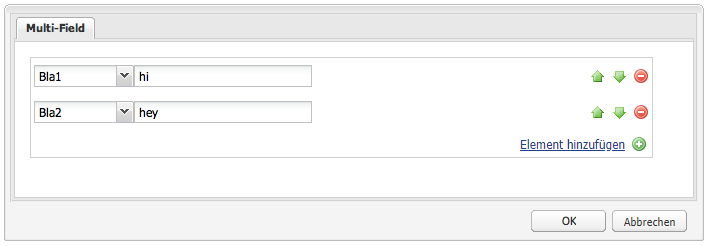

#### Beispiel 2: Benutzerdefiniertes Treebrowse-Widget {#example-custom-treebrowse-widget}

Das auf dem **Treebrowse**-Widget basierende benutzerdefinierte Dialogfeld zeigt ein Fenster mit einer Registerkarte, die ein benutzerdefiniertes Pfadbrowser-Widget enthält: Wenn Sie auf den Pfeil klicken, wird ein Fenster geöffnet, in dem Sie eine Hierarchie durchsuchen und ein Element auswählen können. Der Pfad des Elements wird dann dem Pfadfeld hinzugefügt und wird beibehalten, wenn das Dialogfeld geschlossen wird.

Das benutzerdefinierte treebrowse-Dialogfeld:

* Wird durch einen Knoten definiert (node type = `cq:Dialog`, xtype = ` [dialog](/help/sites-developing/xtypes.md#dialog)`).
* Zeigt ein tabpanel-Widget (node type = `cq:Widget`, xtype = ` [tabpanel](/help/sites-developing/xtypes.md#tabpanel)`) an, das ein Bedienfeld enthält (node type = `cq:Widget`, xtype = ` [panel](/help/sites-developing/xtypes.md#panel)`).
* Das Bedienfeld verfügt über ein benutzerdefiniertes Widget (node type = `cq:Widget`, xtype = `ejstbrowse`)
* Wird definiert durch den Knoten `treebrowse` unter:
   `/apps/extjstraining/components/customwidgets/treebrowse`
* Wird im JSON-Format gerendert, indem Folgendes angefordert wird:
   `https://localhost:4502/apps/extjstraining/components/customwidgets/treebrowse.-1.json`

Das benutzerdefinierte treebrowse-Widgets (xtype = `ejstbrowse`):

* Ist ein JavaScript-Objekt namens `Ejst.CustomWidget`.
* Wird in der JavaScript-Datei `CustomBrowseField.js` unter definiert:
   `/apps/extjstraining/clientlib/js/CustomBrowseField.js`
* Erweitert ` [CQ.Ext.form.TriggerField](https://helpx.adobe.com/experience-manager/6-5/sites/developing/using/reference-materials/widgets-api/index.html?class=CQ.Ext.form.TriggerField)`.
* Definiert ein Fenster zum Durchsuchen namens `browseWindow`.
* Überschreibt ` [CQ.Ext.form.TriggerField](https://helpx.adobe.com/experience-manager/6-5/sites/developing/using/reference-materials/widgets-api/index.html?class=CQ.Ext.form.TriggerField)#onTriggerClick`, um das Fenster &quot;Durchsuchen&quot;anzuzeigen, wenn auf den Pfeil geklickt wird.
* Definiert ein [CQ.Ext.tree.TreePanel](https://helpx.adobe.com/experience-manager/6-5/sites/developing/using/reference-materials/widgets-api/index.html?class=CQ.Ext.tree.TreePanel)-Objekt:
   * Ruft seine Daten ab, indem das unter `/bin/wcm/siteadmin/tree.json` registrierte Servlet aufgerufen wird.
   * Der Stamm ist &quot; `apps/extjstraining`&quot;.
* Definiert ein `window`-Objekt ( ` [CQ.Ext.Window](https://helpx.adobe.com/experience-manager/6-5/sites/developing/using/reference-materials/widgets-api/index.html?class=CQ.Ext.Window)`):
   * Basierend auf dem vordefinierten Bedienfeld.
   * Weist eine **OK**-Schaltfläche auf, die den Wert des ausgewählten Pfads festlegt und das Bedienfeld ausblendet.
* Das Fenster wird unterhalb des Feldes **Pfad** verankert.
* Der ausgewählte Pfad wird bei einem `show`-Ereignis vom Durchsuchfeld an das Fenster weitergegeben.
* Registriert sich selbst als &quot; `ejstbrowse`&quot;xtype:
   `CQ.Ext.reg('ejstbrowse', Ejst.CustomBrowseField);`

So verwenden Sie das Widget-basierte Dialogfeld **Custom Treebrowse** :

1. Ersetzen Sie das Dialogfeld der Komponente **Benutzerdefinierte Widgets** durch das Dialogfeld **Benutzerdefinierte Treebrowse** :
Führen Sie die für [Beispiel 2 beschriebenen Schritte aus: Dialogfeld für einzelne Bereiche](#example-single-panel-dialog)
1. Bearbeiten Sie die Komponente: Das Dialogfeld wird wie im Folgenden dargestellt:

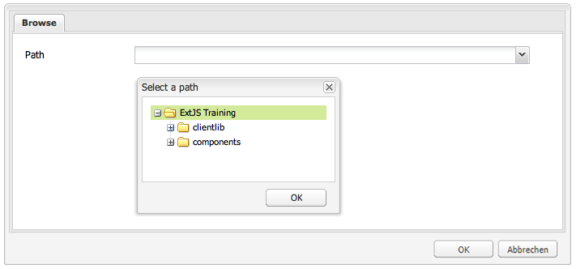

#### Beispiel 3: Rich-Text-Editor (RTE)-Plug-in {#example-rich-text-editor-rte-plug-in}

Das auf dem **Rich-Text-Editor (RTE)-Plug-in** basierende Dialogfeld ist ein auf dem Rich-Text-Editor basierendes Dialogfeld, das eine benutzerdefinierte Schaltfläche aufweist, mit der benutzerdefinierter Text in eckigen Klammern eingefügt wird. Der benutzerdefinierte Text kann auch anhand einer serverseitigen Logik geparst werden (in diesem Beispiel nicht implementiert), um beispielsweise Text hinzuzufügen, der am jeweiligen Pfad definiert ist:

Das auf dem **RTE-Plug-in** basierende Dialogfeld:

* Wird durch den Knoten rteplugin definiert unter:
   `/apps/extjstraining/components/customwidgets/rteplugin`
* Wird im JSON-Format gerendert, indem Folgendes angefordert wird:
   `https://localhost:4502/apps/extjstraining/components/customwidgets/rteplugin.-1.json`
* Der Knoten `rtePlugins` hat einen untergeordneten Knoten `inserttext` (Knotentyp = `nt:unstructured`), der nach dem Plug-in benannt ist. Er weist eine Eigenschaft mit der Bezeichnung `features` auf, die definiert, welche der Plug-in-Funktionen für den RTE verfügbar sind.

Das RTE-Plug-in:

* Ist ein JavaScript-Objekt namens `Ejst.InsertTextPlugin`.
* Wird in der JavaScript-Datei `InsertTextPlugin.js` unter definiert:
   `/apps/extjstraining/clientlib/js/InsertTextPlugin.js`
* Erweitert das ` [CQ.form.rte.plugins.Plugin](https://helpx.adobe.com/experience-manager/6-5/sites/developing/using/reference-materials/widgets-api/index.html?class=CQ.form.rte.plugins.Plugin)`-Objekt.
* Die folgenden Methoden definieren das ` [CQ.form.rte.plugins.Plugin](https://helpx.adobe.com/experience-manager/6-5/sites/developing/using/reference-materials/widgets-api/index.html?class=CQ.form.rte.plugins.Plugin)`-Objekt und werden im implementierenden Plug-in überschrieben:
   * `getFeatures()` gibt ein Array aller Funktionen zurück, die vom Plug-in bereitgestellt werden.
   * `initializeUI()` fügt die neue Schaltfläche der RTE-Symbolleiste hinzu.
   * `notifyPluginConfig()` zeigt Titel und Text an, wenn auf die Schaltfläche gezeigt wird.
   * `execute()` wird aufgerufen, wenn auf die Schaltfläche geklickt wird, und führt die Plug-in-Aktion durch: Sie zeigt ein Fenster an, in dem Text definiert wird, der eingeschlossen werden soll.
* `insertText()` fügt einen Text anhand des entsprechenden Dialogfeldobjekts `Ejst.InsertTextPlugin.Dialog` ein (siehe unten).
* `executeInsertText()` wird von der  `apply()` Methode des Dialogfelds aufgerufen, die beim Klicken auf die  **** OK-Schaltfläche ausgelöst wird.
* Registriert sich selbst als Plug-in &quot; `inserttext`&quot;:
   `CQ.form.rte.plugins.PluginRegistry.register("inserttext", Ejst.InsertTextPlugin);`
* Das `Ejst.InsertTextPlugin.Dialog`-Objekt definiert das Dialogfeld, das geöffnet wird, wenn auf die Plug-in-Schaltfläche geklickt wird. Das Dialogfeld besteht aus einem Bedienfeld, einem Formular, einem Textfeld und zwei Schaltflächen (**OK** und **Abbrechen**).

So verwenden Sie das auf dem **Rich-Text-Editor (RTE)-Plug-in** basierende Dialogfeld:

1. Ersetzen Sie das Dialogfeld der Komponente **Custom Widgets** durch das auf dem **Rich-Text-Editor (RTE)-Plug-in** basierende Dialogfeld: Führen Sie die in [Beispiel 2: Dialogfeld „Single Panel“](#example-single-panel-dialog) beschriebenen Schritte aus.
1. Bearbeiten Sie die Komponente.
1. Klicken Sie auf das letzte Symbol rechts (das mit vier Pfeilen). Geben Sie einen Pfad ein und klicken Sie auf **OK**:
Der Pfad wird in eckigen Klammern ([) angezeigt ]).
1. Klicken Sie auf **OK**, um den Rich-Text-Editor zu schließen.

Das auf dem **Rich-Text-Editor (RTE)-Plug-in** basierende Dialogfeld wird wie folgt angezeigt:

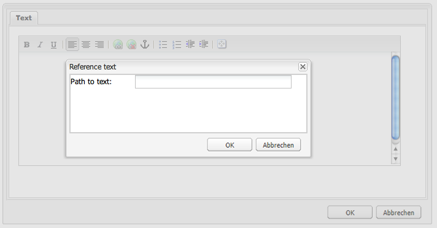

>[!NOTE]
>
>Dieses Beispiel zeigt nur, wie der clientseitige Teil der Logik implementiert wird: Die Platzhalter (*[text]*) müssen dann explizit serverseitig analysiert werden (z. B. in der Komponenten-JSP).

### Tree Overview {#tree-overview}

Das im Lieferumfang enthaltene ` [CQ.Ext.tree.TreePanel](https://helpx.adobe.com/experience-manager/6-5/sites/developing/using/reference-materials/widgets-api/index.html?class=CQ.Ext.tree.TreePanel)`-Objekt bietet eine baumstrukturierte Benutzeroberflächendarstellung baumstrukturierter Daten. Die im Paket **Using ExtJS Widgets** enthaltene Komponente „Tree Overview“ zeigt die Verwendung des Objekts `TreePanel` zur Anzeige einer JCR-Baumstruktur unterhalb eines gegebenen Pfads. Das Fenster selbst kann an- bzw. abgedockt werden. In diesem Beispiel wird die Fensterlogik in die Komponenten-JSP zwischen &lt;script>&lt;/script>-Tags eingebunden.

Fügen Sie die Komponente **Tree Overview** wie folgt der Beispielseite hinzu:

1. Fügen Sie die Komponente **4. Baumübersicht** zur Beispielseite aus der Registerkarte **Verwenden von ExtJS Widgets** im Tab **Sidekick** hinzu.
1. Die Komponente zeigt:
   * einen Titel und etwas Text.
   * einen **EIGENSCHAFTEN**-Link: Klicken Sie, um die Eigenschaften des im Repository gespeicherten Absatzes anzuzeigen. Klicken Sie erneut, um die Eigenschaften zu verbergen.
   * ein frei bewegliches Fenster mit einer Baumstrukturdarstellung des Repositorys, das erweitert werden kann.

Die Komponente wird wie im Folgenden dargestellt:


Die Komponente „Tree Overview“:

* Wird definiert unter:
   `/apps/extjstraining/components/treeoverview`

* Ihr Dialogfeld ermöglicht das Festlegen der Fenstergröße und das An- bzw.- Abdocken des Fensters (weitere Details unten).

Die Komponenten-JSP:

* Ruft die Breite, Höhe und angedockten Eigenschaften aus dem Repository ab.
* Zeigt Text zum Datenformat des Baumstrukturüberblicks an.
* Bettet die Fensterlogik zwischen JavaScript-Tags in die Komponenten-JSP ein.
* Wird definiert unter:
   `apps/extjstraining/components/treeoverview/content.jsp`

Der in die Komponenten-JSP eingebettete JavaScript-Code:

* Definiert ein `tree`-Objekt, indem versucht wird, ein Baumstrukturfenster von der Seite abzurufen.
* Wenn das Fenster, das den Baum anzeigt, nicht vorhanden ist, wird `treePanel` ([CQ.Ext.tree.TreePanel](https://helpx.adobe.com/experience-manager/6-5/sites/developing/using/reference-materials/widgets-api/index.html?class=CQ.Ext.tree.TreePanel)) erstellt:
   * `treePanel` enthält die Daten, anhand derer das Fenster erstellt wird.
   * Die Daten werden abgerufen, indem das Servlet aufgerufen wird, das registriert ist unter:
      `/bin/wcm/siteadmin/tree.json`
* Der Listener `beforeload` stellt sicher, dass der angeklickte Knoten geladen wird.
* Das `root` -Objekt legt den Pfad `apps/extjstraining` als Baumstamm fest.
* `tree` (  ` [CQ.Ext.Window](https://helpx.adobe.com/experience-manager/6-5/sites/developing/using/reference-materials/widgets-api/index.html?class=CQ.Ext.Window)`) wird auf der Grundlage der vordefinierten festgelegt  `treePanel`und angezeigt mit:
   `tree.show();`
* Wenn das Fenster bereits vorhanden ist, wird es anhand der aus dem Repository abgerufenen Breite, Höhe und angedockten Eigenschaften angezeigt.

Das Komponentendialogfeld:

* Zeigt eine Registerkarte mit zwei Feldern zum Festlegen der Größe (Breite und Höhe) des Fensters des Baumstrukturüberblicks und ein Feld zum An-/Abdocken des Fensters.
* Wird durch einen Knoten definiert (node type = `cq:Dialog`, xtype = ` [panel](/help/sites-developing/xtypes.md#panel)`).
* Das Bedienfeld verfügt über ein Widget &quot;sizefield&quot;(node type = `cq:Widget`, xtype = ` [sizefield](/help/sites-developing/xtypes.md#sizefield)`) und ein Auswahl-Widget (node type = `cq:Widget`, xtype = ` [selection](/help/sites-developing/xtypes.md#selection)`, type = `radio`) mit 2 Optionen (true/false)
* Wird definiert durch den Knoten dialog unter:
   `/apps/extjstraining/components/treeoverview/dialog`
* Wird im JSON-Format gerendert, indem Folgendes angefordert wird:
   `https://localhost:4502/apps/extjstraining/components/treeoverview/dialog.-1.json`
* Wird wie folgt angezeigt:

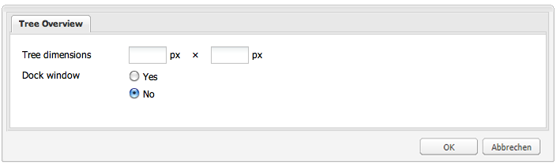

### Grid Overview {#grid-overview}

Ein „Grid Panel“ stellt Daten in tabellarischer Form als Zeilen und Spalten dar. Es setzt sich aus Folgendem zusammen:

* Store: das Modell, das die Datendatensätze enthält (Zeilen)
* Spaltenmodell: das Spaltendesign
* Ansicht: fasst die Benutzeroberfläche zusammen
* Auswahlmodell: das Auswahlverhalten

Die im Paket **Using ExtJS Widgets** enthaltene Komponente &quot;Grid Overview&quot;zeigt, wie Daten im Tabellenformat angezeigt werden:

* Das Beispiel 1 verwendet statische Daten.
* Beispiel 2 verwendet Daten, die aus dem Repository abgerufen wurden.

So fügen Sie die Komponente &quot;Grid Overview&quot;zur Beispielseite hinzu:

1. Fügen Sie die Komponente **5. Grid Overview** der Beispielseite aus der Registerkarte **Using ExtJS Widgets** im Tab **Sidekick** hinzu.
1. Die Komponente zeigt:
   * einen Titel mit etwas Text
   * einen **EIGENSCHAFTEN**-Link: Klicken Sie, um die Eigenschaften des im Repository gespeicherten Absatzes anzuzeigen. Klicken Sie erneut, um die Eigenschaften zu verbergen.
   * ein frei bewegbares Fenster, das Daten im Tabellenformat enthält.

Die Komponente wird wie im Folgenden dargestellt:


#### Beispiel 1: Standardraster {#example-default-grid}

In der von Adobe ausgelieferten Version zeigt die Komponente **Grid Overview** ein Fenster mit statischen Daten in tabellarischer Form. In diesem Beispiel wird die Logik auf zwei Arten in die Komponenten-JSP eingebunden:

* Die generische Logik wird zwischen &lt;script>&lt;/script>-Tags definiert.
* Die spezifische Logik steht in einer separaten JS-Datei zur Verfügung und ist in der JSP verlinkt. Diese Einrichtung ermöglicht es, einfach zwischen den beiden Logiken (statisch/dynamisch) umzuschalten, indem die gewünschten &lt;script>-Tags kommentiert werden.

Die Komponente „Grid Overview“:

* Wird definiert unter:
   `/apps/extjstraining/components/gridoverview`
* Ihr Dialogfeld ermöglicht das Festlegen der Fenstergröße und das An- bzw.- Abdocken des Fensters.

Die Komponenten-JSP:

* Ruft die Breite, Höhe und angedockten Eigenschaften aus dem Repository ab.
* Zeigt Text als Einführung zum Datenformat des Rasterüberblicks an.
* Verweist auf JavaScript-Code, der das GridPanel-Objekt definiert:
   `<script type="text/javascript" src="/apps/extjstraining/components/gridoverview/defaultgrid.js"></script>`

   `defaultgrid.js` definiert einige statische Daten als Grundlage für das GridPanel-Objekt.
* Bettet zwischen JavaScript-Tags JavaScript-Code ein, der das Window-Objekt definiert, das das GridPanel-Objekt verbraucht.
* Wird definiert unter:
   `apps/extjstraining/components/gridoverview/content.jsp`

Der in die Komponenten-JSP eingebettete JavaScript-Code:

* Definiert das `grid`-Objekt, indem versucht wird, die Fensterkomponente von der Seite abzurufen:
   `var grid = CQ.Ext.getCmp("<%= node.getName() %>-grid");`
* Wenn `grid` nicht vorhanden ist, wird ein [CQ.Ext.grid.GridPanel](https://helpx.adobe.com/experience-manager/6-5/sites/developing/using/reference-materials/widgets-api/index.html?class=CQ.Ext.grid.GridPanel) -Objekt ( `gridPanel`) definiert, indem die `getGridPanel()` -Methode aufgerufen wird (siehe unten). Diese Methode wird in `defaultgrid.js` definiert.
* `grid` ist ein  ` [CQ.Ext.Window](https://helpx.adobe.com/experience-manager/6-5/sites/developing/using/reference-materials/widgets-api/index.html?class=CQ.Ext.Window)` Objekt, das auf dem vordefinierten GridPanel basiert und angezeigt wird:  `grid.show();`
* Ist `grid` bereits vorhanden, wird es anhand der aus dem Repository abgerufenen Breite, Höhe und angedockten Eigenschaften angezeigt.

Die JavaScript-Datei ( `defaultgrid.js`), auf die in der Komponenten-JSP verwiesen wird, definiert die `getGridPanel()` -Methode, die durch das in die JSP eingebettete Skript aufgerufen wird, und gibt ein ` [CQ.Ext.grid.GridPanel](https://helpx.adobe.com/experience-manager/6-5/sites/developing/using/reference-materials/widgets-api/index.html?class=CQ.Ext.grid.GridPanel)` -Objekt zurück, das auf statischen Daten basiert. Die Logik lautet wie folgt:

* `myData` ist ein Array statischer Daten, formatiert als Tabelle mit fünf Spalten und vier Zeilen.
* `store` ist ein  `CQ.Ext.data.Store` Objekt, das  `myData`verbraucht.
* `store` wird im Speicher geladen:
   `store.load();`
* `gridPanel` ist ein  ` [CQ.Ext.grid.GridPanel](https://helpx.adobe.com/experience-manager/6-5/sites/developing/using/reference-materials/widgets-api/index.html?class=CQ.Ext.grid.GridPanel)` Objekt, das Folgendes konsumiert  `store`:
   * Die Spaltenbreiten werden jederzeit neu proportional dargestellt:
      `forceFit: true`
   * Es kann jeweils nur eine Zeile ausgewählt werden:
      `singleSelect:true`

#### Beispiel 2: Verweissuchraster {#example-reference-search-grid}

Wenn Sie das Paket installieren, zeigt `content.jsp` der Komponente **Grid Overview** ein Raster an, das auf statischen Daten basiert. Es ist möglich, die Komponente so zu ändern, dass ein Raster mit den folgenden Eigenschaften angezeigt wird:

* Hat drei Spalten.
* Basiert auf Daten, die aus dem Repository abgerufen werden, indem ein Servlet aufgerufen wird.
* Die Zellen der letzten Spalte können bearbeitet werden. Der Wert wird in einer `test`-Eigenschaft unterhalb des Knotens gespeichert, der anhand des in der ersten Spalte angezeigten Pfades definiert wird.

Wie im vorherigen Abschnitt erläutert, ruft das Fensterobjekt sein ` [CQ.Ext.grid.GridPanel](https://helpx.adobe.com/experience-manager/6-5/sites/developing/using/reference-materials/widgets-api/index.html?class=CQ.Ext.grid.GridPanel)`-Objekt ab, indem die `getGridPanel()`-Methode aufgerufen wird, die in der Datei `defaultgrid.js` unter `/apps/extjstraining/components/gridoverview/defaultgrid.js` definiert ist. Die Komponente &quot;Grid Overview&quot;bietet eine andere Implementierung für die Methode `getGridPanel()`, die in der Datei `referencesearch.js` unter `/apps/extjstraining/components/gridoverview/referencesearch.js` definiert ist. Durch Wechseln der JS-Datei, auf die in der Komponenten-JSP verwiesen wird, basiert das Raster auf aus dem Repository abgerufenen Daten.

Wechseln Sie die JS-Datei, auf die in der Komponenten-JSP verwiesen wird:

1. Kommentieren Sie in **CRXDE Lite** in der Datei `content.jsp` der Komponente die Zeile, die die Datei `defaultgrid.js` enthält, sodass sie wie folgt aussieht:
   `<!-- script type="text/javascript" src="/apps/extjstraining/components/gridoverview/defaultgrid.js"></script-->`
1. Entfernen Sie den Kommentar aus der Zeile, die die Datei `referencesearch.js` enthält, sodass sie wie folgt aussieht:
   `<script type="text/javascript" src="/apps/extjstraining/components/gridoverview/referencesearch.js"></script>`
1. Speichern Sie die Änderungen.
1. Aktualisieren Sie die Beispielseite.

Die Komponente wird wie im Folgenden dargestellt:


Der JavaScript-Code, auf den in der Komponenten-JSP ( `referencesearch.js`) verwiesen wird, definiert die `getGridPanel()`-Methode, die von der Komponenten-JSP aufgerufen wird, und gibt ein ` [CQ.Ext.grid.GridPanel](https://helpx.adobe.com/experience-manager/6-5/sites/developing/using/reference-materials/widgets-api/index.html?class=CQ.Ext.grid.GridPanel)`-Objekt zurück, basierend auf Daten, die dynamisch aus dem Repository abgerufen werden. Die Logik in `referencesearch.js` definiert dynamische Daten als Basis für das GridPanel:

* `reader` ist ein ` [CQ.Ext.data.JsonReader](https://helpx.adobe.com/experience-manager/6-5/sites/developing/using/reference-materials/widgets-api/index.html?class=CQ.Ext.data.JsonReader)`-Objekt, das die Servlet-Antwort im JSON-Format für drei Spalten liest.
* `cm` ist ein  ` [CQ.Ext.grid.ColumnModel](https://helpx.adobe.com/experience-manager/6-5/sites/developing/using/reference-materials/widgets-api/index.html?class=CQ.Ext.grid.ColumnModel)` Objekt für 3 Spalten.
Die Zellen der Spalte &quot;Test&quot; können so bearbeitet werden, wie sie mit einem Editor definiert wurden:
   `editor: new [CQ.Ext.form.TextField](https://helpx.adobe.com/experience-manager/6-5/sites/developing/using/reference-materials/widgets-api/index.html?class=CQ.Ext.form.TextField)({})`
* die Spalten sind sortierbar:
   `cm.defaultSortable = true;`
* `store` ist ein  ` [CQ.Ext.data.GroupingStore](https://helpx.adobe.com/experience-manager/6-5/sites/developing/using/reference-materials/widgets-api/index.html?class=CQ.Ext.data.GroupingStore)` Objekt:
   * Ruft seine Daten ab, indem es das unter &quot;`/bin/querybuilder.json`&quot;registrierte Servlet mit einigen Parametern aufruft, die zum Filtern der Abfrage verwendet werden
   * Es basiert auf dem vorher definierten `reader`.
   * Die Tabelle wird anhand der Spalte „**jcr:path**“ in aufsteigender Reihenfolge definiert.
* `gridPanel` ist ein  ` [CQ.Ext.grid.EditorGridPanel](https://helpx.adobe.com/experience-manager/6-5/sites/developing/using/reference-materials/widgets-api/index.html?class=CQ.Ext.grid.EditorGridPanel)` Objekt, das bearbeitet werden kann:
   * Es basiert auf dem vordefinierten `store` und auf dem Spaltenmodell `cm`.
   * Es kann jeweils nur eine Zeile ausgewählt werden:
      `sm: new [CQ.Ext.grid.RowSelectionModel](https://helpx.adobe.com/experience-manager/6-5/sites/developing/using/reference-materials/widgets-api/index.html?class=CQ.Ext.grid.RowSelectionModel)({singleSelect:true})`
   * Der `afteredit`-Listener stellt sicher, dass nach der Bearbeitung einer Zelle in der „**Test**“-Spalte Folgendes passiert:
      * Die Eigenschaft &#39; `test`&#39; des Knotens an dem Pfad, der durch die Spalte &quot;**jcr:path**&quot;definiert wird, wird im Repository mit dem Wert der Zelle festgelegt
      * Wenn der POST erfolgreich ist, wird der Wert dem `store`-Objekt hinzugefügt, andernfalls wird er abgelehnt.
