# Erweitern der Workflow-Funktionen{#extending-workflow-functionality}

In diesem Kapitel wird beschrieben, wie Sie angepasste Schritt-Komponenten für Ihre Workflows entwickeln und programmatisch mit den Workflows interagieren können.

Das Erstellen eines angepassten Workflow-Schritts umfasst die folgenden Aktivitäten:

* Entwickeln der Komponente des Workflow-Schritts
* Implementieren der Schrittfunktionalität als OSGi-Dienst oder ECMA-Skript

Sie können auch [mit Ihren Workflows von Ihren Programmen und Skripten interagieren](/help/sites-developing/workflows-program-interaction.md).

## Workflow-Schritt-Komponenten – die Grundlagen {#workflow-step-components-the-basics}

Eine Workflow-Schritt-Komponente definiert das Erscheinungsbild und das Verhalten des Schritts beim Erstellen von Workflow-Modellen:

* Kategorie und Schrittname im Workflow-Sidekick
* Erscheinungsbild des Schritts in Workflow-Modellen
* Dialogfeld „Bearbeiten“ für die Konfiguration der Komponenteneigenschaften
* Dienst oder Skript, der bzw. das zur Laufzeit ausgeführt wird

Wie [alle Komponenten](/help/sites-developing/components.md) erben Workflow-Schritt-Komponenten von der Komponente, die für die Eigenschaft `sling:resourceSuperType` festgelegt ist. Das folgende Diagramm zeigt die Hierarchie von `cq:component`-Knoten, die die Grundlage aller Workflow-Schritt-Komponenten bilden. Das Diagramm enthält auch die Komponenten **Prozess-Schritt**, **Teilnehmer-Schritt** und **Dynamischer-Teilnehmer-Schritt**, da sie die gängigsten (und grundlegendsten) Ausgangspunkte für die Entwicklung angepasster Schritt-Komponenten darstellen.

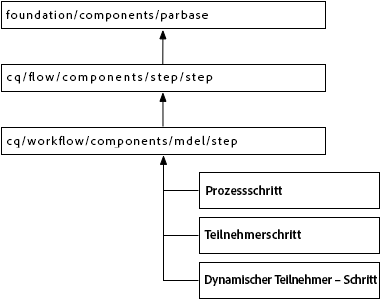

>[!CAUTION]
>
>Sie dürfen ***keinerlei*** Änderungen im Pfad `/libs` vornehmen,
>
>da der Inhalt von `/libs` überschrieben wird, wenn Sie die Instanz das nächste Mal aktualisieren. (Außerdem kann der Inhalt auch durch Anwenden von Hotfixes oder Feature Packs überschrieben werden.)
>
>Die empfohlene Methode zur Konfiguration und für andere Änderungen sieht wie folgt aus:
>
>1. Recreate the required item (i.e. as it exists in `/libs` under `/apps`
>2. Nehmen Sie die gewünschten Änderungen in `/apps` vor.


The `/libs/cq/workflow/components/model/step` component is the nearest common ancestor of the **Process Step**, **Participant Step**, and **Dynamic Participant Step**, which all inherit the following items:

* `step.jsp`

   The `step.jsp` script renders the title of the step component when it is added to a model.

   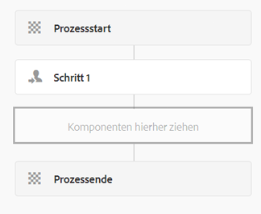

* [cq:dialog](/help/sites-developing/developing-components.md#creating-and-configuring-a-dialog)

   Ein Dialogfeld mit den folgenden Registerkarten:

   * **Allgemein**: für die Bearbeitung von Titel und Beschreibung
   * **Erweitert**: für die Bearbeitung von E-Mail-Benachrichtigungseigenschaften
   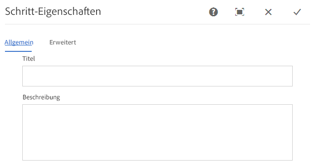 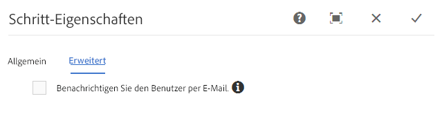

   >[!NOTE]
   >
   >Wenn die Registerkarten des Dialogfelds „Bearbeiten“ nicht mit diesem Standard-Erscheinungsbild übereinstimmen, werden diese geerbten Registerkarten von den definierten Skripten, Knoteneigenschaften oder Dialogfeld-Registerkarten der Schritt-Komponente überschrieben.

### ECMA-Skripte {#ecma-scripts}

Die folgenden Objekte sind in ECMA-Skripten verfügbar (je nach Schritttyp):

* [WorkItem](https://helpx.adobe.com/experience-manager/6-5/sites/developing/using/reference-materials/javadoc/com/day/cq/workflow/exec/WorkItem.html) workItem
* [WorkflowSession](https://helpx.adobe.com/experience-manager/6-5/sites/developing/using/reference-materials/javadoc/com/day/cq/workflow/WorkflowSession.html) workflowSession
* [WorkflowData](https://helpx.adobe.com/experience-manager/6-5/sites/developing/using/reference-materials/javadoc/com/day/cq/workflow/exec/WorkflowData.html) workflowData
* `args`: Array mit den Prozessargumenten

* `sling`: für den Zugriff auf andere OSGi-Dienste
* `jcrSession`

### MetaDataMaps {#metadatamaps}

Sie können mit Workflow-Metadaten Daten speichern, die während des Lebenszyklus des Workflows benötigt werden. Eine häufig vorkommende Anforderung bei Workflow-Schritten besteht im Speichern von Daten für die zukünftige Verwendung im Workflow oder im Abrufen der gespeicherten Daten.

There are three types of MetaDataMap objects - for `Workflow`, `WorkflowData` and `WorkItem` objects. Sie alle haben den gleichen Zweck - Metadaten zu speichern.

Ein WorkItem verfügt über seine eigene MetaDataMap, die nur verwendet werden kann, während das WorkItem (z. B. der Schritt) ausgeführt wird.

Both `Workflow` and `WorkflowData` metadatamaps are shared over the entire workflow. In diesen Fällen empfiehlt es sich, nur die MetaDataMap von `WorkflowData` zu nutzen.

## Erstellen von angepassten Workflow-Schritt-Komponenten {#creating-custom-workflow-step-components}

Workflow-Schritt-Komponenten können [auf dieselbe Weise erstellt werden wie jede andere Komponente](/help/sites-developing/components.md).

Für das Erben von einer der (vorhandenen) Basis-Schritt-Komponenten fügen Sie die folgende Eigenschaft zum Knoten `cq:Component` hinzu:

* Name: `sling:resourceSuperType`
* Typ: `String`
* Wert: einer der folgenden Pfade, die zu einer Basiskomponente verweisen:

   * `cq/workflow/components/model/process`
   * `cq/workflow/components/model/participant`
   * `cq/workflow/components/model/dynamic_participant`

### Festlegen von Standardtitel und -Beschreibung für Schrittinstanzen {#specifying-the-default-title-and-description-for-step-instances}

Mit dem folgenden Verfahren können Sie die Standardwerte für die Felder **Titel** und **Beschreibung** auf der Registerkarte **Allgemein** festlegen.

>[!NOTE]
>
>Die Feldwerte werden auf der Schrittinstanz angezeigt, wenn die beiden folgenden Voraussetzungen erfüllt sind:
>
>* Das Dialogfeld „Bearbeiten“ des Schritts speichert den Titel und die Beschreibung in den folgenden Orten: >
>* `./jcr:title`
>* `./jcr:description` Positionen
>
>  
This requirement is satisfied when the edit dialog uses the Common tab that the `/libs/cq/flow/components/step/step` component implements.
>
>* The step component or an ancestor of the component does not override the `step.jsp` script that the `/libs/cq/flow/components/step/step` component implements.


1. Below the `cq:Component` node, add the following node:

   * Name: `cq:editConfig`
   * Typ: `cq:EditConfig`
   >[!NOTE]
   >
   >For more information about the cq:editConfig node, see [Configuring the Edit Behavior of a Component](/help/sites-developing/developing-components.md#configuring-the-edit-behavior).

1. Below the `cq:EditConfig` node, add the following node:

   * Name: `cq:formParameters`
   * Typ: `nt:unstructured`

1. Add `String` properties of the following names to the `cq:formParameters` node:

   * `jcr:title`: Der Wert wird im Feld **Titel** auf der Registerkarte **Allgemein** angezeigt.
   * `jcr:description`: Der Wert wird im Feld **Beschreibung** auf der Registerkarte **Allgemein** angezeigt.

### Speichern von Eigenschaftswerten in Workflow-Metadaten {#saving-property-values-in-workflow-metadata}

>[!NOTE]
>
>Siehe [Aufbewahren von Daten und Zugreifen auf Daten](#persisting-and-accessing-data). Insbesondere Informationen zum Zugreifen auf die Eigenschaftswerte zur Laufzeit finden Sie unter [Zugreifen auf Dialogfeld-Eigenschaftswerte zur Laufzeit](#accessing-dialog-property-values-at-runtime).

Die name-Eigenschaft von `cq:Widget`-Elementen gibt den JCR-Knoten an, der den Wert des Widgets speichert. Wenn Widgets im Dialogfeld der Workflow-Schritt-Komponenten Werte unter der `./metaData` Node speichern, wird der Wert zum Workflow hinzugefügt `MetaDataMap`.

Beispiel: Ein Textfeld in einem Dialogfeld ist ein `cq:Widget`-Knoten mit den folgenden Eigenschaften:

| Name | Typ | Wert |
|---|---|---|
| `xtype` | `String` | `textarea` |
| `name` | `String` | `./metaData/subject` |
| `fieldLabel` | `String` | `Email Subject` |

Der Wert, der in diesem Textfeld festgelegt wird, wird zum ` [MetaDataMap](#metadatamaps)`-Objekt der Workflow-Instanz hinzugefügt und mit dem `subject`-Schlüssel verknüpft.

>[!NOTE]
>
>Wenn der Schlüssel `PROCESS_ARGS` ist, steht der Wert in ECMA-Skript-Implementierungen über die Variable `args` zur Verfügung. In diesem Fall lautet der Wert der name-Eigenschaft `./metaData/PROCESS_ARGS.`

### Überschreiben der Schrittimplementierung {#overriding-the-step-implementation}

Mit jeder Basiskomponente können Workflow-Modellentwickler die folgenden Hauptfunktionen zur Entwurfszeit konfigurieren:

* Prozess-Schritt: der Dienst oder das ECMA-Skript, das zur Laufzeit ausgeführt werden soll
* Teilnehmer-Schritt: die ID des Benutzers, dem das erzeugte Arbeitselement zugewiesen wird
* Dynamischer-Teilnehmer-Schritt: der Dienst oder das ECMA-Skript, das die ID des Benutzers auswählt, dem das Arbeitselement zugewiesen wird

Um die Komponente auf die Verwendung in einem bestimmten Workflow-Szenario auszurichten, konfigurieren Sie die wichtige Funktion bei der Entwicklung und entfernen Sie die Möglichkeit für Modellentwickler, sie zu ändern.

1. Fügen Sie unter dem Knoten cq:component den folgenden Knoten hinzu:

   * Name: `cq:editConfig`
   * Typ: `cq:EditConfig`
   Weitere Informationen zum Knoten cq:editConfig finden Sie unter [Konfigurieren des Bearbeitungsverhaltens einer Komponente](/help/sites-developing/developing-components.md#configuring-the-edit-behavior).

1. Fügen Sie unter dem Knoten cq:EditConfig den folgenden Knoten hinzu:

   * Name: `cq:formParameters`
   * Typ: `nt:unstructured`

1. Add a `String` property to the `cq:formParameters` node. Der Komponenten-Supertyp bestimmt den Namen der Eigenschaft:

   * Prozessschritt: `PROCESS`
   * Teilnehmer-Schritt: `PARTICIPANT`
   * Dynamischer Teilnehmer – Schritt: `DYNAMIC_PARTICIPANT`

1. Legen Sie den Wert der Eigenschaft fest:

   * `PROCESS`: der Pfad zu dem ECMA-Skript oder der PID des Dienstes, das bzw. der das Schrittverhalten implementiert
   * `PARTICIPANT`: die ID des Benutzers, dem das erzeugte Arbeitselement zugewiesen wird
   * `DYNAMIC_PARTICIPANT`: Der Pfad zum ECMA-Skript oder zur PID des Diensts, mit dem der Benutzer zum Zuweisen des Arbeitselements ausgewählt wird.

1. Um die Möglichkeit für Modellentwickler zur Bearbeitung der Eigenschaftswerte zu entfernen, überschreiben Sie das Dialogfeld des Komponenten-Supertyps.

### Hinzufügen von Formularen und Dialogfeldern zu Teilnehmer-Schritten {#adding-forms-and-dialogs-to-participant-steps}

Customize your participant step component to provide features that are found in the [Form Participant Step](/help/sites-developing/workflows-step-ref.md#form-participant-step) and [Dialog Participant Step](/help/sites-developing/workflows-step-ref.md#dialog-participant-step) components:

* Zeigen Sie dem Benutzer ein Formular an, wenn er das erstellte Arbeitselement öffnet.
* Zeigen Sie dem Benutzer ein angepasstes Dialogfeld an, wenn er das erstellte Arbeitselement fertigstellt.

Peform the following procedure on your new component (see [Creating Custom Workflow Step Components](#creating-custom-workflow-step-components)):

1. Below the `cq:Component` node, add the following node:

   * Name: `cq:editConfig`
   * Typ: `cq:EditConfig`
   For more information about the cq:editConfig node, see [Configuring the Edit Behavior of a Component](/help/sites-developing/components-basics.md#edit-behavior).

1. Fügen Sie unter dem Knoten cq:EditConfig den folgenden Knoten hinzu:

   * Name: `cq:formParameters`
   * Typ: `nt:unstructured`

1. Um ein Formular anzuzeigen, wenn der Benutzer das Arbeitselement öffnet, fügen Sie die folgende Eigenschaft zum Knoten `cq:formParameters` hinzu:

   * Name: `FORM_PATH`
   * Typ: `String`
   * Wert: der Pfad, der zum Formular führt

1. Um ein angepasstes Dialogfeld anzuzeigen, wenn der Benutzer das Arbeitselement fertigstellt, fügen Sie die folgende Eigenschaft zum Knoten `cq:formParameters` hinzu:

   * Name: `DIALOG_PATH`
   * Typ: `String`
   * Wert: der Pfad, der zum Dialogfeld führt

### Konfigurieren des Laufzeitverhaltens des Workflow-Schritts {#configuring-the-workflow-step-runtime-behavior}

Below the `cq:Component` node, add a `cq:EditConfig` node. Below that add an `nt:unstructured` node (must be named `cq:formParameters`) and to that node add the following properties:

* Name: `PROCESS_AUTO_ADVANCE`

   * Typ: `Boolean`
   * Wert:

      * when set to `true` the workflow will run that step and continue - this is default and also recommended
      * Bei `false` führt der Workflow den Schritt durch und wird dann angehalten. Hier ist ein zusätzlicher Eingriff erforderlich, weshalb der Wert `true` empfohlen wird.

* Name: `DO_NOTIFY`

   * Typ: `Boolean`
   * Wert: gibt an, ob E-Mail-Benachrichtigungen für Benutzerteilnahme-Schritte versendet werden sollen (und geht davon aus, dass der E-Mail-Server korrekt konfiguriert ist)

## Aufbewahren von Daten und Zugreifen auf Daten {#persisting-and-accessing-data}

### Aufbewahren von Daten für nachfolgende Workflow-Schritte {#persisting-data-for-subsequent-workflow-steps}

Sie können mit Workflow-Metadaten Daten speichern, die während des Lebenszyklus des Workflows – und zwischen einzelnen Schritten – benötigt werden. Eine häufig vorkommende Anforderung bei Workflow-Schritten besteht im Speichern von Daten für die zukünftige Verwendung oder im Abrufen der gespeicherten Daten von vorhergehenden Schritten.

Workflow-Metadaten werden in einem [`MetaDataMap`](#metadatamaps)-Objekt gespeichert. The Java API provides the [`Workflow.getWorkflowData`](https://helpx.adobe.com/experience-manager/6-5/sites/developing/using/reference-materials/javadoc/com/adobe/granite/workflow/exec/Workflow.html) method to return a [`WorkflowData`](https://helpx.adobe.com/experience-manager/6-5/sites/developing/using/reference-materials/javadoc/com/adobe/granite/workflow/exec/WorkflowData.html) object that provides the appropriate `MetaDataMap` object. This `WorkflowData` `MetaDataMap` object is available to the OSGi service or ECMA script of a step component.

#### Java {#java}

Die Ausführungsmethode der `WorkflowProcess`-Implementierung wird an das Objekt `WorkItem` weitergegeben. Mit diesem Objekt können Sie das `WorkflowData`-Objekt für die aktuelle Workflow-Instanz abrufen. Im folgenden Beispiel wird ein Element zum Workflow-Objekt `MetaDataMap` hinzugefügt und jedes Element protokolliert. Das Element (&quot;mykey&quot;, &quot;My Step Value&quot;) ist für nachfolgende Schritte im Workflow verfügbar.

```java
public void execute(WorkItem item, WorkflowSession session, MetaDataMap args) throws WorkflowException {

    MetaDataMap wfd = item.getWorkflow().getWorkflowData().getMetaDataMap();

    wfd.put("mykey", "My Step Value");

    Set<String> keyset = wfd.keySet();
    Iterator<String> i = keyset.iterator();
    while (i.hasNext()){
     Object key = i.next();
     log.info("The workflow medata includes key {} and value {}",key.toString(),wfd.get(key).toString());
    }
}
```

#### ECMA-Skript {#ecma-script}

Die Variable `graniteWorkItem` ist die ECMA-Skript-Repräsentation des aktuellen Java-Objekts `WorkItem`. Daher können Sie mit der Variablen `graniteWorkItem` die Workflow-Metadaten abrufen. Mit dem folgenden ECMA-Skript können Sie einen **Prozess-Schritt** implementieren, um ein Element zum Workflow-Objekt `MetaDataMap` hinzuzufügen und dann jedes Element zu protokollieren. Diese Elemente sind dann für nachfolgende Schritte im Workflow verfügbar.

>[!NOTE]
>
>Die Variable `metaData`, die dem Schritt-Skript unmittelbar zur Verfügung steht, enthält die Metadaten des Schritts. Die Schrittmetadaten unterscheiden sich von den Workflow-Metadaten.

```
var currentDateInMillis = new Date().getTime();

graniteWorkItem.getWorkflowData().getMetaDataMap().put("hardcodedKey","theKey");

graniteWorkItem.getWorkflowData().getMetaDataMap().put("currentDateInMillisKey",currentDateInMillis);

var iterator = graniteWorkItem.getWorkflowData().getMetaDataMap().keySet().iterator();
while (iterator.hasNext()){
    var key = iterator.next();
    log.info("Workflow metadata key, value = " + key.toString() + ", " + graniteWorkItem.getWorkflowData().getMetaDataMap().get(key));
}
```

### Zugreifen auf Dialog-Eigenschaftswerte zur Laufzeit {#accessing-dialog-property-values-at-runtime}

Das Objekt `MetaDataMap` der Workflow-Instanzen ist nützlich, um Daten während des Workflow-Lebenszyklus zu speichern und abzurufen. Bei Implementierungen von Workflow-Schritt-Komponenten ist `MetaDataMap` besonders hilfreich, um Eigenschaftswerte der Komponenten zur Laufzeit abzurufen.

>[!NOTE]
>
>Weitere Informationen zum Konfigurieren des Komponentendialogfelds für die Speicherung von Eigenschaften als Workflow-Metadaten finden Sie unter [Speichern von Eigenschaftswerten in Workflow-Metadaten](#saving-property-values-in-workflow-metadata).

Der Workflow `MetaDataMap` ist für Java- und ECMA-Skript-Prozessimplementierungen verfügbar:

* Bei Java-Implementierungen der WorkflowProcess-Schnittstelle ist der Parameter `args` das `MetaDataMap`-Objekt für den Workflow.

* In ECMA script implementations, the value is available using the `args` and `metadata` variables.

### Beispiel: Abrufen der Argumente der Prozess-Schritt-Komponente {#example-retrieving-the-arguments-of-the-process-step-component}

Das Dialogfeld „Bearbeiten“ der Komponente **Process Step** enthält die Eigenschaft **Arguments.** The value of the **Arguments** property is stored in the workflow metadata, and is associated with the `PROCESS_ARGS` key.

In the following diagram, the value of the **Arguments** property is `argument1, argument2`:

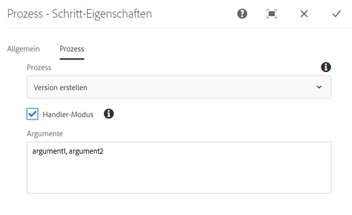

#### Java {#java-1}

Der folgende Java-Code ist die `execute`-Methode für eine `WorkflowProcess`-Implementierung. The method logs the value in the `args` `MetaDataMap` that is associated with the `PROCESS_ARGS` key.

```java
public void execute(WorkItem item, WorkflowSession session, MetaDataMap args) throws WorkflowException {
     if (args.containsKey("PROCESS_ARGS")){
      log.info("workflow metadata for key PROCESS_ARGS and value {}",args.get("PROCESS_ARGS","string").toString());
     }
    }
```

Wenn ein Prozess-Schritt, der diese Java-Implementierung nutzt, ausgeführt wird, enthält das Protokoll den folgenden Eintrag:

```xml
16.02.2018 12:07:39.566 *INFO* [JobHandler: /var/workflow/instances/server0/2018-02-16/model_855140139900189:/content/we-retail/de] com.adobe.example.workflow.impl.process.LogArguments workflow metadata for key PROCESS_ARGS and value argument1, argument2
```

#### ECMA-Skript {#ecma-script-1}

Das folgende ECMA-Skript wird als Prozess für den **Prozess-Schritt** genutzt. Es protokolliert die Anzahl an Argumenten und die Argumentwerte:

```
var iterator = graniteWorkItem.getWorkflowData().getMetaDataMap().keySet().iterator();
while (iterator.hasNext()){
    var key = iterator.next();
    log.info("Workflow metadata key, value = " + key.toString() + ", " + graniteWorkItem.getWorkflowData().getMetaDataMap().get(key));
}
log.info("hardcodedKey "+ graniteWorkItem.getWorkflowData().getMetaDataMap().get("hardcodedKey"));
log.info("currentDateInMillisKey "+ graniteWorkItem.getWorkflowData().getMetaDataMap().get("currentDateInMillisKey"));
```

>[!NOTE]
>
>In diesem Abschnitt wird die Verwendung von Argumenten für Prozess-Schritte beschrieben. Diese Erklärung gilt auch für die Auswahl von dynamischen Teilnehmern.

>[!NOTE]
>Ein weiteres Beispiel für das Speichern von Komponenteneigenschaften in Workflow-Metadaten finden Sie unter Beispiel: Erstellen eines Logger-Workflow-Schritts. Dieses Beispiel enthält ein Dialogfeld, das den Metadatenwert mit einem anderen Schlüssel als PROCESS_ARGS verknüpft.

### Skripte und Prozessargumente {#scripts-and-process-arguments}

In einem Skript für eine **Prozess-Schritt-Komponente** sind die Argumente über das Objekt `args` verfügbar.

When creating a custom step component, the object `metaData` is available in a script. Dieses Objekt ist auf ein einziges String-Argument beschränkt.

## Entwickeln von Prozess-Schrittimplementierungen {#developing-process-step-implementations}

Wenn Prozess-Schritte während eines Workflow-Prozesses gestartet werden, senden die Schritte eine Anfrage an einen OSGi-Dienst oder führen ein ECMA-Skript aus. Entwickeln Sie den Dienst oder das ECMA-Skript, der bzw. das die Aktionen ausführt, die für Ihren Workflow erforderlich sind.

>[!NOTE]
>
>Informationen zum Verknüpfen der Prozess-Schritt-Komponente mit dem Dienst oder Skript finden Sie unter [Prozess-Schritt](/help/sites-developing/workflows-step-ref.md#process-step) oder [Überschreiben der Schritt-Implementierung](#overriding-the-step-implementation).

### Implementieren eines Prozess-Schritts mit einer Java-Klasse {#implementing-a-process-step-with-a-java-class}

So definieren Sie einen Prozess-Schritt als OSGi-Dienstkomponente (Java-Bundle):

1. Erstellen Sie das Bundle und stellen Sie es im OSGi-Container bereit. Refer to the documentation about creating a bundle with [CRXDE Lite](/help/sites-developing/developing-with-crxde-lite.md) or [Eclipse](/help/sites-developing/howto-projects-eclipse.md).

   >[!NOTE]
   >
   >The OSGI component needs to implement the `WorkflowProcess` interface with its `execute()` method. Siehe Beispielcode unten.

   >[!NOTE]
   >
   >The package name needs to be added to the `<*Private-Package*>` section of the `maven-bundle-plugin` configuration.

1. Add the SCR property `process.label`  and set the value as you require. This will be the name which your process step is listed as when using the generic **Process Step** component. Siehe Beispiel unten.
1. In the **Models** editor, add the process step to the workflow using the generic **Process Step** component.
1. In the edit dialog (of the **Process Step**), go to the **Process** tab and select your process implementation.
1. If you use arguments in your code, set the **Process Arguments**. Beispiel: false.
1. Speichern Sie die Änderungen für den Schritt und das Workflow-Modell (obere linke Ecke des Modell-Editors).

Die Java-Methoden, respektive die Klassen, die ausführbare Java-Methoden implementieren, werden als OSGi-Dienste implementiert, sodass Sie Methoden jederzeit während der Laufzeit hinzufügen können.

Die folgende OSGi-Komponente fügt die Eigenschaft `approved` zum Seiteninhaltsknoten hinzu, wenn die Nutzlast eine Seite ist:

```java
package com.adobe.example.workflow.impl.process;

import com.adobe.granite.workflow.WorkflowException;
import com.adobe.granite.workflow.WorkflowSession;
import com.adobe.granite.workflow.exec.WorkItem;
import com.adobe.granite.workflow.exec.WorkflowData;
import com.adobe.granite.workflow.exec.WorkflowProcess;
import com.adobe.granite.workflow.metadata.MetaDataMap;

import org.apache.felix.scr.annotations.Component;
import org.apache.felix.scr.annotations.Property;
import org.apache.felix.scr.annotations.Service;

import org.osgi.framework.Constants;

import javax.jcr.Node;
import javax.jcr.RepositoryException;
import javax.jcr.Session;

/**
 * Sample workflow process that sets an <code>approve</code> property to the payload based on the process argument value.
 */
@Component
@Service
public class MyProcess implements WorkflowProcess {

 @Property(value = "An example workflow process implementation.")
 static final String DESCRIPTION = Constants.SERVICE_DESCRIPTION;
 @Property(value = "Adobe")
 static final String VENDOR = Constants.SERVICE_VENDOR;
 @Property(value = "My Sample Workflow Process")
 static final String LABEL="process.label";

 private static final String TYPE_JCR_PATH = "JCR_PATH";

 public void execute(WorkItem item, WorkflowSession session, MetaDataMap args) throws WorkflowException {
  WorkflowData workflowData = item.getWorkflowData();
  if (workflowData.getPayloadType().equals(TYPE_JCR_PATH)) {
   String path = workflowData.getPayload().toString() + "/jcr:content";
   try {
    Session jcrSession = session.adaptTo(Session.class);
    Node node = (Node) jcrSession.getItem(path);
    if (node != null) {
     node.setProperty("approved", readArgument(args));
     jcrSession.save();
    }
   } catch (RepositoryException e) {
    throw new WorkflowException(e.getMessage(), e);
   }
  }
 }

 private boolean readArgument(MetaDataMap args) {
  String argument = args.get("PROCESS_ARGS", "false");
  return argument.equalsIgnoreCase("true");
 }
}
```

>[!NOTE]
>
>Wenn der Prozess drei Mal hintereinander fehlschlägt, wird ein Element im Posteingang des Workflow-Administrators platziert.

### Verwenden von ECMA-Skripten {#using-ecmascript}

Mit ECMA-Skripten können Skriptentwickler Prozess-Schritte implementieren. Die Skripte befinden sich im JCR-Repository und werden von dort aus ausgeführt.

In der folgenden Tabelle sind die Variablen aufgeführt, die Prozess-Skripten unmittelbar zur Verfügung stehen und Zugriff auf Objekte der Workflow-Java-API bieten.

| Java-Klasse | Name der Skriptvariablen | Beschreibung |
|---|---|---|
| `com.adobe.granite.workflow.exec.WorkItem` | `graniteWorkItem` | Die aktuelle Schrittinstanz. |
| `com.adobe.granite.workflow.WorkflowSession` | `graniteWorkflowSession` | Die Workflow-Sitzung der aktuellen Schrittinstanz. |
| `String[]` (enthält Prozessargumente) | `args` | Die step-Argumente. |
| `com.adobe.granite.workflow.metadata.MetaDataMap` | `metaData` | Die Metadaten der aktuellen Schrittinstanz. |
| `org.apache.sling.scripting.core.impl.InternalScriptHelper` | `sling` | Bietet Zugriff auf die Sling-Laufzeit-Umgebung. |

Das folgende Beispielskript zeigt den Zugriff auf den JCR-Knoten, der die Workflow-Nutzlast repräsentiert. Die Variable `graniteWorkflowSession` ist an eine JCR-Sitzungsvariable angepasst, mit der der Knoten vom Nutzlastpfad abgerufen wird.

```
var workflowData = graniteWorkItem.getWorkflowData();
if (workflowData.getPayloadType() == "JCR_PATH") {
    var path = workflowData.getPayload().toString();
    var jcrsession = graniteWorkflowSession.adaptTo(Packages.javax.jcr.Session);
    var node = jcrsession.getNode(path);
    if (node.hasProperty("approved")){
     node.setProperty("approved", args[0] == "true" ? true : false);
     node.save();
 }
}
```

The following script checks if the payload is an image ( `.png` file), creates a black and white image from it, and saves it as a sibling node.

```
var workflowData = graniteWorkItem.getWorkflowData();
if (workflowData.getPayloadType() == "JCR_PATH") {
    var path = workflowData.getPayload().toString();
    var jcrsession = graniteWorkflowSession.adaptTo(Packages.javax.jcr.Session);
    var node = jcrsession.getRootNode().getNode(path.substring(1));
     if (node.isNodeType("nt:file") && node.getProperty("jcr:content/jcr:mimeType").getString().indexOf("image/") == 0) {
        var is = node.getProperty("jcr:content/jcr:data").getStream();
        var layer = new Packages.com.day.image.Layer(is);
        layer.grayscale();
                var parent = node.getParent();
                var gn = parent.addNode("grey" + node.getName(), "nt:file");
        var content = gn.addNode("jcr:content", "nt:resource");
                content.setProperty("jcr:mimeType","image/png");
                var cal = Packages.java.util.Calendar.getInstance();
                content.setProperty("jcr:lastModified",cal);
                var f = Packages.java.io.File.createTempFile("test",".png");
        var tout = new Packages.java.io.FileOutputStream(f);
        layer.write("image/png", 1.0, tout);
        var fis = new Packages.java.io.FileInputStream(f);
                content.setProperty("jcr:data", fis);
                parent.save();
        tout.close();
        fis.close();
        is.close();
        f.deleteOnExit();
    }
}
```

So verwenden Sie das Skript:

1. Create the script (for example with CRXDE Lite) and save it in the repository below `/apps/myapp/workflow/scripts`
1. Um einen Titel festzulegen, der das Skript im Dialogfeld „Bearbeiten“ von **Prozess-Schritt** identifiziert, fügen Sie die folgenden Eigenschaften zum Knoten `jcr:content` Ihres Skripts hinzu:

   | Name | Typ | Wert |
   |---|---|---|
   | `jcr:mixinTypes` | `Name[]` | `mix:title` |
   | `jcr:title` | `String` | Der Name, der im Dialogfeld &quot;Bearbeiten&quot;angezeigt wird. |

1. Bearbeiten Sie die **Prozess-Schritt**-Instanz und legen Sie das zu verwendende Skript fest.

## Entwickeln von Teilnehmer-Auswahlen {#developing-participant-choosers}

Sie können Teilnehmer-Auswahlen für **Dynamischer-Teilnehmer-Schritt**-Komponenten entwickeln.

When a **Dynamic Participant Step** component is started during a workflow, the step needs to detemine the participant to which the generated work item can be assigned. Dazu geht der Schritt auf eine der folgenden Weisen vor:

* sendet eine Anforderung an einen OSGi-Dienst
* Er führt ein ECMA-Skript zur Auswahl des Teilnehmers aus.

Sie können einen Dienst oder ein ECMA-Skript entwickeln, der bzw. das den Teilnehmer basierend auf den Anforderungen des Workflows auswählt.

>[!NOTE]
>
>Informationen zum Verknüpfen der Komponente **Dynamic Participant Step** mit dem Dienst oder dem Skript finden Sie unter [Dynamischer-Teilnehmer-Schritt](/help/sites-developing/workflows-step-ref.md#dynamic-participant-step) oder [Überschreiben der Schritt-Implementierung](#persisting-and-accessing-data).

### Entwickeln einer Teilnehmer-Auswahl mit einer Java-Klasse {#developing-a-participant-chooser-using-a-java-class}

So definieren Sie einen Teilnehmer-Schritt als OSGi-Dienstkomponente (Java-Bundle):

1. The OSGI component needs to implement the `ParticipantStepChooser` interface with its `getParticipant()` method. Siehe Beispielcode unten.

   Erstellen Sie das Bundle und stellen Sie es im OSGi-Container bereit.

1. Add the SCR property `chooser.label` and set the value as required. This will be the name as which your participant chooser is listed, using the **Dynamic Participant Step** component. Siehe folgendes Beispiel:

   ```java
   package com.adobe.example.workflow.impl.process;
   
   import com.adobe.granite.workflow.WorkflowException;
   import com.adobe.granite.workflow.WorkflowSession;
   import com.adobe.granite.workflow.exec.ParticipantStepChooser;
   import com.adobe.granite.workflow.exec.WorkItem;
   import com.adobe.granite.workflow.exec.WorkflowData;
   import com.adobe.granite.workflow.metadata.MetaDataMap;
   
   import org.apache.felix.scr.annotations.Component;
   import org.apache.felix.scr.annotations.Property;
   import org.apache.felix.scr.annotations.Service;
   
   import org.osgi.framework.Constants;
   
   /**
    * Sample dynamic participant step that determines the participant based on a path given as argument.
    */
   @Component
   @Service
   
   public class MyDynamicParticipant implements ParticipantStepChooser {
   
    @Property(value = "An example implementation of a dynamic participant chooser.")
    static final String DESCRIPTION = Constants.SERVICE_DESCRIPTION;
       @Property(value = "Adobe")
       static final String VENDOR = Constants.SERVICE_VENDOR;
       @Property(value = "Dynamic Participant Chooser Process")
       static final String LABEL=ParticipantStepChooser.SERVICE_PROPERTY_LABEL;
   
       private static final String TYPE_JCR_PATH = "JCR_PATH";
   
       public String getParticipant(WorkItem workItem, WorkflowSession workflowSession, MetaDataMap args) throws WorkflowException {
           WorkflowData workflowData = workItem.getWorkflowData();
           if (workflowData.getPayloadType().equals(TYPE_JCR_PATH)) {
               String path = workflowData.getPayload().toString();
               String pathFromArgument = args.get("PROCESS_ARGS", String.class);
               if (pathFromArgument != null && path.startsWith(pathFromArgument)) {
                   return "admin";
               }
           }
           return "administrators";
       }
   }
   ```

1. In the **Models** editor, add the dynamic participant step to the workflow using the generic **Dynamic Participant Step** component.
1. In the edit dialog select the **Participant Chooser** tab and select your chooser implementation.
1. If you use arguments in your code set the **Process Arguments**. Für dieses Beispiel: `/content/we-retail/de`.
1. Speichern Sie die Änderungen für den Schritt und das Workflow-Modell.

### Entwickeln einer Teilnehmer-Auswahl mit einem ECMA-Skript {#developing-a-participant-chooser-using-an-ecma-script}

Sie können ein ECMA-Skript erstellen, das den Benutzer auswählt, dem das vom **Teilnehmer-Schritt** erzeugte Arbeitselement zugewiesen wird. Das Skript muss eine Funktion namens `getParticipant` enthalten, das keine Argumente benötigt und einen `String` zurückgibt, der die ID eines Benutzers oder einer Gruppe enthält.

Die Skripte befinden sich im JCR-Repository und werden von dort aus ausgeführt.

In der folgenden Tabelle sind die Variablen aufgeführt, die unmittelbaren Zugriff auf Workflow-Java-Objekte in Ihren Skripten bereitstellen.

| Java-Klasse | Name der Skriptvariablen |
|---|---|
| `com.adobe.granite.workflow.exec.WorkItem` | `graniteWorkItem` |
| `com.adobe.granite.workflow.WorkflowSession` | `graniteWorkflowSession` |
| `String[]` (enthält Prozessargumente) | `args` |
| `com.adobe.granite.workflow.metadata.MetaDataMap` | `metaData` |
| `org.apache.sling.scripting.core.impl.InternalScriptHelper` | `sling` |

```
function getParticipant() {
    var workflowData = graniteWorkItem.getWorkflowData();
    if (workflowData.getPayloadType() == "JCR_PATH") {
        var path = workflowData.getPayload().toString();
        if (path.indexOf("/content/we-retail/de") == 0) {
            return "admin";
        } else {
            return "administrators";
        }
    }
}
```

1. Create the script (for example with CRXDE Lite) and save it in the repository below `/apps/myapp/workflow/scripts`
1. Um einen Titel festzulegen, der das Skript im Dialogfeld „Bearbeiten“ von **Prozess-Schritt** identifiziert, fügen Sie die folgenden Eigenschaften zum Knoten `jcr:content` Ihres Skripts hinzu:

   | Name | Typ | Wert |
   |---|---|---|
   | `jcr:mixinTypes` | `Name[]` | `mix:title` |
   | `jcr:title` | `String` | Der Name, der im Dialogfeld &quot;Bearbeiten&quot;angezeigt wird. |

1. Edit the [Dynamic Participant Step](/help/sites-developing/workflows-step-ref.md#dynamic-participant-step) instance and specify the script to be used.

## Verarbeiten von Workflow-Paketen {#handling-workflow-packages}

[Workflow-Pakete](/help/sites-authoring/workflows-applying.md#specifying-workflow-details-in-the-create-workflow-wizard) können zur Verarbeitung an einen Workflow weitergegeben werden. Workflow-Pakete enthalten Verweise auf Ressourcen wie Seiten und Assets.

>[!NOTE]
>
>Die folgenden Workflow-Prozess-Schritte akzeptieren Workflow-Pakete für die Massen-Seitenaktivierung:
>
>* [`com.day.cq.wcm.workflow.process.ActivatePageProcess`](https://helpx.adobe.com/experience-manager/6-5/sites/developing/using/reference-materials/javadoc/com/day/cq/wcm/workflow/process/ActivatePageProcess.html)
>* [`com.day.cq.wcm.workflow.process.DeactivatePageProcess`](https://helpx.adobe.com/experience-manager/6-5/sites/developing/using/reference-materials/javadoc/com/day/cq/wcm/workflow/process/DeactivatePageProcess.html)
>


Sie können Workflow-Schritte entwickeln, die die Paketressourcen abrufen und verarbeiten. Die folgenden Elemente des Pakets `com.day.cq.workflow.collection` bieten Zugriff auf Workflow-Pakete:

* `ResourceCollection`: Workflow-Paketklasse.
* `ResourceCollectionUtil`: Zum Abrufen von ResourceCollection-Objekten
* `ResourceCollectionManager`: Erstellt und ruft Sammlungen ab. Eine Implementierung wird als OSGi-Dienst. bereitgestellt.

Die folgende Beispiel-Java-Klasse zeigt, wie Paketressourcen abgerufen werden:

```java
package com.adobe.example;

import java.util.ArrayList;
import java.util.List;

import com.day.cq.workflow.WorkflowException;
import com.day.cq.workflow.WorkflowSession;
import com.day.cq.workflow.collection.ResourceCollection;
import com.day.cq.workflow.collection.ResourceCollectionManager;
import com.day.cq.workflow.collection.ResourceCollectionUtil;
import com.day.cq.workflow.exec.WorkItem;
import com.day.cq.workflow.exec.WorkflowData;
import com.day.cq.workflow.exec.WorkflowProcess;
import com.day.cq.workflow.metadata.MetaDataMap;

import org.apache.felix.scr.annotations.Component;
import org.apache.felix.scr.annotations.Property;
import org.apache.felix.scr.annotations.Service;
import org.apache.felix.scr.annotations.Reference;
import org.osgi.framework.Constants;

import org.slf4j.Logger;
import org.slf4j.LoggerFactory;

import javax.jcr.Node;
import javax.jcr.PathNotFoundException;
import javax.jcr.RepositoryException;
import javax.jcr.Session;

@Component
@Service
public class LaunchBulkActivate implements WorkflowProcess {

 private static final Logger log = LoggerFactory.getLogger(LaunchBulkActivate.class);

 @Property(value="Bulk Activate for Launches")
  static final String PROCESS_NAME ="process.label";
 @Property(value="A sample workflow process step to support Launches bulk activation of pages")
 static final String SERVICE_DESCRIPTION = Constants.SERVICE_DESCRIPTION;

 @Reference
 private ResourceCollectionManager rcManager;
public void execute(WorkItem workItem, WorkflowSession workflowSession) throws Exception {
    Session session = workflowSession.getSession();
    WorkflowData data = workItem.getWorkflowData();
    String path = null;
    String type = data.getPayloadType();
    if (type.equals(TYPE_JCR_PATH) && data.getPayload() != null) {
        String payloadData = (String) data.getPayload();
        if (session.itemExists(payloadData)) {
            path = payloadData;
        }
    } else if (data.getPayload() != null && type.equals(TYPE_JCR_UUID)) {
        Node node = session.getNodeByUUID((String) data.getPayload());
        path = node.getPath();
    }

    // CUSTOMIZED CODE IF REQUIRED....

    if (path != null) {
        // check for resource collection
        ResourceCollection rcCollection = ResourceCollectionUtil.getResourceCollection((Node)session.getItem(path), rcManager);
        // get list of paths to replicate (no resource collection: size == 1
        // otherwise size >= 1
        List<String> paths = getPaths(path, rcCollection);
        for (String aPath: paths) {

            // CUSTOMIZED CODE....

        }
    } else {
        log.warn("Cannot process because path is null for this " + "workitem: " + workItem.toString());
    }
}

/**
 * helper
 */
private List<String> getPaths(String path, ResourceCollection rcCollection) {
    List<String> paths = new ArrayList<String>();
    if (rcCollection == null) {
        paths.add(path);
    } else {
        log.debug("ResourceCollection detected " + rcCollection.getPath());
        // this is a resource collection. the collection itself is not
        // replicated. only its members
        try {
            List<Node> members = rcCollection.list(new String[]{"cq:Page", "dam:Asset"});
            for (Node member: members) {
                String mPath = member.getPath();
                paths.add(mPath);
            }
        } catch(RepositoryException re) {
            log.error("Cannot build path list out of the resource collection " + rcCollection.getPath());
        }
    }
    return paths;
}
}
```

## Beispiel: Erstellen eines angepassten Schritts {#example-creating-a-custom-step}

Eine einfache Möglichkeit, einen eigenen angepassten Schritt zu erstellen, besteht darin, einen vorhandenen Schritt aus folgendem Verzeichnis zu kopieren:

`/libs/cq/workflow/components/model`

### Erstellen des Basisschritts {#creating-the-basic-step}

1. Erstellen Sie den Pfad unter /apps erneut, z. B.:

   `/apps/cq/workflow/components/model`

   The new folders are of type `nt:folder`:

   ```xml
   - apps
     - cq
       - workflow (nt:folder)
         - components (nt:folder)
           - model (nt:folder)
   ```

   >[!NOTE]
   >
   >Dieser Schritt gilt nicht für den Modell-Editor in der klassischen Benutzeroberfläche

1. Fügen Sie dann den kopierten Schritt in den Ordner /apps ein, z. B. als:

   `/apps/cq/workflow/components/model/myCustomStep`

   Hier sehen Sie das Ergebnis unseres Beispiels für einen angepassten Schritt:

   

   >[!CAUTION]
   >
   >Da in der Standard-Benutzeroberfläche nur der Titel auf der Karte angezeigt wird, die Details dagegen nicht, wird die Datei `details.jsp` anders als beim Editor der klassischen Benutzeroberfläche nicht benötigt.

1. Fügen Sie dem Knoten die folgenden Eigenschaften hinzu:

   `/apps/cq/workflow/components/model/myCustomStep`

   **Relevante Eigenschaften:**

   * `sling:resourceSuperType`

      Muss von einem vorhandenen Schritt übernommen werden.

      In this example we are inheriting from the base step at `cq/workflow/components/model/step`, but you can use other super types like `participant`, `process`, etc.

   * `jcr:title`

      Das ist der Titel, der angezeigt wird, wenn die Komponente im Schritt-Browser aufgeführt wird (linkes Feld im Workflow-Modell-Editor).

   * `cq:icon`

      Used to specify a [Coral icon](https://helpx.adobe.com/experience-manager/6-5/sites/developing/using/reference-materials/coral-ui/coralui3/Coral.Icon.html) for the step.

   * `componentGroup`

      muss einer der folgenden sein:

      * Kollaboration-Workflow
      * DAM-Workflow
      * Formular-Workflow
      * Projekte
      * WCM-Workflow
      * Workflow
   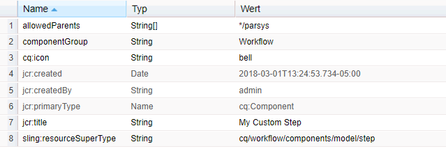

1. Sie können jetzt ein Workflow-Modell zur Bearbeitung öffnen. Im Schritt-Browser können Sie einen Filter nutzen, um **Mein angepasster Schritt** anzuzeigen:

   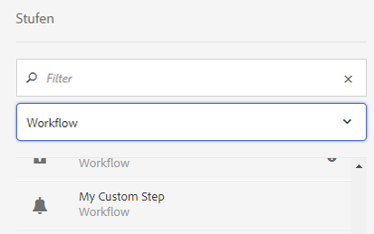

   Wenn Sie **Mein angepasster Schritt** auf das Modell ziehen, wird die Karte angezeigt:

   

   Wenn kein `cq:icon` für den Schritt definiert wurde, wird ein Standardsymbol mit den ersten zwei Buchstaben des Titels angezeigt. Beispiel:

   

#### Definieren des Schritt-Dialogfelds „Konfigurieren“{#defining-the-step-configure-dialog}

Nach dem [Erstellen des Basisschritts](#creating-the-basic-step) definieren Sie den Schritt **Konfigurieren** wie folgt:

1. Configure the properties on the node `cq:editConfig` as follows:

   **Relevante Eigenschaften:**

   * `cq:inherit`

      When set to `true`, then your step component will inherit properties from the step you specified in `sling:resourceSuperType`.

   * `cq:disableTargeting`

      Legen Sie die gewünschten Einstellungen fest.
   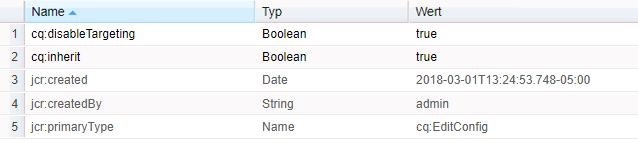

1. Configure the properties on the node `cq:formsParameter` as follows:

   **Relevante Eigenschaften:**

   * `jcr:title`

      Legt den Standardtitel auf der Schritt-Karte in der Modellzuordnung und im Feld **Titel** des Konfigurationsdialogfelds **Mein angepasster Schritt – Eigenschaften** fest.

   * Sie können auch Ihre eigenen angepassten Eigenschaften definieren.
   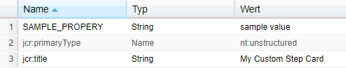

1. Configure the properties on the node `cq:listeners`.

   Mit dem Knoten `cq:listener` und seinen Eigenschaften können Sie Ereignis-Handler festlegen, die auf Ereignisse im Modell-Editor der Touch-optimierten Benutzeroberfläche reagieren, z. B. wenn ein Schritt auf eine Modellseite gezogen wird oder Schritteigenschaften bearbeitet werden.

   **Relevante Eigenschaften:**

   * `afterMove: REFRESH_PAGE`
   * `afterdelete: CQ.workflow.flow.Step.afterDelete`
   * `afteredit: CQ.workflow.flow.Step.afterEdit`
   * `afterinsert: CQ.workflow.flow.Step.afterInsert`
   Diese Konfiguration ist für das einwandfreie Funktionieren des Editors unabdingbar. In den meisten Fällen darf diese Konfiguration nicht geändert werden.

   Wenn Sie jedoch `cq:inherit` auf „true“ festlegen (auf dem Knoten `cq:editConfig`, s. o.), können Sie diese Konfiguration erben, ohne sie explizit in die Schrittdefinition einschließen zu müssen. Wenn keine Vererbung vorliegt, müssen Sie diesen Knoten mit den folgenden Eigenschaften und Werten hinzufügen.

   In diesem Beispiel wurde die Vererbung aktiviert, sodass wir den Knoten `cq:listeners` entfernen könnten und der Schritt trotzdem funktionieren würde.

   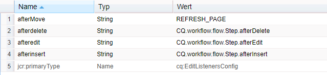

1. Sie können nun eine Instanz Ihres Schritts zu einem Workflow-Modell hinzufügen. Beim **Konfigurieren** des Schritts wird das folgende Dialogfeld angezeigt:

   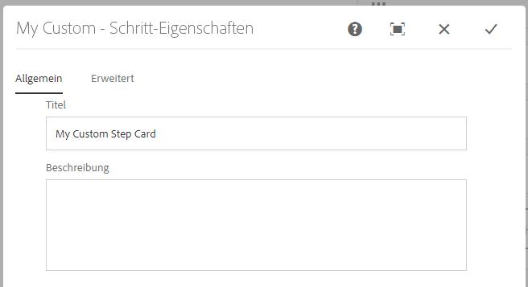 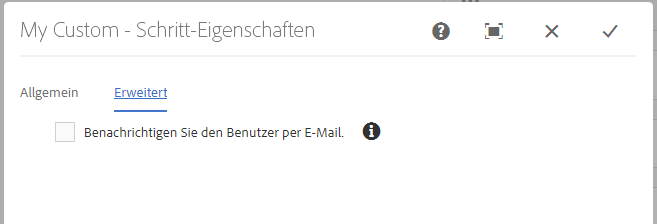

#### In diesem Beispiel verwendetes Beispiel-Markup {#sample-markup-used-in-this-example}

Markup for a custom step is be represented in the `.content.xml` of the component root node. The sample `.content.xml` used for this example:

`/apps/cq/workflow/components/model/myCustomStep/.content.xml`

```xml
<?xml version="1.0" encoding="UTF-8"?>
<jcr:root xmlns:sling="https://sling.apache.org/jcr/sling/1.0" xmlns:cq="https://www.day.com/jcr/cq/1.0" xmlns:jcr="https://www.jcp.org/jcr/1.0"
    cq:icon="bell"
    jcr:primaryType="cq:Component"
    jcr:title="My Custom Step"
    sling:resourceSuperType="cq/workflow/components/model/process"
    allowedParents="[*/parsys]"
    componentGroup="Workflow"/>
```

The `_cq_editConfig.xml` sample used in this example:

```xml
<?xml version="1.0" encoding="UTF-8"?>
<jcr:root xmlns:cq="https://www.day.com/jcr/cq/1.0" xmlns:jcr="https://www.jcp.org/jcr/1.0" xmlns:nt="https://www.jcp.org/jcr/nt/1.0"
    cq:disableTargeting="{Boolean}true"
    cq:inherit="{Boolean}true"
    jcr:primaryType="cq:EditConfig">
    <cq:formParameters
        jcr:primaryType="nt:unstructured"
        jcr:title="My Custom Step Card"
        SAMPLE_PROPERY="sample value"/>
    <cq:listeners
        jcr:primaryType="cq:EditListenersConfig"
        afterdelete="CQ.workflow.flow.Step.afterDelete"
        afteredit="CQ.workflow.flow.Step.afterEdit"
        afterinsert="CQ.workflow.flow.Step.afterInsert"
        afterMove="REFRESH_PAGE"/>
</jcr:root>
```

The `_cq_dialog/.content.xml` sample used in this example:

```xml
<?xml version="1.0" encoding="UTF-8"?>
<jcr:root xmlns:sling="https://sling.apache.org/jcr/sling/1.0" xmlns:cq="https://www.day.com/jcr/cq/1.0" xmlns:jcr="https://www.jcp.org/jcr/1.0" xmlns:nt="https://www.jcp.org/jcr/nt/1.0"
    jcr:primaryType="nt:unstructured"
    jcr:title="My Custom - Step Properties"
    sling:resourceType="cq/gui/components/authoring/dialog">
    <content
        jcr:primaryType="nt:unstructured"
        sling:resourceType="granite/ui/components/coral/foundation/tabs">
        <items jcr:primaryType="nt:unstructured">
            <common
                cq:hideOnEdit="true"
                jcr:primaryType="nt:unstructured"
                jcr:title="Common"
                sling:resourceType="granite/ui/components/coral/foundation/fixedcolumns"/>
            <process
                cq:hideOnEdit="true"
                jcr:primaryType="nt:unstructured"
                jcr:title="Process"
                sling:resourceType="granite/ui/components/coral/foundation/fixedcolumns"/>
            <mycommon
                jcr:primaryType="nt:unstructured"
                jcr:title="Common"
                sling:resourceType="granite/ui/components/coral/foundation/fixedcolumns">
                <items jcr:primaryType="nt:unstructured">
                    <columns
                        jcr:primaryType="nt:unstructured"
                        sling:resourceType="granite/ui/components/coral/foundation/container">
                        <items jcr:primaryType="nt:unstructured">
                            <title
                                jcr:primaryType="nt:unstructured"
                                sling:resourceType="granite/ui/components/coral/foundation/form/textfield"
                                fieldLabel="Title"
                                name="./jcr:title"/>
                            <description
                                jcr:primaryType="nt:unstructured"
                                sling:resourceType="granite/ui/components/coral/foundation/form/textarea"
                                fieldLabel="Description"
                                name="./jcr:description"/>
                        </items>
                    </columns>
                </items>
            </mycommon>
            <advanced
                jcr:primaryType="nt:unstructured"
                jcr:title="Advanced"
                sling:resourceType="granite/ui/components/coral/foundation/fixedcolumns">
                <items jcr:primaryType="nt:unstructured">
                    <columns
                        jcr:primaryType="nt:unstructured"
                        sling:resourceType="granite/ui/components/coral/foundation/container">
                        <items jcr:primaryType="nt:unstructured">
                            <email
                                jcr:primaryType="nt:unstructured"
                                sling:resourceType="granite/ui/components/coral/foundation/form/checkbox"
                                fieldDescription="Notify user via email."
                                fieldLabel="Email"
                                name="./metaData/PROCESS_AUTO_ADVANCE"
                                text="Notify user via email."
                                value="true"/>
                        </items>
                    </columns>
                </items>
            </advanced>
        </items>
    </content>
</jcr:root>
```

>[!NOTE]
>
>Beachten Sie die allgemeinen und die Prozessknoten in der Dialogfeld-Definition. Sie werden von dem Prozess-Schritt geerbt, den wir als Supertyp für den angepassten Schritt verwendet haben:
>
>`sling:resourceSuperType : cq/workflow/components/model/process`

>[!NOTE]
>
>Die Modell-Editor-Dialogfelder der klassischen Benutzeroberfläche funktionieren auch weiterhin mit dem standardmäßigen Editor für die Touch-optimierte Benutzeroberfläche.
>
>AEM verfügt allerdings über ein Tool zur [Dialogfeldumwandlung](/help/sites-developing/dialog-conversion.md), wenn Sie die Schrittdialogfelder der klassischen Benutzeroberfläche für die Standard-Benutzeroberfläche konvertieren möchten. Nach der Umwandlung können Sie das Dialogfeld für bestimmte Fälle noch manuell verbessern.
>
>* In cases where an upgraded dialog is empty you can look at dialogs in `/libs` that have similar functionality as examples of how to provide a solution. Beispiel:
   >
   >
* `/libs/cq/workflow/components/model`
>* `/libs/cq/workflow/components/workflow`
>* `/libs/dam/components`
>* `/libs/wcm/workflow/components/autoassign`
>* `/libs/cq/projects`
>
>  
You must not modify anything in `/libs`, simply use them as examples. If you want to leverage any of the existing steps, copy them to `/apps` and modify them there.
