# Erstellen von Workflow-Modellen{#creating-workflow-models}

>[!CAUTION]
>
>Informationen zur Verwendung der klassischen Benutzeroberfläche finden Sie im Abschnitt [Dokumentation zu AEM 6.3](https://helpx.adobe.com/de/experience-manager/6-3/help/sites-developing/workflows-models.html) als Referenz.

Sie erstellen ein [Workflow-Modell](/help/sites-developing/workflows.md#model), um die Schritte zu definieren, die beim Starten des Workflows ausgeführt werden. Sie können auch Modelleigenschaften definieren, um beispielsweise festzulegen, ob es sich um einen Übergangs-Workflow oder einen Workflow mit mehreren Ressourcen handelt.

Wenn eine Benutzerin bzw. ein Benutzer einen Workflow startet, wird eine Instanz gestartet. Dies ist das entsprechende Laufzeitmodell, das erstellt wird, wenn Sie Ihre Änderungen [synchronisieren](#sync-your-workflow-generate-a-runtime-model).

## Erstellen eines neuen Workflows {#creating-a-new-workflow}

Wenn Sie ein Workflow-Modell neu erstellen, enthält es zunächst:

* Die Schritte **Fluss-Start** und **Fluss-Ende**.
Diese stellen den Anfang und das Ende des Workflows dar. Diese Schritte sind erforderlich und können nicht bearbeitet bzw. entfernt werden.
* Ein **Teilnehmer**-Beispielschritt namens **Schritt 1**.
Dieser Schritt ist so konfiguriert, dass er dem Workflow-Initiator ein Arbeitselement zuordnet. Sie können diesen Schritt nach Bedarf bearbeiten oder löschen und Schritte hinzufügen.

So erstellen Sie einen Workflow mit dem Editor:

1. Öffnen Sie die **Workflow-Modelle-Konsole** über **Tools** > **Workflow** > **Modelle** oder beispielsweise über: [https://localhost:4502/aem/workflow](https://localhost:4502/aem/workflow)
1. Wählen Sie **Erstellen** und dann **Modell erstellen** aus.
1. Das Dialogfeld **Arbeitsablaufmodell hinzufügen** wird angezeigt. Geben Sie **Titel** und **Namen** (optional) ein, bevor Sie **Fertig** auswählen.
1. Das neue Modell wird nun in der **Workflow-Modelle-Konsole** aufgeführt.
1. Wählen Sie Ihren neuen Workflow aus und öffnen Sie ihn dann, indem Sie auf [**Bearbeiten** klicken, um ihn zu konfigurieren](#editinganexistingworkflow):
   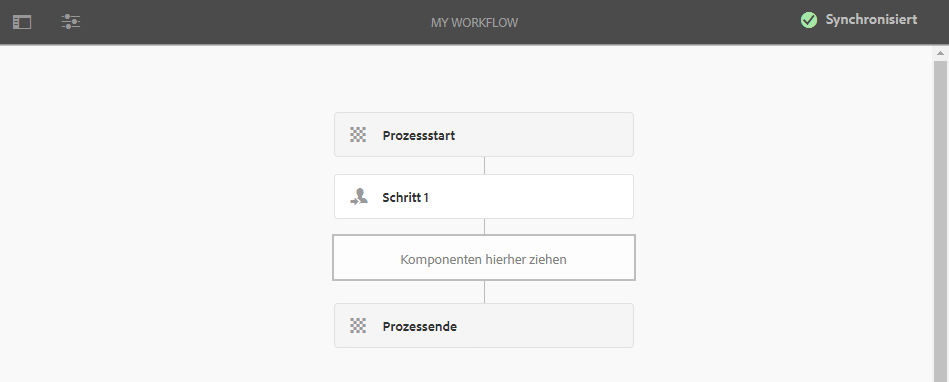

>[!NOTE]
>
>Wenn Sie Modelle programmgesteuert (mithilfe eines CRX-Pakets) erstellen, können Sie auch einen Unterordner erstellen:
>
>`/var/workflow/models`
>
>Beispiel: `/var/workflow/models/prototypes`
>
>Dieser Ordner kann dann zum [Verwalten des Zugriffs auf die Modelle in diesem Ordner](/help/sites-administering/workflows-managing.md#create-a-subfolder-in-var-workflow-models-and-apply-the-acl-to-that) verwendet werden.

## Bearbeiten eines Workflows {#editing-a-workflow}

Sie können jedes vorhandene Workflow-Modell bearbeiten, um:

* [Schritte](#addingasteptoamodel-) und ihre [Parameter](#configuring-a-workflow-step) zu definieren
* Workflow-Eigenschaften zu konfigurieren, einschließlich [Phasen](#configuring-workflow-stages-that-show-workflow-progress), [ob der Workflow vorübergehend ist](#creatingatransientworkflow-) und/oder [ ob er mehrere Ressourcen verwendet](#configuring-a-workflow-for-multi-resource-support)

Das Bearbeiten eines (vordefinierten) [**Standard- bzw. Legacy**-Workflows](#editing-a-default-or-legacy-workflow-for-the-first-time) umfasst einen zusätzlichen Schritt, um sicherzustellen, dass eine [sichere Kopie](/help/sites-developing/workflows-best-practices.md#locations-workflow-models) erstellt wird, bevor Sie Änderungen vornehmen.

Wenn Aktualisierungen Ihres Workflows abgeschlossen sind, müssen Sie **Synchronisieren** verwenden, um ein **Laufzeitmodell zu generieren**. Siehe [Synchronisieren eines Workflows](#sync-your-workflow-generate-a-runtime-model), um Details zu erfahren.

### Workflow synchronisieren – Laufzeitmodell generieren {#sync-your-workflow-generate-a-runtime-model}

**Synchronisieren** (direkt in der Editor-Symbolleiste) generiert ein [Laufzeitmodell](/help/sites-developing/workflows.md#runtime-model). Das Laufzeitmodell ist das Modell, das tatsächlich verwendet wird, wenn eine Benutzerin bzw. ein Benutzer einen Workflow startet. Wenn Sie Ihre Änderungen nicht durch Klicken auf **Sync** synchronisieren, stehen diese nicht zur Laufzeit zur Verfügung.

Wenn Sie (oder eine andere Person) Änderungen am Workflow vornehmen, müssen Sie **Synchronisieren** verwenden, um ein Laufzeitmodell zu generieren – selbst wenn einzelne Dialogfelder (z. B. für Schritte) eigene Speicheroptionen hatten.

Wenn die Änderungen mit dem (gespeicherten) Laufzeitmodell synchronisiert sind, wird stattdessen **Synchronisiert** angezeigt.

Einige Schritte verfügen über obligatorische Felder und/oder eine integrierte Validierung. Wenn diese Bedingungen nicht erfüllt sind, wird beim Versuch, einen Fehler angezeigt **Synchronisieren** das Modell. Etwa wenn für einen **Teilnehmer**-Schritt kein Teilnehmer definiert wurde:

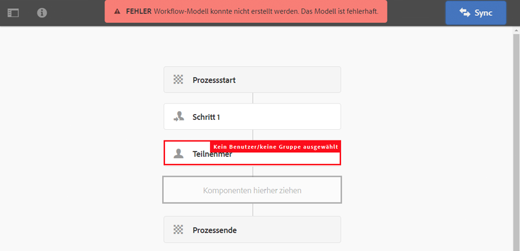

### Erstmalige Bearbeitung eines Standard- oder Legacy-Workflows {#editing-a-default-or-legacy-workflow-for-the-first-time}

Wenn Sie ein [Standard- bzw. Legacy-Modell](/help/sites-developing/workflows.md#workflow-types) zur Bearbeitung öffnen, finden Sie die folgenden Bedingungen vor:

* Der Schritte-Browser (auf der linken Seite) ist nicht verfügbar.
* Die Symbolleiste weist eine Option zum **Bearbeiten** auf (auf der rechten Seite).
* Zunächst werden das Modell und seine Eigenschaften im schreibgeschützten Modus wie folgt dargestellt:
   * Standard-Workflows befinden sich in `/libs`
   * Alte Workflows befinden sich unter `/etc`
Auswählen **Bearbeiten** wird:
* eine Kopie des Workflows unter `/conf` gespeichert
* der Schritte-Browser verfügbar gemacht
* es möglich, Änderungen vorzunehmen.

>[!NOTE]
>
>Unter [Speicherorte von Workflow-Modellen](/help/sites-developing/workflows-best-practices.md#locations-workflow-models) finden Sie weitere Informationen.

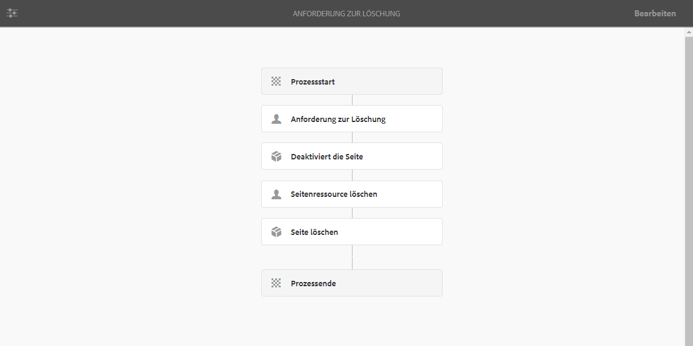

### Hinzufügen eines Schritts zu einem Modell {#adding-a-step-to-a-model}

Fügen Sie Schritte zu Ihrem Modell hinzu, um die auszuführende Aktivität darzustellen. Jeder Schritt führt eine bestimmte Aktivität aus. Eine Auswahl von Schrittkomponenten ist in einer AEM-Standardinstanz verfügbar.

Wenn Sie ein Modell bearbeiten, werden die verfügbaren Schritte in den verschiedenen Gruppen des **Schritte-Browsers** angezeigt. Beispiel:

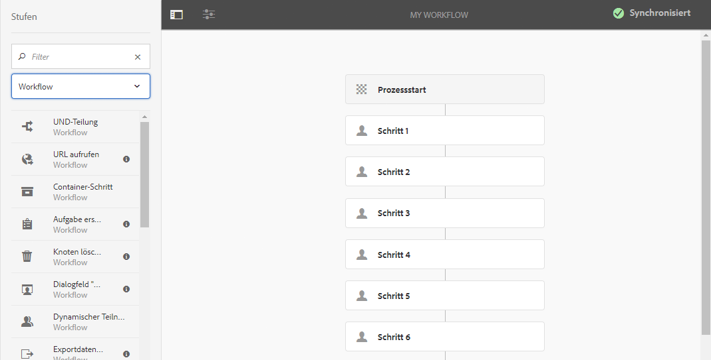

>[!NOTE]
>
>Informationen zu den Komponenten des primären Schritts, die mit AEM installiert werden, finden Sie in der [Referenz zu Workflow-Schritten](/help/sites-developing/workflows-step-ref.md).

So fügen Sie Schritte zum Workflow-Modell hinzu:

1. Öffnen Sie ein vorhandenes Workflow-Modell zur Bearbeitung. Wählen Sie in der **Workflow-Modelle-Konsole** das gewünschte Modell aus und klicken Sie anschließend auf **Bearbeiten**.
1. Öffnen Sie den Schritte-Browser, indem Sie ganz links in der oberen Symbolleiste das **Seitenbedienfeld umschalten**. Folgende Informationen/Optionen sind verfügbar:

   * Nach bestimmten Schritten **filtern**.
   * Verwenden Sie die Dropdown-Auswahl, um die Auswahl auf eine bestimmte Gruppe von Schritten zu beschränken.
   * Über das Symbol  zum Anzeigen von Breschreibungen können Sie weitere Informationen zum jeweiligen Schritt anzeigen.

   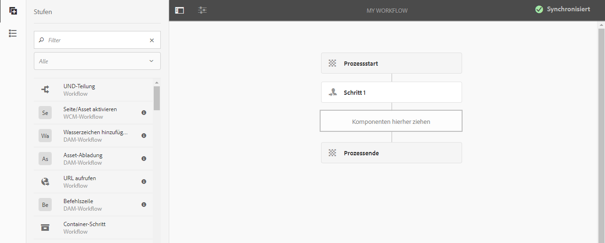

1. Ziehen Sie die entsprechenden Schritte an die gewünschte Position im Modell.

   Beispiel: ein **Teilnehmer-Schritt**.

   Nachdem Sie ihn zum Workflow hinzugefügt haben, können Sie [den Schritt konfigurieren](#configuring-a-workflow-step).

   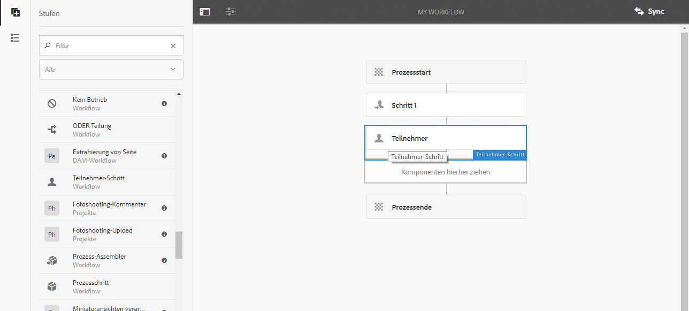

1. Fügen Sie nach Bedarf beliebig viele Schritte oder andere Aktualisierungen hinzu.

   Zur Laufzeit werden die Schritte in der Reihenfolge ausgeführt, in der sie im Modell angezeigt werden. Nachdem Sie Schrittkomponenten hinzugefügt haben, können Sie sie an eine andere Position im Modell ziehen.

   Sie können auch vorhandene Schritte kopieren, ausschneiden, einfügen, gruppieren oder löschen, wie mit dem [Seiteneditor.](/help/sites-authoring/editing-content.md)

   Unterteilte Schritte können auch mithilfe der Symbolleistenoption  ein- oder ausgeblendet werden. 

1. Bestätigen Sie Ihre Änderungen, indem Sie in der Editor-Symbolleiste auf **Sync** klicken, um das Laufzeitmodell zu generieren.

   Details finden Sie unter [Synchronisieren eines Workflows](#sync-your-workflow-generate-a-runtime-model).

### Konfigurieren eines Workflow-Schritts {#configuring-a-workflow-step}

Sie können das **Verhalten** von Workflow-Schritten über das Dialogfeld **Schritt-Eigenschaften** konfigurieren und anpassen.

1. So öffnen Sie das Dialogfeld **Schritt-Eigenschaften** für einen Schritt:

   * Klicken Sie auf den Schritt * im Workflow-Modell und wählen Sie **Konfigurieren** aus der Komponenten-Symbolleiste.

   * Doppelklicken Sie auf den Schritt.

   >[!NOTE]
   >
   >Informationen zu den Komponenten des primären Schritts, die mit AEM installiert werden, finden Sie in der [Referenz zu Workflow-Schritten](/help/sites-developing/workflows-step-ref.md).

1. Konfigurieren Sie die **Schritt-Eigenschaften** nach Bedarf, wobei die verfügbaren Eigenschaften vom Schritttyp abhängen. Es können auch mehrere Registerkarten verfügbar sein. Beispiel: der standardmäßige **Teilnehmer-Schritt**, der in einem neuen Workflow als `Step 1` enthalten ist:

   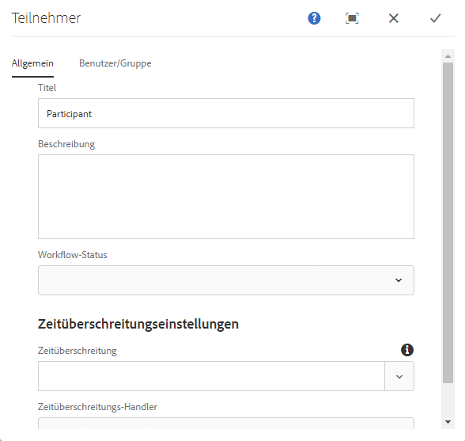

1. Bestätigen Sie die Änderungen durch Klicken auf das Häkchen-Symbol.
1. Bestätigen Sie Ihre Änderungen, indem Sie in der Editor-Symbolleiste auf **Sync** klicken, um das Laufzeitmodell zu generieren.

   Details finden Sie unter [Synchronisieren eines Workflows](#sync-your-workflow-generate-a-runtime-model).

### Erstellen eines Übergangs-Workflows {#creating-a-transient-workflow}

Sie können eine [Übergangs](/help/sites-developing/workflows.md#transient-workflows) Workflow-Modell beim Erstellen eines Modells oder durch Bearbeiten eines vorhandenen Modells:

1. Öffnen Sie das Workflow-Modell zum [Bearbeiten](#editinganexistingworkflow).
1. Wählen Sie **Workflow-Modelleigenschaften** aus der Symbolleiste aus.
1. Aktivieren Sie im Dialogfeld **Übergangs-Workflow** (bzw. bei Bedarf deaktivieren):

   

1. Bestätigen Sie die Änderung mit **Speichern und schließen** und klicken Sie anschließend in der Editor-Symbolleiste auf **Sync**, um das Laufzeitmodell zu generieren.

   Details finden Sie unter [Synchronisieren eines Workflows](#sync-your-workflow-generate-a-runtime-model).

>[!NOTE]
>
>Wenn Sie einen Workflow im [Übergangsmodus](/help/sites-developing/workflows.md#transient-workflows) speichern, speichert AEM keinen Workflow-Verlauf. Aus diesem Grund werden in der [Zeitleiste](/help/sites-authoring/basic-handling.md#timeline) keine Informationen zu diesem Workflow angezeigt.

## Workflow-Modelle in der Touch-Benutzeroberfläche verfügbar machen {#classic2touchui}

Befolgen Sie die Konfiguration, wenn ein Workflow-Modell der klassischen Benutzeroberfläche im Auswahl-Popup-Menü der **[!UICONTROL Zeitleiste]** in der Touch-Benutzeroberfläche fehlt und verfügbar gemacht werden muss. Die folgenden Schritte zeigen die Verwendung des Workflow-Modells namens **[!UICONTROL Aktivierungsanfrage]**.

1. Vergewissern Sie sich, dass das Modell nicht in der Touch-Benutzeroberfläche verfügbar ist. Greifen Sie über den Pfad `/assets.html/content/dam` auf ein Asset zu. Auswählen eines Assets. Öffnen Sie **[!UICONTROL Zeitleiste]** in der linken Leiste. Klicken Sie auf **[!UICONTROL Workflow starten]** und bestätigen Sie, dass das **[!UICONTROL Aktivierungsanfrage]**-Modell nicht in der Popup-Liste vorhanden ist.

1. Navigieren Sie wie folgt: **[!UICONTROL Tools > Allgemein > Tagging]**. Wählen Sie **[!UICONTROL Workflow]**.

1. Wählen Sie **[!UICONTROL Erstellen > Tag erstellen]**. Legen Sie den **[!UICONTROL Titel]** als `DAM` und den **[!UICONTROL Namen]** als `dam` fest. Klicken Sie auf **[!UICONTROL Übermitteln]**.
   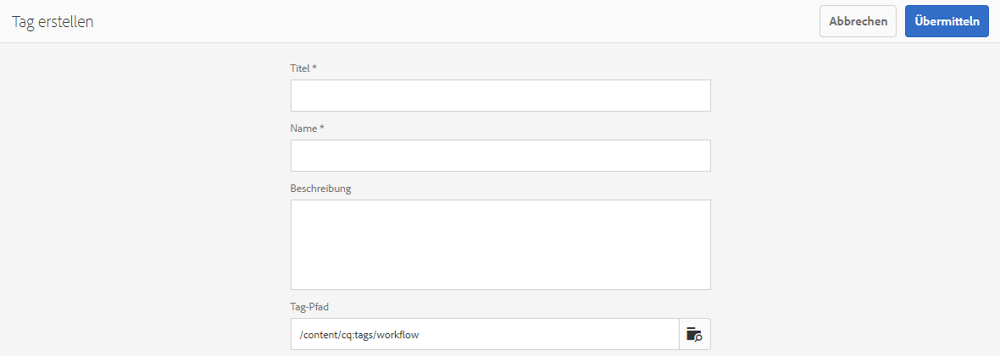

1. Gehen Sie zu **[!UICONTROL Tools > Workflow > Modelle]**. Wählen Sie **[!UICONTROL Aktivierungsanfrage]** aus und wählen Sie dann **[!UICONTROL Bearbeiten]**.

1. Klicken Sie auf **[!UICONTROL Bearbeiten]** und öffnen Sie das Menü **[!UICONTROL Seiteninformationen]**. Von dort wählen Sie **[!UICONTROL Eigenschaften öffnen]** und gehen Sie zur Registerkarte **[!UICONTROL Allgemein]** (falls noch nicht geöffnet).

1. Fügen Sie `Workflow : DAM` zum Feld **[!UICONTROL Tags]** hinzu. Bestätigen Sie die Auswahl mit dem Häkchen.

1. Bestätigen Sie das Hinzufügen des Tags mit **[!UICONTROL Speichern und schließen]**.
   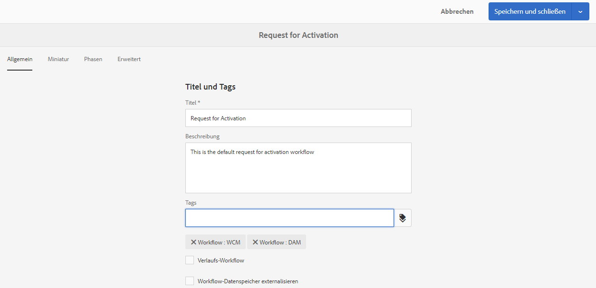

1. Schließen Sie den Prozess mit **[!UICONTROL Synchronisieren]** ab. Der Workflow ist jetzt in der Touch-optimierten Benutzeroberfläche verfügbar.

### Konfigurieren eines Workflows für die Unterstützung mehrerer Ressourcen {#configuring-a-workflow-for-multi-resource-support}

Sie können ein Workflow-Modell für [Unterstützung mehrerer Ressourcen](/help/sites-developing/workflows.md#multi-resource-support) beim Erstellen eines Modells oder durch Bearbeiten eines vorhandenen Modells:

1. Öffnen Sie das Workflow-Modell zum [Bearbeiten](#editinganexistingworkflow).
1. Wählen Sie **Workflow-Modelleigenschaften** aus der Symbolleiste aus.

1. Aktivieren Sie im Dialogfeld **Unterstützung mehrerer Ressourcen** (bzw. bei Bedarf deaktivieren):

   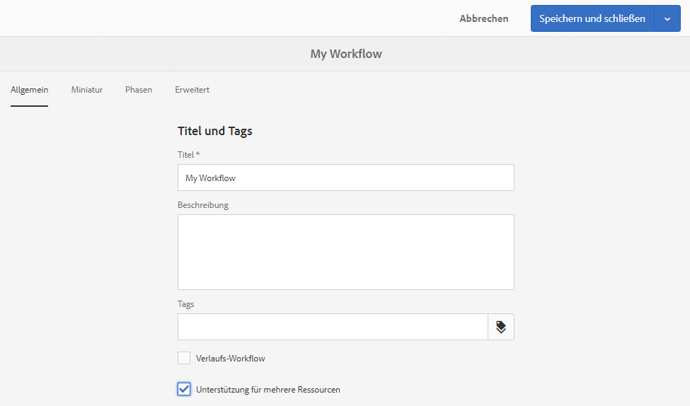

1. Bestätigen Sie die Änderung mit **Speichern und schließen** und klicken Sie anschließend in der Editor-Symbolleiste auf **Sync**, um das Laufzeitmodell zu generieren.

   Details finden Sie unter [Synchronisieren eines Workflows](#sync-your-workflow-generate-a-runtime-model).

### Konfigurieren der Workflow-Phasen (die den Workflow-Fortschritt anzeigen) {#configuring-workflow-stages-that-show-workflow-progress}

Die [Workflow-Phasen](/help/sites-developing/workflows.md#workflow-stages) sind hilfreich, um den Fortschritt eines Workflows beim Ausführen von Aufgaben anzuzeigen.

>[!CAUTION]
>
>Wenn Workflow-Phasen in den **Seiteneigenschaften** definiert sind, aber nicht für einen der Workflow-Schritte verwendet werden, zeigt die Fortschrittsleiste keinen Fortschritt an (unabhängig vom aktuellen Workflow-Schritt).

Die verfügbaren Phasen werden in den Workflow-Modellen definiert. Bestehende Workflow-Modelle können aktualisiert werden, um Statusdefinitionen einzuschließen. Sie können eine beliebige Anzahl von Phasen für das Workflow-Modell definieren.

**Phasen**, die für Ihren Workflow definiert werden müssen:

1. Öffnen Sie Ihr Workflow-Modell zum Bearbeiten.
1. Wählen Sie **Workflow-Modelleigenschaften** aus der Symbolleiste aus. Öffnen Sie dann die Registerkarte **Phasen**.
1. Fügen Sie Ihre benötigten **Phasen** hinzu (und positionieren Sie sie). Sie können eine beliebige Anzahl von Phasen für das Workflow-Modell definieren.

   Beispiel:

   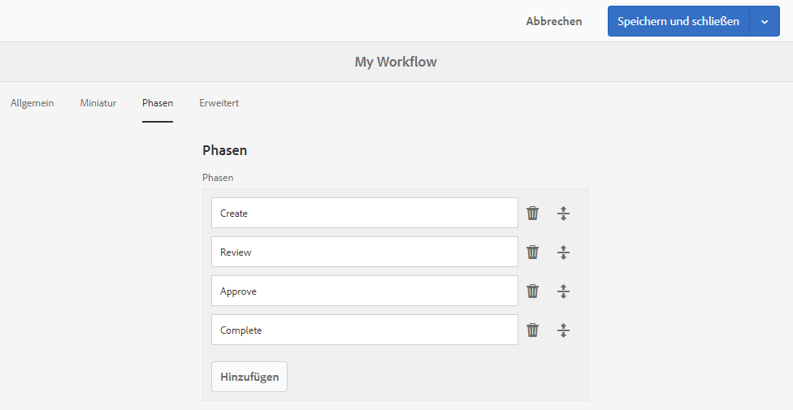

1. Klicken Sie auf **Speichern und schließen**, um die Änderungen zu speichern.
1. Weisen Sie jedem Schritt im Workflow-Modell eine Phase zu. Beispiel:

   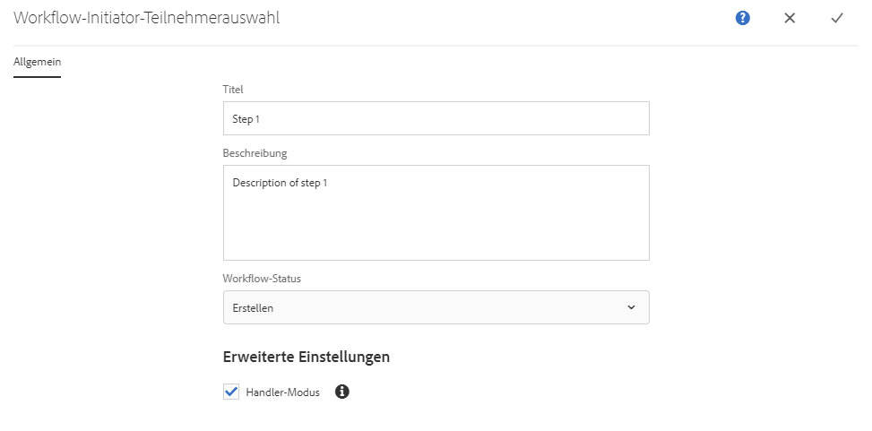

   Eine Phase kann mehreren Schritten zugewiesen werden. Beispiel:

   | **Schritt** | **Staging** |
   |---|---|
   | Schritt 1 | Erstellen |
   | Schritt 2 | Erstellen |
   | Schritt 3 | Überprüfung |
   | Schritt 4 | Genehmigen |
   | Schritt 5 | Genehmigen |
   | Schritt 6 | Fertig stellen |

1. Bestätigen Sie Ihre Änderungen, indem Sie in der Editor-Symbolleiste auf **Sync** klicken, um das Laufzeitmodell zu generieren.

   Details finden Sie unter [Synchronisieren eines Workflows](#sync-your-workflow-generate-a-runtime-model).

## Exportieren eines Workflow-Modells in ein Paket {#exporting-a-workflow-model-in-a-package}

Gehen Sie folgendermaßen vor, um ein Workflow-Modell in ein Paket zu exportieren:

1. Erstellen Sie ein Paket mit dem [Package Manager](/help/sites-administering/package-manager.md#package-manager):

   1. Navigieren Sie zum Package Manager über **Tools**, **Implementierung**, **Pakete**.

   1. Klicken Sie auf **Paket erstellen**.
   1. Geben Sie den **Paketnamen** und ggf. weitere Details an.
   1. Klicken Sie auf **OK**.

1. Klicken Sie in der Symbolleiste Ihres neuen Pakets auf **Bearbeiten**.

1. Öffnen Sie die Registerkarte **Filter**.

1. Wählen Sie **Filter hinzufügen** und geben Sie den Pfad zum *Design* Ihres Workflow-Modells ein:

   `/conf/global/settings/workflow/models/<*your-model-name*>`

   Klicken Sie auf **Fertig**.

1. Wählen Sie **Filter hinzufügen** aus und geben Sie den Pfad Ihres *Laufzeit*-Workflow-Modells ein:

   `/var/workflow/models/<*your-model-name*>`

   Klicken Sie auf **Fertig**.

1. Fügen Sie zusätzliche Filter für benutzerdefinierte Skripte hinzu, die von Ihrem Modell verwendet werden.
1. Klicken Sie auf **Speichern**, um Ihre Filterdefinitionen zu bestätigen.
1. Wählen Sie **Build** in der Symbolleiste Ihrer Paketdefinition aus.
1. Wählen Sie **Herunterladen** aus der Paketsymbolleiste aus.

## Verwenden von Workflows zur Verarbeitung von Formularübermittlungen {#using-workflows-to-process-form-submissions}

Sie können ein Formular konfigurieren, das vom ausgewählten Workflow verarbeitet werden soll. Wenn Benutzer das Formular übermitteln, wird eine neue Workflow-Instanz mit den Daten der Formularübermittlung als Payload erstellt.

So konfigurieren Sie den Workflow für Ihr Formular:

1. Erstellen Sie eine Seite und öffnen Sie sie zur Bearbeitung.
1. Fügen Sie eine **Formularkomponente** zu der Seite hinzu.
1. **Konfigurieren** Sie die **Formular-Start**-Komponente, die auf der Seite angezeigt wurde.
1. Wählen Sie mithilfe von **Workflow starten** den gewünschten Workflow aus den verfügbaren Optionen aus:

   

1. Bestätigen Sie die neue Formularkonfiguration mit dem Häkchen.

## Testen von Workflows {#testing-workflows}

Beim Testen eines Workflows ist es sinnvoll, verschiedene Payload-Typen zu verwenden, auch solche, die sich von denen unterscheiden, für die der Workflow entwickelt wurde. Wenn Sie beispielsweise möchten, dass Ihr Workflow für die Verwendung mit Assets ausgelegt ist, testen Sie ihn, indem Sie eine Seite als Payload festlegen und sicherstellen, dass keine Fehler auftreten.

Testen Sie Ihren neuen Workflow beispielsweise wie folgt:

1. [Starten Sie Ihr Workflow-Modell](/help/sites-administering/workflows-starting.md) über die Konsole.
1. Definieren Sie die **Payload** und bestätigen Ihre Eingaben.

1. Ergreifen Sie die erforderlichen Maßnahmen, damit der Workflow fortgesetzt wird.
1. Überwachen Sie die Protokolldateien während der Ausführung des Workflows.

Sie können auch AEM so konfigurieren, dass **DEBUG**-Meldungen in den Protokolldateien angezeigt werden. Weitere Informationen finden Sie unter [Protokollierung](/help/sites-deploying/configure-logging.md). Wenn die Entwicklung abgeschlossen ist, legen Sie die Einstellung für die **Protokollebene** wieder auf **Informationen** fest.

## Beispiele {#examples}

### Beispiel: Erstellen eines (einfachen) Workflows, um eine Anfrage zur Veröffentlichung zu akzeptieren oder abzulehnen {#example-creating-a-simple-workflow-to-accept-or-reject-a-request-for-publication}

Um einige der Möglichkeiten zur Erstellung eines Workflows zu veranschaulichen, wird im folgenden Beispiel eine Variante des Workflows `Publish Example` erstellt.

1. [Erstellen eines Workflow-Modells](#creating-a-new-workflow).

   Der neue Workflow enthält:

   * **Flussstart**
   * `Step 1`
   * **Prozessende**

1. Löschen Sie `Step 1` (da es sich um den falschen Schritttyp für dieses Beispiel handelt):

   * Klicken Sie auf den Schritt und klicken Sie in der Komponenten-Symbolleiste auf **Löschen**. Bestätigen Sie die Aktion.

1. Ziehen Sie aus der **Workflow**-Auswahl des Schritte-Browsers einen **Teilnehmer-Schritt** auf den Workflow und positionieren Sie ihn zwischen **Fluss-Start** und **Fluss-Ende**.
1. Führen Sie zum Öffnen des Dialogfelds „Eigenschaften“ einen der folgenden Schritte durch:

   * Klicken Sie auf den Teilnehmer-Schritt und klicken Sie in der Komponenten-Symbolleiste auf **Konfigurieren**.
   * Doppelklicken Sie auf den Teilnehmerschritt.

1. Geben Sie auf der Registerkarte **Allgemein** `Validate Content` als **Titel** und **Beschreibung** ein.
1. Öffnen Sie die Registerkarte **Benutzer/Gruppe**:

   * Aktivieren Sie **Benutzer per E-Mail benachrichtigen**.
   * Wählen Sie für das Feld **Benutzer/Gruppe** die Option `Administrator` (`admin`) aus.

   >[!NOTE]
   >
   >Damit E-Mails gesendet werden, [müssen der E-Mail-Dienst und die Benutzerkontodetails konfiguriert werden](/help/sites-administering/notification.md).

1. Bestätigen Sie die Änderungen durch Klicken auf das Häkchen-Symbol.

   Daraufhin wird wieder die Übersicht über das Workflow-Modell angezeigt. Der Teilnehmer-Schritt ist nun in `Validate Content` umbenannt.

1. Ziehen Sie eine **ODER-Teilung** auf den Workflow und positionieren Sie sie zwischen `Validate Content` und **Fluss-Ende**.
1. Öffnen Sie die **ODER-Teilung** für die Konfiguration.
1. Konfigurieren:

   * **Allgemein**: Geben Sie den Teilungsnamen an.
   * **Verzweigung 1**: Wählen Sie **Standardroute** aus.

   * **Verzweigung 2**: Stellen Sie sicher, dass **Standardroute** nicht ausgewählt ist.

1. Bestätigen Sie die Änderungen an der **ODER-Teilung**.
1. Ziehen Sie einen **Teilnehmerschritt** per Drag-and-Drop auf den rechten Zweig, öffnen Sie die Eigenschaften, geben Sie die folgenden Werte an und bestätigen Sie die Änderungen:

   * **Titel**: `Reject Publish Request`

   * **Benutzer/Gruppe**: z. B. `projects-administrators`

   * **Benachrichtigen des Benutzers per E-Mail**: Aktivieren Sie dieses Kontrollkästchen, damit die Benutzer per E-Mail benachrichtigt werden.

1. Ziehen Sie einen **Prozessschritt** auf den rechten Zweig, öffnen Sie die Eigenschaften, geben Sie die folgenden Werte an und bestätigen Sie die Änderungen:

   * **Titel**: `Publish Page as Requested`

   * **Prozess**: Wählen Sie `Activate Page` aus. Durch diesen Prozess wird die ausgewählte Seite in den Veröffentlichungsinstanzen veröffentlicht.

1. Klicken Sie auf **Synchronisieren** (Editor-Symbolleiste), um das Laufzeitmodell zu generieren.

   Details finden Sie unter [Synchronisieren eines Workflows](#sync-your-workflow-generate-a-runtime-model).

   Ihr neues Workflow-Modell sieht wie folgt aus:

   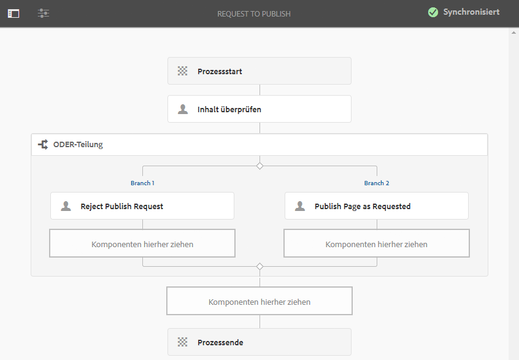

1. Wenden Sie diesen Workflow auf Ihre Seite an, sodass Benutzer, die zur Phase **Fertig stellen** übergehen, den Schritt **Inhalt überprüfen** auswählen können, egal ob sie die **Seite wie angefordert veröffentlichen** oder die **Anfrage zur Veröffentlichung ablehnen** möchten.

   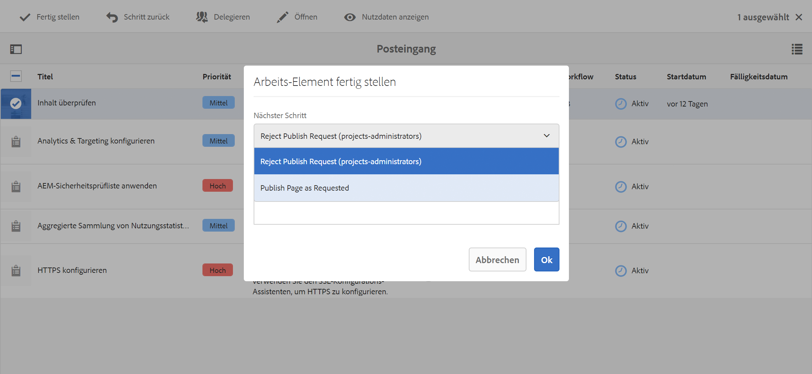

### Beispiel: Definieren einer Regel für eine ODER-Teilung mithilfe eines ECMA-Skripts {#defineruleecmascript}

Mit Schritten von **ODER-Teilung** können Sie bedingte Verarbeitungspfade in Ihren Workflow einführen.

Um eine ODER-Regel zu definieren, gehen Sie wie folgt vor:

1. Erstellen Sie zwei Skripte und speichern Sie sie im Repository, z. B. unter:

   `/apps/myapp/workflow/scripts`

   >[!NOTE]
   >
   >Die Skripte müssen eine [Funktion `check()`](#function-check) aufweisen, die einen booleschen Wert zurückgibt.

1. Bearbeiten Sie den Workflow und fügen Sie die **ODER-Teilung** zum Modell hinzu.
1. Bearbeiten Sie die Eigenschaften von **Verzweigung 1** der **ODER-Teilung**:

   * Definieren Sie dies als **Standardroute**, indem Sie den **Wert** auf `true` festlegen.

   * Geben Sie für **Regel** den Pfad zum Skript an. Beispiel:
     `/apps/myapp/workflow/scripts/myscript1.ecma`

   >[!NOTE]
   >
   >Sie können bei Bedarf die Reihenfolge der Verzweigungen wechseln.

1. Bearbeiten Sie die Eigenschaften von **Zweig 2** der **ODER-Teilung**:

   * Geben Sie für **Regel** den Pfad zum anderen Skript an. Beispiel:
     `/apps/myapp/workflow/scripts/myscript2.ecma`

1. Legen Sie die Eigenschaften der einzelnen Schritte in jedem Zweig fest. Stellen Sie sicher, dass die Einstellung für **Benutzer/Gruppe** festlegt ist.
1. Klicken Sie auf **Synchronisieren** (Editor-Symbolleiste), um Ihre Änderungen am Laufzeitmodell beizubehalten.

   Details finden Sie unter [Synchronisieren eines Workflows](#sync-your-workflow-generate-a-runtime-model).

#### Function Check() {#function-check}

>[!NOTE]
>
>Siehe [Verwenden von ECMAScript](/help/sites-developing/workflows-customizing-extending.md#using-ecmascript).

Das folgende Beispielskript gibt `true` zurück, wenn es sich bei dem Knoten um einen `JCR_PATH` unter `/content/we-retail/us/en` handelt:

```
function check() {
    if (workflowData.getPayloadType() == "JCR_PATH") {
      var path = workflowData.getPayload().toString();
      var node = jcrSession.getItem(path);

      if (node.getPath().indexOf("/content/we-retail/us/en") >= 0) {
       return true;
      } else {
       return false;
      }
     } else {
      return false;
     }
}
```

### Beispiel: Benutzerdefinierte Aktivierungsanfrage {#example-customized-request-for-activation}

Sie können jeden vordefinierten Workflow anpassen. Um ein benutzerdefiniertes Verhalten zu erhalten, überlagern Sie Details des entsprechenden Workflows.

Beispiel: **Aktivierungsanfrage**. Dieser Workflow wird zum Veröffentlichen von Seiten in **Sites** verwendet und wird automatisch ausgelöst, wenn eine Inhaltsautorin oder ein Inhaltsautor nicht über die entsprechenden Replikationsrechte verfügt. Weitere Informationen finden Sie unter [Anpassen der Seitenbearbeitung – Anpassen des Workflows „Aktivierungsanfrage“](/help/sites-developing/customizing-page-authoring-touch.md#customizing-the-request-for-activation-workflow).
