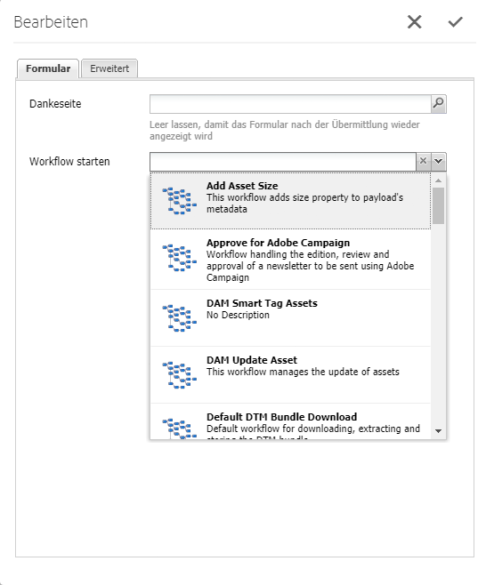

# Erstellen von Workflow-Modellen{#creating-workflow-models}

>[!CAUTION]
>
>Informationen zur Verwendung der klassischen Benutzeroberfläche finden Sie im Abschnitt [Dokumentation zu AEM 6.3](https://helpx.adobe.com/de/experience-manager/6-3/help/sites-developing/workflows-models.html) als Referenz.

Sie erstellen eine [Workflow-Modell](/help/sites-developing/workflows.md#model) , um die Schritte zu definieren, die beim Starten des Workflows ausgeführt werden. Sie können auch Modelleigenschaften definieren, um beispielsweise festzulegen, ob es sich um einen Übergangs-Workflow oder einen Workflow mit mehreren Ressourcen handelt.

Wenn ein Benutzer einen Workflow startet, wird eine Instanz gestartet. Dies ist das entsprechende Laufzeitmodell, das erstellt wird, wenn Sie [Synchronisieren](#sync-your-workflow-generate-a-runtime-model) Ihre Änderungen.

## Erstellen eines neuen Workflows {#creating-a-new-workflow}

Wenn Sie ein Workflow-Modell neu erstellen, enthält es zunächst:

* Die Schritte **Fluss-Start** und **Fluss-Ende**.
Diese stellen den Anfang und das Ende des Workflows dar. Diese Schritte sind erforderlich und können nicht bearbeitet bzw. entfernt werden.
* Ein **Teilnehmer**-Beispielschritt namens **Schritt 1**.
Dieser Schritt ist so konfiguriert, dass er dem Workflow-Initiator ein Arbeitselement zuordnet. Sie können diesen Schritt nach Bedarf bearbeiten oder löschen und Schritte hinzufügen.

So erstellen Sie einen Workflow mit dem Editor:

1. Öffnen Sie die **Workflow-Modelle-Konsole** über **Tools** > **Workflow** > **Modelle** oder beispielsweise über: [https://localhost:4502/aem/workflow](https://localhost:4502/aem/workflow)
1. Wählen Sie **Erstellen** und dann **Modell erstellen** aus.
1. Das Dialogfeld **Arbeitsablaufmodell hinzufügen** wird angezeigt. Geben Sie die **Titel** und **Name** (optional) vor Auswahl **Fertig**.
1. Das neue Modell wird nun in der **Workflow-Modelle-Konsole** aufgeführt.
1. Wählen Sie Ihren neuen Workflow aus und öffnen Sie ihn dann, indem Sie auf [**Bearbeiten** klicken, um ihn zu konfigurieren](#editinganexistingworkflow):
   

>[!NOTE]
>
>Wenn Sie Modelle programmgesteuert (mithilfe eines CRX-Pakets) erstellen, können Sie auch einen Unterordner erstellen:
>
>`/var/workflow/models`
>
>Beispiel: `/var/workflow/models/prototypes`
>
>Dieser Ordner kann dann für [Verwalten des Zugriffs auf die Modelle in diesem Ordner](/help/sites-administering/workflows-managing.md#create-a-subfolder-in-var-workflow-models-and-apply-the-acl-to-that).

## Bearbeiten eines Workflows {#editing-a-workflow}

Sie können jedes vorhandene Workflow-Modell bearbeiten, um:

* [Definieren von Schritten](#addingasteptoamodel-) und [parameters](#configuring-a-workflow-step)
* Konfigurieren von Workflow-Eigenschaften, einschließlich [Phasen](#configuring-workflow-stages-that-show-workflow-progress), [ob der Workflow vorübergehend ist](#creatingatransientworkflow-) und/oder [verwendet mehrere Ressourcen](#configuring-a-workflow-for-multi-resource-support)

Das Bearbeiten eines (vordefinierten) [**Standard- bzw. Legacy**-Workflows](#editing-a-default-or-legacy-workflow-for-the-first-time) umfasst einen zusätzlichen Schritt, um sicherzustellen, dass eine [sichere Kopie](/help/sites-developing/workflows-best-practices.md#locations-workflow-models) erstellt wird, bevor Sie Änderungen vornehmen.

Wenn Aktualisierungen Ihres Workflows abgeschlossen sind, müssen Sie **Synchronisieren** nach **Laufzeitmodell generieren**. Siehe [Workflow synchronisieren](#sync-your-workflow-generate-a-runtime-model) für Details.

### Workflow synchronisieren - Laufzeitmodell erstellen {#sync-your-workflow-generate-a-runtime-model}

**Synchronisieren** (direkt in der Editor-Symbolleiste) generiert eine [Laufzeitmodell](/help/sites-developing/workflows.md#runtime-model). Das Laufzeitmodell ist das Modell, das tatsächlich verwendet wird, wenn ein Benutzer einen Workflow startet. Wenn Sie Ihre Änderungen nicht durch Klicken auf **Sync** synchronisieren, stehen diese nicht zur Laufzeit zur Verfügung.

Wenn Sie (oder ein anderer Benutzer) Änderungen am Workflow vornehmen, müssen Sie **Synchronisieren** um ein Laufzeitmodell zu generieren - auch wenn einzelne Dialogfelder (z. B. für Schritte) über eigene Speicheroptionen verfügten.

Wenn die Änderungen mit dem (gespeicherten) Laufzeitmodell synchronisiert werden, **Synchronisiert** stattdessen angezeigt.

Einige Schritte verfügen über obligatorische Felder und/oder eine integrierte Validierung. Wenn diese Bedingungen nicht erfüllt sind, wird beim Versuch, einen Fehler angezeigt **Synchronisieren** das Modell. Etwa wenn für einen **Teilnehmer**-Schritt kein Teilnehmer definiert wurde:


### Erstmalige Bearbeitung eines Standard- oder Legacy-Workflows {#editing-a-default-or-legacy-workflow-for-the-first-time}

Wenn Sie eine [Standardmodell und/oder Legacy-Modell](/help/sites-developing/workflows.md#workflow-types) zur Bearbeitung:

* Der Schritte-Browser (auf der linken Seite) ist nicht verfügbar.
* Die Symbolleiste weist eine Option zum **Bearbeiten** auf (auf der rechten Seite).
* Zunächst werden das Modell und seine Eigenschaften im schreibgeschützten Modus wie folgt dargestellt:
   * Standard-Workflows befinden sich in `/libs`
   * Alte Workflows befinden sich unter `/etc`
Auswählen **Bearbeiten** wird:
* eine Kopie des Workflows unter `/conf` gespeichert
* der Schritte-Browser verfügbar gemacht
* es möglich, Änderungen vorzunehmen.

>[!NOTE]
>
>Unter [Speicherorte von Workflow-Modellen](/help/sites-developing/workflows-best-practices.md#locations-workflow-models) finden Sie weitere Informationen.


### Hinzufügen eines Schritts zu einem Modell {#adding-a-step-to-a-model}

Sie müssen Ihrem Modell Schritte hinzufügen, um die auszuführende Aktivität darzustellen. Jeder Schritt führt eine bestimmte Aktivität aus. Eine Auswahl von Schritt-Komponenten ist in einer AEM-Standardinstanz verfügbar.

Wenn Sie ein Modell bearbeiten, werden die verfügbaren Schritte in den verschiedenen Gruppen der **Schritte-Browser**. Beispiel:


>[!NOTE]
>
>Informationen zu den Komponenten des primären Schritts, die mit AEM installiert werden, finden Sie unter [Referenz zu Workflow-Schritten](/help/sites-developing/workflows-step-ref.md).

So fügen Sie Schritte zum Workflow-Modell hinzu:

1. Öffnen Sie ein vorhandenes Workflow-Modell zur Bearbeitung. Wählen Sie in der **Workflow-Modelle-Konsole** das gewünschte Modell aus und klicken Sie anschließend auf **Bearbeiten**.
1. Öffnen Sie den Steps-Browser mithilfe von **Seitliches Bedienfeld ein/aus**, ganz links in der oberen Symbolleiste. Folgende Informationen/Optionen sind verfügbar:

   * **Filter** für bestimmte Schritte.
   * Verwenden Sie die Dropdown-Auswahl, um die Auswahl auf eine bestimmte Gruppe von Schritten zu beschränken.
   * Über das Symbol  zum Anzeigen von Breschreibungen können Sie weitere Informationen zum jeweiligen Schritt anzeigen.

   

1. Ziehen Sie die entsprechenden Schritte an die gewünschte Position im Modell.

   Beispiel: eine **Teilnehmer-Schritt**.

   Nachdem Sie ihn zum Workflow hinzugefügt haben, können Sie [den Schritt konfigurieren](#configuring-a-workflow-step).

   

1. Fügen Sie nach Bedarf beliebig viele Schritte oder andere Aktualisierungen hinzu.

   Zur Laufzeit werden die Schritte in der Reihenfolge ausgeführt, in der sie im Modell angezeigt werden. Nachdem Sie Schritt-Komponenten hinzugefügt haben, können Sie sie an eine andere Position im Modell ziehen.

   Sie können auch vorhandene Schritte kopieren, ausschneiden, einfügen, gruppieren oder löschen, wie bei der [Seiteneditor.](/help/sites-authoring/editing-content.md)

   Unterteilte Schritte können auch mithilfe der Symbolleistenoption  ein- oder ausgeblendet werden. 

1. Bestätigen Sie Ihre Änderungen, indem Sie in der Editor-Symbolleiste auf **Sync** klicken, um das Laufzeitmodell zu generieren.

   Siehe [Workflow synchronisieren](#sync-your-workflow-generate-a-runtime-model) für Details.

### Konfigurieren eines Workflow-Schritts {#configuring-a-workflow-step}

Sie können das **Verhalten** von Workflow-Schritten über das Dialogfeld **Schritt-Eigenschaften** konfigurieren und anpassen.

1. So öffnen Sie die **Schritt-Eigenschaften** Dialogfeld für einen Schritt:

   * Klicken/tippen Sie auf den **-Schritt im Workflow-Modell und wählen Sie in der Komponenten-Symbolleiste die Option **Konfigurieren** aus.

   * Doppelklicken Sie auf den Schritt.

   >[!NOTE]
   >
   >Informationen zu den Komponenten des primären Schritts, die mit AEM installiert werden, finden Sie unter [Referenz zu Workflow-Schritten](/help/sites-developing/workflows-step-ref.md).

1. Konfigurieren Sie die **Schritt-Eigenschaften** nach Bedarf; die verfügbaren Eigenschaften hängen vom Schritttyp ab. Es können auch mehrere Registerkarten verfügbar sein. Beispiel: der standardmäßige **Teilnehmer-Schritt**, der in einem neuen Workflow als `Step 1` enthalten ist:

   

1. Bestätigen Sie die Änderungen durch Klicken auf das Häkchen-Symbol.
1. Bestätigen Sie Ihre Änderungen, indem Sie in der Editor-Symbolleiste auf **Sync** klicken, um das Laufzeitmodell zu generieren.

   Siehe [Workflow synchronisieren](#sync-your-workflow-generate-a-runtime-model) für Details.

### Erstellen eines Verlaufs-Workflows {#creating-a-transient-workflow}

Sie können eine [Übergangs](/help/sites-developing/workflows.md#transient-workflows) Workflow-Modell beim Erstellen eines Modells oder durch Bearbeiten eines vorhandenen Modells:

1. Öffnen Sie das Workflow-Modell für [Bearbeiten](#editinganexistingworkflow).
1. Auswählen **Workflow-Modelleigenschaften** aus der Symbolleiste.
1. Aktivieren Sie im Dialogfeld das Kontrollkästchen **Übergangs-Workflow** (bzw. deaktivieren Sie es, falls erforderlich):

   

1. Bestätigen Sie die Änderung mit **Speichern und schließen** und klicken Sie anschließend in der Editor-Symbolleiste auf **Sync**, um das Laufzeitmodell zu generieren.

   Siehe [Workflow synchronisieren](#sync-your-workflow-generate-a-runtime-model) für Details.

>[!NOTE]
>
>Wenn Sie einen Workflow in [transient](/help/sites-developing/workflows.md#transient-workflows) AEM speichert keinen Workflow-Verlauf. Aus diesem Grund werden in der [Zeitleiste](/help/sites-authoring/basic-handling.md#timeline) keine Informationen zu diesem Workflow angezeigt.

## Workflow-Modelle in der Touch-Benutzeroberfläche verfügbar machen {#classic2touchui}

Befolgen Sie die Konfiguration, wenn ein Workflow-Modell der klassischen Benutzeroberfläche im Auswahl-Popup-Menü der **[!UICONTROL Zeitleiste]** in der Touch-Benutzeroberfläche fehlt und verfügbar gemacht werden muss. Die folgenden Schritte zeigen die Verwendung des Workflow-Modells namens **[!UICONTROL Aktivierungsanfrage]**.

1. Vergewissern Sie sich, dass das Modell nicht in der Touch-Benutzeroberfläche verfügbar ist. Greifen Sie über den Pfad `/assets.html/content/dam` auf ein Asset zu. Auswählen eines Assets. Öffnen Sie **[!UICONTROL Zeitleiste]** in der linken Leiste. Klicken Sie auf **[!UICONTROL Workflow starten]** und bestätigen Sie, dass das **[!UICONTROL Aktivierungsanfrage]**-Modell nicht in der Popup-Liste vorhanden ist.

1. Navigieren Sie wie folgt: **[!UICONTROL Tools > Allgemein > Tagging]**. Wählen Sie **[!UICONTROL Workflow]**.

1. Wählen Sie **[!UICONTROL Erstellen > Tag erstellen]**. Legen Sie den **[!UICONTROL Titel]** als `DAM` und den **[!UICONTROL Namen]** als `dam` fest. Klicken Sie auf **[!UICONTROL Übermitteln]**.
   

1. Gehen Sie zu **[!UICONTROL Tools > Workflow > Modelle]**. Wählen Sie **[!UICONTROL Aktivierungsanfrage]** aus und wählen Sie dann **[!UICONTROL Bearbeiten]**.

1. Klicken Sie auf **[!UICONTROL Bearbeiten]** und öffnen Sie das Menü **[!UICONTROL Seiteninformationen]**. Von dort wählen Sie **[!UICONTROL Eigenschaften öffnen]** und gehen Sie zur Registerkarte **[!UICONTROL Allgemein]** (falls noch nicht geöffnet).

1. Fügen Sie `Workflow : DAM` zum Feld **[!UICONTROL Tags]** hinzu. Bestätigen Sie die Auswahl mit dem Häkchen.

1. Bestätigen Sie das Hinzufügen des Tags mit **[!UICONTROL Speichern und schließen]**.
   

1. Schließen Sie den Prozess mit **[!UICONTROL Synchronisieren]** ab. Der Workflow ist jetzt in der Touch-optimierten Benutzeroberfläche verfügbar.

### Konfigurieren eines Workflows für die Unterstützung mehrerer Ressourcen {#configuring-a-workflow-for-multi-resource-support}

Sie können ein Workflow-Modell für [Unterstützung mehrerer Ressourcen](/help/sites-developing/workflows.md#multi-resource-support) beim Erstellen eines Modells oder durch Bearbeiten eines vorhandenen Modells:

1. Öffnen Sie das Workflow-Modell für [Bearbeiten](#editinganexistingworkflow).
1. Auswählen **Workflow-Modelleigenschaften** aus der Symbolleiste.

1. Aktivieren Sie im Dialogfeld das Kontrollkästchen **Unterstützung für mehrere Ressourcen** (bzw. deaktivieren Sie es, falls erforderlich):

   

1. Bestätigen Sie die Änderung mit **Speichern und schließen** und klicken Sie anschließend in der Editor-Symbolleiste auf **Sync**, um das Laufzeitmodell zu generieren.

   Siehe [Workflow synchronisieren](#sync-your-workflow-generate-a-runtime-model) für Details.

### Konfigurieren von Workflow-Phasen (die den Workflow-Fortschritt anzeigen) {#configuring-workflow-stages-that-show-workflow-progress}

Die [Workflow-Phasen](/help/sites-developing/workflows.md#workflow-stages) sind hilfreich, um den Fortschritt eines Workflows beim Ausführen von Aufgaben anzuzeigen.

>[!CAUTION]
>
>Wenn Workflow-Phasen definiert sind in **Seiteneigenschaften**, aber nicht für einen der Workflow-Schritte verwendet wird, zeigt die Fortschrittsleiste keinen Fortschritt an (unabhängig vom aktuellen Workflow-Schritt).

Die verfügbaren Phasen werden in den Workflow-Modellen definiert. Bestehende Workflow-Modelle können aktualisiert werden, um Statusdefinitionen einzuschließen. Sie können eine beliebige Anzahl von Phasen für das Workflow-Modell definieren.

Zu definieren **Phasen** für Ihren Workflow:

1. Öffnen Sie Ihr Workflow-Modell zur Bearbeitung.
1. Auswählen **Workflow-Modelleigenschaften** aus der Symbolleiste. Öffnen Sie dann die **Phasen** Registerkarte.
1. Fügen Sie Ihre Anforderungen hinzu (und positionieren Sie sie) **Phasen**. Sie können eine beliebige Anzahl von Phasen für das Workflow-Modell definieren.

   Beispiel:

   

1. Klicks **Speichern und schließen** , um die Eigenschaften zu speichern.
1. Weisen Sie jedem Schritt im Workflow-Modell eine Phase zu. Beispiel:

   

   Eine Phase kann mehreren Schritten zugewiesen werden. Beispiel:

   | **Schritt** | **Staging** |
   |---|---|
   | Schritt 1 | Erstellen |
   | Schritt 2 | Erstellen |
   | Schritt 3 | Überprüfung |
   | Schritt 4 | Genehmigen |
   | Schritt 5 | Genehmigen |
   | Schritt 6 | Fertig stellen |

1. Bestätigen Sie Ihre Änderungen, indem Sie in der Editor-Symbolleiste auf **Sync** klicken, um das Laufzeitmodell zu generieren.

   Siehe [Workflow synchronisieren](#sync-your-workflow-generate-a-runtime-model) für Details.

## Exportieren eines Workflow-Modells in ein Package {#exporting-a-workflow-model-in-a-package}

Gehen Sie folgendermaßen vor, um ein Workflow-Modell in ein Paket zu exportieren:

1. Erstellen Sie ein Paket mit dem [Package Manager](/help/sites-administering/package-manager.md#package-manager):

   1. Navigieren Sie zum Package Manager über **Instrumente**, **Implementierung**, **Pakete**.

   1. Klicken Sie auf **Paket erstellen**.
   1. Geben Sie die **Paketname** und ggf. weitere Details.
   1. Klicken Sie auf **OK**.

1. Klicken Sie in der Symbolleiste Ihres neuen Pakets auf **Bearbeiten**.

1. Öffnen Sie die Registerkarte **Filter**.

1. Wählen Sie **Filter hinzufügen** und geben Sie den Pfad zum *Design* Ihres Workflow-Modells ein:

   `/conf/global/settings/workflow/models/<*your-model-name*>`

   Klicken Sie auf **Fertig**.

1. Auswählen **Filter hinzufügen** und geben Sie den Pfad Ihrer *runtime* Workflow-Modell:

   `/var/workflow/models/<*your-model-name*>`

   Klicken Sie auf **Fertig**.

1. Fügen Sie zusätzliche Filter für benutzerdefinierte Skripte hinzu, die von Ihrem Modell verwendet werden.
1. Klicks **Speichern** um Ihre Filterdefinitionen zu bestätigen.
1. Auswählen **Build** in der Symbolleiste Ihrer Package-Definition.
1. Auswählen **Herunterladen** aus der Paketsymbolleiste.

## Verwenden von Workflows zur Verarbeitung von Formularübermittlungen {#using-workflows-to-process-form-submissions}

Sie können ein Formular konfigurieren, das vom ausgewählten Workflow verarbeitet werden soll. Wenn Benutzer das Formular übermitteln, wird eine neue Workflow-Instanz mit den Daten der Formularübermittlung als Payload erstellt.

So konfigurieren Sie den Workflow für Ihr Formular:

1. Erstellen Sie eine Seite und öffnen Sie sie zur Bearbeitung.
1. Hinzufügen einer **Formular** -Komponente auf der Seite.
1. **Konfigurieren** die **Formular-Start** -Komponente, die auf der Seite angezeigt wurde.
1. Wählen Sie mithilfe von **Workflow starten** den gewünschten Workflow aus den verfügbaren Optionen aus:

   

1. Bestätigen Sie die neue Formularkonfiguration mit dem Häkchen.

## Testen von Workflows {#testing-workflows}

Beim Testen eines Workflows ist es sinnvoll, verschiedene Payload-Typen zu verwenden, auch solche, die sich von denen unterscheiden, für die der Workflow entwickelt wurde. Wenn Sie beispielsweise möchten, dass Ihr Workflow für die Verwendung mit Assets ausgelegt ist, testen Sie ihn, indem Sie eine Seite als Payload festlegen und sicherstellen, dass keine Fehler auftreten.

Testen Sie Ihren neuen Workflow beispielsweise wie folgt:

1. [Starten Sie Ihr Workflow-Modell](/help/sites-administering/workflows-starting.md) über die Konsole.
1. Definieren Sie die **Payload** und bestätigen Ihre Eingaben.

1. Nehmen Sie die erforderlichen Schritte vor, damit der Workflow fortgesetzt wird.
1. Überwachen Sie die Protokolldateien während der Ausführung des Workflows.

Sie können auch AEM für die Anzeige konfigurieren **DEBUG** Meldungen in den Protokolldateien. Weitere Informationen finden Sie unter [Protokollierung](/help/sites-deploying/configure-logging.md). Wenn die Entwicklung abgeschlossen ist, legen Sie die Einstellung für die **Protokollebene** wieder auf **Informationen** fest.

## Beispiele {#examples}

### Beispiel: Erstellen eines (einfachen) Workflows zum Akzeptieren oder Ablehnen einer Veröffentlichungsanforderung {#example-creating-a-simple-workflow-to-accept-or-reject-a-request-for-publication}

Um einige der Möglichkeiten zur Erstellung eines Workflows zu veranschaulichen, wird im folgenden Beispiel eine Variante des Workflows `Publish Example` erstellt.

1. [Erstellen Sie ein Workflow-Modell](#creating-a-new-workflow).

   Der neue Workflow enthält:

   * **Prozessstart**
   * `Step 1`
   * **Prozessende**

1. Löschen Sie `Step 1` (da es sich um den falschen Schritttyp für dieses Beispiel handelt):

   * Klicken Sie auf den Schritt und klicken Sie in der Komponenten-Symbolleiste auf **Löschen**. Bestätigen Sie die Aktion.

1. Ziehen Sie aus der **Workflow**-Auswahl des Schritte-Browsers einen **Teilnehmer-Schritt** auf den Workflow und positionieren Sie ihn zwischen **Fluss-Start** und **Fluss-Ende**.
1. Führen Sie zum Öffnen des Dialogfelds „Eigenschaften“ einen der folgenden Schritte durch:

   * Klicken Sie auf den Teilnehmer-Schritt und klicken Sie in der Komponenten-Symbolleiste auf **Konfigurieren**.
   * Doppelklicken Sie auf den Teilnehmer-Schritt.

1. Geben Sie auf der Registerkarte **Allgemein** `Validate Content` als **Titel** und **Beschreibung** ein.
1. Öffnen Sie die **Benutzer/Gruppe** tab:

   * Aktivieren **Benutzer per E-Mail benachrichtigen**.
   * Wählen Sie für das Feld **Benutzer/Gruppe** die Option `Administrator` (`admin`) aus.

   >[!NOTE]
   >
   >Für zu sendende E-Mails [die E-Mail-Dienst- und Benutzerkontodetails müssen konfiguriert werden](/help/sites-administering/notification.md).

1. Bestätigen Sie die Änderungen durch Klicken auf das Häkchen-Symbol.

   Daraufhin wird wieder die Übersicht über das Workflow-Modell angezeigt. Der Teilnehmer-Schritt ist nun in `Validate Content` umbenannt.

1. Ziehen Sie eine **ODER-Teilung** auf den Workflow und positionieren Sie sie zwischen `Validate Content` und **Fluss-Ende**.
1. Öffnen Sie die **Oder Aufspaltung** für die Konfiguration.
1. Konfigurieren:

   * **Häufig**: Geben Sie den Namen der Aufspaltung an.
   * **Verzweigung 1**: select **Standardroute**.

   * **Zweig 2**: stellen Sie sicher **Standardroute** nicht ausgewählt ist.

1. Bestätigen Sie die Änderungen an der **ODER-Teilung**.
1. Ziehen Sie eine **Teilnehmer-Schritt** Öffnen Sie in der linken Verzweigung die Eigenschaften, geben Sie die folgenden Werte an und bestätigen Sie dann die Änderungen:

   * **Titel**: `Reject Publish Request`

   * **Benutzer/Gruppe**: z. B. `projects-administrators`

   * **Benachrichtigen des Benutzers per E-Mail**: Aktivieren Sie dieses Kontrollkästchen, damit die Benutzer per E-Mail benachrichtigt werden.

1. Ziehen Sie einen **Prozessschritt** auf den rechten Zweig, öffnen Sie die Eigenschaften, geben Sie die folgenden Werte an und bestätigen Sie die Änderungen:

   * **Titel**: `Publish Page as Requested`

   * **Prozess**: Wählen Sie `Activate Page` aus. Durch diesen Prozess wird die ausgewählte Seite in den Publisher-Instanzen veröffentlicht.

1. Klicks **Synchronisieren** (Editor-Symbolleiste), um das Laufzeitmodell zu generieren.

   Siehe [Workflow synchronisieren](#sync-your-workflow-generate-a-runtime-model) für Details.

   Ihr neues Workflow-Modell sieht wie folgt aus:

   

1. Wenden Sie diesen Workflow auf Ihre Seite an, sodass Benutzer, die zur Phase **Fertig stellen** übergehen, den Schritt **Inhalt überprüfen** auswählen können, egal ob sie die **Seite wie angefordert veröffentlichen** oder die **Anfrage zur Veröffentlichung ablehnen** möchten.

   

### Beispiel: Definieren einer Regel für eine ODER-Teilung     mit einem ECMA-Skript {#defineruleecmascript}

**ODER-Teilung** können Sie bedingte Verarbeitungspfade in Ihren Workflow einführen.

Um eine ODER-Regel zu definieren, gehen Sie wie folgt vor:

1. Erstellen Sie zwei Skripte und speichern Sie sie im Repository, z. B. unter:

   `/apps/myapp/workflow/scripts`

   >[!NOTE]
   >
   >Die Skripte müssen eine [Funktion `check()`](#function-check) aufweisen, die einen booleschen Wert zurückgibt.

1. Bearbeiten Sie den Workflow und fügen Sie die **ODER-Teilung** zum Modell.
1. Eigenschaften von bearbeiten **Verzweigung 1** des **ODER-Teilung**:

   * Definieren Sie dies als **Standardroute**, indem Sie den **Wert** auf `true` festlegen.

   * Geben Sie für **Regel** den Pfad zum Skript an. Beispiel:
     `/apps/myapp/workflow/scripts/myscript1.ecma`

   >[!NOTE]
   >
   >Sie können die Reihenfolge der Verzweigungen ändern, sofern dies erforderlich ist.

1. Bearbeiten Sie die Eigenschaften von **Zweig 2** der **ODER-Teilung**:

   * Geben Sie für **Regel** den Pfad zum anderen Skript an. Beispiel:
     `/apps/myapp/workflow/scripts/myscript2.ecma`

1. Legen Sie die Eigenschaften der einzelnen Schritte in jedem Zweig fest. Stellen Sie sicher, dass die Einstellung für **Benutzer/Gruppe** festlegt ist.
1. Klicks **Synchronisieren** (Editor-Symbolleiste), um Ihre Änderungen am Laufzeitmodell beizubehalten.

   Siehe [Workflow synchronisieren](#sync-your-workflow-generate-a-runtime-model) für Details.

#### Funktionsprüfung() {#function-check}

>[!NOTE]
>
>Siehe [Verwenden von ECMAScript](/help/sites-developing/workflows-customizing-extending.md#using-ecmascript).

Das folgende Beispielskript gibt `true` zurück, wenn es sich bei dem Knoten um einen `JCR_PATH` unter `/content/we-retail/us/en` handelt:

```
function check() {
    if (workflowData.getPayloadType() == "JCR_PATH") {
      var path = workflowData.getPayload().toString();
      var node = jcrSession.getItem(path);

      if (node.getPath().indexOf("/content/we-retail/us/en") >= 0) {
       return true;
      } else {
       return false;
      }
     } else {
      return false;
     }
}
```

### Beispiel: Benutzerdefinierte Aktivierungsanfrage {#example-customized-request-for-activation}

Sie können jeden vordefinierten Workflow anpassen. Um ein benutzerdefiniertes Verhalten zu erhalten, überlagern Sie Details des entsprechenden Workflows.

Beispiel: **Aktivierungsanfrage**. Dieser Workflow wird zum Veröffentlichen von Seiten in **Sites** und wird automatisch ausgelöst, wenn ein Inhaltsautor nicht über die entsprechenden Replikationsrechte verfügt. Weitere Informationen finden Sie unter [Anpassen der Seitenbearbeitung – Anpassen des Workflows „Aktivierungsanfrage“](/help/sites-developing/customizing-page-authoring-touch.md#customizing-the-request-for-activation-workflow).
