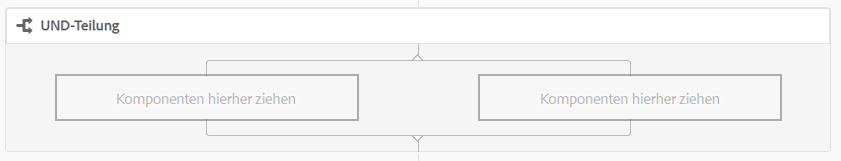
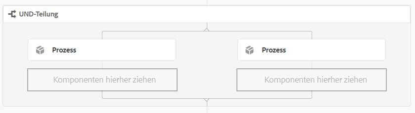
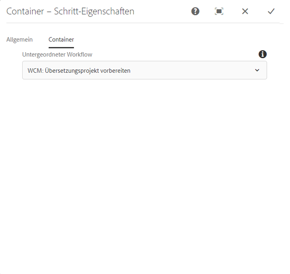
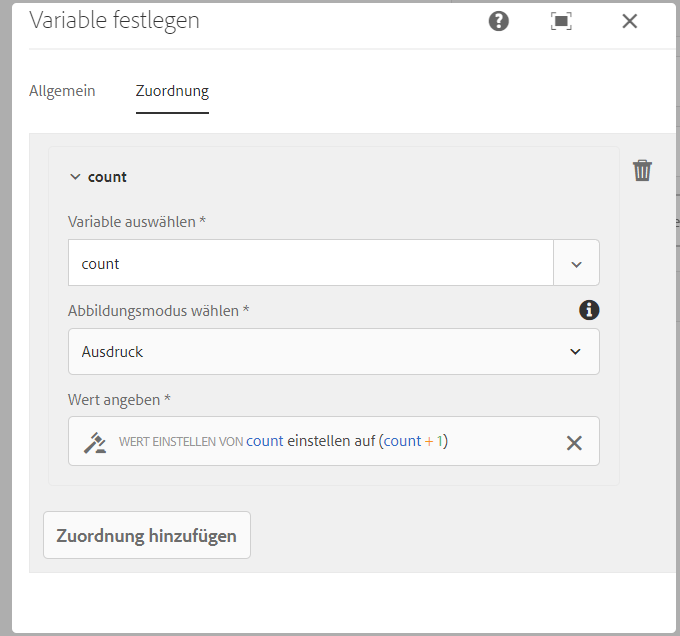
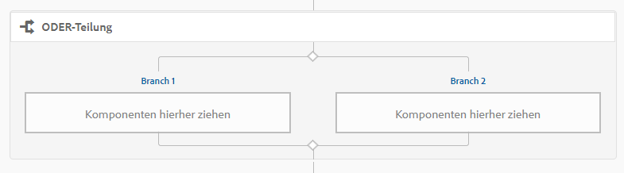
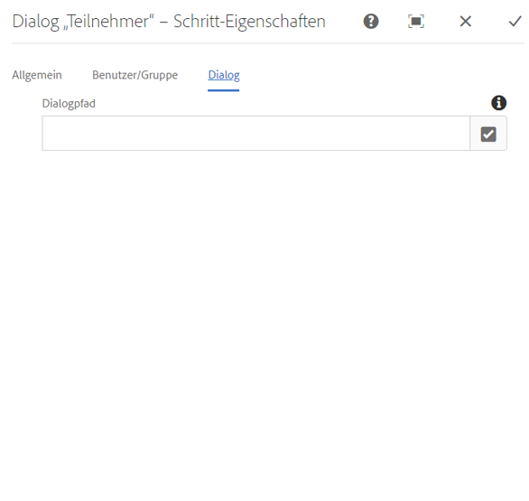
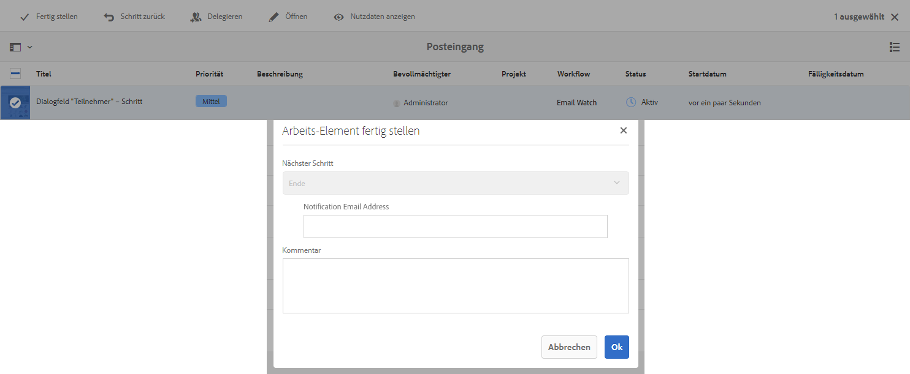
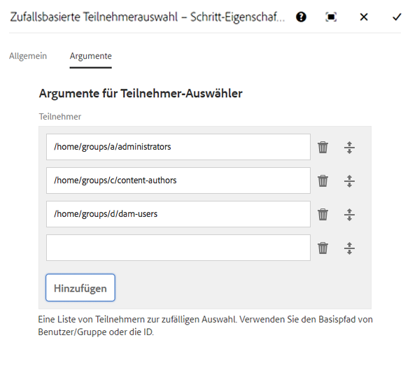
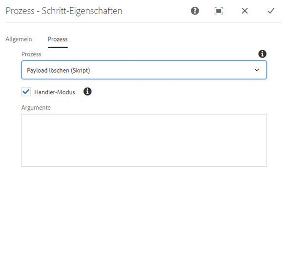
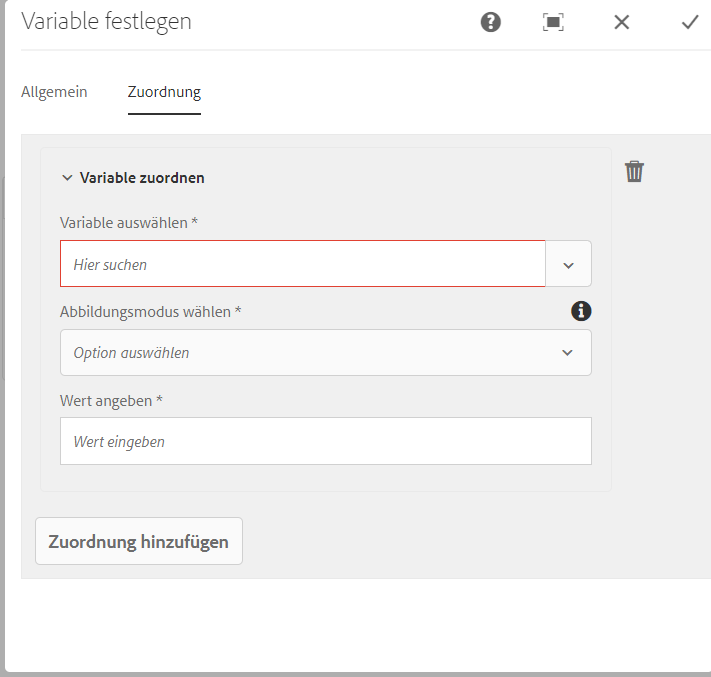

# Referenz für Workflow-Schritte {#workflow-step-reference}

Workflow-Modelle beinhalten eine Reihe von Schritten unterschiedlichen Typs. Je nach Typ können diese Schritte mit Parametern und Skripten konfiguriert und erweitert werden, um die gewünschten Funktionen und Steuerungsoptionen bereitzustellen.

>[!NOTE]
>
>In diesem Abschnitt werden die standardmäßigen Workflow-Schritte behandelt.
>
>Informationen zu Schritten für spezifische Module finden Sie unter:
>
>* [Referenz für Workflow-Schritte in AEM Forms](/help/forms/using/aem-forms-workflow-step-reference.md)
* [Verarbeitung von Assets mithilfe von Medien-Handlern und Workflows](/help/assets/media-handlers.md)


## Schritt-Eigenschaften {#step-properties}

Jeder Komponentenschritt beinhaltet ein Dialogfeld **Schritt-Eigenschaften**, in dem Sie die erforderlichen Eigenschaften definieren und bearbeiten können.

### Schritt-Eigenschaften – Registerkarte „Allgemein“  {#step-properties-common-tab}

Eine Kombination der folgenden Eigenschaften ist für die meisten Workflow-Schrittkomponenten im Eigenschaften-Dialogfeld auf der Registerkarte **Allgemein** verfügbar:

* **Titel** Der Titel für den Schritt.

* **Beschreibung**
Eine Beschreibung des Schritts.

* **Workflow-Status**

   Eine Dropdown-Auswahl, um einen [Stage](/help/sites-developing/workflows.md#workflow-stages) auf den Schritt anzuwenden.

* **Zeitüberschreitung**

   Der Zeitraum, nach dem der Schritt &quot;abgelaufen&quot;wird.
Sie können zwischen folgenden Optionen wählen: **Aus**, **Sofort**, **1h**, **6h**, **12h**, **24h**.

* **Zeitüberschreitungs-Handler**

   Der Handler, der den Workflow steuert, wenn der Schritt beendet wird; Beispiel:
   `Auto Advancer`

* **Handler-Modus**

   Wählen Sie diese Option, um den Workflow nach der Ausführung automatisch zum nächsten Schritt zu führen. Wenn diese Option nicht ausgewählt ist, muss das Implementierungsskript den Workflow weiterleiten.

### Schritt-Eigenschaften – Registerkarte „Benutzer/Gruppe“{#step-properties-user-group-tab}

Die folgenden Eigenschaften sind für viele Workflow-Schrittkomponenten im Eigenschaften-Dialogfeld auf der Registerkarte **Benutzer/Gruppe** verfügbar:

* **Benachrichtigen Sie den Benutzer per E-Mail**

   * Sie können Teilnehmer benachrichtigen, indem Sie eine E-Mail senden, sobald der Workflow einen Schritt erreicht hat.
   * Wenn diese Option aktiviert ist, wird eine E-Mail an den mit der Eigenschaft **Benutzer/Gruppe** definierten Benutzer oder an alle Mitglieder einer Gruppe (falls definiert) gesendet.

* **Benutzer/Gruppe**

   * Sie können einen Benutzer oder eine Gruppe aus einem Dropdown-Menü auswählen.
   * Falls Sie den Schritt einem bestimmten Benutzer zuweisen, kann nur dieser Benutzer Aktionen für den Schritt durchführen.
   * Wenn Sie den Schritt einer ganzen Gruppe zuweisen, haben alle Benutzer dieser Gruppe die Aktion im **Workflow-Posteingang**, wenn der Workflow diesen Schritt erreicht.
   * Weitere Informationen finden Sie unter [Teilnehmen an Workflows](/help/sites-authoring/workflows-participating.md).

## UND-Teilung  {#and-split}

Die **UND-Teilung** erstellt eine Aufspaltung im Workflow, nach der beide Zweige aktiv sind. Sie fügen jeder Verzweigung nach Bedarf Workflow-Schritte hinzu. Mit diesem Schritt können Sie mehrere Prozesspfade in einem Workflow einrichten. Sie können z. B. mehrere Bewertungsschritte parallel zulassen, sodass Sie Zeit sparen.



### UND-Teilung – Konfiguration {#and-split-configuration}

Zum Konfigurieren der Teilung:

* Bearbeiten Sie die **UND-Verzweigungs-Eigenschaften**:

   * **Name der Teilung**: Fügen Sie zur Erläuterung einen Namen ein.
   * Wählen Sie die Anzahl der erforderlichen Verzweigungen aus: 2, 3, 4 oder 5.

* Fügen Sie bei Bedarf Workflow-Schritte zu den Verzweigungen hinzu.

   

## Container-Schritt {#container-step}

Ein Container-Schritt startet ein anderes Workflow-Modell, das als untergeordneter Workflow ausgeführt wird.

Mit diesem Container können Sie Workflow-Modelle wiederverwenden, um häufige Schrittsequenzen zu implementieren. Beispielsweise kann ein Übersetzungs-Workflow-Modell in mehreren Bearbeitungs-Workflows verwendet werden.



### Container-Schritt – Konfiguration {#container-step-configuration}

Verwenden und bearbeiten Sie die folgenden Registerkarten, um den Schritt zu konfigurieren:

* [Allgemein](#step-properties-common-tab)
* **Container**

   * **Untergeordneter Workflow**: Wählen Sie den zu startenden Workflow aus.

## Zum Schritt wechseln  {#goto-step}

Mit **Zum Schritt wechseln** können Sie den nächsten Schritt angeben, der im Workflow-Modell ausgeführt werden soll. Sie können eine Regeldefinition, ein externes Skript oder ein ECMA-Skript als Routing-Ausdruck angeben, um den nächsten Schritt für das Workflow-Modell zu bewerten.

* Wenn die von Ihnen angegebene Bedingung &quot;true&quot;lautet, wird **Zum Schritt wechseln** abgeschlossen und die Workflow-Engine führt den angegebenen Schritt aus.
* Wenn die von Ihnen angegebene Bedingung nicht &quot;true&quot;lautet, wird **Zum Schritt wechseln** abgeschlossen und die normale Routing-Logik bestimmt den nächsten auszuführenden Schritt.

Mit **Zum Schritt wechseln** können Sie erweiterte Routingstrukturen im Workflow-Modell implementieren. Um beispielsweise eine Schleife zu implementieren, kann **Zum Schritt wechseln** definiert werden, um einen vorherigen Schritt im Workflow auszuführen, wobei der Routing-Ausdruck eine Schleifenbedingung auswertet.

### Zum Schritt wechseln – Konfiguration {#goto-step-configuration}

Verwenden und bearbeiten Sie die folgenden Registerkarten, um den Schritt zu konfigurieren:

* [Allgemein](#step-properties-common-tab)
* **Prozess**

   * **Target-Schritt**: Wählen Sie den auszuführenden Schritt aus, nachdem Sie die Bedingung für den Routing-Ausdruck ausgewertet haben.
   * **Routing-Ausdruck**: Wählen Sie Regeldefinition, externes Skript oder ein ECMA-Skript aus, das bestimmt, ob der  **Target-Schritt** ausgeführt werden soll.

      * **Regeldefinition:** Definieren Sie die Regel mithilfe des  [Ausdruckseditors ](/help/forms/using/variable-in-aem-workflows.md#use-expression-editor) .
      * **Externes Skript:** Der Pfad des externen Skripts.
      * **ECMA-Skript**: Das Skript, das bestimmt, ob der  **Zum Schritt wechseln** ausgeführt werden soll.

#### Simulieren einer for-Schleife {#simulating-a-for-loop}

Um eine for-Schleife zu simulieren, müssen Sie die Zahl der erfolgten Schleifeniterationen überwachen:

* Die Zahl steht in der Regel für einen Index der Elemente, für die im Workflow Aktionen erfolgen.
* Die Zahl wird als Beendigungskriterium der Schleife ausgewertet.

Um beispielsweise einen Workflow zu implementieren, der eine Aktion für mehrere JCR-Knoten durchführt, können Sie eine Schleifenzahl als Index für die Knoten verwenden. Um die Anzahl beizubehalten, speichern Sie einen `integer` -Wert in der Datenzuordnung der Workflow-Instanz. Verwenden Sie das Skript für **Zum Schritt wechseln**, um die Zahl zu erhöhen und mit den Beendigungskriterien zu vergleichen.

```
function check(){
   var count=0;
   var keyname="loopcount"
   try{
      if (workflowData.getMetaDataMap().containsKey(keyname)){
        log.info("goto script: found loopcount key");
        count= parseInt(workflowData.getMetaDataMap().get(keyname))+1;
      }

     workflowData.getMetaDataMap().put(keyname,count);

     }catch(err) {
         log.info(err.message);
         return false;
    }
   if (parseInt(count) <7){
       return true;
   } else {
      return false;
   }
}
```

### Simulieren einer for-Schleife mithilfe der Regeldefinition {#simulateforloop}

Sie können auch eine für eine Schleife simulieren, indem Sie die Regeldefinition als Routing-Ausdruck verwenden. [Erstellen Sie eine  **** ](/help/forms/using/variable-in-aem-workflows.md#create-a-variable) zählbare Variable des Datentyps Long . Verwenden Sie **Expression** als Zuordnungsmodus im Schritt **[Variable](/help/sites-developing/using-variables-in-aem-workflows.md#set-a-variable)** festlegen , um den Wert der Variable **count** bei jeder Ausführung des Schritts **Variable festlegen auf** count + 1 **festzulegen.**



Verwenden Sie in **Zum Schritt wechseln** **Variable** als **Target-Schritt** und **Zählung &lt; 5** als Routing-Ausdruck.


Der Schritt **Variable** festlegen führt wiederholt aus und inkrementiert den Wert der Variable **count** bei jeder Ausführung um 1, bis der Wert 5 erreicht.

## ODER-Teilung {#or-split}

Mit der **ODER-Teilung** wird der Workflow so geteilt, dass nur eine Verzweigung aktiv bleibt. Mit diesem Schritt können Sie bedingte Prozesspfade in einem Workflow einrichten. Sie fügen jeder Verzweigung nach Bedarf Workflow-Schritte hinzu.

>[!NOTE]
Weitere Informationen zum Erstellen einer ODER-Teilung finden Sie unter: [https://helpx.adobe.com/experience-manager/using/aem64_workflow_servlet.html](https://helpx.adobe.com/experience-manager/using/aem64_workflow_servlet.html)



### ODER-Teilung – Konfiguration {#or-split-configuration}

Zum Konfigurieren der Teilung:

* Bearbeiten Sie die **ODER-Verzweigungs-Eigenschaften**:

   * **Allgemein**

      * Geben Sie den Namen der Aufspaltung an.
   * **Verzweigungen (*x)***

      * **Verzweigung hinzufügen:** Fügen Sie dem Schritt weitere Verzweigungen hinzu.
      * **Wählen Sie Routing-Ausdruck** aus: Wählen Sie den Routing-Ausdruck aus, um die aktive Verzweigung auszuwerten. Mögliche Werte sind: Regeldefinition, externes Skript und ECMA-Skript.
      * **Klicken Sie auf Ausdruck hinzufügen** : Fügen Sie einen Ausdruck hinzu, um die aktive Verzweigung auszuwerten, wenn Sie  **Regeldefinitionen als Routing-Ausdruck** auswählen.
      * **Skriptpfad**: Der Pfad zu einer Datei, die das Skript zum Auswerten der aktiven Verzweigung enthält, wenn Sie  **Externe** Skripte als Routing-Ausdruck auswählen.
      * **Skript**: Fügen Sie das Skript in das Feld ein, um die aktive Verzweigung auszuwerten, wenn Sie  **ECMA-** Skripte als Routing-Ausdruck auswählen.
      * **Standardroute**: Die Standardverzweigung wird bei mehreren Verzweigungen verwendet. Sie können nur eine Verzweigung als Standard festlegen.

   >[!NOTE]
   * Eine Verzweigung wird anhand des Routing-Ausdrucks gleichzeitig ausgewertet.
   * Die Verzweigungen werden von oben nach unten ausgewertet.
   * Das erste Skript, das als &quot;true&quot;ausgewertet wird, wird ausgeführt.
   * Wenn keine Verzweigung &quot;true&quot;ergibt, wird der Workflow nicht weitergeleitet.


   >[!NOTE]
   Weitere Informationen finden Sie unter [Definieren einer Regel für eine ODER-Teilung](/help/sites-developing/workflows-models.md#defineruleecmascript).

* Fügen Sie bei Bedarf Workflow-Schritte zu den Verzweigungen hinzu.

## Teilnehmer-Schritte und -Auswahl  {#participant-steps-and-choosers}

### Teilnehmer-Schritt {#participant-step}

Mit der Option **Teilnehmer-Schritt** können Sie einer bestimmten Aktion Eigentümerrechte zuweisen. Der Workflow wird nur fortgesetzt, wenn der Benutzer diesen Schritt manuell bestätigt hat. Die Option wird verwendet, wenn Sie einer Person eine Aktion in einem Workflow zuweisen möchten, z. B. einen Bewertungsschritt.

Obwohl sie nicht direkt damit im Zusammenhang steht, muss die Benutzerautorisierung beim Zuweisen einer Aktion berücksichtigt werden. Der Benutzer muss Zugriff auf die Seite mit der Workflow-Nutzlast haben.

#### Teilnehmer-Schritt – Konfiguration  {#participant-step-configuration}

Verwenden und bearbeiten Sie die folgenden Registerkarten, um den Schritt zu konfigurieren:

* [Allgemein](#step-properties-common-tab)
* [Benutzer/Gruppe](#step-properties-user-group-tab)

>[!NOTE]
Der Workflow-Initiator wird immer benachrichtigt, wenn:
* der Workflow abgeschlossen (beendet) wurde.
* der Workflow abgebrochen (beendet) wurde.


>[!NOTE]
Einige Eigenschaften müssen konfiguriert werden, um E-Mail-Benachrichtigungen zu aktivieren. Sie können die E-Mail-Vorlage auch anpassen oder eine E-Mail-Vorlage für eine neue Sprache hinzufügen. Informationen zum Konfigurieren von E-Mail-Benachrichtigungen in AEM finden Sie unter [Konfigurieren von E-Mail-Benachrichtigungen](/help/sites-administering/notification.md#configuringemailnotification) .

### Dialogfeld „Teilnehmer-Schritt“{#dialog-participant-step}

Verwenden Sie ein Dialogfeld **Teilnehmer-Schritt**, um Daten des Benutzers zu erfassen, dem das Arbeitselement zugewiesen wird. Dieser Schritt eignet sich für das Erfassen kleiner Datenmengen, die später im Workflow verwendet werden.

Nach Abschluss des Schritts enthält das Dialogfeld **Arbeits-Element fertig stellen** die Felder, die Sie für dieses Dialogfeld definiert haben. Die in den Feldern erfassten Daten werden in den Knoten der Workflow-Nutzlast gespeichert. Nachfolgende Workflow-Schritte können die Werte aus dem Repository auslesen.

Um den Schritt zu konfigurieren, geben Sie die Gruppe oder den Benutzer, der bzw. dem das Arbeitselement zugewiesen werden soll, sowie den Pfad zum Dialogfeld an.

#### Dialogfeld „Teilnehmer-Schritt“ – Konfiguration  {#dialog-participant-step-configuration}

Verwenden und bearbeiten Sie die folgenden Registerkarten, um den Schritt zu konfigurieren:

* [Allgemein](#step-properties-common-tab)
* [Benutzer/Gruppe](#step-properties-user-group-tab)
* **Dialogfeld**

   * **Dialogpfad**: Der Pfad zum Dialogfeldknoten des  [erstellten](#dialog-participant-step-creating-a-dialog) Dialogfelds.

#### Dialogfeld „Teilnehmer – Schritt“ – Erstellen eines Dialogfelds {#dialog-participant-step-creating-a-dialog}

Um ein Dialogfeld zu erstellen, müssen Sie wie folgt vorgehen:

* Entscheiden Sie, wo die erfassten Daten [in der Nutzlast gespeichert werden](#dialog-participant-step-storing-data-in-the-payload).
* [Dialogfeld definieren; Hierzu gehört auch die Definition der Felder, die zum Erfassen (und Speichern) der Daten](#dialog-participant-step-dialog-definition) verwendet werden.

#### Dialogfeld „Teilnehmer-Schritt“ – Speichern von Daten in der Nutzlast {#dialog-participant-step-storing-data-in-the-payload}

Sie können Widget-Daten in der Workflow-Nutzlast oder in den Metadaten des Arbeitselements speichern. Das Format der `name`-Eigenschaft des Widget-Knotens bestimmt, wo die Daten gespeichert werden.

* **Daten mit der Nutzlast speichern**

   * Um Widget-Daten als Eigenschaft der Workflow-Payload zu speichern, verwenden Sie das folgende Format für den Wert der name-Eigenschaft des Widget-Knotens:
      `./jcr:content/nodename`

   * Die Daten werden in der `nodename`-Eigenschaft des Nutzlastknotens gespeichert. Falls der Knoten diese Eigenschaft nicht enthält, wird die Eigenschaft erstellt.
   * Wenn Daten mit der Nutzlast gespeichert werden, wird der Wert der Eigenschaft bei nachfolgender Verwendung des Dialogfelds mit derselben Nutzlast überschrieben.

* **Daten mit dem Arbeitselement speichern**

   * Um Widget-Daten als Eigenschaft der Metadaten des Arbeitselements zu speichern, verwenden Sie das folgende Format für den Wert der name-Eigenschaft:
      `nodename`

   * Die Daten werden in der Eigenschaft `nodename` des Arbeitselements `metadata` gespeichert. Die Daten werden beibehalten, wenn das Dialogfeld anschließend von derselben Nutzlast verwendet wird.

#### Dialogfeld „Teilnehmer-Schritt“ – Definieren des Dialogfelds  {#dialog-participant-step-dialog-definition}

1. **Dialogfeldstruktur**

   Dialogfelder für das Dialogfeld „Teilnehmer-Schritt&quot; ähneln den Dialogfeldern, die Sie für Bearbeitungskomponenten erstellen. Sie werden gespeichert in:

   `/apps/myapp/workflow/dialogs`

   Dialogfelder für die Touch-optimierte Standardbenutzeroberfläche weisen folgende Knotenstruktur auf:

   ```xml
   newComponent (cq:Component)
     |- cq:dialog (nt:unstructured)
       |- content
         |- layout
           |- items
             |- column
               |- items
                 |- component0
                 |- component1
                 |- ...
   ```

   >[!NOTE]
   Weitere Informationen finden Sie unter [Erstellen und Konfigurieren eines Dialogfelds](/help/sites-developing/developing-components.md#creating-and-configuring-a-dialog).

1. **Eigenschaft „Dialogpfad“**

   Der **Dialog Participant Step** verfügt über die Eigenschaft **Dialog Path** (zusammen mit den Eigenschaften eines [Participant Step](#participant-step)). Der Wert der Eigenschaft **Dialogpfad** entspricht dem Pfad zum Knoten `dialog` im Dialogfeld.

   Das Dialogfeld kann sich beispielsweise in einer Komponente mit dem Namen `EmailWatch` befindet, die im Knoten gespeichert ist:

   `/apps/myapp/workflows/dialogs`

   Für die Touch-optimierte Benutzeroberfläche wird folgender Wert für die Eigenschaft **Dialogpfad** verwendet:

   `/apps/myapp/workflow/dialogs/EmailWatch/cq:dialog`

   

1. **Beispiel für eine Dialogfelddefinition**

   Das folgende XML-Code-Snippet steht für ein Dialogfeld, bei dem der `String`-Wert im Knoten `watchEmail` des Nutzlastinhalts gespeichert wird. Der Titelknoten steht für die [TextField](https://helpx.adobe.com/experience-manager/6-5/sites/developing/using/reference-materials/granite-ui/api/jcr_root/libs/granite/ui/components/coral/foundation/form/textfield/index.html)-Komponente:

   ```xml
   jcr:primaryType="nt:unstructured"
       jcr:title="Watcher Email Address Dialog"
       sling:resourceType="cq/gui/components/authoring/dialog">
       <content jcr:primaryType="nt:unstructured"
           sling:resourceType="granite/ui/components/foundation/container">
           <layout jcr:primaryType="nt:unstructured"
               margin="false"
               sling:resourceType="granite/ui/components/foundation/layouts/fixedcolumns"
           />
           <items jcr:primaryType="nt:unstructured">
               <column jcr:primaryType="nt:unstructured"
                   sling:resourceType="granite/ui/components/foundation/container">
                   <items jcr:primaryType="nt:unstructured">
                       <title jcr:primaryType="nt:unstructured"
                           fieldLabel="Notification Email Address"
                           name="./jcr:content/watchEmails"
                           sling:resourceType="granite/ui/components/foundation/form/textfield"
                       />
                   </items>
               </column>
           </items>
       </content>
   </cq:dialog>
   ```

   Bei diesem Beispiel sieht das Dialogfeld für eine Touch-optimierte Benutzeroberfläche wie folgt aus:

   

### Dynamischer Teilnehmer – Schritt {#dynamic-participant-step}

Die Komponente **Dynamischer Teilnehmer – Schritt** ähnelt der Komponente **[Teilnehmer – Schritt](#participant-step)**, allerdings wird der Teilnehmer automatisch während der Laufzeit ausgewählt.

Um diesen Schritt zu konfigurieren, wählen Sie eine **Teilnehmerauswahl** zum Identifizieren des Teilnehmers, dem das Arbeitselement zugewiesen werden soll, und ein Dialogfeld aus.

#### Dynamischer Teilnehmer – Schritt – Konfiguration  {#dynamic-participant-step-configuration}

Verwenden und bearbeiten Sie die folgenden Registerkarten, um den Schritt zu konfigurieren:

* [Allgemein](#step-properties-common-tab)
* **Teilnehmer-Auswähler**

   * **Teilnehmer-Auswähler**: der Name der [Teilnehmerauswahl, den Sie erstellen](#developingtheparticipantchooser).
   * **Argumente**: Alle erforderlichen Argumente.
   * **E-Mail**: Legt fest, ob eine E-Mail-Benachrichtigung an den Benutzer gesendet werden soll.

* **Dialogfeld**

   * **Dialogpfad**: Der Pfad zum Dialogfeldknoten des [Dialogfelds, das Sie erstellen (wie beim **Dialogfeld „Teilnehmer-Schritt“**)](#dialog-participant-step-creating-a-dialog).

#### Dynamischer Teilnehmer – Schritt – Entwickeln der Teilnehmerauswahl  {#dynamic-participant-step-developing-the-participant-chooser}

Sie erstellen die Teilnehmerauswahl. Dabei können Sie beliebige Logik oder Kriterien für die Auswahl verwenden. Beispielsweise kann die Teilnehmerauswahl den Benutzer (innerhalb einer Gruppe) auswählen, dem die wenigsten Arbeitselemente zugewiesen sind. Sie können eine beliebige Anzahl von Teilnehmerauswahlen für die Verwendung mit verschiedenen Instanzen der Komponente **Dynamischer Teilnehmer – Schritt** in Ihren Workflow-Modellen erstellen.

Erstellen Sie einen OSGi-Dienst oder ein ECMA-Skript zum Auswählen eines Benutzers, dem das Arbeitselement zugewiesen werden soll.

* **ECMA-Skript**

   Skripte müssen eine getParticipant-Funktion enthalten, mit der eine Benutzer-ID als `String`-Wert zurückgegeben wird. Speichern Sie Ihre benutzerdefinierten Skripte beispielsweise im Ordner `/apps/myapp/workflow/scripts` oder in einem Unterordner.

   Ein Beispielskript ist in einer Standard-AEM-Instanz enthalten:

   `/libs/workflow/scripts/initiator-participant-chooser.ecma`

   >[!CAUTION]
   Sie dürfen ***keinerlei*** Änderungen im Pfad `/libs` vornehmen.
   Dies liegt daran, dass der Inhalt von `/libs` beim nächsten Upgrade Ihrer Instanz überschrieben wird (und möglicherweise überschrieben wird, wenn Sie einen Hotfix oder ein Feature Pack anwenden).

   Mit diesem Skript wird der Workflow-Initiator als Teilnehmer ausgewählt:

   ```
   function getParticipant() {
       return workItem.getWorkflow().getInitiator();
   }
   ```

   >[!NOTE]
   Die Komponente **Workflow-Initiator-Teilnehmerauswahl** erweitert den **Dynamischer Teilnehmer-Schritt** und verwendet dieses Skript als Schrittimplementierung.

* **OSGi-Dienst**

   Dienste müssen die Schnittstelle [com.day.cq.workflow.exec.ParticipantStepChooser](https://helpx.adobe.com/experience-manager/6-5/sites/developing/using/reference-materials/javadoc/com/day/cq/workflow/exec/ParticipantStepChooser.html) implementieren. Die Schnittstelle definiert die folgenden Mitglieder:

   * `SERVICE_PROPERTY_LABEL` -Feld: Verwenden Sie dieses Feld, um den Namen der Teilnehmerauswahl anzugeben. Der Name wird in einer Liste der verfügbaren Teilnehmerauswahlen in den Eigenschaften **Dynamischer Teilnehmer – Schritt** angezeigt.

   * `getParticipant` -Methode: Gibt die dynamisch aufgelöste Prinzipal-ID als  `String` Wert zurück.
   >[!CAUTION]
   Die `getParticipant`-Methode gibt die dynamisch aufgelöste Prinzipal-ID zurück. Dies kann entweder eine Gruppen-ID oder eine Benutzer-ID sein.
   Eine Gruppen-ID kann jedoch nur für eine Komponente **Teilnehmer-Schritt** verwendet werden, wenn eine Liste der Teilnehmer zurückgegeben wird. Für einen **Dynamischer Teilnehmer-Schritt** wird eine leere Liste zurückgegeben, die nicht für die Zuweisung verwendet werden kann.

   Um die Implementierung für Komponenten **Dynamischer Teilnehmer – Schritt** verfügbar zu machen, fügen Sie die Java-Klasse zum OSGi-Bundle hinzu, das den Dienst exportiert, und stellen Sie das Bundle auf dem AEM-Server bereit.

   >[!NOTE]
   Die **zufallsbasierte Teilnehmerauswahl** ist ein Sampling-Dienst, der willkürlich einen Benutzer auswählt ( `com.day.cq.workflow.impl.process.RandomParticipantChooser`). Die Sampling-Komponente **Zufallsbasierte Teilnehmerauswahl** erweitert die Komponente **Dynamischer Teilnehmer – Schritt** und verwendet diesen Dienst für die Implementierung des Schritts.

#### Dynamischer Teilnehmer – Schritt – Beispiel für Teilnehmerauswahldienst  {#dynamic-participant-step-example-participant-chooser-service}

Die folgende Java-Klasse implementiert die `ParticipantStepChooser`-Oberfläche. Die Klasse gibt den Namen des Teilnehmers zurück, der den Workflow initiiert hat. Der Code verwendet dieselbe Logik wie das Beispielskript (`initiator-participant-chooser.ecma`).

Die Anmerkung `@Property` setzt den Wert des Felds `SERVICE_PROPERTY_LABEL` auf `Workflow Initiator Participant Chooser`.

```java
package com.adobe.example;

import org.apache.felix.scr.annotations.Component;
import org.apache.felix.scr.annotations.Properties;
import org.apache.felix.scr.annotations.Property;
import org.apache.felix.scr.annotations.Service;
import org.osgi.framework.Constants;
import org.slf4j.Logger;
import org.slf4j.LoggerFactory;

import com.adobe.granite.workflow.WorkflowException;
import com.adobe.granite.workflow.WorkflowSession;
import com.adobe.granite.workflow.exec.ParticipantStepChooser;
import com.adobe.granite.workflow.exec.WorkItem;
import com.adobe.granite.workflow.metadata.MetaDataMap;

@Component
@Service
@Properties({
        @Property(name = Constants.SERVICE_DESCRIPTION, value = "An example implementation of a dynamic participant chooser."),
        @Property(name = ParticipantStepChooser.SERVICE_PROPERTY_LABEL, value = "Workflow Initiator Participant Chooser (service)") })
public class InitiatorParticipantChooser implements ParticipantStepChooser {

 private Logger logger = LoggerFactory.getLogger(this.getClass());

 public String getParticipant(WorkItem arg0, WorkflowSession arg1,
   MetaDataMap arg2) throws WorkflowException {

  String initiator = arg0.getWorkflow().getInitiator();
  logger.info("Assigning Dynamic Participant Step work item to {}",initiator);

  return initiator;
 }
}
```

Im Eigenschaftendialogfeld **Dynamischer Teilnehmer - Schritt** enthält die Liste **Teilnehmer-Auswahl** das Element `Workflow Initiator Participant Chooser (script)`, das diesen Dienst darstellt.

Wenn das Workflow-Modell gestartet wird, wird in der Protokolldatei die ID des Benutzers angegeben, der den Workflow initiiert hat und dem das Arbeitselement zugewiesen ist. In diesem Beispiel hat der Benutzer `admin` den Workflow gestartet.

`13.09.2015 15:48:53.037 *INFO* [10.176.129.223 [1347565733037] POST /etc/workflow/instances HTTP/1.1] com.adobe.example.InitiatorParticipantChooser Assigning Dynamic Participant Step work item to admin`

### Formular „Teilnehmer – Schritt“{#form-participant-step}

**Formular „Teilnehmer – Schritt“** zeigt beim Öffnen des Arbeitselements ein Formular an. Wenn der Benutzer das Formular ausfüllt und absendet, werden die Daten in den Knoten der Workflow-Nutzlast gespeichert.

Um diesen Schritt zu konfigurieren, geben Sie die Gruppe oder den Benutzer, der/dem das Arbeitselement zugewiesen werden soll, und den Pfad zum Formular an.

>[!CAUTION]
Dieser Abschnitt behandelt den Abschnitt [Forms von Foundation-Komponenten für die Seitenbearbeitung](/help/sites-authoring/default-components-foundation.md#form).

#### Formular „Teilnehmer – Schritt“ – Konfiguration {#form-participant-step-configuration}

Verwenden und bearbeiten Sie die folgenden Registerkarten, um den Schritt zu konfigurieren:

* [Allgemein](#step-properties-common-tab)
* [Benutzer/Gruppe](#step-properties-user-group-tab)
* **Formular**

   * **Formularpfad**: Der Pfad zum  [Formular, das Sie erstellen](#form-participant-step-creating-the-form).

#### Formular „Teilnehmer – Schritt“ - Erstellen des Formulars {#form-participant-step-creating-the-form}

Erstellen Sie wie gewohnt ein Formular mit einem **Formular „Teilnehmer – Schritt“**. Formulare für Formular „Teilnehmer – Schritt“ müssen wie folgt konfiguriert werden:

* Für die Komponente **Beginn des Formulars** muss die Eigenschaft **Aktionstyp** auf `Edit Workflow Controlled Resource(s)` gesetzt sein.
* Die Komponente **Beginn des Formulars** muss einen Wert für die Eigenschaft `Form Identifier` aufweisen.
* Für die Formularkomponenten muss die Eigenschaft **Elementname** auf den Pfad des Knotens verweisen, in dem die Felddaten gespeichert werden. Der Pfad muss auf einen Knoten im Nutzlastinhalt des Workflows verweisen. Der Wert verwendet das folgende Format:

   `./jcr:content/path_to_node`

* Das Formular muss eine Komponente vom Typ **Workflow-Senden-Schaltfläche(n)** enthalten. Sie konfigurieren keine Eigenschaften für die Komponente.

Die Workflow-Anforderungen bestimmen, wo Felddaten gespeichert werden sollen. Beispielsweise können Felddaten verwendet werden, um die Eigenschaften von Seiteninhalten zu konfigurieren. Der folgende Wert einer Eigenschaft **Elementname** speichert Felddaten als Wert der Eigenschaft `redirectTarget` des Knotens `jcr:content` :

`./jcr:content/redirectTarget`

Im folgenden Beispiel werden die Felddaten als Inhalt einer **Text**-Komponente auf der Nutzlastseite verwendet:

`./jcr:content/par/text_3/text`

Das erste Beispiel kann für eine beliebige Seite verwendet werden, die von der `cq:Page`-Komponente gerendert wird. Das zweite Beispiel kann nur verwendet werden, wenn die Nutzlastseite eine ****-Komponente mit der ID `text_3`text_  beinhaltet.

Das Formular kann sich an einer beliebigen Stelle im Repository befinden, Workflow-Benutzer müssen jedoch berechtigt sein, das Formular zu lesen.

### Zufallsbasierte Teilnehmerauswahl  {#random-participant-chooser}

Der Schritt **Zufallsbasierte Teilnehmerauswahl** bezieht sich auf eine Teilnehmerauswahl, die das erzeugte Arbeitselement einem willkürlich aus einer Liste ausgewählten Benutzer zuweist.



#### Zufallsbasierte Teilnehmerauswahl – Konfiguration {#random-participant-chooser-configuration}

Verwenden und bearbeiten Sie die folgenden Registerkarten, um den Schritt zu konfigurieren:

* [Allgemein](#step-properties-common-tab)
* **Argumente**

   * **Teilnehmer**: Gibt die Liste der zur Auswahl stehenden Benutzer an. Um einen Benutzer zur Liste hinzuzufügen, klicken Sie auf **Element hinzufügen** und geben Sie den Stammpfad des Benutzerknotens oder die Benutzer-ID an. Die Reihenfolge der Benutzer hat keine Auswirkungen auf die Wahrscheinlichkeit, mit der diesen ein Arbeitselement zugeordnet wird.

### Workflow-Initiator-Teilnehmerauswahl  {#workflow-initiator-participant-chooser}

Der Schritt **Workflow-Initiator-Teilnehmerauswahl** bezieht sich auf eine Teilnehmerauswahl, bei der das erzeugte Arbeitselement dem Benutzer zugewiesen wird, der den Workflow gestartet hat. Bei diesem Schritt muss nur die Eigenschaft **Allgemein** konfiguriert werden.

#### Workflow-Initiator-Teilnehmerauswahl – Konfiguration  {#workflow-initiator-participant-chooser-configuration}

Um diesen Schritt zu konfigurieren, bearbeiten Sie die folgenden Registerkarten:

* [Allgemein](#step-properties-common-tab)

## Prozessschritt {#process-step}

Ein **Prozessschritt** führt ein ECMAScript aus oder ruft einen OSGi-Dienst auf, um eine automatische Verarbeitung durchzuführen.



### Prozessschritt – Konfiguration {#process-step-configuration}

Verwenden und bearbeiten Sie die folgenden Registerkarten, um den Schritt zu konfigurieren:

* [Allgemein](#step-properties-common-tab)
* **Prozess**

   * **Prozess**: Die Implementierung des Prozesses, die durchgeführt werden soll. Wählen Sie über das Dropdown-Menü den ECMAScript- oder OSGi-Dienst aus. Informationen:

      * zu den standardmäßigen ECMA-Skripten und OSGi-Diensten finden Sie unter [Integrierte Prozesse für Prozessschritte](/help/sites-developing/workflows-process-ref.md).
      * zum Erstellen von ECMA-Skripten für einen Prozessschritt finden Sie unter [Implementieren eines Prozessschritts mit einem ECMA-Skript](/help/sites-developing/workflows-customizing-extending.md#using-ecmascript).
      * zum Erstellen von OSGi-Diensten für einen Prozessschritt finden Sie unter [Implementieren eines Prozessschritts mit einer Java-Klasse](/help/sites-developing/workflows-customizing-extending.md#implementing-a-process-step-with-a-java-class).
   * **Handler-Modus**: Wählen Sie diese Option aus, um den Workflow nach der Ausführung automatisch an den nächsten Schritt weiterzuleiten. Wenn diese Option nicht ausgewählt ist, muss das Implementierungsskript den Workflow weiterleiten.
   * **Argumente**: An den Prozess zu übergebende Argumente.


## Variable festlegen {#set-variable}

Im Schritt Variable festlegen können Sie den Wert einer Variablen festlegen und die Reihenfolge definieren, in der die Werte festgelegt werden. Die Variable wird in der Reihenfolge festgelegt, in der die Variablenzuordnungen im Schritt Variable festlegen aufgeführt werden.



### Variable festlegen - Konfiguration {#setvariable}

Verwenden und bearbeiten Sie die folgenden Registerkarten, um den Schritt zu konfigurieren:

* [Allgemein](/help/sites-developing/workflows-step-ref.md#step-properties-common-tab)
* **Zuordnung**

   * **Variable auswählen:** Verwenden Sie diese Option, um eine Variable auszuwählen und ihren Wert festzulegen.
   * **Zuordnungsmodus auswählen:** Wählen Sie einen Zuordnungsmodus aus, um den Wert für die Variable festzulegen. Je nach Datentyp der Variablen können Sie die folgenden Optionen verwenden, um den Wert einer Variablen festzulegen:

      * **Literal:** Verwenden Sie die Option, wenn Sie den genauen, zu spezifizierenden Wert kennen.
      * **Ausdruck:** Verwenden Sie die Option, wenn der zu verwendende Wert auf der Grundlage eines Ausdrucks berechnet wird. Der Ausdruck wird im bereitgestellten Ausdruckseditor erstellt.
      * **JSON Dot Notation:** Verwenden Sie die Option, um einen Wert aus einer JSON- oder FDM-Variablen abzurufen.
      * **XPATH:** Verwenden Sie die Option, um einen Wert aus einer XML-Typvariablen abzurufen.
      * **Relativ zur Payload:** Verwenden Sie die Option, wenn der in einer Variablen zu speichernde Wert in einem Pfad relativ zur Payload verfügbar ist.
      * **Absoluter Pfad:** Verwenden Sie die Option, wenn der in einer Variablen zu speichernde Wert in einem absoluten Pfad verfügbar ist.
   * **Wert angeben:** Geben Sie einen Wert an, der der Variablen zugeordnet werden soll. Der Wert, den Sie in diesem Feld angeben, hängt vom Zuordnungsmodus ab.
   * **Zuordnung hinzufügen:** Mit dieser Option können Sie weitere Zuordnungen hinzufügen, um einen Wert für die Variable festzulegen.
