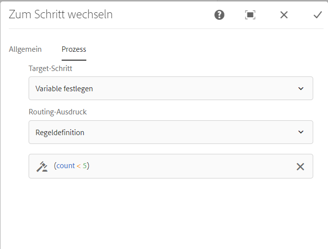

# Referenz für Workflow-Schritte {#workflow-step-reference}

Workflow-Modelle beinhalten eine Reihe von Schritten unterschiedlichen Typs. Je nach Typ können diese Schritte konfiguriert und mit Parametern und Skripten erweitert werden, um die benötigten Funktionen und Steuerungsmöglichkeiten bereitzustellen.

>[!NOTE]
>
>In diesem Abschnitt werden die standardmäßigen Workflow-Schritte beschrieben.
>
>Informationen zu modulspezifischen Schritten finden Sie unter folgenden Themen:
>
>* [Schrittreferenz für AEM Forms Workflow](/help/forms/using/aem-forms-workflow-step-reference.md)
>* [Verarbeiten von Assets mithilfe von Medien-Handlern und Workflows](/help/assets/media-handlers.md)
>

## Schritt-Eigenschaften {#step-properties}

Jede Schritt-Komponente verfügt über eine **Schritt-Eigenschaften** -Dialogfeld, in dem Sie die erforderlichen Eigenschaften definieren und bearbeiten können.

### Schritteigenschaften – Registerkarte „Allgemein“ {#step-properties-common-tab}

Eine Kombination der folgenden Eigenschaften ist für die meisten Workflow-Schrittkomponenten im Eigenschaften-Dialogfeld auf der Registerkarte **Allgemein** verfügbar:

* **Titel** Der Titel für den Schritt.

* **Beschreibung**
Eine Beschreibung des Schritts.

* **Workflow-Phase**

  Eine Dropdown-Auswahl, mit der Sie dem Schritt eine [Phase](/help/sites-developing/workflows.md#workflow-stages) zuweisen können.

* **Zeitüberschreitung**

  Der Zeitraum, nach dem für den Schritt eine Zeitüberschreitung auftritt.
Folgende Optionen stehen zur Auswahl: **Aus**, **Unmittelbar**, **1 h**, **6 h**, **12 h**, **24 h**.

* **Zeitüberschreitungs-Handler**

  Der Handler, der den Workflow steuert, wenn bei dem Schritt eine Zeitüberschreitung auftritt. Beispiel: `Auto Advancer`

* **Handler-Fortschritt**

  Wählen Sie diese Option aus, um den Workflow nach dem Ausführen automatisch mit dem nächsten Schritt fortzuführen. Wenn diese Option nicht ausgewählt ist, muss das Implementierungsskript den Workflow fortführen.

### Schritteigenschaften – Registerkarte „Benutzer/Gruppe“ {#step-properties-user-group-tab}

Die folgenden Eigenschaften sind für viele Workflow-Schrittkomponenten auf der Registerkarte **Benutzer/Gruppe** des Eigenschaftendialogfelds verfügbar:

* **Benachrichtigen Sie den Benutzer bzw. die Benutzerinn per E-Mail**

   * Sie können die Teilnehmenden benachrichtigen, indem Sie ihnen eine E-Mail senden, wenn der Workflow den Schritt erreicht.
   * Wenn diese Option aktiviert ist, wird eine E-Mail an den Benutzer bzw. die Benutzerin, die durch die Eigenschaft **Benutzer/Gruppe** definiert ist, oder an jedes Mitglied der Gruppe gesendet, wenn eine Gruppe definiert ist.

* **Benutzer/Gruppe**

   * Über eine Dropdown-Auswahl können Sie zu einem Benutzer bzw. einer Benutzerin oder einer Gruppe navigieren und diese auswählen.
   * Falls Sie den Schritt einem bestimmten Benutzer bzw. Benutzerin zuweisen, kann nur diese Person Aktionen für den Schritt durchführen.
   * Falls Sie den Schritt einer ganzen Gruppe zuweisen, erhalten alle Personen in dieser Gruppe die Aktion im **Workflow-Posteingang**, sobald der Workflow diesen Schritt erreicht.
   * Weitere Informationen finden Sie unter [An Workflows teilnehmen](/help/sites-authoring/workflows-participating.md).

## UND-Teilung {#and-split}

Mit der **UND-Teilung** wird der Workflow unterteilt und beide Verzweigungen werden aktiviert. Sie fügen jeder Verzweigung nach Bedarf Workflow-Schritte hinzu. In diesem Schritt können Sie mehrere Verarbeitungspfade in den Workflow einführen. Sie können beispielsweise zulassen, dass bestimmte Überprüfungsschritte parallel ausgeführt werden und so Zeit sparen.


### UND-Teilung – Konfiguration {#and-split-configuration}

So konfigurieren Sie die Aufspaltung:

* Bearbeiten Sie die **UND-Verzweigungs-Eigenschaften**:

   * **Name der Teilung**: Fügen Sie zur Erläuterung einen Namen ein.
   * Wählen Sie die Anzahl der erforderlichen Verzweigungen aus. 2, 3, 4 oder 5.

* Fügen Sie den Verzweigungen Workflow-Schritte hinzu, falls erforderlich.

  

## Container-Schritt {#container-step}

Ein Container-Schritt startet ein anderes Workflow-Modell, das als untergeordneter Workflow ausgeführt wird.

Mit diesem Container können Sie Workflow-Modelle wiederverwenden, um häufige Schrittfolgen zu implementieren. Beispielsweise kann ein Übersetzung-Workflow-Modell in mehreren Bearbeitung-Workflows verwendet werden.


### Container-Schritt – Konfiguration {#container-step-configuration}

Verwenden und bearbeiten Sie die folgenden Registerkarten, um den Schritt zu konfigurieren:

* [Allgemein](#step-properties-common-tab)
* **Container**

   * **Unter-Workflow**: Wählen Sie den zu startenden Workflow aus.

## Zum Schritt wechseln {#goto-step}

Die **Zum Schritt wechseln** können Sie den nächsten Schritt angeben, der im Workflow-Modell ausgeführt werden soll. Sie können eine Regeldefinition, ein externes Skript oder ein ECMA-Skript als Routing-Ausdruck angeben, um den nächsten Schritt für das Workflow-Modell zu bewerten.

* Wenn die von Ihnen angegebene Bedingung erfüllt ist, wird **Zum Schritt wechseln** abgeschlossen und die Workflow-Engine führt den angegebenen Schritt aus.
* Wenn die von Ihnen angegebene Bedingung nicht zutrifft, wird **Zum Schritt wechseln** abgeschlossen und die normale Routing-Logik bestimmt den nächsten auszuführenden Schritt.

Mit **Zum Schritt wechseln** können Sie erweiterte Routingstrukturen im Workflow-Modell implementieren. Um z. B. eine Schleife zu implementieren, kann **Zum Schritt wechseln** so definiert werden, dass im Workflow ein vorheriger Schritt ausgeführt wird und der Routing-Ausdruck eine Schleifenbedingung auswertet.

### Zum Schritt wechseln – Konfiguration {#goto-step-configuration}

Verwenden und bearbeiten Sie die folgenden Registerkarten, um den Schritt zu konfigurieren:

* [Allgemein](#step-properties-common-tab)
* **Prozess**

   * **Target-Schritt**: Wählen Sie den auszuführenden Schritt aus, nachdem Sie die Bedingung für den Routing-Ausdruck bewertet haben.
   * **Routing-Ausdruck**: Wählen Sie Regeldefinition, externes Skript oder ein ECMA-Skript aus, das bestimmt, ob der **Target-Schritt** ausgeführt wird.

      * **Regeldefinition:** Verwenden Sie den [Ausdruckseditor](/help/forms/using/variable-in-aem-workflows.md#use-expression-editor), um die Regel zu definieren.
      * **Externes Skript:** Der Pfad des externen Skripts.
      * **ECMA Skript**: Das Skript, das bestimmt, ob **Zum Schritt wechseln** ausgeführt wird.

#### Simulieren einer for-Schleife {#simulating-a-for-loop}

Zur Simulation einer „for-Schleife“ müssen Sie die Anzahl der aufgetretenen Schleifeniterationen zählen:

* Die Anzahl stellt normalerweise einen Index der Elemente dar, auf die im Workflow Aktionen erfolgen.
* Die Anzahl wird als Ausstiegskriterium für die Schleife ausgewertet.

Um beispielsweise einen Workflow zu implementieren, der eine Aktion auf mehreren JCR-Knoten ausführt, können Sie einen Schleifenzähler als Index für die Knoten verwenden. Speichern Sie in der Datenzuordnung der Workflow-Instanz einen `integer`-Wert, um die Schleifenzahl zu speichern. Um die Anzahl zu erhöhen und die Anzahl mit dem Ausstiegskriterium zu vergleichen, verwenden Sie das Skript des **Zum Schritt wechseln**.

```
function check(){
   var count=0;
   var keyname="loopcount"
   try{
      if (workflowData.getMetaDataMap().containsKey(keyname)){
        log.info("goto script: found loopcount key");
        count= parseInt(workflowData.getMetaDataMap().get(keyname))+1;
      }

     workflowData.getMetaDataMap().put(keyname,count);

     }catch(err) {
         log.info(err.message);
         return false;
    }
   if (parseInt(count) <7){
       return true;
   } else {
      return false;
   }
}
```

### Simulieren einer for-Schleife mithilfe der Regeldefinition {#simulateforloop}

Sie können auch eine for-Schleife simulieren, indem Sie die Regeldefinition als Routing-Ausdruck verwenden. [Erstellen Sie eine Variable **count**](/help/forms/using/variable-in-aem-workflows.md#create-a-variable) des Datentyps Long. Verwenden Sie **Ausdruck** als Zuordnungsmodus im Schritt **[Variable festlegen](/help/sites-developing/using-variables-in-aem-workflows.md#set-a-variable)**, um den Wert der Variable **count** bei jeder Ausführung des Schritts **Variable festlegen** auf **count + 1** zu setzen.


Verwenden Sie in **Zum Schritt wechseln** **Variable festlegen** als **Target-Schritt** und **count &lt; 5** als Routing-Ausdruck.



Der Schritt **Variable festlegen** wird wiederholt ausgeführt. Dabei wird der Wert der Variablen **count** bei jedem Durchlauf um 1 erhöht, bis der Wert 5 erreicht.

## ODER-Teilung {#or-split}

Die **ODER-Teilung** erstellt eine Verzweigung im Workflow, nach der nur eine der beiden Verzweigungen aktiv bleibt. Mit diesem Schritt können Sie bedingte Verarbeitungspfade in einem Workflow einrichten. Sie fügen jeder Verzweigung nach Bedarf Workflow-Schritte hinzu.

>[!NOTE]
>
>Weitere Informationen finden Sie unter [Schritt ODER-Teilung](https://experienceleague.adobe.com/docs/experience-manager-65/developing/extending-aem/extending-workflows/using-variables-in-aem-workflows.html?lang=de#use-a-variable).


### ODER-Teilung – Konfiguration {#or-split-configuration}

So konfigurieren Sie die Aufspaltung:

* Bearbeiten Sie die **ODER-Verzweigungs-Eigenschaften**:

   * **Allgemein**

      * Geben Sie den Namen der Teilung an.

   * **Verzweigungen (*x)***

      * **Verzweigung hinzufügen:** Fügen Sie dem Schritt weitere Verzweigungen hinzu.
      * **Routing-Ausdruck auswählen**: Um die aktive Verzweigung auszuwerten, wählen Sie den Routing-Ausdruck aus. Mögliche Werte sind: Regeldefinition, externes Skript und ECMA-Skript.
      * **Klicken, um Ausdruck hinzuzufügen**: Fügen Sie einen Ausdruck hinzu, um die aktive Verzweigung zu bewerten, wenn Sie **Regeldefinition** als Routing-Ausdruck auswählen.
      * **Skriptpfad**: Der Pfad zu einer Datei, die das Skript zum Bewerten der aktiven Verzweigung enthält, wenn Sie **Externes Skript** als Routing-Ausdruck auswählen.
      * **Skript**: Fügen Sie das Skript in das Feld ein, um die aktive Verzweigung zu bewerten, wenn Sie **ECMA-Skript** als Routing-Ausdruck auswählen.
      * **Standardroute**: Im Falle mehrerer Verzweigungen wird die Standardverzweigung befolgt. Sie können nur eine Verzweigung als Standard festlegen.

  >[!NOTE]
  >
  >    * Es wird jeweils ein Zweig auf der Grundlage des Routing-Ausdrucks bewertet.
  >    * Die Verzweigungen werden von oben nach unten bewertet.
  >    * Das erste Skript, das als „true“ bewertet wird, wird ausgeführt.
  >    * Falls keine Verzweigung als „true“ bewertet wird, wird der Workflow nicht fortgeführt.
  >
  >

  >[!NOTE]
  >
  >Siehe [Definieren einer Regel für eine ODER-Teilung](/help/sites-developing/workflows-models.md#defineruleecmascript).

* Fügen Sie den Verzweigungen Workflow-Schritte hinzu, falls erforderlich.

## Teilnehmerschritte und Auswahlmöglichkeiten {#participant-steps-and-choosers}

### Teilnehmerschritt {#participant-step}

Mit der Option **Teilnehmer-Schritt** können Sie einer bestimmten Aktion Eigentümerrechte zuweisen. Der Workflow wird nur fortgesetzt, wenn der Benutzer bzw. Benutzerin den Schritt manuell bestätigt hat. Dieser Workflow wird verwendet, wenn Sie möchten, dass jemand auf den Workflow reagiert. Zum Beispiel ein Überprüfungsschritt.

Obwohl sie nicht direkt damit im Zusammenhang steht, muss die Benutzerautorisierung beim Zuweisen einer Aktion berücksichtigt werden. Der Benutzer muss Zugriff auf die Seite mit der Workflow-Payload haben.

#### Teilnehmerschritt – Konfiguration {#participant-step-configuration}

Verwenden und bearbeiten Sie die folgenden Registerkarten, um den Schritt zu konfigurieren:

* [Allgemein](#step-properties-common-tab)
* [Benutzer/Gruppe](#step-properties-user-group-tab)

>[!NOTE]
>
>Der Workflow-Initiator wird immer benachrichtigt, wenn:
>
>* Der Workflow abgeschlossen (beendet) wurde.
>* Der Workflow wurde abgebrochen (vorzeitig beendet).
>

>[!NOTE]
>
>Einige Eigenschaften müssen konfiguriert werden, um E-Mail-Benachrichtigungen zu aktivieren. Sie können auch die E-Mail-Vorlage anpassen oder eine E-Mail-Vorlage für eine neue Sprache hinzufügen. Informationen zum Konfigurieren von E-Mail-Benachrichtigungen in AEM finden Sie unter [Konfigurieren von E-Mail-Benachrichtigungen](/help/sites-administering/notification.md#configuringemailnotification).

### Dialogfeld „Teilnehmerschritt“ {#dialog-participant-step}

Verwenden Sie das Dialogfeld **Teilnehmerschritt**, um Daten des Benutzers bzw. der Benutzerin zu erfassen, dem das Arbeitselement zugewiesen wird. Dieser Schritt ist nützlich für die Erfassung kleiner Datenmengen, die später im Workflow verwendet werden.

Nach Abschluss des Schritts enthält das Dialogfeld **Arbeitselement fertigstellen** die Felder, die Sie für dieses Dialogfeld definiert haben. Die in den Feldern erfassten Daten werden in den Knoten der Workflow-Payload gespeichert. Nachfolgende Workflow-Schritte können dann den Wert aus dem Repository lesen.

Um den Schritt zu konfigurieren, geben Sie die Gruppe oder den Benutzer bzw. der Benutzerin an, dem bzw. der das Arbeitselement zugewiesen werden soll, sowie den Pfad zum Dialogfeld.

#### Dialogfeld „Teilnehmerschritt“ – Konfiguration {#dialog-participant-step-configuration}

Verwenden und bearbeiten Sie die folgenden Registerkarten, um den Schritt zu konfigurieren:

* [Allgemein](#step-properties-common-tab)
* [Benutzer/Gruppe](#step-properties-user-group-tab)
* **Dialogfeld**

   * **Dialogpfad**: Der Pfad zum Dialogfeldknoten des [von Ihnen erstellten Dialogfelds](#dialog-participant-step-creating-a-dialog).

#### Dialogfeld „Teilnehmerschritt“ – Erstellen eines Dialogfelds {#dialog-participant-step-creating-a-dialog}

Beim Erstellen eines Dialogfelds müssen Sie Folgendes beachten:

* Entscheiden Sie, wo die entstandenen Daten [in der Payload gespeichert werden](#dialog-participant-step-storing-data-in-the-payload).
* [Definieren Sie das Dialogfeld, einschließlich der Felder zum Erfassen und Speichern der Daten](#dialog-participant-step-dialog-definition).

#### Dialogfeld „Teilnehmer-Schritt“ – Speichern von Daten in der Payload {#dialog-participant-step-storing-data-in-the-payload}

Sie können Widget-Daten in der Workflow-Payload oder in den Metadaten des Arbeitselements speichern. Das Format der `name`-Eigenschaft des Widget-Knotens bestimmt, wo die Daten gespeichert werden.

* **Daten mit der Payload speichern**

   * Um Widget-Daten als Eigenschaft der Workflow-Payload zu speichern, verwenden Sie folgendes Format für den Wert der name-Eigenschaft des Widget-Knotens:
     `./jcr:content/nodename`

   * Die Daten werden in der `nodename`-Eigenschaft des Payload-Knotens gespeichert. Wenn der Knoten diese Eigenschaft nicht enthält, wird die Eigenschaft erstellt.
   * Wenn Daten bei der Payload gespeichert werden, wird der Wert der Eigenschaft bei nachfolgender Verwendung des Dialogfelds mit derselben Payload überschrieben.

* **Speichern von Daten mit dem Arbeitselement**

   * Um Widget-Daten als Eigenschaft der Metadaten des Arbeitselements zu speichern, verwenden Sie das folgende Format für den Wert der name-Eigenschaft:
     `nodename`

   * Die Daten werden in der `nodename`-Eigenschaft der `metadata` des Arbeitselements gespeichert. Die Daten werden beibehalten, wenn das Dialogfeld anschließend mit derselben Payload verwendet wird.

#### Dialogfeld „Teilnehmerschritt“ – Dialogfelddefinition {#dialog-participant-step-dialog-definition}

1. **Dialogfeldstruktur**

   Dialogfelder für das Dialogfeld „Teilnehmer-Schritt“ ähneln den Dialogfeldern, die Sie für Bearbeitungskomponenten erstellen. Sie sind gespeichert unter:

   `/apps/myapp/workflow/dialogs`

   Dialogfelder für die standardmäßige Touch-optimierte Benutzeroberfläche weisen die folgende Knotenstruktur auf:

   ```xml
   newComponent (cq:Component)
     |- cq:dialog (nt:unstructured)
       |- content
         |- layout
           |- items
             |- column
               |- items
                 |- component0
                 |- component1
                 |- ...
   ```

   >[!NOTE]
   >
   >Weitere Informationen finden Sie unter [Erstellen und Konfigurieren eines Dialogfelds](/help/sites-developing/developing-components.md#creating-and-configuring-a-dialog).

1. **Eigenschaft „Dialogpfad“**

   Das Dialogfeld **Teilnehmer-Schritt** beinhaltet die Eigenschaft **Dialogpfad** (in Kombination mit den Eigenschaften eines [Teilnehmer-Schritts](#participant-step)). Der Wert der Eigenschaft **Dialogpfad** entspricht dem Pfad zum Knoten `dialog` im Dialogfeld.

   Das Dialogfeld kann sich beispielsweise in einer Komponente mit dem Namen `EmailWatch` befindet, die im Knoten gespeichert ist:

   `/apps/myapp/workflows/dialogs`

   Für die Touch-optimierte Benutzeroberfläche wird folgender Wert für die Eigenschaft **Dialogpfad** verwendet:

   `/apps/myapp/workflow/dialogs/EmailWatch/cq:dialog`

   

1. **Beispiel für eine Dialogfelddefinition**

   Das folgende XML-Code-Snippet steht für ein Dialogfeld, bei dem der `String`-Wert im Knoten `watchEmail` des Payload-Inhalts gespeichert wird. Der Titelknoten stellt die Komponente [TextField](https://developer.adobe.com/experience-manager/reference-materials/6-5/granite-ui/api/jcr_root/libs/granite/ui/components/coral/foundation/form/textfield/index.html) dar:

   ```xml
   jcr:primaryType="nt:unstructured"
       jcr:title="Watcher Email Address Dialog"
       sling:resourceType="cq/gui/components/authoring/dialog">
       <content jcr:primaryType="nt:unstructured"
           sling:resourceType="granite/ui/components/foundation/container">
           <layout jcr:primaryType="nt:unstructured"
               margin="false"
               sling:resourceType="granite/ui/components/foundation/layouts/fixedcolumns"
           />
           <items jcr:primaryType="nt:unstructured">
               <column jcr:primaryType="nt:unstructured"
                   sling:resourceType="granite/ui/components/foundation/container">
                   <items jcr:primaryType="nt:unstructured">
                       <title jcr:primaryType="nt:unstructured"
                           fieldLabel="Notification Email Address"
                           name="./jcr:content/watchEmails"
                           sling:resourceType="granite/ui/components/foundation/form/textfield"
                       />
                   </items>
               </column>
           </items>
       </content>
   </cq:dialog>
   ```

   In der Touch-optimierten Benutzeroberfläche führt dieses Beispiel zu einem Dialogfeld wie dem folgenden:

   

### Dynamischer Teilnehmerschritt {#dynamic-participant-step}

Die Komponente **Dynamischer Teilnehmerschritt** ähnelt **[Teilnehmerschritt](#participant-step)**, mit dem Unterschied, dass der Teilnehmer oder die Teilnehmerin zur Laufzeit automatisch ausgewählt wird.

Rufen Sie zur Konfiguration des Schritts eine **Teilnehmerauswahl** auf, die Teilnehmende identifiziert, denen das Arbeitselement, zusammen mit einem Dialogfeld, zugewiesen werden soll.

#### Dynamischer Teilnehmerschritt – Konfiguration {#dynamic-participant-step-configuration}

Verwenden und bearbeiten Sie die folgenden Registerkarten, um den Schritt zu konfigurieren:

* [Allgemein](#step-properties-common-tab)
* **Teilnehmerauswahl**

   * **Teilnehmerauswahl**: Der Name der [Teilnehmerauswahl, die Sie erstellen](#developingtheparticipantchooser).
   * **Argumente**: Alle erforderlichen Argumente.
   * **E-Mail**: Ob eine E-Mail-Benachrichtigung an Benutzer bzw. Benutzerinnen gesendet werden soll.

* **Dialogfeld**

   * **Dialogpfad**: Der Pfad zum Dialogknoten des [Dialogfelds, das Sie erstellen (wie mit dem **Dialogfeld „Teilnehmerschritt“**)](#dialog-participant-step-creating-a-dialog).

#### Dynamischer Teilnehmerschritt – Schritt zur Entwicklung der Teilnehmerauswahl {#dynamic-participant-step-developing-the-participant-chooser}

Sie erstellen die Teilnehmerauswahl. Daher können Sie eine beliebige Auswahllogik oder ein beliebiges Kriterium verwenden. Ihre Teilnehmerauswahl kann beispielsweise Benutzer bzw. Benutzerinnen (innerhalb einer Gruppe) mit den wenigsten Arbeitselementen auswählen. Sie können eine beliebige Anzahl von Teilnehmerauswahlen erstellen, die mit verschiedenen Vorkommen der Komponente **Dynamischer Teilnehmerschritt** in Ihren Workflow-Modellen verwendet werden kann.

Erstellen Sie einen OSGi-Dienst oder ein ECMAScript, das Benutzer bzw. Benutzerinnen auswählt, denen das Arbeitselement zugewiesen werden soll.

* **ECMA-Skript**

  Skripte müssen eine getParticipant-Funktion enthalten, mit der eine Benutzer-ID als `String`-Wert zurückgegeben wird. Speichern Sie die benutzerdefinierten Skripte beispielsweise im Ordner `/apps/myapp/workflow/scripts` oder in einem Unterordner.

  Ein Beispielskript ist in einer Standard-AEM-Instanz enthalten:

  `/libs/workflow/scripts/initiator-participant-chooser.ecma`

  >[!CAUTION]
  >
  >Sie dürfen keinerlei Änderungen im Pfad `/libs` vornehmen.
  >
  >
  >Der Grund dafür ist, dass der Inhalt von `/libs` überschrieben wird, wenn Sie Ihre Instanz das nächste Mal aktualisieren (und möglicherweise überschrieben wird, wenn Sie einen Hotfix oder ein Feature Pack anwenden).

  Mit diesem Skript wird der Workflow-Initiator als Teilnehmer ausgewählt:

  ```
  function getParticipant() {
      return workItem.getWorkflow().getInitiator();
  }
  ```

  >[!NOTE]
  >
  >Die Komponente **Workflow-Initiator-Teilnehmerauswahl** erweitert die Komponente **Dynamischer-Teilnehmer-Schritt** und verwendet dieses Skript für die Implementierung des Schritts.

* **OSGi-Dienst**

  Dienste müssen die Schnittstelle [com.day.cq.workflow.exec.ParticipantStepChooser](https://developer.adobe.com/experience-manager/reference-materials/6-5/javadoc/com/day/cq/workflow/exec/ParticipantStepChooser.html) implementieren. Die Schnittstelle definiert die folgenden Mitglieder:

   * `SERVICE_PROPERTY_LABEL`-Feld: Geben Sie in diesem Feld den Namen der Teilnehmerauswahl an. Der Name wird in einer Liste der verfügbaren Teilnehmerauswahlen in den Eigenschaften **Dynamischer Teilnehmer – Schritt** angezeigt.

   * `getParticipant`-Methode: Gibt die dynamisch aufgelöste Prinzipal-ID als `String`-Wert zurück.

  >[!CAUTION]
  >
  >Die `getParticipant`-Methode gibt die dynamisch aufgelöste Prinzipal-ID zurück. Diese ID kann entweder eine Gruppen-ID oder eine Benutzer-ID sein.
  >
  >
  >Eine Gruppen-ID kann jedoch nur für einen **Teilnehmerschritt** verwendet werden, wenn eine Liste der Teilnehmenden zurückgegeben wird. Für einen **Dynamischen Teilnehmerschritt** wird eine leere Liste zurückgegeben und kann nicht für die Delegierung verwendet werden.

  Um die Implementierung für **Dynamische Teilnehmerschritt**-Komponenten verfügbar zu machen, fügen Sie die Java™-Klasse zum OSGi-Bundle hinzu, das den Dienst exportiert, und stellen Sie das Bundle auf dem AEM-Server bereit.

  >[!NOTE]
  >
  >Die **zufallsbasierte Teilnehmerauswahl** ist ein Sampling-Dienst, der willkürlich einen Benutzer auswählt ( `com.day.cq.workflow.impl.process.RandomParticipantChooser`). Das Beispiel der Schrittkomponente **Zufällige Teilnehmerwahl** erweitert den **Dynamischen Teilnehmerschritt** und verwendet diesen Dienst für die Implementierung des Schritts.

#### Dynamischer Teilnehmerschritt – Beispiel für einen Teilnehmerauswahldienst {#dynamic-participant-step-example-participant-chooser-service}

Die folgende Java™-Klasse implementiert die Schnittstelle `ParticipantStepChooser`. Die Klasse gibt den Namen des Teilnehmers zurück, der den Workflow initiiert hat. Der Code verwendet dieselbe Logik wie das Beispielskript (`initiator-participant-chooser.ecma`).

Die `@Property`-Anmerkung setzt den Wert des `SERVICE_PROPERTY_LABEL`-Felds auf `Workflow Initiator Participant Chooser`.

```java
package com.adobe.example;

import org.apache.felix.scr.annotations.Component;
import org.apache.felix.scr.annotations.Properties;
import org.apache.felix.scr.annotations.Property;
import org.apache.felix.scr.annotations.Service;
import org.osgi.framework.Constants;
import org.slf4j.Logger;
import org.slf4j.LoggerFactory;

import com.adobe.granite.workflow.WorkflowException;
import com.adobe.granite.workflow.WorkflowSession;
import com.adobe.granite.workflow.exec.ParticipantStepChooser;
import com.adobe.granite.workflow.exec.WorkItem;
import com.adobe.granite.workflow.metadata.MetaDataMap;

@Component
@Service
@Properties({
        @Property(name = Constants.SERVICE_DESCRIPTION, value = "An example implementation of a dynamic participant chooser."),
        @Property(name = ParticipantStepChooser.SERVICE_PROPERTY_LABEL, value = "Workflow Initiator Participant Chooser (service)") })
public class InitiatorParticipantChooser implements ParticipantStepChooser {

 private Logger logger = LoggerFactory.getLogger(this.getClass());

 public String getParticipant(WorkItem arg0, WorkflowSession arg1,
   MetaDataMap arg2) throws WorkflowException {

  String initiator = arg0.getWorkflow().getInitiator();
  logger.info("Assigning Dynamic Participant Step work item to {}",initiator);

  return initiator;
 }
}
```

Im Dialogfeld **Dynamischer-Teilnehmer-Schritt** enthält die Liste **Teilnehmerauswahl** das Element `Workflow Initiator Participant Chooser (script)`, das für diesen Dienst steht.

Wenn das Workflow-Modell gestartet wird, wird in der Protokolldatei die ID des Benutzers angegeben, der den Workflow initiiert hat und dem das Arbeitselement zugewiesen ist. In diesem Beispiel hat der Benutzer `admin` den Workflow gestartet.

`13.09.2015 15:48:53.037 *INFO* [10.176.129.223 [1347565733037] POST /etc/workflow/instances HTTP/1.1] com.adobe.example.InitiatorParticipantChooser Assigning Dynamic Participant Step work item to admin`

### Formular „Teilnehmerschritt“ {#form-participant-step}

Das **Formular „Teilnehmerschritt“** zeigt beim Öffnen des Arbeitselements ein Formular an. Wenn der Benutzer das Formular ausfüllt und absendet, werden die Daten in den Knoten der Workflow-Payload gespeichert.

Um den Schritt zu konfigurieren, geben Sie die Gruppe oder den Benutzer bzw. die Benutzerin an, dem bzw. der das Arbeitselement zugewiesen werden soll, und den Pfad zum Formular.

>[!CAUTION]
>
>In diesem Abschnitt werden [Formulare von Foundation-Komponenten für die Seitenbearbeitung](/help/sites-authoring/default-components-foundation.md#form) behandelt.

#### Formular „Teilnehmerschritt“ – Konfiguration {#form-participant-step-configuration}

Verwenden und bearbeiten Sie die folgenden Registerkarten, um den Schritt zu konfigurieren:

* [Allgemein](#step-properties-common-tab)
* [Benutzer/Gruppe](#step-properties-user-group-tab)
* **Formular**

   * **Formularpfad**: Der Pfad zum [Formular, das Sie erstellen](#form-participant-step-creating-the-form).

#### Formular „Teilnehmerschritt“ – Erstellen des Formulars {#form-participant-step-creating-the-form}

Erstellen Sie wie gewohnt ein Formular mit einem **Formular „Teilnehmerschritt“**. Formulare für Formular „Teilnehmerschritt“ müssen wie folgt konfiguriert werden:

* Für die Komponente **Beginn des Formulars** muss die Eigenschaft **Aktionstyp** auf `Edit Workflow Controlled Resource(s)` gesetzt sein.
* Die Komponente **Beginn des Formulars** muss einen Wert für die Eigenschaft `Form Identifier` enthalten.
* Für die Formularkomponenten muss die Eigenschaft **Elementname** auf den Pfad des Knotens verweisen, in dem die Felddaten gespeichert werden. Der Pfad muss auf einen Knoten im Payload-Inhalt des Workflows verweisen. Der Wert verwendet das folgende Format:

  `./jcr:content/path_to_node`

* Das Formular muss die Komponente **Workflow-Senden-Schaltfläche** enthalten. Sie konfigurieren keine Eigenschaften der Komponente.

Die Anforderungen Ihres Workflows bestimmen, wo Felddaten gespeichert werden sollen. Beispielsweise können Felddaten verwendet werden, um die Eigenschaften des Seiteninhalts zu konfigurieren. Der folgende Wert der Eigenschaft **Elementname** speichert Felddaten als Wert der `redirectTarget`-Eigenschaft des Knotens `jcr:content`:

`./jcr:content/redirectTarget`

Im folgenden Beispiel werden die Felddaten als Inhalt einer **Text**-Komponente auf der Payload-Seite verwendet:

`./jcr:content/par/text_3/text`

Das erste Beispiel kann für eine beliebige Seite verwendet werden, die von der `cq:Page`-Komponente gerendert wird. Das zweite Beispiel kann nur verwendet werden, wenn die Payload-Seite eine **Text**-Komponente mit der ID `text_3` beinhaltet.

Das Formular kann sich an einer beliebigen Stelle im Repository befinden, Workflow-Benutzer bzw. -Benutzerinnen müssen jedoch berechtigt sein, das Formular zu lesen.

### Zufallsbasierte Teilnehmerauswahl {#random-participant-chooser}

Der Schritt **Zufallsbasierte Teilnehmerauswahl** bezieht sich auf eine Teilnehmerauswahl, die das erzeugte Arbeitselement einem willkürlich aus einer Liste ausgewählten Benutzer zuweist.


#### Zufallsbasierte Teilnehmerauswahl – Konfiguration {#random-participant-chooser-configuration}

Verwenden und bearbeiten Sie die folgenden Registerkarten, um den Schritt zu konfigurieren:

* [Allgemein](#step-properties-common-tab)
* **Argumente**

   * **Teilnehmer bzw. Teilnehmerin**: Gibt die Liste der zur Auswahl verfügbaren Benutzer bzw. Benutzerinnen an. Um einen Benutzer oder eine Benutzerin zur Liste hinzuzufügen, klicken Sie auf **Element hinzufügen** und geben Sie den Home-Pfad des Benutzerknotens oder die Benutzer-ID ein. Die Reihenfolge der Benutzer bzw. Benutzerinnen wirkt sich nicht auf die Wahrscheinlichkeit aus, ein Arbeitselement zugewiesen zu bekommen.

### Workflow-Initiator-Teilnehmerauswahl {#workflow-initiator-participant-chooser}

Der Schritt **Workflow-Initiator-Teilnehmerauswahl** ist eine Teilnehmerauswahl, die das generierte Arbeitselement dem Benutzer bzw. der Benutzerin zuweist, der bzw. die den Workflow gestartet hat. Außer den **Allgemein**-Eigenschaften gibt es keine weiteren zu konfigurierenden Eigenschaften.

#### Workflow-Initiator-Teilnehmerauswahl – Konfiguration {#workflow-initiator-participant-chooser-configuration}

Bearbeiten Sie den Schritt auf den folgenden Registerkarten, um ihn zu konfigurieren:

* [Allgemein](#step-properties-common-tab)

## Prozessschritt {#process-step}

Ein **Prozessschritt** führt ein ECMA-Skript aus oder ruft einen OSGi-Dienst für eine automatische Verarbeitung auf.


### Prozessschritt – Konfiguration {#process-step-configuration}

Verwenden und bearbeiten Sie die folgenden Registerkarten, um den Schritt zu konfigurieren:

* [Allgemein](#step-properties-common-tab)
* **Prozess**

   * **Prozess**: Die auszuführende Prozessimplementierung. Wählen Sie das ECMA-Skript oder den OSGi-Dienst aus dem Dropdown-Menü aus. Informationen:

      * Die standardmäßigen ECMAScripts und OSGi-Dienste finden Sie unter [Integrierte Prozesse für Prozessschritte](/help/sites-developing/workflows-process-ref.md).
      * Weitere Informationen zum Erstellen von ECMAScripts für einen Prozessschritt finden Sie unter [Implementieren eines Prozessschritts mit einem ECMAScript](/help/sites-developing/workflows-customizing-extending.md#using-ecmascript).
      * Weitere Informationen zum Erstellen von OSGi-Diensten für einen Prozessschritt finden Sie unter [Implementieren eines Prozessschritts mit einer Java™-Klasse](/help/sites-developing/workflows-customizing-extending.md#implementing-a-process-step-with-a-java-class).

   * **Handler-Fortschritt**: Wählen Sie diese Option aus, um den Workflow nach der Ausführung automatisch mit dem nächsten Schritt fortzuführen. Wenn diese Option nicht ausgewählt ist, muss das Implementierungsskript den Workflow fortführen.
   * **Argumente**: An den Prozess zu übergebende Argumente.

## Variable festlegen {#set-variable}

Im Schritt Variable festlegen können Sie den Wert einer Variablen festlegen und die Reihenfolge definieren, in der die Werte festgelegt werden. Die Variable wird in der Reihenfolge festgelegt, in der die Variablenzuordnungen im Schritt „Variable festlegen“ aufgeführt sind.


### Variable festlegen – Konfiguration {#setvariable}

Verwenden und bearbeiten Sie die folgenden Registerkarten, um den Schritt zu konfigurieren:

* [Allgemein](/help/sites-developing/workflows-step-ref.md#step-properties-common-tab)
* **Zuordnung**

   * **Variable auswählen:** Verwenden Sie diese Option, um eine Variable auszuwählen und ihren Wert festzulegen.
   * **Zuordnungsmodus auswählen:** Wählen Sie einen Zuordnungsmodus aus, um den Wert für die Variable festzulegen. Je nach Datentyp der Variablen können Sie die folgenden Optionen verwenden, um den Wert einer Variablen festzulegen:

      * **Literal:** Verwenden Sie die Option, wenn Sie den genauen Wert kennen, der angegeben werden soll.
      * **Ausdruck:** Verwenden Sie die Option, wenn der zu verwendende Wert in einem Ausdruck berechnet wird. Der Ausdruck wird im bereitgestellten Ausdruckseditor erstellt.
      * **JSON-Punktnotation:** Verwenden Sie die Option, um einen Wert aus einer Variablen vom Typ JSON oder FDM abzurufen.
      * **XPATH:** Verwenden Sie die Option, um einen Wert aus einer Variablen vom Typ XML abzurufen.
      * **Relativ zur Payload:** Verwenden Sie die Option, wenn der Wert, der in einer Variablen gespeichert werden soll, unter einem Pfad relativ zur Payload verfügbar ist.
      * **Absoluter Pfad:** Verwenden Sie die Option, wenn der Wert, der in einer Variablen gespeichert werden soll, unter einem absoluten Pfad verfügbar ist.

   * **Wert angeben:** Um die Variable zuzuordnen, geben Sie einen Wert an. Der Wert, den Sie in diesem Feld angeben, hängt vom Zuordnungsmodus ab.
   * **Zuordnung hinzufügen:** Verwenden Sie diese Option, um weitere Zuordnungen hinzuzufügen, um einen Wert für die Variable festzulegen.
