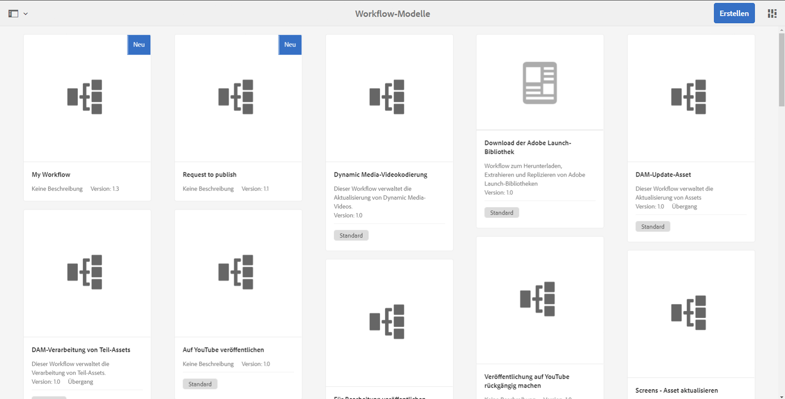

# Entwickeln und Erweitern von Workflows{#developing-and-extending-workflows}

AEM stellt mehrere Tools und Ressourcen zum Erstellen von Workflow-Modellen, Entwickeln von Workflow-Schritten und programmgesteuerten Interagieren mit Workflows bereit.

Mit Workflows können Sie Prozesse zum Verwalten von Ressourcen und Veröffentlichen von Inhalten in der AEM-Umgebung automatisieren. Workflows beinhalten eine Reihe von Schritten, wobei bei jedem Schritt eine diskrete Aufgabe ausgeführt wird. Sie können Logik und Laufzeitdaten verwenden, um zu entscheiden, wann ein Prozess fortgesetzt wird, und den nächsten Schritt unter mehreren möglichen Schritten auswählen.

So beinhalten beispielsweise Geschäftsprozesse zum Erstellen und Veröffentlichen von Webseiten Genehmigungs- und Abzeichnungsaufgaben diverser am Prozess beteiligter Personen. Diese Prozesse können anhand von AEM-Workflows modelliert und auf spezifische Inhalte angewandt werden.

Die Hauptaspekte sind unten beschrieben; die folgenden Seiten enthalten weitere Einzelheiten.

* [Erstellen von Workflow-Modellen](/help/sites-developing/workflows-models.md)
* [Erweitern der Workflow-Funktionen](/help/sites-developing/workflows-customizing-extending.md)
* [Programmgesteuerte Interaktion mit Workflows](/help/sites-developing/workflows-program-interaction.md)
* [Referenz für Workflow-Schritte](/help/sites-developing/workflows-step-ref.md)
* [Prozessreferenz für Workflows](/help/sites-developing/workflows-process-ref.md)
* [Best Practices für Workflows](/help/sites-developing/workflows-best-practices.md)

>[!NOTE]
>
>Informationen:
>
>* Informationen zum Teilnehmen an Workflows finden Sie unter [Workflows verwenden](/help/sites-authoring/workflows.md).
>* Informationen zum Verwalten von Workflows und Workflow-Instanzen finden Sie unter [Verwalten von Workflows](/help/sites-administering/workflows.md).
>* Ein durchgängiger Community-Artikel finden Sie unter [Ändern digitaler Assets mit Adobe Experience Manager-Workflows.](https://helpx.adobe.com/experience-manager/using/modify_asset_workflow.html)
>* Siehe das Webinar [Fragen Sie die AEM Experten zu Workflows](https://bit.ly/ATACE218).
>* Einen End-to-End-Community-Artikel finden Sie unter [Erstellen eines benutzerdefinierten Adobe Experience Manager 6.3 Dynamic Participant-Schritts](https://helpx.adobe.com/experience-manager/using/dynamic-steps-aem63.html).
>* Informationen zu Änderungen der Datenspeicherorte finden Sie unter [Neustrukturierung von Repositorys in AEM 6.5](/help/sites-deploying/repository-restructuring.md) und [Best Practices für Workflows – Speicherorte](/help/sites-developing/workflows-best-practices.md#locations).

>

## Modell {#model}

Ein `WorkflowModel` steht für eine Definition (bzw. ein Modell) eines Workflows. Sie besteht aus `WorkflowNodes` und `WorkflowTransitions`. Die Transitionen verbinden die Knoten und definieren den *flow*. Das Modell weist immer einen Start- und einen Endknoten auf.

### Laufzeitmodell {#runtime-model}

Workflow-Modelle sind versioniert. Wenn Sie eine Workflow-Instanz ausführen, wird für diese das Laufzeitmodell des Workflows (das zum Startzeitpunkt des Workflows verfügbar ist) verwendet (und beibehalten).

Ein Laufzeitmodell wird [erzeugt, sobald die **Synchronisierung** im Workflow-Modell-Editor ausgelöst wird](/help/sites-developing/workflows-models.md#sync-your-workflow-generate-a-runtime-model).

Änderungen am Workflow-Modell, die auftreten, und/oder an den generierten Laufzeitmodellen *nach* wird die spezifische Instanz nicht auf diese Instanz angewendet.

>[!CAUTION]
>
>Die auszuführenden Schritte werden vom [Laufzeitmodell](/help/sites-developing/workflows-models.md#sync-your-workflow-generate-a-runtime-model) definiert, das zu dem Zeitpunkt erstellt wird, zu dem die **Synchronisierung** im Workflow-Modell-Editor ausgelöst wird.
>
>Falls das Workflow-Modell nach diesem Zeitpunkt geändert wird, (ohne dass eine **Synchronisierung** ausgelöst wird), werden diese Änderungen nicht auf die Laufzeitinstanz angewandt. Die Änderungen werden nur auf nach der Aktualisierung erstellte Laufzeitmodelle angewandt. Ausnahmen sind die zugrunde liegenden ECMA-Skripte, die nur einmal gespeichert werden, sodass Änderungen an diesen übernommen werden.

### Schritt {#step}

Bei jedem Schritt wird eine diskrete Aufgabe ausgeführt. Es gibt verschiedene Arten von Workflow-Schritten:

* Teilnehmer (Benutzer/Gruppe): Diese Schritte erzeugen ein Arbeitselement und weisen es einem Benutzer oder einer Gruppe zu. Ein Benutzer muss das Arbeitselement abschließen, um den Workflow voranzubringen.
* Prozess (Schritt, Java-Methodenaufruf): Diese Schritte werden automatisch vom System ausgeführt. Ein ECMA-Skript oder eine Java-Klasse implementiert den Schritt. Dienste können entwickelt werden, um bestimmte Workflow-Ereignisse zu überwachen und Aufgaben je nach Geschäftslogik auszuführen.
* Container (Untergeordneter Workflow): Dieser Schritt-Typ startet ein anderes Workflow-Modell.
* ODER-Teilung/Verbindung: Verwenden Sie Logik, um zu entscheiden, welcher Schritt als nächster im Workflow ausgeführt werden soll.
* UND-Teilung/Verbindung: Damit können mehrere Schritt gleichzeitig ausgeführt werden.

Alle Schritte weisen die folgenden allgemeinen Eigenschaften auf: `Autoadvance` und `Timeout` Warnhinweise (skriptfähig).

### Übergang {#transition}

Ein `WorkflowTransition` stellt einen Übergang zwischen zwei `WorkflowNodes` von einem `WorkflowModel` dar.

* Er definiert die Verbindung zwischen zwei aufeinander folgenden Schritten.
* Auf ihn können Regeln angewandt werden.

### Arbeitselement {#workitem}

Ein `WorkItem` ist die Einheit, die durch eine `Workflow`-Instanz von `WorkflowModel` übergeben wird. Es enthält das `WorkflowData`, auf das die Instanz reagiert, und einen Verweis auf das `WorkflowNode` , das den zugrunde liegenden Workflow-Schritt beschreibt.

* Arbeitselemente werden verwendet, um eine Aufgabe zu identifizieren und in den entsprechenden Posteingang weiterzuleiten.
* Eine Workflow-Instanz kann ein oder mehrere `WorkItems` gleichzeitig enthalten (je nach Workflow-Modell).
* Das `WorkItem` verweist auf die Workflow-Instanz.
* Im Repository wird das `WorkItem` unterhalb der Workflow-Instanz gespeichert.

### Nutzlast {#payload}

Verweist auf die Ressource, die über einen Workflow weitergeleitet werden muss.

Die Nutzlast-Implementierung verweist auf eine Ressource im Repository (über einen Pfad, eine UUID oder URL) oder auf ein serialisiertes Java-Objekt. Der Verweis auf eine Ressource im Repository kann flexibel und in Verbindung mit Sling sehr effektiv gehandhabt werden. Beispielsweise kann der Knoten, auf den verwiesen wird, als Formular gerendert werden.

### Lebenszyklus {#lifecycle}

Wird beim Starten eines neuen Workflows (durch Auswählen des jeweiligen Workflow-Modells und Definieren der Nutzlast) erstellt und endet, sobald der Endknoten verarbeitet ist.

Die folgenden Aktionen sind in einer Workflow-Instanz möglich:

* Beenden
* Aussetzen
* Fortsetzen
* Neu starten

Abgeschlossene und beendete Instanzen werden archiviert.

### Posteingang {#inbox}

Jedes Benutzerkonto hat einen eigenen Workflow-Posteingang, in dem die zugewiesenen `WorkItems` verfügbar sind.

Die `WorkItems` werden entweder dem Benutzerkonto direkt oder der Gruppe zugewiesen, zu der sie gehören.

### Workflow-Typen {#workflow-types}

Es gibt diverse Workflow-Typen, wie aus der Konsole für Workflow-Modelle ersichtlich:

* **Default**

   Dies sind die vordefinierten Workflows, die in einer standardmäßigen AEM-Instanz enthalten sind.

* Benutzerdefinierte Workflows (kein Indikator in der Konsole)

   Hierbei handelt es sich um Workflows, die als neu oder aus nativen Workflows erstellt wurden, die mit Anpassungen überlagert wurden.

* **Veraltet**

   Workflows, die in einer früheren Version von AEM erstellt wurden. Diese können bei einem Upgrade beibehalten oder als Workflow-Paket aus einer älteren Version exportiert und dann in die neue Version importiert werden.

### Übergangs-Workflows {#transient-workflows}

Standard-Workflows speichern bei der Ausführung Laufzeit- bzw. Verlaufsdaten. Sie können ein Workflow-Modell auch als **Übergang** definieren, um zu verhindern, dass dieser Verlauf beibehalten wird. Dies wird bei der Leistungsoptimierung verwendet, um den Zeitaufwand bzw. die Ressourcen zu sparen/vermeiden, die für das persistente Speichern der Daten erforderlich sind.

Übergangs-Workflows können für Workflows verwendet werden, die:

* oft ausgeführt werden.
* keinen Workflow-Verlauf erfordern.

Übergangs-Workflows wurden eingeführt, um eine große Anzahl von Assets zu laden, wobei die Asset-Daten, jedoch nicht der Laufzeitverlauf des Workflows wichtig sind.

>[!NOTE]
>
>Weitere Informationen finden Sie unter [Erstellen von Übergangs-Workflows](/help/sites-developing/workflows-models.md#creating-a-transient-workflow).

>[!CAUTION]
>
>Wenn ein Workflow-Modell als „Übergang“ gekennzeichnet ist, gibt es einige Szenarien, bei denen die Laufzeitdaten dennoch persistent gespeichert werden:
>
>* Für den Nutzlasttyp (z. B. Video) sind externe Verarbeitungsschritte erforderlich. In diesem Fall ist der Laufzeitverlauf zum Bestätigen des Status erforderlich.
>* Der Workflow erreicht eine **UND-Teilung**. In diesem Fall ist der Laufzeitverlauf zum Bestätigen des Status erforderlich.
>* Wenn der Übergangs-Workflow einen Teilnehmerschritt erreicht, ändert sich der Modus (während der Laufzeit) in „dauerhaft“. Wenn die Aufgabe an eine Person weitergeleitet wird, muss der Verlauf persistent gespeichert werden.

>

>[!CAUTION]
>
>In einem Übergangs-Workflow sollten Sie nicht **Zum Schritt wechseln** verwenden.
>
>Dies liegt daran, dass der **Zum Schritt wechseln** einen Sling-Auftrag erstellt, um den Workflow am `goto`-Punkt fortzusetzen. Dies widerspricht dem Zweck eines Übergangs-Workflows und erzeugt einen Fehler in der Protokolldatei.
>
>Sie können die **ODER-Teilung** dazu verwenden, Entscheidungen in einem Übergangs-Workflow festzulegen.

>[!NOTE]
>
>Weitere Informationen, wie sich Übergangs-Workflows auf die Asset-Leistung auswirken, finden Sie unter [Best Practices für Assets](/help/assets/performance-tuning-guidelines.md#transient-workflows).

### Unterstützung für mehrere Ressourcen  {#multi-resource-support}

Die Aktivierung von **Multi Resource Support** für Ihr Workflow-Modell bedeutet, dass eine einzelne Workflow-Instanz gestartet wird, selbst wenn Sie mehrere Ressourcen auswählen. Diese werden als Paket angehängt.

Wenn **Unterstützung für mehrere Ressourcen** nicht für ein Workflow-Modell aktiviert ist und mehrere Ressourcen ausgewählt sind, wird für jede Ressource eine einzelne Workflow-Instanz gestartet.

>[!NOTE]
>
>Weitere Informationen finden Sie unter[ Workflow-Konfiguration für die Unterstützung für mehrere Ressourcen](/help/sites-developing/workflows-models.md#configuring-a-workflow-for-multi-resource-support).

### Workflow-Statuswerte {#workflow-stages}

Der Workflow-Status ist hilfreich, um den Fortschritt eines Workflows beim Ausführen von Aufgaben anzuzeigen. Der Status kann einen Überblick darüber geben, wie weit ein Workflow verarbeitet wurde. Wenn der Workflow ausgeführt wird, kann der Benutzer den Fortschritt anhand der **Status**-Beschreibung (anstelle eines einzelnen Schritts) anzeigen.

Da die einzelnen Schrittnamen spezifisch und technisch sein können, können die Staging-Namen definiert werden, um einen konzeptionellen Überblick über den Workflow-Fortschritt zu erhalten.

Für einen Workflow mit sechs Schritten und vier Status kann dies wie folgt aussehen:

1. Sie können den [Workflow-Status (der den jeweiligen Fortschritt anzeigt) konfigurieren und dann den Status dem entsprechenden Schritt im Workflow zuweisen](/help/sites-developing/workflows-models.md#configuring-workflow-stages-that-show-workflow-progress):

   * Mehrere Statusnamen können erstellt werden.
   * Dann wird jedem Schritt ein einzelner Statusname zugewiesen (ein Statusname kann einem oder mehreren Schritten zu gewiesen werden).

   | **Schrittname** | **Phase (dem Schritt zugewiesen)** |
   |---|---|
   | Schritt 1 | Erstellen |
   | Schritt 2 | Erstellen |
   | Schritt 3 | Überprüfung |
   | Schritt 4 | Genehmigen |
   | Schritt 5 | Fertig stellen |
   | Schritt 6 | Fertig stellen |

1. Wenn der Workflow ausgeführt wird, kann der Benutzer den Fortschritt anhand des Statusnamens (anstelle des Schrittnamens) anzeigen. Der Workflow-Fortschritt wird im Tab [WORKFLOW-INFO des Aufgabendetailfensters des Arbeitselements](/help/sites-authoring/workflows-participating.md#opening-a-workflow-item-to-view-details-and-take-actions) angezeigt, das im Eintrag [Inbox](/help/sites-authoring/inbox.md) aufgeführt ist.

### Workflows und Formulare {#workflows-and-forms}

In der Regel werden Workflows dazu benutzt, die Übermittlung von Formularen in AEM zu verarbeiten. Dies kann mit den [Kernkomponenten von Formularkomponenten](https://helpx.adobe.com/experience-manager/core-components/using/form-container.html) geschehen, die in einer standardmäßigen AEM-Instanz verfügbar sind, oder mit der [AEM Forms-Lösung](/help/forms/using/aem-forms-workflow.md).

Wenn Sie ein neues Formular erstellen, kann die Übermittlung des Formulars problemlos einem Workflow-Modell zugewiesen werden, um beispielsweise Inhalte an einem bestimmten Ort im Repository zu speichern oder einen Benutzer über die Übermittlung des Formulars und der Inhalte zu benachrichtigen.

### Workflows und Übersetzung  {#workflows-and-translation}

Workflows sind auch ein fester Bestandteil des [Übersetzungs](/help/sites-administering/translation.md)-Prozesses.
